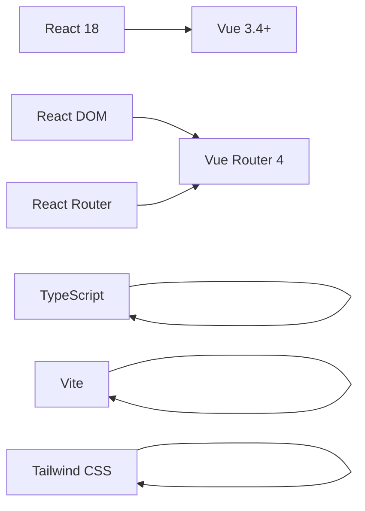
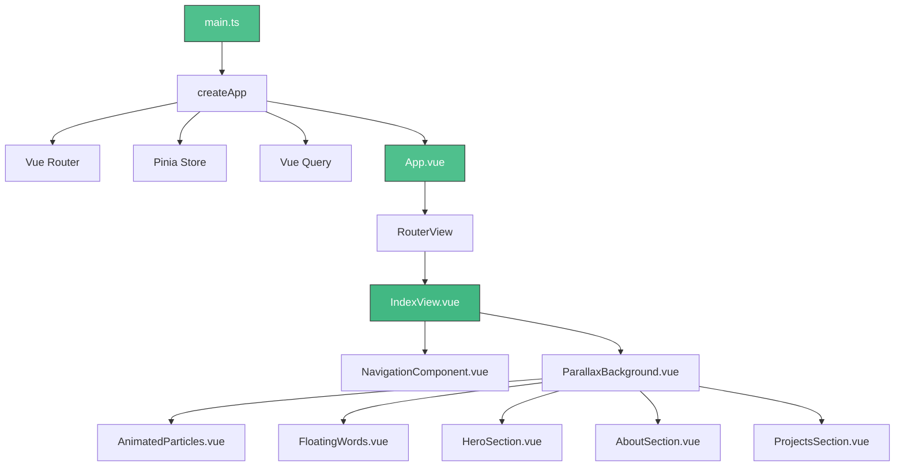

# Vue 3 Portfolio Migration Design

## Overview

This design outlines the complete migration of the farruh-folio-wave React portfolio application to Vue 3 with TypeScript. The migration will preserve all existing functionality while leveraging Vue 3's Composition API, modern tooling, and ecosystem equivalents for enhanced performance and developer experience.

The current React application is a sophisticated personal portfolio featuring advanced visual effects, parallax animations, and responsive design. The Vue 3 version will maintain the same aesthetic and functionality while adopting Vue's reactive system and component architecture.

## Technology Stack & Dependencies

### Core Framework Migration


### Build Tools & Configuration
- **Build System**: Vite (maintained) with Vue plugin
- **TypeScript**: Full TypeScript support with Vue TSX
- **Styling**: Tailwind CSS with Vue-compatible configuration
- **CSS Modules**: Native Vue scoped styles or CSS Modules
- **Package Manager**: npm/pnpm with Vue 3 ecosystem packages

### Vue 3 Ecosystem Replacements
| React Dependency | Vue 3 Equivalent | Purpose |
|------------------|-----------------|---------|
| @tanstack/react-query | @tanstack/vue-query | Data fetching & caching |
| React Router | Vue Router 4 | Client-side routing |
| Radix UI | Headless UI Vue / Naive UI | Accessible UI components |
| React Hook Form | VeeValidate | Form validation |
| Sonner | vue-sonner | Toast notifications |
| Lucide React | @vicons/lucide | Icon library |

## Component Architecture

### Application Structure Migration


### Core Application Setup
**main.ts** (equivalent to main.tsx)
```typescript
import { createApp } from 'vue'
import { createPinia } from 'pinia'
import { VueQueryPlugin } from '@tanstack/vue-query'
import { createRouter, createWebHistory } from 'vue-router'
import App from './App.vue'
import './index.css'

const router = createRouter({
  history: createWebHistory(),
  routes: [
    { path: '/', component: () => import('./views/IndexView.vue') },
    { path: '/:pathMatch(.*)*', component: () => import('./views/NotFound.vue') }
  ]
})

const app = createApp(App)
app.use(createPinia())
app.use(VueQueryPlugin)
app.use(router)
app.mount('#app')
```

### Component Hierarchy Translation

#### 1. App Component (App.vue)
```vue
<template>
  <div id="app">
    <RouterView />
    <!-- Toast/Notification Components -->
    <VueQueryDevtools />
  </div>
</template>

<script setup lang="ts">
import { RouterView } from 'vue-router'
// Global providers handled in main.ts
</script>
```

#### 2. Main Index View (IndexView.vue)
```vue
<template>
  <div>
    <NavigationComponent />
    <FloatingWords 
      :count="20"
      :speed="3"
      :rotation-speed="20"
      :opacity="0.2"
      :font-size="'0.8rem'"
      :side-only-percentage="0.85"
      :center-area-start="25"
      :center-area-end="75"
      :left-side-end="20"
      :right-side-start="80"
      :enable-rotation="true"
      :enable-bounce="true"
    />
    
    <ParallaxBackground 
      :config="parallaxConfig" 
      :adjusted-particle-count="adjustedParticleCount"
    >
      <AnimatedParticles :config="particleConfig" />
      <div class="relative z-10">
        <HeroSection />
        <AboutSection />
        <ExperienceSection />
        <ProjectsSection />
        <SkillsSection />
        <StrengthsSection />
        <EducationSection />
        <ContactSection />
      </div>
    </ParallaxBackground>
    
    <footer class="footer">
      <div class="container mx-auto px-4">
        <p class="footerText">
          © 2025 FusionCode. Built with Vue 3 and Tailwind CSS.
        </p>
      </div>
    </footer>
  </div>
</template>

<script setup lang="ts">
import { computed } from 'vue'
import { useWindowSize } from '@vueuse/core'
import { createParallaxConfig } from '@/components/effects/ParallaxConfig'

const { width } = useWindowSize()

const parallaxConfig = createParallaxConfig('intense', {
  particleCount: 10,
  mouseIntensity: 1.0,
  backgroundOpacity: 0.8,
})

const adjustedParticleCount = computed(() => 
  width.value < 768 
    ? Math.floor(parallaxConfig.particleCount / 2)
    : parallaxConfig.particleCount
)

const particleConfig = {
  particleCount: 120,
  colors: [
    'rgba(139, 92, 246, 0.3)',
    'rgba(59, 130, 246, 0.3)',
    'rgba(236, 72, 153, 0.3)',
    'rgba(34, 197, 94, 0.3)',
  ],
  maxConnectionDistance: 60,
  speedRange: [-0.1, 0.1] as [number, number],
  sizeRange: [0.5, 2] as [number, number],
  opacityRange: [0.1, 0.3] as [number, number],
  fps: 24,
}
</script>
```

### Section Components Migration Pattern

#### Hero Section (HeroSection.vue)
```vue
<template>
  <section id="hero" :class="styles.hero">
    <div :class="styles.backgroundElement1"></div>
    <div :class="styles.backgroundElement2"></div>

    <div :class="styles.floatingElements">
      <div 
        :class="styles.floatingElement1"
        :style="getCombinedParallaxStyle(0.03, 0.01)"
      />
      <div 
        :class="styles.floatingElement2"
        :style="getCombinedParallaxStyle(0.04, -0.01)"
      />
    </div>

    <div :class="styles.container" v-if="heroData">
      <div :class="styles.fadeIn">
        <div :class="styles.header">
          <div :class="styles.badge">
            <span :class="styles.badgeSpan">{{ heroData.badge }}</span>
          </div>
          
          <h1 :class="styles.mainTitle">{{ heroData.name }}</h1>
          <h2 :class="styles.subtitle">{{ heroData.subtitle }}</h2>
        </div>

        <div :class="styles.description">
          <p :class="styles.descriptionText">{{ heroData.description }}</p>
        </div>

        <div :class="styles.buttonContainer">
          <button
            :class="styles.primaryButton"
            @click="() => window.open(heroData.primaryButtonLink, '_blank')"
          >
            <Download :class="styles.buttonIcon" />
            {{ heroData.primaryButtonText }}
          </button>
          <button
            :class="styles.secondaryButton"
            @click="scrollToContact"
          >
            <Mail :class="styles.buttonIcon" />
            {{ heroData.secondaryButtonText }}
          </button>
        </div>

        <div :class="styles.stats">
          <div 
            v-for="(stat, idx) in stats" 
            :key="idx" 
            :class="styles.statItem"
          >
            <div 
              :class="styles.statNumber" 
              :style="{ '--text-color': stat.colorPalette.text }"
            >
              {{ stat.number }}
            </div>
            <div :class="styles.statLabel">{{ stat.label }}</div>
          </div>
        </div>

        <div :class="styles.scrollIndicator">
          <div :class="styles.scrollText">Explore my work</div>
          <button @click="scrollToAbout" :class="styles.scrollButton">
            <ArrowDown :class="styles.scrollIcon" />
          </button>
        </div>
      </div>
    </div>
  </section>
</template>

<script setup lang="ts">
import { ref, computed, onMounted } from 'vue'
import { Download, Mail, ArrowDown } from '@vicons/lucide'
import { useParallax } from '@/composables/useParallax'
import styles from './Hero.module.css'

interface StatJson {
  number: string
  label: string
}

interface HeroJson {
  badge: string
  name: string
  subtitle: string
  description: string
  primaryButtonText: string
  primaryButtonLink: string
  secondaryButtonText: string
  stats: StatJson[]
}

interface StatItem extends StatJson {
  colorPalette: {
    primary: string
    text: string
  }
}

const colorPalettes = [
  { primary: '#60a5fa', text: '#60a5fa' },
  { primary: '#34d399', text: '#34d399' },
  { primary: '#c084fc', text: '#c084fc' },
  { primary: '#f59e0b', text: '#f59e0b' },
]

const { getCombinedParallaxStyle } = useParallax()
const heroData = ref<HeroJson | null>(null)

const stats = computed(() => 
  heroData.value?.stats.map((s, idx) => ({
    ...s,
    colorPalette: colorPalettes[idx % colorPalettes.length],
  })) || []
)

const scrollToContact = () => {
  const element = document.getElementById('contact')
  if (element) {
    const elementTop = element.getBoundingClientRect().top + window.pageYOffset
    const maxScroll = document.body.scrollHeight - window.innerHeight
    const target = Math.min(elementTop - 80, maxScroll)
    window.scrollTo({
      top: target,
      behavior: 'smooth'
    })
  }
}

const scrollToAbout = () => {
  const element = document.getElementById('about')
  if (element) {
    const elementTop = element.getBoundingClientRect().top + window.pageYOffset
    const maxScroll = document.body.scrollHeight - window.innerHeight
    const target = Math.min(elementTop - 80, maxScroll)
    window.scrollTo({
      top: target,
      behavior: 'smooth'
    })
  }
}

onMounted(async () => {
  try {
    const res = await fetch('/data/hero.json')
    if (!res.ok) throw new Error(`Failed to fetch hero.json: ${res.status}`)
    heroData.value = await res.json()
  } catch (e) {
    console.error('Error loading hero.json', e)
  }
})
</script>
```

## Visual Effects System Migration

### Parallax Background Component
**ParallaxBackground.vue**
```vue
<template>
  <div :class="styles.parallaxContainer">
    <!-- Grid background -->
    <div 
      :class="styles.gridBackground"
      :style="gridBackgroundStyle"
    ></div>

    <!-- Large background shapes -->
    <div 
      v-for="(shape, index) in largeShapes" 
      :key="index"
      :class="[styles.largeShape, styles[`shape${index + 1}`]]"
      :style="shape.style"
    ></div>

    <!-- Floating particles -->
    <div 
      v-for="(particle, index) in particles" 
      :key="index"
      :class="styles.particle"
      :style="particle.style"
    ></div>

    <!-- Background overlay -->
    <div 
      :class="styles.backgroundOverlay"
      :style="backgroundOverlayStyle"
    ></div>

    <!-- Gradient overlay -->
    <div 
      :class="styles.gradientOverlay"
      :style="gradientOverlayStyle"
    ></div>

    <!-- Content slot -->
    <div :class="styles.content">
      <slot></slot>
    </div>
  </div>
</template>

<script setup lang="ts">
import { ref, computed, onMounted, onUnmounted } from 'vue'
import { useEventListener, useRafFn } from '@vueuse/core'
import styles from './ParallaxBackground.module.css'

interface ParallaxConfig {
  particleCount?: number
  particleSize?: number
  particleOpacity?: number
  largeShapesOpacity?: number
  largeShapesSizes?: [number, number, number, number, number]
  mouseIntensity?: number
  scrollIntensity?: number
  particleMouseSensitivity?: number
  particleScrollSpeed?: number
  backgroundOpacity?: number
  gradientOverlayOpacity?: number
  gridOpacity?: number
  mouseLerpFactor?: number
  scrollLerpFactor?: number
  blurIntensity?: 'sm' | 'md' | 'lg' | 'xl' | '2xl' | '3xl'
  gridSize?: number
}

interface Props {
  config?: ParallaxConfig
  adjustedParticleCount?: number
}

const props = withDefaults(defineProps<Props>(), {
  config: () => ({}),
  adjustedParticleCount: undefined
})

const defaultConfig: Required<ParallaxConfig> = {
  particleCount: 20,
  particleSize: 4,
  particleOpacity: 0.3,
  largeShapesOpacity: 0.2,
  largeShapesSizes: [500, 400, 300, 200, 100],
  mouseIntensity: 0.12,
  scrollIntensity: 0.3,
  particleMouseSensitivity: 0.03,
  particleScrollSpeed: 0.05,
  backgroundOpacity: 0.95,
  gradientOverlayOpacity: 0.2,
  gridOpacity: 0.15,
  mouseLerpFactor: 0.06,
  scrollLerpFactor: 0.08,
  blurIntensity: '3xl',
  gridSize: 40,
}

const finalConfig = computed(() => ({ ...defaultConfig, ...props.config }))

const scrollY = ref(0)
const mousePosition = ref({ x: 50, y: 50 })
const smoothScrollY = ref(0)
const smoothMousePosition = ref({ x: 50, y: 50 })
const windowSize = ref({ width: 0, height: 0 })

// Smooth interpolation function
const lerp = (start: number, end: number, factor: number) => {
  return start + (end - start) * factor
}

// Animation loop using VueUse
const { pause, resume } = useRafFn(() => {
  smoothScrollY.value = lerp(smoothScrollY.value, scrollY.value, finalConfig.value.scrollLerpFactor)
  smoothMousePosition.value = {
    x: lerp(smoothMousePosition.value.x, mousePosition.value.x, finalConfig.value.mouseLerpFactor),
    y: lerp(smoothMousePosition.value.y, mousePosition.value.y, finalConfig.value.mouseLerpFactor),
  }
})

// Event listeners using VueUse
useEventListener('scroll', () => {
  scrollY.value = window.scrollY
}, { passive: true })

useEventListener('mousemove', (e: MouseEvent) => {
  mousePosition.value = {
    x: (e.clientX / window.innerWidth) * 100,
    y: (e.clientY / window.innerHeight) * 100,
  }
}, { passive: true })

useEventListener('resize', () => {
  windowSize.value = {
    width: window.innerWidth,
    height: window.innerHeight
  }
})

// Computed styles
const gridBackgroundStyle = computed(() => ({
  opacity: finalConfig.value.gridOpacity,
  backgroundSize: `${finalConfig.value.gridSize}px ${finalConfig.value.gridSize}px`,
}))

const backgroundOverlayStyle = computed(() => ({
  opacity: finalConfig.value.backgroundOpacity,
  filter: `blur(${finalConfig.value.blurIntensity === 'sm' ? '4px' : '24px'})`,
}))

const gradientOverlayStyle = computed(() => ({
  opacity: finalConfig.value.gradientOverlayOpacity,
}))

// Generate particles
const particles = computed(() => {
  const count = props.adjustedParticleCount ?? finalConfig.value.particleCount
  return Array.from({ length: count }, (_, index) => {
    const x = Math.random() * 100
    const y = Math.random() * 100
    
    const mouseOffsetX = (smoothMousePosition.value.x - 50) * finalConfig.value.particleMouseSensitivity * (index % 3 + 1)
    const mouseOffsetY = (smoothMousePosition.value.y - 50) * finalConfig.value.particleMouseSensitivity * (index % 3 + 1)
    const scrollOffset = smoothScrollY.value * finalConfig.value.particleScrollSpeed * (index % 2 + 1)
    
    return {
      style: {
        left: `${x + mouseOffsetX}%`,
        top: `${y + mouseOffsetY + scrollOffset * 0.1}%`,
        width: `${finalConfig.value.particleSize}px`,
        height: `${finalConfig.value.particleSize}px`,
        opacity: finalConfig.value.particleOpacity,
      }
    }
  })
})

// Generate large shapes
const largeShapes = computed(() => 
  finalConfig.value.largeShapesSizes.map((size, index) => {
    const mouseOffsetX = (smoothMousePosition.value.x - 50) * finalConfig.value.mouseIntensity * 0.3 * (index + 1)
    const mouseOffsetY = (smoothMousePosition.value.y - 50) * finalConfig.value.mouseIntensity * 0.3 * (index + 1)
    const scrollOffset = smoothScrollY.value * finalConfig.value.scrollIntensity * 0.1 * (index + 1)
    
    return {
      style: {
        width: `${size}px`,
        height: `${size}px`,
        opacity: finalConfig.value.largeShapesOpacity,
        transform: `translate(${mouseOffsetX}px, ${mouseOffsetY + scrollOffset}px)`,
      }
    }
  })
)

onMounted(() => {
  windowSize.value = {
    width: window.innerWidth,
    height: window.innerHeight
  }
  resume()
})

onUnmounted(() => {
  pause()
})
</script>
```

### Animated Particles Component
**AnimatedParticles.vue**
```vue
<template>
  <canvas 
    ref="canvasRef" 
    :class="styles.canvas"
  ></canvas>
</template>

<script setup lang="ts">
import { ref, onMounted, onUnmounted } from 'vue'
import { useEventListener, useRafFn } from '@vueuse/core'
import styles from './AnimatedParticles.module.css'

interface Particle {
  x: number
  y: number
  vx: number
  vy: number
  size: number
  opacity: number
  color: string
}

interface ParticlesConfig {
  particleCount?: number
  colors?: string[]
  maxConnectionDistance?: number
  speedRange?: [number, number]
  sizeRange?: [number, number]
  opacityRange?: [number, number]
  fps?: number
}

interface Props {
  config?: ParticlesConfig
}

const props = withDefaults(defineProps<Props>(), {
  config: () => ({})
})

const {
  particleCount = 1000,
  colors = [
    'rgba(139, 92, 246, 0.3)',
    'rgba(59, 130, 246, 0.3)',
    'rgba(236, 72, 153, 0.3)',
    'rgba(34, 197, 94, 0.3)',
  ],
  maxConnectionDistance = 60,
  speedRange = [-0.1, 0.1] as [number, number],
  sizeRange = [0.5, 2] as [number, number],
  opacityRange = [0.1, 0.3] as [number, number],
  fps = 24,
} = props.config

const canvasRef = ref<HTMLCanvasElement>()
const particles = ref<Particle[]>([])
const lastTime = ref(0)

const createParticles = (canvas: HTMLCanvasElement) => {
  particles.value = Array.from({ length: particleCount }, () => ({
    x: Math.random() * canvas.width,
    y: Math.random() * canvas.height,
    vx: Math.random() * (speedRange[1] - speedRange[0]) + speedRange[0],
    vy: Math.random() * (speedRange[1] - speedRange[0]) + speedRange[0],
    size: Math.random() * (sizeRange[1] - sizeRange[0]) + sizeRange[0],
    opacity: Math.random() * (opacityRange[1] - opacityRange[0]) + opacityRange[0],
    color: colors[Math.floor(Math.random() * colors.length)],
  }))
}

const { pause, resume } = useRafFn((currentTime) => {
  const canvas = canvasRef.value
  if (!canvas) return

  const ctx = canvas.getContext('2d')
  if (!ctx) return

  const frameInterval = 1000 / fps
  if (currentTime - lastTime.value < frameInterval) return
  lastTime.value = currentTime

  ctx.clearRect(0, 0, canvas.width, canvas.height)
  
  particles.value.forEach((particle, index) => {
    // Update position
    particle.x += particle.vx
    particle.y += particle.vy
    
    // Bounce off edges
    if (particle.x <= 0 || particle.x >= canvas.width) {
      particle.vx *= -1
    }
    if (particle.y <= 0 || particle.y >= canvas.height) {
      particle.vy *= -1
    }
    
    // Keep particles within bounds
    particle.x = Math.max(0, Math.min(canvas.width, particle.x))
    particle.y = Math.max(0, Math.min(canvas.height, particle.y))
    
    // Draw particle
    ctx.beginPath()
    ctx.arc(particle.x, particle.y, particle.size, 0, Math.PI * 2)
    ctx.fillStyle = particle.color
    ctx.fill()
    
    // Draw connections to nearby particles
    for (let i = index + 1; i < particles.value.length; i++) {
      const otherParticle = particles.value[i]
      const dx = particle.x - otherParticle.x
      const dy = particle.y - otherParticle.y
      const distance = Math.sqrt(dx * dx + dy * dy)
      
      if (distance < maxConnectionDistance) {
        ctx.beginPath()
        ctx.moveTo(particle.x, particle.y)
        ctx.lineTo(otherParticle.x, otherParticle.y)
        ctx.strokeStyle = `rgba(255, 255, 255, ${0.03 * (1 - distance / maxConnectionDistance)})`
        ctx.lineWidth = 0.3
        ctx.stroke()
      }
    }
  })
})

const resizeCanvas = () => {
  const canvas = canvasRef.value
  if (!canvas) return

  const ctx = canvas.getContext('2d')
  if (!ctx) return

  const dpr = window.devicePixelRatio || 1
  const rect = canvas.getBoundingClientRect()
  
  canvas.width = rect.width * dpr
  canvas.height = rect.height * dpr
  
  ctx.scale(dpr, dpr)
  
  canvas.style.width = rect.width + 'px'
  canvas.style.height = rect.height + 'px'
  
  createParticles(canvas)
}

useEventListener('resize', resizeCanvas)

onMounted(() => {
  const canvas = canvasRef.value
  if (!canvas) return

  const ctx = canvas.getContext('2d')
  if (!ctx) return

  // Enable hardware acceleration
  ctx.imageSmoothingEnabled = true
  ctx.imageSmoothingQuality = 'high'

  resizeCanvas()
  resume()
})

onUnmounted(() => {
  pause()
})
</script>
```

## Composables & Hooks Migration

### useParallax Composable
**composables/useParallax.ts**
```typescript
import { ref, computed } from 'vue'
import { useEventListener } from '@vueuse/core'

export function useParallax() {
  const mousePosition = ref({ x: 50, y: 50 })
  const scrollY = ref(0)

  useEventListener('mousemove', (e: MouseEvent) => {
    mousePosition.value = {
      x: (e.clientX / window.innerWidth) * 100,
      y: (e.clientY / window.innerHeight) * 100,
    }
  }, { passive: true })

  useEventListener('scroll', () => {
    scrollY.value = window.scrollY
  }, { passive: true })

  const getCombinedParallaxStyle = (mouseIntensity: number, scrollIntensity: number) => {
    return computed(() => {
      const mouseOffsetX = (mousePosition.value.x - 50) * mouseIntensity
      const mouseOffsetY = (mousePosition.value.y - 50) * mouseIntensity
      const scrollOffset = scrollY.value * scrollIntensity
      
      return {
        transform: `translate(${mouseOffsetX}px, ${mouseOffsetY + scrollOffset}px)`,
      }
    })
  }

  return {
    mousePosition: readonly(mousePosition),
    scrollY: readonly(scrollY),
    getCombinedParallaxStyle,
  }
}
```

## Routing & Navigation

### Vue Router Configuration
**router/index.ts**
```typescript
import { createRouter, createWebHistory } from 'vue-router'

const router = createRouter({
  history: createWebHistory(),
  routes: [
    {
      path: '/',
      name: 'Home',
      component: () => import('@/views/IndexView.vue')
    },
    {
      path: '/:pathMatch(.*)*',
      name: 'NotFound', 
      component: () => import('@/views/NotFound.vue')
    }
  ],
  scrollBehavior(to, from, savedPosition) {
    if (savedPosition) {
      return savedPosition
    }
    
    if (to.hash) {
      return {
        el: to.hash,
        behavior: 'smooth',
        top: 80 // Account for navigation height
      }
    }
    
    return { top: 0 }
  }
})

export default router
```

### Navigation Component
**NavigationComponent.vue**
```vue
<template>
  <nav :class="[styles.navigation, { [styles.scrolled]: isScrolled }]">
    <div :class="styles.container">
      <div :class="styles.logo">
        <a href="#hero" @click.prevent="scrollToSection('hero')">
          FusionCode
        </a>
      </div>
      
      <div :class="styles.navItems">
        <a 
          v-for="item in navItems" 
          :key="item.id"
          :href="`#${item.id}`"
          :class="[styles.navItem, { [styles.active]: activeSection === item.id }]"
          @click.prevent="scrollToSection(item.id)"
        >
          {{ item.label }}
        </a>
      </div>
      
      <button 
        :class="styles.mobileToggle"
        @click="isMobileMenuOpen = !isMobileMenuOpen"
      >
        <Menu v-if="!isMobileMenuOpen" />
        <X v-else />
      </button>
    </div>
    
    <!-- Mobile Menu -->
    <div v-show="isMobileMenuOpen" :class="styles.mobileMenu">
      <a 
        v-for="item in navItems" 
        :key="item.id"
        :href="`#${item.id}`"
        :class="[styles.mobileNavItem, { [styles.active]: activeSection === item.id }]"
        @click="handleMobileNavClick(item.id)"
      >
        {{ item.label }}
      </a>
    </div>
  </nav>
</template>

<script setup lang="ts">
import { ref, computed, onMounted, onUnmounted } from 'vue'
import { useEventListener, useIntersectionObserver } from '@vueuse/core'
import { Menu, X } from '@vicons/lucide'
import styles from './Navigation.module.css'

const navItems = [
  { id: 'hero', label: 'Home' },
  { id: 'about', label: 'About' },
  { id: 'experience', label: 'Experience' },
  { id: 'projects', label: 'Projects' },
  { id: 'skills', label: 'Skills' },
  { id: 'education', label: 'Education' },
  { id: 'contact', label: 'Contact' },
]

const scrollY = ref(0)
const activeSection = ref('hero')
const isMobileMenuOpen = ref(false)

const isScrolled = computed(() => scrollY.value > 50)

useEventListener('scroll', () => {
  scrollY.value = window.scrollY
}, { passive: true })

// Intersection Observer for active section tracking
onMounted(() => {
  const sections = navItems.map(item => document.getElementById(item.id)).filter(Boolean)
  
  const observer = new IntersectionObserver(
    (entries) => {
      entries.forEach((entry) => {
        if (entry.isIntersecting && entry.intersectionRatio > 0.5) {
          activeSection.value = entry.target.id
        }
      })
    },
    {
      threshold: [0.1, 0.5, 0.9],
      rootMargin: '-80px 0px -80px 0px' // Account for fixed navigation
    }
  )
  
  sections.forEach(section => {
    if (section) observer.observe(section)
  })
  
  onUnmounted(() => {
    observer.disconnect()
  })
})

const scrollToSection = (sectionId: string) => {
  const element = document.getElementById(sectionId)
  if (element) {
    const elementTop = element.getBoundingClientRect().top + window.pageYOffset
    const offset = 80 // Navigation height
    window.scrollTo({
      top: elementTop - offset,
      behavior: 'smooth'
    })
  }
}

const handleMobileNavClick = (sectionId: string) => {
  scrollToSection(sectionId)
  isMobileMenuOpen.value = false
}
</script>
```

## State Management Strategy

### Pinia Store Setup
**stores/app.ts**
```typescript
import { defineStore } from 'pinia'
import { ref, computed } from 'vue'

export const useAppStore = defineStore('app', () => {
  // Global loading state
  const isLoading = ref(false)
  
  // Theme state (if needed for future theming)
  const theme = ref<'light' | 'dark'>('dark')
  
  // Navigation state
  const isMobileMenuOpen = ref(false)
  
  // Scroll position for global effects
  const scrollY = ref(0)
  const mousePosition = ref({ x: 50, y: 50 })
  
  // Computed getters
  const isScrolled = computed(() => scrollY.value > 50)
  
  // Actions
  const setLoading = (loading: boolean) => {
    isLoading.value = loading
  }
  
  const setScrollY = (y: number) => {
    scrollY.value = y
  }
  
  const setMousePosition = (x: number, y: number) => {
    mousePosition.value = { x, y }
  }
  
  const toggleMobileMenu = () => {
    isMobileMenuOpen.value = !isMobileMenuOpen.value
  }
  
  const closeMobileMenu = () => {
    isMobileMenuOpen.value = false
  }
  
  return {
    // State
    isLoading,
    theme,
    isMobileMenuOpen,
    scrollY,
    mousePosition,
    // Getters
    isScrolled,
    // Actions
    setLoading,
    setScrollY,
    setMousePosition,
    toggleMobileMenu,
    closeMobileMenu,
  }
})
```

## API Integration Layer

### Data Fetching with Vue Query
**composables/useHeroData.ts**
```typescript
import { useQuery } from '@tanstack/vue-query'

interface StatJson {
  number: string
  label: string
}

interface HeroJson {
  badge: string
  name: string
  subtitle: string
  description: string
  primaryButtonText: string
  primaryButtonLink: string
  secondaryButtonText: string
  stats: StatJson[]
}

export function useHeroData() {
  return useQuery({
    queryKey: ['hero'],
    queryFn: async (): Promise<HeroJson> => {
      const response = await fetch('/data/hero.json')
      if (!response.ok) {
        throw new Error(`Failed to fetch hero.json: ${response.status}`)
      }
      return response.json()
    },
    staleTime: 5 * 60 * 1000, // 5 minutes
    cacheTime: 10 * 60 * 1000, // 10 minutes
  })
}
```

**composables/useProjectsData.ts**
```typescript
import { useQuery } from '@tanstack/vue-query'

interface Project {
  title: string
  description: string
  technologies: string[]
  category: string
  impact: string
  githubUrl?: string
  liveUrl?: string
  imageUrl?: string
}

export function useProjectsData() {
  return useQuery({
    queryKey: ['projects'],
    queryFn: async (): Promise<Project[]> => {
      const response = await fetch('/data/projects.json')
      if (!response.ok) {
        throw new Error(`Failed to fetch projects.json: ${response.status}`)
      }
      return response.json()
    },
    staleTime: 5 * 60 * 1000,
    cacheTime: 10 * 60 * 1000,
  })
}
```

## Styling Strategy

### Tailwind CSS Configuration
**tailwind.config.ts**
```typescript
import type { Config } from 'tailwindcss'

export default {
  content: [
    './index.html',
    './src/**/*.{vue,js,ts,jsx,tsx}',
  ],
  theme: {
    extend: {
      colors: {
        primary: {
          50: '#eff6ff',
          500: '#3b82f6',
          600: '#2563eb',
          700: '#1d4ed8',
          900: '#1e3a8a',
        },
        accent: {
          purple: '#8b5cf6',
          pink: '#ec4899',
          emerald: '#10b981',
          amber: '#f59e0b',
        }
      },
      fontFamily: {
        sans: ['Inter', 'system-ui', 'sans-serif'],
        mono: ['JetBrains Mono', 'monospace'],
      },
      animation: {
        'float': 'float 6s ease-in-out infinite',
        'fade-in': 'fadeIn 0.8s ease-out',
        'slide-up': 'slideUp 0.6s ease-out',
        'particle-float': 'particleFloat 10s linear infinite',
      },
      keyframes: {
        float: {
          '0%, 100%': { transform: 'translateY(0px)' },
          '50%': { transform: 'translateY(-20px)' },
        },
        fadeIn: {
          '0%': { opacity: '0', transform: 'translateY(30px)' },
          '100%': { opacity: '1', transform: 'translateY(0)' },
        },
        slideUp: {
          '0%': { opacity: '0', transform: 'translateY(100px)' },
          '100%': { opacity: '1', transform: 'translateY(0)' },
        },
        particleFloat: {
          '0%': { transform: 'translateY(100vh) rotate(0deg)' },
          '100%': { transform: 'translateY(-100vh) rotate(360deg)' },
        },
      },
      backdropBlur: {
        xs: '2px',
      },
      screens: {
        xs: '475px',
      },
    },
  },
  plugins: [
    require('@tailwindcss/forms'),
    require('@tailwindcss/typography'),
  ],
} satisfies Config
```

### CSS Modules Migration
The existing CSS modules will be directly compatible with Vue 3. The scoped styles in Vue provide similar encapsulation:

**Hero.module.css** (remains largely unchanged)
```css
.hero {
  @apply relative min-h-screen flex items-center justify-center overflow-hidden;
  background: linear-gradient(135deg, #0f172a 0%, #1e293b 100%);
}

.container {
  @apply container mx-auto px-4 relative z-10;
}

.fadeIn {
  animation: fadeIn 0.8s ease-out;
}

/* All existing styles remain compatible */
```

## Testing Strategy

### Component Testing with Vitest & Vue Test Utils
**tests/components/HeroSection.test.ts**
```typescript
import { describe, it, expect, vi } from 'vitest'
import { mount } from '@vue/test-utils'
import { createTestingPinia } from '@pinia/testing'
import HeroSection from '@/components/sections/HeroSection.vue'

// Mock fetch
global.fetch = vi.fn()

describe('HeroSection', () => {
  it('renders hero content when data is loaded', async () => {
    const mockHeroData = {
      badge: 'Senior Developer',
      name: 'John Doe',
      subtitle: 'Full Stack Developer',
      description: 'Building amazing web experiences',
      primaryButtonText: 'Download CV',
      primaryButtonLink: '/cv.pdf',
      secondaryButtonText: 'Contact Me',
      stats: [
        { number: '5+', label: 'Years Experience' },
        { number: '50+', label: 'Projects Completed' }
      ]
    }

    vi.mocked(fetch).mockResolvedValueOnce({
      ok: true,
      json: async () => mockHeroData,
    } as Response)

    const wrapper = mount(HeroSection, {
      global: {
        plugins: [createTestingPinia({ createSpy: vi.fn })],
      },
    })

    // Wait for data to load
    await wrapper.vm.$nextTick()
    
    expect(wrapper.find('h1').text()).toBe('John Doe')
    expect(wrapper.find('h2').text()).toBe('Full Stack Developer')
    expect(wrapper.findAll('.statItem')).toHaveLength(2)
  })

  it('handles scroll to contact functionality', async () => {
    const scrollToSpy = vi.spyOn(window, 'scrollTo').mockImplementation(() => {})
    
    // Mock getElementById
    const mockElement = { getBoundingClientRect: () => ({ top: 100 }) }
    vi.spyOn(document, 'getElementById').mockReturnValue(mockElement as any)
    
    const wrapper = mount(HeroSection, {
      global: {
        plugins: [createTestingPinia({ createSpy: vi.fn })],
      },
    })

    await wrapper.find('.secondaryButton').trigger('click')
    
    expect(scrollToSpy).toHaveBeenCalledWith({
      top: expect.any(Number),
      behavior: 'smooth'
    })
  })
})
```

### Visual Effects Testing
**tests/components/AnimatedParticles.test.ts**
```typescript
import { describe, it, expect, vi } from 'vitest'
import { mount } from '@vue/test-utils'
import AnimatedParticles from '@/components/effects/AnimatedParticles.vue'

// Mock canvas and requestAnimationFrame
const mockCanvas = {
  getContext: vi.fn(() => ({
    clearRect: vi.fn(),
    beginPath: vi.fn(),
    arc: vi.fn(),
    fill: vi.fn(),
    moveTo: vi.fn(),
    lineTo: vi.fn(),
    stroke: vi.fn(),
    scale: vi.fn(),
  })),
  getBoundingClientRect: vi.fn(() => ({ width: 800, height: 600 })),
  width: 800,
  height: 600,
  style: {},
}

global.HTMLCanvasElement.prototype.getContext = mockCanvas.getContext

describe('AnimatedParticles', () => {
  it('creates canvas and initializes particles', () => {
    const wrapper = mount(AnimatedParticles, {
      props: {
        config: {
          particleCount: 10,
          colors: ['rgba(255, 0, 0, 0.5)'],
        }
      }
    })

    expect(wrapper.find('canvas').exists()).toBe(true)
    expect(mockCanvas.getContext).toHaveBeenCalledWith('2d')
  })

  it('handles window resize events', async () => {
    const wrapper = mount(AnimatedParticles)
    
    // Simulate window resize
    window.dispatchEvent(new Event('resize'))
    
    await wrapper.vm.$nextTick()
    
    expect(mockCanvas.getContext).toHaveBeenCalled()
  })
})
```

## Build Configuration

### Vite Configuration for Vue 3
**vite.config.ts**
```typescript
import { defineConfig } from 'vite'
import vue from '@vitejs/plugin-vue'
import { resolve } from 'path'

export default defineConfig(({ mode }) => ({
  base: '/',
  plugins: [
    vue({
      script: {
        defineModel: true,
        propsDestructure: true,
      },
    }),
  ],
  resolve: {
    alias: {
      '@': resolve(__dirname, 'src'),
    },
  },
  css: {
    modules: {
      localsConvention: 'camelCaseOnly',
    },
  },
  build: {
    sourcemap: mode !== 'production',
    minify: 'esbuild',
    rollupOptions: {
      output: {
        manualChunks: {
          vendor: ['vue', 'vue-router'],
          ui: ['@vueuse/core', '@vicons/lucide'],
          effects: ['@/components/effects/ParallaxBackground.vue', '@/components/effects/AnimatedParticles.vue'],
        },
      },
    },
  },
  server: {
    host: '::',
    port: 8080,
  },
  test: {
    globals: true,
    environment: 'jsdom',
    setupFiles: ['./tests/setup.ts'],
  },
}))
```

### Package.json Dependencies
**package.json**
```json
{
  "name": "farruh-folio-vue",
  "private": true,
  "version": "0.0.0",
  "type": "module",
  "scripts": {
    "dev": "vite",
    "build": "vue-tsc && vite build",
    "preview": "vite preview",
    "test": "vitest",
    "test:ui": "vitest --ui",
    "lint": "eslint src --ext .vue,.js,.jsx,.ts,.tsx",
    "lint:fix": "eslint src --ext .vue,.js,.jsx,.ts,.tsx --fix",
    "type-check": "vue-tsc --noEmit"
  },
  "dependencies": {
    "vue": "^3.4.0",
    "vue-router": "^4.2.0",
    "pinia": "^2.1.0",
    "@tanstack/vue-query": "^5.0.0",
    "@vueuse/core": "^10.7.0",
    "@headlessui/vue": "^1.7.0",
    "@vicons/lucide": "^0.12.0",
    "class-variance-authority": "^0.7.0",
    "clsx": "^2.0.0",
    "tailwind-merge": "^2.2.0"
  },
  "devDependencies": {
    "@vitejs/plugin-vue": "^5.0.0",
    "@vue/test-utils": "^2.4.0",
    "@pinia/testing": "^0.1.0",
    "vue-tsc": "^1.8.0",
    "vite": "^5.0.0",
    "vitest": "^1.2.0",
    "@vitest/ui": "^1.2.0",
    "jsdom": "^24.0.0",
    "typescript": "^5.3.0",
    "@types/node": "^20.10.0",
    "eslint": "^8.56.0",
    "@typescript-eslint/eslint-plugin": "^6.17.0",
    "@typescript-eslint/parser": "^6.17.0",
    "eslint-plugin-vue": "^9.19.0",
    "tailwindcss": "^3.4.0",
    "@tailwindcss/forms": "^0.5.0",
    "@tailwindcss/typography": "^0.5.0",
    "autoprefixer": "^10.4.0",
    "postcss": "^8.4.0"
  }
}
```

### TypeScript Configuration
**tsconfig.json**
```json
{
  "compilerOptions": {
    "target": "ES2020",
    "useDefineForClassFields": true,
    "lib": ["ES2020", "DOM", "DOM.Iterable"],
    "module": "ESNext",
    "skipLibCheck": true,
    "moduleResolution": "bundler",
    "allowImportingTsExtensions": true,
    "resolveJsonModule": true,
    "isolatedModules": true,
    "noEmit": true,
    "jsx": "preserve",
    "strict": true,
    "noUnusedLocals": true,
    "noUnusedParameters": true,
    "noFallthroughCasesInSwitch": true,
    "baseUrl": ".",
    "paths": {
      "@/*": ["./src/*"]
    },
    "types": ["vite/client", "vitest/globals"]
  },
  "include": [
    "src/**/*.ts",
    "src/**/*.tsx", 
    "src/**/*.vue",
    "tests/**/*.ts"
  ],
  "references": [
    { "path": "./tsconfig.node.json" }
  ]
}
```// Global providers handled in main.ts
</script>
```

#### 2. Main Index View (IndexView.vue)
```vue
<template>
  <div>
    <NavigationComponent />
    <FloatingWords 
      :count="20"
      :speed="3"
      :rotation-speed="20"
      :opacity="0.2"
      :font-size="'0.8rem'"
      :side-only-percentage="0.85"
      :center-area-start="25"
      :center-area-end="75"
      :left-side-end="20"
      :right-side-start="80"
      :enable-rotation="true"
      :enable-bounce="true"
    />
    
    <ParallaxBackground 
      :config="parallaxConfig" 
      :adjusted-particle-count="adjustedParticleCount"
    >
      <AnimatedParticles :config="particleConfig" />
      <div class="relative z-10">
        <HeroSection />
        <AboutSection />
        <ExperienceSection />
        <ProjectsSection />
        <SkillsSection />
        <StrengthsSection />
        <EducationSection />
        <ContactSection />
      </div>
    </ParallaxBackground>
    
    <footer class="footer">
      <div class="container mx-auto px-4">
        <p class="footerText">
          © 2025 FusionCode. Built with Vue 3 and Tailwind CSS.
        </p>
      </div>
    </footer>
  </div>
</template>

<script setup lang="ts">
import { computed } from 'vue'
import { useWindowSize } from '@vueuse/core'
import { createParallaxConfig } from '@/components/effects/ParallaxConfig'

const { width } = useWindowSize()

const parallaxConfig = createParallaxConfig('intense', {
  particleCount: 10,
  mouseIntensity: 1.0,
  backgroundOpacity: 0.8,
})

const adjustedParticleCount = computed(() => 
  width.value < 768 
    ? Math.floor(parallaxConfig.particleCount / 2)
    : parallaxConfig.particleCount
)

const particleConfig = {
  particleCount: 120,
  colors: [
    'rgba(139, 92, 246, 0.3)',
    'rgba(59, 130, 246, 0.3)',
    'rgba(236, 72, 153, 0.3)',
    'rgba(34, 197, 94, 0.3)',
  ],
  maxConnectionDistance: 60,
  speedRange: [-0.1, 0.1] as [number, number],
  sizeRange: [0.5, 2] as [number, number],
  opacityRange: [0.1, 0.3] as [number, number],
  fps: 24,
}
</script>
```

### Section Components Migration Pattern

#### Hero Section (HeroSection.vue)
```vue
<template>
  <section id="hero" :class="styles.hero">
    <div :class="styles.backgroundElement1"></div>
    <div :class="styles.backgroundElement2"></div>

    <div :class="styles.floatingElements">
      <div 
        :class="styles.floatingElement1"
        :style="getCombinedParallaxStyle(0.03, 0.01)"
      />
      <div 
        :class="styles.floatingElement2"
        :style="getCombinedParallaxStyle(0.04, -0.01)"
      />
    </div>

    <div :class="styles.container" v-if="heroData">
      <div :class="styles.fadeIn">
        <div :class="styles.header">
          <div :class="styles.badge">
            <span :class="styles.badgeSpan">{{ heroData.badge }}</span>
          </div>
          
          <h1 :class="styles.mainTitle">{{ heroData.name }}</h1>
          <h2 :class="styles.subtitle">{{ heroData.subtitle }}</h2>
        </div>

        <div :class="styles.description">
          <p :class="styles.descriptionText">{{ heroData.description }}</p>
        </div>

        <div :class="styles.buttonContainer">
          <button
            :class="styles.primaryButton"
            @click="() => window.open(heroData.primaryButtonLink, '_blank')"
          >
            <Download :class="styles.buttonIcon" />
            {{ heroData.primaryButtonText }}
          </button>
          <button
            :class="styles.secondaryButton"
            @click="scrollToContact"
          >
            <Mail :class="styles.buttonIcon" />
            {{ heroData.secondaryButtonText }}
          </button>
        </div>

        <div :class="styles.stats">
          <div 
            v-for="(stat, idx) in stats" 
            :key="idx" 
            :class="styles.statItem"
          >
            <div 
              :class="styles.statNumber" 
              :style="{ '--text-color': stat.colorPalette.text }"
            >
              {{ stat.number }}
            </div>
            <div :class="styles.statLabel">{{ stat.label }}</div>
          </div>
        </div>

        <div :class="styles.scrollIndicator">
          <div :class="styles.scrollText">Explore my work</div>
          <button @click="scrollToAbout" :class="styles.scrollButton">
            <ArrowDown :class="styles.scrollIcon" />
          </button>
        </div>
      </div>
    </div>
  </section>
</template>

<script setup lang="ts">
import { ref, computed, onMounted } from 'vue'
import { Download, Mail, ArrowDown } from '@vicons/lucide'
import { useParallax } from '@/composables/useParallax'
import styles from './Hero.module.css'

interface StatJson {
  number: string
  label: string
}

interface HeroJson {
  badge: string
  name: string
  subtitle: string
  description: string
  primaryButtonText: string
  primaryButtonLink: string
  secondaryButtonText: string
  stats: StatJson[]
}

interface StatItem extends StatJson {
  colorPalette: {
    primary: string
    text: string
  }
}

const colorPalettes = [
  { primary: '#60a5fa', text: '#60a5fa' },
  { primary: '#34d399', text: '#34d399' },
  { primary: '#c084fc', text: '#c084fc' },
  { primary: '#f59e0b', text: '#f59e0b' },
]

const { getCombinedParallaxStyle } = useParallax()
const heroData = ref<HeroJson | null>(null)

const stats = computed(() => 
  heroData.value?.stats.map((s, idx) => ({
    ...s,
    colorPalette: colorPalettes[idx % colorPalettes.length],
  })) || []
)

const scrollToContact = () => {
  const element = document.getElementById('contact')
  if (element) {
    const elementTop = element.getBoundingClientRect().top + window.pageYOffset
    const maxScroll = document.body.scrollHeight - window.innerHeight
    const target = Math.min(elementTop - 80, maxScroll)
    window.scrollTo({
      top: target,
      behavior: 'smooth'
    })
  }
}

const scrollToAbout = () => {
  const element = document.getElementById('about')
  if (element) {
    const elementTop = element.getBoundingClientRect().top + window.pageYOffset
    const maxScroll = document.body.scrollHeight - window.innerHeight
    const target = Math.min(elementTop - 80, maxScroll)
    window.scrollTo({
      top: target,
      behavior: 'smooth'
    })
  }
}

onMounted(async () => {
  try {
    const res = await fetch('/data/hero.json')
    if (!res.ok) throw new Error(`Failed to fetch hero.json: ${res.status}`)
    heroData.value = await res.json()
  } catch (e) {
    console.error('Error loading hero.json', e)
  }
})
</script>
```

## Visual Effects System Migration

### Parallax Background Component
**ParallaxBackground.vue**
```vue
<template>
  <div :class="styles.parallaxContainer">
    <!-- Grid background -->
    <div 
      :class="styles.gridBackground"
      :style="gridBackgroundStyle"
    ></div>

    <!-- Large background shapes -->
    <div 
      v-for="(shape, index) in largeShapes" 
      :key="index"
      :class="[styles.largeShape, styles[`shape${index + 1}`]]"
      :style="shape.style"
    ></div>

    <!-- Floating particles -->
    <div 
      v-for="(particle, index) in particles" 
      :key="index"
      :class="styles.particle"
      :style="particle.style"
    ></div>

    <!-- Background overlay -->
    <div 
      :class="styles.backgroundOverlay"
      :style="backgroundOverlayStyle"
    ></div>

    <!-- Gradient overlay -->
    <div 
      :class="styles.gradientOverlay"
      :style="gradientOverlayStyle"
    ></div>

    <!-- Content slot -->
    <div :class="styles.content">
      <slot></slot>
    </div>
  </div>
</template>

<script setup lang="ts">
import { ref, computed, onMounted, onUnmounted } from 'vue'
import { useEventListener, useRafFn } from '@vueuse/core'
import styles from './ParallaxBackground.module.css'

interface ParallaxConfig {
  particleCount?: number
  particleSize?: number
  particleOpacity?: number
  largeShapesOpacity?: number
  largeShapesSizes?: [number, number, number, number, number]
  mouseIntensity?: number
  scrollIntensity?: number
  particleMouseSensitivity?: number
  particleScrollSpeed?: number
  backgroundOpacity?: number
  gradientOverlayOpacity?: number
  gridOpacity?: number
  mouseLerpFactor?: number
  scrollLerpFactor?: number
  blurIntensity?: 'sm' | 'md' | 'lg' | 'xl' | '2xl' | '3xl'
  gridSize?: number
}

interface Props {
  config?: ParallaxConfig
  adjustedParticleCount?: number
}

const props = withDefaults(defineProps<Props>(), {
  config: () => ({}),
  adjustedParticleCount: undefined
})

const defaultConfig: Required<ParallaxConfig> = {
  particleCount: 20,
  particleSize: 4,
  particleOpacity: 0.3,
  largeShapesOpacity: 0.2,
  largeShapesSizes: [500, 400, 300, 200, 100],
  mouseIntensity: 0.12,
  scrollIntensity: 0.3,
  particleMouseSensitivity: 0.03,
  particleScrollSpeed: 0.05,
  backgroundOpacity: 0.95,
  gradientOverlayOpacity: 0.2,
  gridOpacity: 0.15,
  mouseLerpFactor: 0.06,
  scrollLerpFactor: 0.08,
  blurIntensity: '3xl',
  gridSize: 40,
}

const finalConfig = computed(() => ({ ...defaultConfig, ...props.config }))

const scrollY = ref(0)
const mousePosition = ref({ x: 50, y: 50 })
const smoothScrollY = ref(0)
const smoothMousePosition = ref({ x: 50, y: 50 })
const windowSize = ref({ width: 0, height: 0 })

// Smooth interpolation function
const lerp = (start: number, end: number, factor: number) => {
  return start + (end - start) * factor
}

// Animation loop using VueUse
const { pause, resume } = useRafFn(() => {
  smoothScrollY.value = lerp(smoothScrollY.value, scrollY.value, finalConfig.value.scrollLerpFactor)
  smoothMousePosition.value = {
    x: lerp(smoothMousePosition.value.x, mousePosition.value.x, finalConfig.value.mouseLerpFactor),
    y: lerp(smoothMousePosition.value.y, mousePosition.value.y, finalConfig.value.mouseLerpFactor),
  }
})

// Event listeners using VueUse
useEventListener('scroll', () => {
  scrollY.value = window.scrollY
}, { passive: true })

useEventListener('mousemove', (e: MouseEvent) => {
  mousePosition.value = {
    x: (e.clientX / window.innerWidth) * 100,
    y: (e.clientY / window.innerHeight) * 100,
  }
}, { passive: true })

useEventListener('resize', () => {
  windowSize.value = {
    width: window.innerWidth,
    height: window.innerHeight
  }
})

// Computed styles
const gridBackgroundStyle = computed(() => ({
  opacity: finalConfig.value.gridOpacity,
  backgroundSize: `${finalConfig.value.gridSize}px ${finalConfig.value.gridSize}px`,
}))

const backgroundOverlayStyle = computed(() => ({
  opacity: finalConfig.value.backgroundOpacity,
  filter: `blur(${finalConfig.value.blurIntensity === 'sm' ? '4px' : '24px'})`,
}))

const gradientOverlayStyle = computed(() => ({
  opacity: finalConfig.value.gradientOverlayOpacity,
}))

// Generate particles
const particles = computed(() => {
  const count = props.adjustedParticleCount ?? finalConfig.value.particleCount
  return Array.from({ length: count }, (_, index) => {
    const x = Math.random() * 100
    const y = Math.random() * 100
    
    const mouseOffsetX = (smoothMousePosition.value.x - 50) * finalConfig.value.particleMouseSensitivity * (index % 3 + 1)
    const mouseOffsetY = (smoothMousePosition.value.y - 50) * finalConfig.value.particleMouseSensitivity * (index % 3 + 1)
    const scrollOffset = smoothScrollY.value * finalConfig.value.particleScrollSpeed * (index % 2 + 1)
    
    return {
      style: {
        left: `${x + mouseOffsetX}%`,
        top: `${y + mouseOffsetY + scrollOffset * 0.1}%`,
        width: `${finalConfig.value.particleSize}px`,
        height: `${finalConfig.value.particleSize}px`,
        opacity: finalConfig.value.particleOpacity,
      }
    }
  })
})

// Generate large shapes
const largeShapes = computed(() => 
  finalConfig.value.largeShapesSizes.map((size, index) => {
    const mouseOffsetX = (smoothMousePosition.value.x - 50) * finalConfig.value.mouseIntensity * 0.3 * (index + 1)
    const mouseOffsetY = (smoothMousePosition.value.y - 50) * finalConfig.value.mouseIntensity * 0.3 * (index + 1)
    const scrollOffset = smoothScrollY.value * finalConfig.value.scrollIntensity * 0.1 * (index + 1)
    
    return {
      style: {
        width: `${size}px`,
        height: `${size}px`,
        opacity: finalConfig.value.largeShapesOpacity,
        transform: `translate(${mouseOffsetX}px, ${mouseOffsetY + scrollOffset}px)`,
      }
    }
  })
)

onMounted(() => {
  windowSize.value = {
    width: window.innerWidth,
    height: window.innerHeight
  }
  resume()
})

onUnmounted(() => {
  pause()
})
</script>
```

### Animated Particles Component
**AnimatedParticles.vue**
```vue
<template>
  <canvas 
    ref="canvasRef" 
    :class="styles.canvas"
  ></canvas>
</template>

<script setup lang="ts">
import { ref, onMounted, onUnmounted } from 'vue'
import { useEventListener, useRafFn } from '@vueuse/core'
import styles from './AnimatedParticles.module.css'

interface Particle {
  x: number
  y: number
  vx: number
  vy: number
  size: number
  opacity: number
  color: string
}

interface ParticlesConfig {
  particleCount?: number
  colors?: string[]
  maxConnectionDistance?: number
  speedRange?: [number, number]
  sizeRange?: [number, number]
  opacityRange?: [number, number]
  fps?: number
}

interface Props {
  config?: ParticlesConfig
}

const props = withDefaults(defineProps<Props>(), {
  config: () => ({})
})

const {
  particleCount = 1000,
  colors = [
    'rgba(139, 92, 246, 0.3)',
    'rgba(59, 130, 246, 0.3)',
    'rgba(236, 72, 153, 0.3)',
    'rgba(34, 197, 94, 0.3)',
  ],
  maxConnectionDistance = 60,
  speedRange = [-0.1, 0.1] as [number, number],
  sizeRange = [0.5, 2] as [number, number],
  opacityRange = [0.1, 0.3] as [number, number],
  fps = 24,
} = props.config

const canvasRef = ref<HTMLCanvasElement>()
const particles = ref<Particle[]>([])
const lastTime = ref(0)

const createParticles = (canvas: HTMLCanvasElement) => {
  particles.value = Array.from({ length: particleCount }, () => ({
    x: Math.random() * canvas.width,
    y: Math.random() * canvas.height,
    vx: Math.random() * (speedRange[1] - speedRange[0]) + speedRange[0],
    vy: Math.random() * (speedRange[1] - speedRange[0]) + speedRange[0],
    size: Math.random() * (sizeRange[1] - sizeRange[0]) + sizeRange[0],
    opacity: Math.random() * (opacityRange[1] - opacityRange[0]) + opacityRange[0],
    color: colors[Math.floor(Math.random() * colors.length)],
  }))
}

const { pause, resume } = useRafFn((currentTime) => {
  const canvas = canvasRef.value
  if (!canvas) return

  const ctx = canvas.getContext('2d')
  if (!ctx) return

  const frameInterval = 1000 / fps
  if (currentTime - lastTime.value < frameInterval) return
  lastTime.value = currentTime

  ctx.clearRect(0, 0, canvas.width, canvas.height)
  
  particles.value.forEach((particle, index) => {
    // Update position
    particle.x += particle.vx
    particle.y += particle.vy
    
    // Bounce off edges
    if (particle.x <= 0 || particle.x >= canvas.width) {
      particle.vx *= -1
    }
    if (particle.y <= 0 || particle.y >= canvas.height) {
      particle.vy *= -1
    }
    
    // Keep particles within bounds
    particle.x = Math.max(0, Math.min(canvas.width, particle.x))
    particle.y = Math.max(0, Math.min(canvas.height, particle.y))
    
    // Draw particle
    ctx.beginPath()
    ctx.arc(particle.x, particle.y, particle.size, 0, Math.PI * 2)
    ctx.fillStyle = particle.color
    ctx.fill()
    
    // Draw connections to nearby particles
    for (let i = index + 1; i < particles.value.length; i++) {
      const otherParticle = particles.value[i]
      const dx = particle.x - otherParticle.x
      const dy = particle.y - otherParticle.y
      const distance = Math.sqrt(dx * dx + dy * dy)
      
      if (distance < maxConnectionDistance) {
        ctx.beginPath()
        ctx.moveTo(particle.x, particle.y)
        ctx.lineTo(otherParticle.x, otherParticle.y)
        ctx.strokeStyle = `rgba(255, 255, 255, ${0.03 * (1 - distance / maxConnectionDistance)})`
        ctx.lineWidth = 0.3
        ctx.stroke()
      }
    }
  })
})

const resizeCanvas = () => {
  const canvas = canvasRef.value
  if (!canvas) return

  const ctx = canvas.getContext('2d')
  if (!ctx) return

  const dpr = window.devicePixelRatio || 1
  const rect = canvas.getBoundingClientRect()
  
  canvas.width = rect.width * dpr
  canvas.height = rect.height * dpr
  
  ctx.scale(dpr, dpr)
  
  canvas.style.width = rect.width + 'px'
  canvas.style.height = rect.height + 'px'
  
  createParticles(canvas)
}

useEventListener('resize', resizeCanvas)

onMounted(() => {
  const canvas = canvasRef.value
  if (!canvas) return

  const ctx = canvas.getContext('2d')
  if (!ctx) return

  // Enable hardware acceleration
  ctx.imageSmoothingEnabled = true
  ctx.imageSmoothingQuality = 'high'

  resizeCanvas()
  resume()
})

onUnmounted(() => {
  pause()
})
</script>
```

## Composables & Hooks Migration

### useParallax Composable
**composables/useParallax.ts**
```typescript
import { ref, computed } from 'vue'
import { useEventListener } from '@vueuse/core'

export function useParallax() {
  const mousePosition = ref({ x: 50, y: 50 })
  const scrollY = ref(0)

  useEventListener('mousemove', (e: MouseEvent) => {
    mousePosition.value = {
      x: (e.clientX / window.innerWidth) * 100,
      y: (e.clientY / window.innerHeight) * 100,
    }
  }, { passive: true })

  useEventListener('scroll', () => {
    scrollY.value = window.scrollY
  }, { passive: true })

  const getCombinedParallaxStyle = (mouseIntensity: number, scrollIntensity: number) => {
    return computed(() => {
      const mouseOffsetX = (mousePosition.value.x - 50) * mouseIntensity
      const mouseOffsetY = (mousePosition.value.y - 50) * mouseIntensity
      const scrollOffset = scrollY.value * scrollIntensity
      
      return {
        transform: `translate(${mouseOffsetX}px, ${mouseOffsetY + scrollOffset}px)`,
      }
    })
  }

  return {
    mousePosition: readonly(mousePosition),
    scrollY: readonly(scrollY),
    getCombinedParallaxStyle,
  }
}
```

## Routing & Navigation

### Vue Router Configuration
**router/index.ts**
```typescript
import { createRouter, createWebHistory } from 'vue-router'

const router = createRouter({
  history: createWebHistory(),
  routes: [
    {
      path: '/',
      name: 'Home',
      component: () => import('@/views/IndexView.vue')
    },
    {
      path: '/:pathMatch(.*)*',
      name: 'NotFound', 
      component: () => import('@/views/NotFound.vue')
    }
  ],
  scrollBehavior(to, from, savedPosition) {
    if (savedPosition) {
      return savedPosition
    }
    
    if (to.hash) {
      return {
        el: to.hash,
        behavior: 'smooth',
        top: 80 // Account for navigation height
      }
    }
    
    return { top: 0 }
  }
})

export default router
```

### Navigation Component
**NavigationComponent.vue**
```vue
<template>
  <nav :class="[styles.navigation, { [styles.scrolled]: isScrolled }]">
    <div :class="styles.container">
      <div :class="styles.logo">
        <a href="#hero" @click.prevent="scrollToSection('hero')">
          FusionCode
        </a>
      </div>
      
      <div :class="styles.navItems">
        <a 
          v-for="item in navItems" 
          :key="item.id"
          :href="`#${item.id}`"
          :class="[styles.navItem, { [styles.active]: activeSection === item.id }]"
          @click.prevent="scrollToSection(item.id)"
        >
          {{ item.label }}
        </a>
      </div>
      
      <button 
        :class="styles.mobileToggle"
        @click="isMobileMenuOpen = !isMobileMenuOpen"
      >
        <Menu v-if="!isMobileMenuOpen" />
        <X v-else />
      </button>
    </div>
    
    <!-- Mobile Menu -->
    <div v-show="isMobileMenuOpen" :class="styles.mobileMenu">
      <a 
        v-for="item in navItems" 
        :key="item.id"
        :href="`#${item.id}`"
        :class="[styles.mobileNavItem, { [styles.active]: activeSection === item.id }]"
        @click="handleMobileNavClick(item.id)"
      >
        {{ item.label }}
      </a>
    </div>
  </nav>
</template>

<script setup lang="ts">
import { ref, computed, onMounted, onUnmounted } from 'vue'
import { useEventListener, useIntersectionObserver } from '@vueuse/core'
import { Menu, X } from '@vicons/lucide'
import styles from './Navigation.module.css'

const navItems = [
  { id: 'hero', label: 'Home' },
  { id: 'about', label: 'About' },
  { id: 'experience', label: 'Experience' },
  { id: 'projects', label: 'Projects' },
  { id: 'skills', label: 'Skills' },
  { id: 'education', label: 'Education' },
  { id: 'contact', label: 'Contact' },
]

const scrollY = ref(0)
const activeSection = ref('hero')
const isMobileMenuOpen = ref(false)

const isScrolled = computed(() => scrollY.value > 50)

useEventListener('scroll', () => {
  scrollY.value = window.scrollY
}, { passive: true })

// Intersection Observer for active section tracking
onMounted(() => {
  const sections = navItems.map(item => document.getElementById(item.id)).filter(Boolean)
  
  const observer = new IntersectionObserver(
    (entries) => {
      entries.forEach((entry) => {
        if (entry.isIntersecting && entry.intersectionRatio > 0.5) {
          activeSection.value = entry.target.id
        }
      })
    },
    {
      threshold: [0.1, 0.5, 0.9],
      rootMargin: '-80px 0px -80px 0px' // Account for fixed navigation
    }
  )
  
  sections.forEach(section => {
    if (section) observer.observe(section)
  })
  
  onUnmounted(() => {
    observer.disconnect()
  })
})

const scrollToSection = (sectionId: string) => {
  const element = document.getElementById(sectionId)
  if (element) {
    const elementTop = element.getBoundingClientRect().top + window.pageYOffset
    const offset = 80 // Navigation height
    window.scrollTo({
      top: elementTop - offset,
      behavior: 'smooth'
    })
  }
}

const handleMobileNavClick = (sectionId: string) => {
  scrollToSection(sectionId)
  isMobileMenuOpen.value = false
}
</script>
```

## State Management Strategy

### Pinia Store Setup
**stores/app.ts**
```typescript
import { defineStore } from 'pinia'
import { ref, computed } from 'vue'

export const useAppStore = defineStore('app', () => {
  // Global loading state
  const isLoading = ref(false)
  
  // Theme state (if needed for future theming)
  const theme = ref<'light' | 'dark'>('dark')
  
  // Navigation state
  const isMobileMenuOpen = ref(false)
  
  // Scroll position for global effects
  const scrollY = ref(0)
  const mousePosition = ref({ x: 50, y: 50 })
  
  // Computed getters
  const isScrolled = computed(() => scrollY.value > 50)
  
  // Actions
  const setLoading = (loading: boolean) => {
    isLoading.value = loading
  }
  
  const setScrollY = (y: number) => {
    scrollY.value = y
  }
  
  const setMousePosition = (x: number, y: number) => {
    mousePosition.value = { x, y }
  }
  
  const toggleMobileMenu = () => {
    isMobileMenuOpen.value = !isMobileMenuOpen.value
  }
  
  const closeMobileMenu = () => {
    isMobileMenuOpen.value = false
  }
  
  return {
    // State
    isLoading,
    theme,
    isMobileMenuOpen,
    scrollY,
    mousePosition,
    // Getters
    isScrolled,
    // Actions
    setLoading,
    setScrollY,
    setMousePosition,
    toggleMobileMenu,
    closeMobileMenu,
  }
})
```

## API Integration Layer

### Data Fetching with Vue Query
**composables/useHeroData.ts**
```typescript
import { useQuery } from '@tanstack/vue-query'

interface StatJson {
  number: string
  label: string
}

interface HeroJson {
  badge: string
  name: string
  subtitle: string
  description: string
  primaryButtonText: string
  primaryButtonLink: string
  secondaryButtonText: string
  stats: StatJson[]
}

export function useHeroData() {
  return useQuery({
    queryKey: ['hero'],
    queryFn: async (): Promise<HeroJson> => {
      const response = await fetch('/data/hero.json')
      if (!response.ok) {
        throw new Error(`Failed to fetch hero.json: ${response.status}`)
      }
      return response.json()
    },
    staleTime: 5 * 60 * 1000, // 5 minutes
    cacheTime: 10 * 60 * 1000, // 10 minutes
  })
}
```

**composables/useProjectsData.ts**
```typescript
import { useQuery } from '@tanstack/vue-query'

interface Project {
  title: string
  description: string
  technologies: string[]
  category: string
  impact: string
  githubUrl?: string
  liveUrl?: string
  imageUrl?: string
}

export function useProjectsData() {
  return useQuery({
    queryKey: ['projects'],
    queryFn: async (): Promise<Project[]> => {
      const response = await fetch('/data/projects.json')
      if (!response.ok) {
        throw new Error(`Failed to fetch projects.json: ${response.status}`)
      }
      return response.json()
    },
    staleTime: 5 * 60 * 1000,
    cacheTime: 10 * 60 * 1000,
  })
}
```

## Styling Strategy

### Tailwind CSS Configuration
**tailwind.config.ts**
```typescript
import type { Config } from 'tailwindcss'

export default {
  content: [
    './index.html',
    './src/**/*.{vue,js,ts,jsx,tsx}',
  ],
  theme: {
    extend: {
      colors: {
        primary: {
          50: '#eff6ff',
          500: '#3b82f6',
          600: '#2563eb',
          700: '#1d4ed8',
          900: '#1e3a8a',
        },
        accent: {
          purple: '#8b5cf6',
          pink: '#ec4899',
          emerald: '#10b981',
          amber: '#f59e0b',
        }
      },
      fontFamily: {
        sans: ['Inter', 'system-ui', 'sans-serif'],
        mono: ['JetBrains Mono', 'monospace'],
      },
      animation: {
        'float': 'float 6s ease-in-out infinite',
        'fade-in': 'fadeIn 0.8s ease-out',
        'slide-up': 'slideUp 0.6s ease-out',
        'particle-float': 'particleFloat 10s linear infinite',
      },
      keyframes: {
        float: {
          '0%, 100%': { transform: 'translateY(0px)' },
          '50%': { transform: 'translateY(-20px)' },
        },
        fadeIn: {
          '0%': { opacity: '0', transform: 'translateY(30px)' },
          '100%': { opacity: '1', transform: 'translateY(0)' },
        },
        slideUp: {
          '0%': { opacity: '0', transform: 'translateY(100px)' },
          '100%': { opacity: '1', transform: 'translateY(0)' },
        },
        particleFloat: {
          '0%': { transform: 'translateY(100vh) rotate(0deg)' },
          '100%': { transform: 'translateY(-100vh) rotate(360deg)' },
        },
      },
      backdropBlur: {
        xs: '2px',
      },
      screens: {
        xs: '475px',
      },
    },
  },
  plugins: [
    require('@tailwindcss/forms'),
    require('@tailwindcss/typography'),
  ],
} satisfies Config
```

### CSS Modules Migration
The existing CSS modules will be directly compatible with Vue 3. The scoped styles in Vue provide similar encapsulation:

**Hero.module.css** (remains largely unchanged)
```css
.hero {
  @apply relative min-h-screen flex items-center justify-center overflow-hidden;
  background: linear-gradient(135deg, #0f172a 0%, #1e293b 100%);
}

.container {
  @apply container mx-auto px-4 relative z-10;
}

.fadeIn {
  animation: fadeIn 0.8s ease-out;
}

/* All existing styles remain compatible */
```

## Testing Strategy

### Component Testing with Vitest & Vue Test Utils
**tests/components/HeroSection.test.ts**
```typescript
import { describe, it, expect, vi } from 'vitest'
import { mount } from '@vue/test-utils'
import { createTestingPinia } from '@pinia/testing'
import HeroSection from '@/components/sections/HeroSection.vue'

// Mock fetch
global.fetch = vi.fn()

describe('HeroSection', () => {
  it('renders hero content when data is loaded', async () => {
    const mockHeroData = {
      badge: 'Senior Developer',
      name: 'John Doe',
      subtitle: 'Full Stack Developer',
      description: 'Building amazing web experiences',
      primaryButtonText: 'Download CV',
      primaryButtonLink: '/cv.pdf',
      secondaryButtonText: 'Contact Me',
      stats: [
        { number: '5+', label: 'Years Experience' },
        { number: '50+', label: 'Projects Completed' }
      ]
    }

    vi.mocked(fetch).mockResolvedValueOnce({
      ok: true,
      json: async () => mockHeroData,
    } as Response)

    const wrapper = mount(HeroSection, {
      global: {
        plugins: [createTestingPinia({ createSpy: vi.fn })],
      },
    })

    // Wait for data to load
    await wrapper.vm.$nextTick()
    
    expect(wrapper.find('h1').text()).toBe('John Doe')
    expect(wrapper.find('h2').text()).toBe('Full Stack Developer')
    expect(wrapper.findAll('.statItem')).toHaveLength(2)
  })

  it('handles scroll to contact functionality', async () => {
    const scrollToSpy = vi.spyOn(window, 'scrollTo').mockImplementation(() => {})
    
    // Mock getElementById
    const mockElement = { getBoundingClientRect: () => ({ top: 100 }) }
    vi.spyOn(document, 'getElementById').mockReturnValue(mockElement as any)
    
    const wrapper = mount(HeroSection, {
      global: {
        plugins: [createTestingPinia({ createSpy: vi.fn })],
      },
    })

    await wrapper.find('.secondaryButton').trigger('click')
    
    expect(scrollToSpy).toHaveBeenCalledWith({
      top: expect.any(Number),
      behavior: 'smooth'
    })
  })
})
```

### Visual Effects Testing
**tests/components/AnimatedParticles.test.ts**
```typescript
import { describe, it, expect, vi } from 'vitest'
import { mount } from '@vue/test-utils'
import AnimatedParticles from '@/components/effects/AnimatedParticles.vue'

// Mock canvas and requestAnimationFrame
const mockCanvas = {
  getContext: vi.fn(() => ({
    clearRect: vi.fn(),
    beginPath: vi.fn(),
    arc: vi.fn(),
    fill: vi.fn(),
    moveTo: vi.fn(),
    lineTo: vi.fn(),
    stroke: vi.fn(),
    scale: vi.fn(),
  })),
  getBoundingClientRect: vi.fn(() => ({ width: 800, height: 600 })),
  width: 800,
  height: 600,
  style: {},
}

global.HTMLCanvasElement.prototype.getContext = mockCanvas.getContext

describe('AnimatedParticles', () => {
  it('creates canvas and initializes particles', () => {
    const wrapper = mount(AnimatedParticles, {
      props: {
        config: {
          particleCount: 10,
          colors: ['rgba(255, 0, 0, 0.5)'],
        }
      }
    })

    expect(wrapper.find('canvas').exists()).toBe(true)
    expect(mockCanvas.getContext).toHaveBeenCalledWith('2d')
  })

  it('handles window resize events', async () => {
    const wrapper = mount(AnimatedParticles)
    
    // Simulate window resize
    window.dispatchEvent(new Event('resize'))
    
    await wrapper.vm.$nextTick()
    
    expect(mockCanvas.getContext).toHaveBeenCalled()
  })
})
```

## Build Configuration

### Vite Configuration for Vue 3
**vite.config.ts**
```typescript
import { defineConfig } from 'vite'
import vue from '@vitejs/plugin-vue'
import { resolve } from 'path'

export default defineConfig(({ mode }) => ({
  base: '/',
  plugins: [
    vue({
      script: {
        defineModel: true,
        propsDestructure: true,
      },
    }),
  ],
  resolve: {
    alias: {
      '@': resolve(__dirname, 'src'),
    },
  },
  css: {
    modules: {
      localsConvention: 'camelCaseOnly',
    },
  },
  build: {
    sourcemap: mode !== 'production',
    minify: 'esbuild',
    rollupOptions: {
      output: {
        manualChunks: {
          vendor: ['vue', 'vue-router'],
          ui: ['@vueuse/core', '@vicons/lucide'],
          effects: ['@/components/effects/ParallaxBackground.vue', '@/components/effects/AnimatedParticles.vue'],
        },
      },
    },
  },
  server: {
    host: '::',
    port: 8080,
  },
  test: {
    globals: true,
    environment: 'jsdom',
    setupFiles: ['./tests/setup.ts'],
  },
}))
```

### Package.json Dependencies
**package.json**
```json
{
  "name": "farruh-folio-vue",
  "private": true,
  "version": "0.0.0",
  "type": "module",
  "scripts": {
    "dev": "vite",
    "build": "vue-tsc && vite build",
    "preview": "vite preview",
    "test": "vitest",
    "test:ui": "vitest --ui",
    "lint": "eslint src --ext .vue,.js,.jsx,.ts,.tsx",
    "lint:fix": "eslint src --ext .vue,.js,.jsx,.ts,.tsx --fix",
    "type-check": "vue-tsc --noEmit"
  },
  "dependencies": {
    "vue": "^3.4.0",
    "vue-router": "^4.2.0",
    "pinia": "^2.1.0",
    "@tanstack/vue-query": "^5.0.0",
    "@vueuse/core": "^10.7.0",
    "@headlessui/vue": "^1.7.0",
    "@vicons/lucide": "^0.12.0",
    "class-variance-authority": "^0.7.0",
    "clsx": "^2.0.0",
    "tailwind-merge": "^2.2.0"
  },
  "devDependencies": {
    "@vitejs/plugin-vue": "^5.0.0",
    "@vue/test-utils": "^2.4.0",
    "@pinia/testing": "^0.1.0",
    "vue-tsc": "^1.8.0",
    "vite": "^5.0.0",
    "vitest": "^1.2.0",
    "@vitest/ui": "^1.2.0",
    "jsdom": "^24.0.0",
    "typescript": "^5.3.0",
    "@types/node": "^20.10.0",
    "eslint": "^8.56.0",
    "@typescript-eslint/eslint-plugin": "^6.17.0",
    "@typescript-eslint/parser": "^6.17.0",
    "eslint-plugin-vue": "^9.19.0",
    "tailwindcss": "^3.4.0",
    "@tailwindcss/forms": "^0.5.0",
    "@tailwindcss/typography": "^0.5.0",
    "autoprefixer": "^10.4.0",
    "postcss": "^8.4.0"
  }
}
```

### TypeScript Configuration
**tsconfig.json**
```json
{
  "compilerOptions": {
    "target": "ES2020",
    "useDefineForClassFields": true,
    "lib": ["ES2020", "DOM", "DOM.Iterable"],
    "module": "ESNext",
    "skipLibCheck": true,
    "moduleResolution": "bundler",
    "allowImportingTsExtensions": true,
    "resolveJsonModule": true,
    "isolatedModules": true,
    "noEmit": true,
    "jsx": "preserve",
    "strict": true,
    "noUnusedLocals": true,
    "noUnusedParameters": true,
    "noFallthroughCasesInSwitch": true,
    "baseUrl": ".",
    "paths": {
      "@/*": ["./src/*"]
    },
    "types": ["vite/client", "vitest/globals"]
  },
  "include": [
    "src/**/*.ts",
    "src/**/*.tsx", 
    "src/**/*.vue",
    "tests/**/*.ts"
  ],
  "references": [
    { "path": "./tsconfig.node.json" }
  ]
}
```


