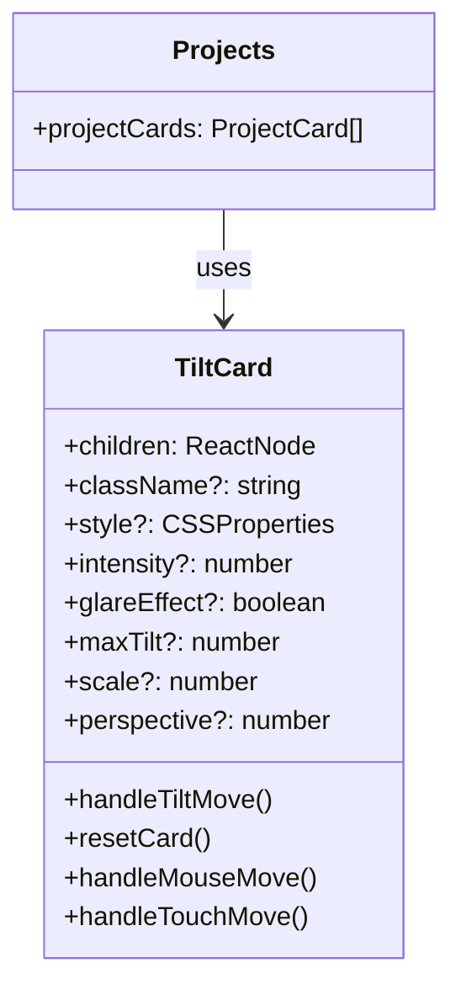
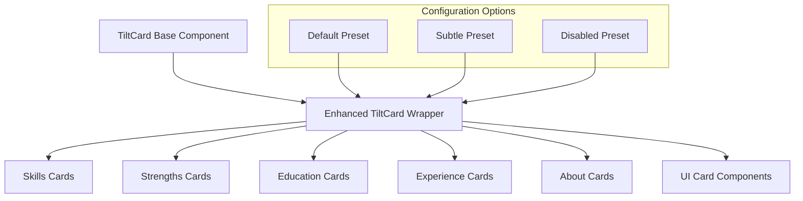
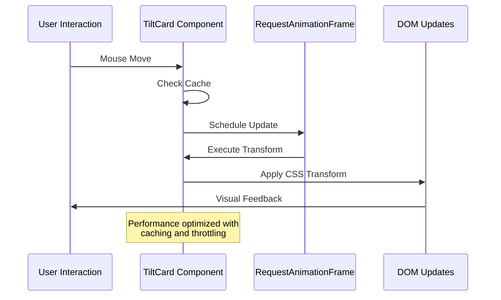

# Tilt Effect for All Cards

## Overview

This design document outlines the implementation strategy for applying interactive 3D tilt effects to all card components throughout the portfolio application. The goal is to enhance user engagement through consistent, performant, and accessible interactive visual effects across all sections.

## Current State Analysis

### Existing Card Usage

The application currently contains various card implementations across different sections:

1. **Projects Section**: Already using `TiltCard` component with full 3D effects
2. **Skills Section**: Uses `.categoryCard` CSS classes (3 cards)
3. **Strengths Section**: Uses `.card` CSS classes (6 cards)
4. **Education Section**: Uses `.card` CSS classes (1-2 cards)
5. **Experience Section**: Uses `.experienceCard` CSS classes (multiple cards)
6. **About Section**: Uses `.profileCard` and `.contactCard` CSS classes (4+ cards)
7. **UI Components**: Base `Card` component from shadcn/ui library

### Current TiltCard Implementation



## Architecture Design

### Component Integration Strategy



### Enhanced TiltCard Props Interface

| Property | Type | Default | Description |
|----------|------|---------|-------------|
| `children` | ReactNode | required | Card content |
| `className` | string | '' | Additional CSS classes |
| `style` | CSSProperties | {} | Inline styles |
| `intensity` | number | 0.8 | Tilt sensitivity (0-1) |
| `glareEffect` | boolean | true | Enable light reflection |
| `maxTilt` | number | 10 | Maximum tilt angle (degrees) |
| `scale` | number | 0.05 | Scale factor on hover |
| `perspective` | number | 1000 | CSS perspective value |
| `preset` | 'default' \| 'subtle' \| 'disabled' | 'default' | Predefined configurations |
| `disableOnMobile` | boolean | false | Disable tilt on mobile devices |

### Tilt Effect Presets

```typescript
const TILT_PRESETS = {
  default: {
    intensity: 0.8,
    maxTilt: 10,
    scale: 0.05,
    glareEffect: true,
    perspective: 1000
  },
  subtle: {
    intensity: 0.4,
    maxTilt: 5,
    scale: 0.02,
    glareEffect: false,
    perspective: 1500
  },
  disabled: {
    intensity: 0,
    maxTilt: 0,
    scale: 0,
    glareEffect: false,
    perspective: 1000
  }
}
```

## Implementation Plan

### Phase 1: Enhance TiltCard Component

**Update TiltCard Component**
- Add preset configuration system
- Improve mobile device detection
- Add reduced motion support
- Enhance performance optimizations

**New Props Structure**
```typescript
interface TiltCardProps {
  children: ReactNode;
  className?: string;
  style?: CSSProperties;
  preset?: 'default' | 'subtle' | 'disabled';
  customConfig?: Partial<TiltConfig>;
  disableOnMobile?: boolean;
  respectReducedMotion?: boolean;
}

interface TiltConfig {
  intensity: number;
  maxTilt: number;
  scale: number;
  glareEffect: boolean;
  perspective: number;
}
```

### Phase 2: Skills Section Integration

**Current Implementation:**
```jsx
<div className={styles.categoryCard} style={style}>
  {/* Content */}
</div>
```

**Enhanced Implementation:**
```jsx
<TiltCard 
  preset="subtle"
  className={styles.categoryCard} 
  style={style}
>
  {/* Content */}
</TiltCard>
```

### Phase 3: Strengths Section Integration

**Current Implementation:**
```jsx
<div className={styles.card}>
  {/* Content */}
</div>
```

**Enhanced Implementation:**
```jsx
<TiltCard 
  preset="default"
  className={styles.card}
>
  {/* Content */}
</TiltCard>
```

### Phase 4: Education Section Integration

**Current Implementation:**
```jsx
<div className={styles.card} style={cardStyle}>
  {/* Content */}
</div>
```

**Enhanced Implementation:**
```jsx
<TiltCard 
  preset="subtle"
  className={styles.card} 
  style={cardStyle}
>
  {/* Content */}
</TiltCard>
```

### Phase 5: Experience Section Integration

**Current Implementation:**
```jsx
<div className={styles.experienceCard}>
  {/* Content */}
</div>
```

**Enhanced Implementation:**
```jsx
<TiltCard 
  preset="subtle"
  className={styles.experienceCard}
>
  {/* Content */}
</TiltCard>
```

### Phase 6: About Section Integration

**Profile Card Integration:**
```jsx
<TiltCard 
  preset="default"
  className={styles.profileCard}
>
  {/* Content */}
</TiltCard>
```

**Contact Cards Integration:**
```jsx
<TiltCard 
  preset="subtle"
  className={styles.contactCard} 
  style={cardStyle}
>
  {/* Content */}
</TiltCard>
```

### Phase 7: UI Components Enhancement

**Enhanced Base Card Component:**
```jsx
const Card = React.forwardRef<HTMLDivElement, CardProps>(
  ({ className, enableTilt = false, tiltPreset = 'subtle', ...props }, ref) => {
    if (enableTilt) {
      return (
        <TiltCard 
          preset={tiltPreset}
          className={cn("rounded-lg border bg-card text-card-foreground shadow-sm", className)}
          ref={ref}
          {...props}
        />
      );
    }
    
    return (
      <div
        ref={ref}
        className={cn("rounded-lg border bg-card text-card-foreground shadow-sm", className)}
        {...props}
      />
    );
  }
);
```

## Performance Considerations

### Optimization Strategies

1. **RequestAnimationFrame Throttling**: Maintain existing RAF implementation
2. **Event Delegation**: Use passive event listeners where possible
3. **Cache Management**: Implement intelligent rect caching with invalidation
4. **Mobile Optimization**: Reduced intensity and optional disabling on mobile
5. **Memory Management**: Proper cleanup of event listeners and cache

### Performance Monitoring



## Accessibility & UX

### Accessibility Features

1. **Reduced Motion Support**: Respect `prefers-reduced-motion` system setting
2. **Keyboard Navigation**: Maintain standard focus behavior
3. **Screen Reader Compatibility**: Preserve semantic HTML structure
4. **Progressive Enhancement**: Graceful degradation when JavaScript is disabled

### UX Guidelines

1. **Consistent Interaction**: Uniform tilt behavior across all cards
2. **Visual Hierarchy**: Different presets for different content importance
3. **Mobile Experience**: Optimized touch interaction or optional disabling
4. **Performance**: Smooth 60fps animations with proper throttling

## Visual Effects Customization

### Section-Specific Configurations

| Section | Preset | Justification |
|---------|--------|---------------|
| Projects | default | High engagement, showcase content |
| Skills | subtle | Information density, multiple cards |
| Strengths | default | Key personal attributes, visual impact |
| Education | subtle | Formal content, less emphasis on interaction |
| Experience | subtle | Professional content, multiple entries |
| About (Profile) | default | Primary personal information |
| About (Contact) | subtle | Functional content, less emphasis |

### Dynamic Color Integration

Maintain existing dynamic color systems while adding tilt effects:

```typescript
// Preserve existing color palette logic
const cardStyle = {
  '--card-gradient': `linear-gradient(135deg, ${primary}33 0%, ${secondary}33 100%)`,
  '--text-color': text,
  '--border-hover': `${primary}66`,
  '--shadow-color': `${primary}33`,
}
```

## Implementation Sequence

```mermaid
gantt
    title Tilt Effect Implementation Timeline
    dateFormat  X
    axisFormat %d
    
    section Phase 1
    Enhance TiltCard Component    :active, p1, 0, 2
    
    section Phase 2
    Skills Section Integration    :p2, after p1, 1
    
    section Phase 3
    Strengths Section Integration :p3, after p2, 1
    
    section Phase 4
    Education Section Integration :p4, after p3, 1
    
    section Phase 5
    Experience Section Integration:p5, after p4, 1
    
    section Phase 6
    About Section Integration     :p6, after p5, 1
    
    section Phase 7
    UI Components Enhancement     :p7, after p6, 2
```



## Testing Strategy

### Test Coverage Areas

1. **Component Integration**: Verify TiltCard wrapping doesn't break existing layouts
2. **Performance Testing**: Monitor frame rates and memory usage
3. **Accessibility Testing**: Screen reader and keyboard navigation verification
4. **Cross-Browser Testing**: Ensure consistent behavior across modern browsers
5. **Mobile Testing**: Touch interaction and performance on mobile devices
6. **Reduced Motion Testing**: Verify proper handling of system accessibility preferences

### Test Cases

```typescript
describe('TiltCard Integration', () => {
  test('preserves existing card styling and layout');
  test('applies correct preset configurations');
  test('handles mobile device detection');
  test('respects reduced motion preferences');
  test('maintains performance within acceptable limits');
  test('properly cleans up event listeners');
});
```