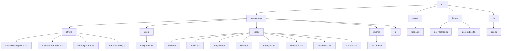
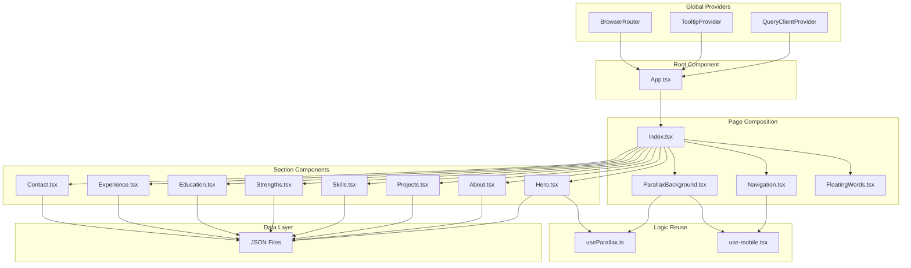
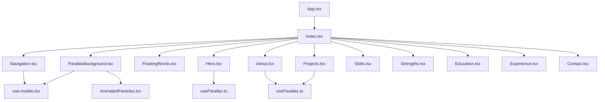
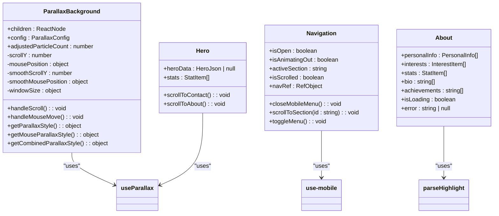
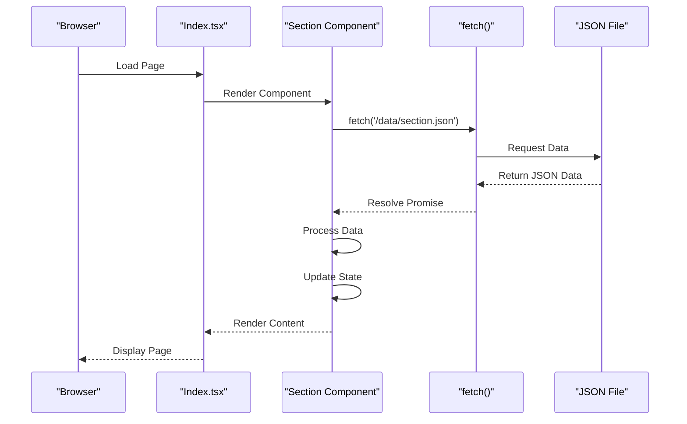
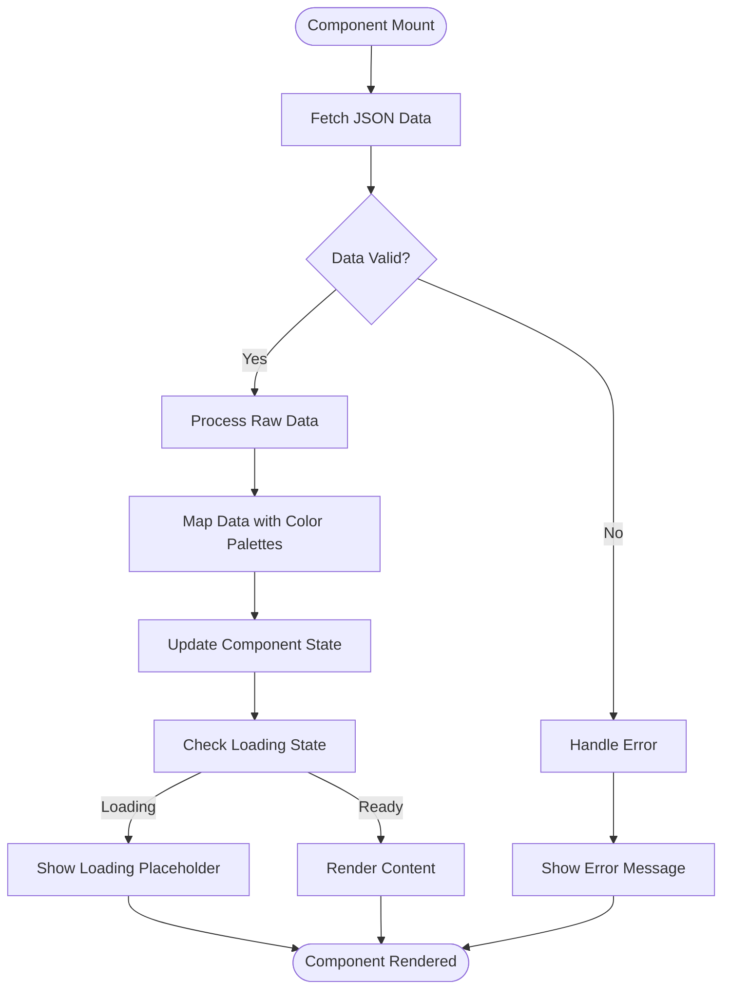
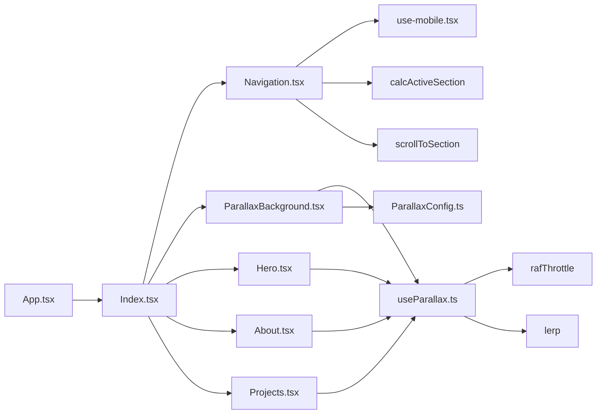

# Component Architecture

<cite>
**Referenced Files in This Document**   
- [App.tsx](file://src/App.tsx)
- [Index.tsx](file://src/pages/Index.tsx)
- [Navigation.tsx](file://src/components/layout/Navigation.tsx)
- [ParallaxBackground.tsx](file://src/components/effects/ParallaxBackground.tsx)
- [ParallaxConfig.ts](file://src/components/effects/ParallaxConfig.ts)
- [useParallax.ts](file://src/hooks/useParallax.ts)
- [use-mobile.tsx](file://src/hooks/use-mobile.tsx)
- [Hero.tsx](file://src/components/pages/Hero.tsx)
- [About.tsx](file://src/components/pages/About.tsx)
- [Projects.tsx](file://src/components/pages/Projects.tsx)
- [Skills.tsx](file://src/components/pages/Skills.tsx)
- [Strengths.tsx](file://src/components/pages/Strengths.tsx)
- [Education.tsx](file://src/components/pages/Education.tsx)
- [Experience.tsx](file://src/components/pages/Experience.tsx)
- [Contact.tsx](file://src/components/pages/Contact.tsx)
- [TiltCard.tsx](file://src/components/shared/TiltCard.tsx)
</cite>

## Table of Contents
1. [Introduction](#introduction)
2. [Project Structure](#project-structure)
3. [Core Components](#core-components)
4. [Architecture Overview](#architecture-overview)
5. [Detailed Component Analysis](#detailed-component-analysis)
6. [Dependency Analysis](#dependency-analysis)
7. [Performance Considerations](#performance-considerations)
8. [Troubleshooting Guide](#troubleshooting-guide)
9. [Conclusion](#conclusion)

## Introduction
The farruh-folio-wave application implements a component-based architecture that emphasizes separation of concerns, reusability, and composability. The system is built with React and leverages modern frontend patterns to create an interactive portfolio experience with parallax effects and dynamic content loading. The architecture follows a hierarchical structure starting from the root App.tsx component, which serves as the provider wrapper for global state and context, down to individual section components that represent distinct content areas of the portfolio.

The design principles prioritize clean separation between presentation and logic layers, with data flowing from JSON files through React components via client-side fetching. Visual effects are implemented through reusable effect components and custom hooks, while navigation provides seamless user interaction across sections. This documentation explores the architectural patterns, component relationships, data flow, and performance considerations that define the application's structure.

## Project Structure

**Diagram sources**
- [src/components/effects/ParallaxBackground.tsx](file://src/components/effects/ParallaxBackground.tsx)
- [src/components/layout/Navigation.tsx](file://src/components/layout/Navigation.tsx)
- [src/components/pages/Hero.tsx](file://src/components/pages/Hero.tsx)
- [src/pages/Index.tsx](file://src/pages/Index.tsx)
- [src/hooks/useParallax.ts](file://src/hooks/useParallax.ts)

**Section sources**
- [src/App.tsx](file://src/App.tsx)
- [src/pages/Index.tsx](file://src/pages/Index.tsx)
- [src/components/layout/Navigation.tsx](file://src/components/layout/Navigation.tsx)

## Core Components

The application's core components form a hierarchical structure that enables modular development and easy maintenance. At the top level, App.tsx serves as the root provider wrapper, managing global state and routing through React Router. It wraps the entire application with necessary providers including QueryClientProvider for data fetching, TooltipProvider for UI tooltips, and BrowserRouter for navigation.

Index.tsx acts as the main page composer, importing and orchestrating all section components (Hero, About, Projects, etc.) into a cohesive layout. This component also integrates visual effects like ParallaxBackground and FloatingWords, creating the distinctive aesthetic of the portfolio. The Navigation component provides fixed-position navigation with scroll-spy functionality, automatically highlighting the active section as users navigate through the page.

Each section component (Hero, About, Projects, etc.) is responsible for fetching its own data from JSON files in the public/data directory, processing it, and rendering it with appropriate styling. These components follow a consistent pattern of using useEffect for data fetching, useState for managing component state, and custom hooks for shared logic. The architecture promotes reusability through shared UI elements like TiltCard and utility functions in the lib directory.

**Section sources**
- [src/App.tsx](file://src/App.tsx)
- [src/pages/Index.tsx](file://src/pages/Index.tsx)
- [src/components/layout/Navigation.tsx](file://src/components/layout/Navigation.tsx)
- [src/components/pages/Hero.tsx](file://src/components/pages/Hero.tsx)
- [src/components/pages/About.tsx](file://src/components/pages/About.tsx)
- [src/components/pages/Projects.tsx](file://src/components/pages/Projects.tsx)

## Architecture Overview

**Diagram sources**
- [src/App.tsx](file://src/App.tsx)
- [src/pages/Index.tsx](file://src/pages/Index.tsx)
- [src/components/layout/Navigation.tsx](file://src/components/layout/Navigation.tsx)
- [src/components/effects/ParallaxBackground.tsx](file://src/components/effects/ParallaxBackground.tsx)
- [src/hooks/useParallax.ts](file://src/hooks/useParallax.ts)
- [src/hooks/use-mobile.tsx](file://src/hooks/use-mobile.tsx)

## Detailed Component Analysis

### Component Hierarchy and Relationships

**Diagram sources**
- [src/App.tsx](file://src/App.tsx)
- [src/pages/Index.tsx](file://src/pages/Index.tsx)
- [src/components/layout/Navigation.tsx](file://src/components/layout/Navigation.tsx)
- [src/components/effects/ParallaxBackground.tsx](file://src/components/effects/ParallaxBackground.tsx)
- [src/components/pages/Hero.tsx](file://src/components/pages/Hero.tsx)
- [src/hooks/useParallax.ts](file://src/hooks/useParallax.ts)
- [src/hooks/use-mobile.tsx](file://src/hooks/use-mobile.tsx)

#### For Object-Oriented Components:

**Diagram sources**
- [src/components/effects/ParallaxBackground.tsx](file://src/components/effects/ParallaxBackground.tsx)
- [src/components/layout/Navigation.tsx](file://src/components/layout/Navigation.tsx)
- [src/components/pages/Hero.tsx](file://src/components/pages/Hero.tsx)
- [src/components/pages/About.tsx](file://src/components/pages/About.tsx)
- [src/hooks/useParallax.ts](file://src/hooks/useParallax.ts)
- [src/hooks/use-mobile.tsx](file://src/hooks/use-mobile.tsx)

#### For API/Service Components:

**Diagram sources**
- [src/pages/Index.tsx](file://src/pages/Index.tsx)
- [src/components/pages/Hero.tsx](file://src/components/pages/Hero.tsx)
- [src/components/pages/About.tsx](file://src/components/pages/About.tsx)
- [src/components/pages/Projects.tsx](file://src/components/pages/Projects.tsx)

#### For Complex Logic Components:

**Diagram sources**
- [src/components/pages/Hero.tsx](file://src/components/pages/Hero.tsx)
- [src/components/pages/About.tsx](file://src/components/pages/About.tsx)
- [src/components/pages/Projects.tsx](file://src/components/pages/Projects.tsx)

**Section sources**
- [src/components/pages/Hero.tsx](file://src/components/pages/Hero.tsx)
- [src/components/pages/About.tsx](file://src/components/pages/About.tsx)
- [src/components/pages/Projects.tsx](file://src/components/pages/Projects.tsx)
- [src/components/pages/Skills.tsx](file://src/components/pages/Skills.tsx)
- [src/components/pages/Strengths.tsx](file://src/components/pages/Strengths.tsx)

### Conceptual Overview
The component architecture of farruh-folio-wave follows a clear hierarchy from the root App component down to individual section components. This structure enables separation of concerns by isolating different aspects of the application into distinct modules. The Index component serves as the main composer, bringing together navigation, visual effects, and content sections into a cohesive layout.

Data flows from static JSON files through individual section components, which are responsible for fetching their own data and rendering it appropriately. This decentralized approach to data management allows each section to be developed and maintained independently. Visual effects are implemented through reusable components like ParallaxBackground and FloatingWords, which can be configured through props and configuration objects.

The architecture emphasizes reusability through custom hooks like useParallax and use-mobile, which encapsulate complex logic and make it available across multiple components. CSS Modules provide scoped styling, preventing style conflicts between components. The overall design promotes composability, allowing new sections to be added easily by following the established patterns.

## Dependency Analysis

**Diagram sources**
- [src/App.tsx](file://src/App.tsx)
- [src/pages/Index.tsx](file://src/pages/Index.tsx)
- [src/components/layout/Navigation.tsx](file://src/components/layout/Navigation.tsx)
- [src/components/effects/ParallaxBackground.tsx](file://src/components/effects/ParallaxBackground.tsx)
- [src/hooks/useParallax.ts](file://src/hooks/useParallax.ts)
- [src/components/effects/ParallaxConfig.ts](file://src/components/effects/ParallaxConfig.ts)

## Performance Considerations

The application employs several strategies to optimize performance despite its animation-heavy design. The use of requestAnimationFrame for throttling scroll and mouse events prevents excessive re-renders and ensures smooth animations. The lerp (linear interpolation) function creates smooth transitions between values, enhancing the visual experience without sacrificing performance.

For mobile devices, the application uses the use-mobile hook to detect screen size and potentially adjust behavior accordingly. The ParallaxBackground component can accept an adjustedParticleCount prop to reduce the number of particles on smaller screens, improving performance on less powerful devices.

Data loading is handled efficiently through direct fetch calls to JSON files, avoiding the overhead of a full API integration. However, this client-side data loading approach means all data is loaded when the component mounts, which could impact initial load time as the amount of content grows. The use of React Query through QueryClientProvider provides caching capabilities that could be leveraged to further optimize data fetching.

The parallax effects are implemented with CSS transforms and will-change properties to enable hardware acceleration, ensuring smooth animations. However, the intensive use of DOM manipulation for the parallax effect could impact performance on lower-end devices, particularly with the "intense" configuration preset.

**Section sources**
- [src/components/effects/ParallaxBackground.tsx](file://src/components/effects/ParallaxBackground.tsx)
- [src/hooks/useParallax.ts](file://src/hooks/useParallax.ts)
- [src/hooks/use-mobile.tsx](file://src/hooks/use-mobile.tsx)

## Troubleshooting Guide

Common issues in the farruh-folio-wave application typically relate to data loading, visual effects, and responsiveness. When JSON data fails to load, check that the corresponding file exists in the public/data directory and that the fetch path is correct. Network errors can be diagnosed by checking the browser's developer tools network tab.

If parallax effects are not working correctly, verify that the useParallax hook is properly imported and used in the component. Ensure that the ParallaxBackground component receives the correct configuration props and that the window events for scroll and mouse movement are being properly captured.

For mobile responsiveness issues, confirm that the use-mobile hook is functioning correctly by checking its return value in components that depend on it. The mobile menu animation in Navigation.tsx relies on proper timing of the isOpen and isAnimatingOut states, so issues with the menu closing prematurely may indicate problems with the setTimeout duration or state management.

Performance issues on lower-end devices can often be mitigated by using the "performance" preset in ParallaxConfig or by reducing the particle count in the component configuration. If text highlighting with the [[text|color]] syntax is not working, ensure that the corresponding CSS classes exist in the component's module CSS file.

**Section sources**
- [src/components/pages/Hero.tsx](file://src/components/pages/Hero.tsx)
- [src/components/pages/About.tsx](file://src/components/pages/About.tsx)
- [src/components/layout/Navigation.tsx](file://src/components/layout/Navigation.tsx)
- [src/components/effects/ParallaxBackground.tsx](file://src/components/effects/ParallaxBackground.tsx)
- [src/hooks/useParallax.ts](file://src/hooks/useParallax.ts)

## Conclusion

The farruh-folio-wave application demonstrates a well-structured component-based architecture that effectively balances visual appeal with maintainable code organization. The hierarchical component structure, from App.tsx as the root provider wrapper to Index.tsx as the main page composer, creates a clear separation of concerns that facilitates development and maintenance.

Key architectural patterns include the use of CSS Modules for scoped styling, custom hooks for logic reuse, and configuration-driven effects through ParallaxConfig.ts. The data flow from JSON files to React components via inline fetch operations provides a simple and efficient way to manage content, though it presents scalability challenges for larger datasets.

The integration of visual effects like ParallaxBackground with navigation components creates an engaging user experience, while the use of React Query provides a foundation for more sophisticated data management if needed in the future. The architecture demonstrates thoughtful consideration of trade-offs between client-side data loading and API integration, as well as performance implications of animation-heavy designs.

Future enhancements could include implementing server-side rendering for improved initial load performance, adding lazy loading for images and non-critical components, and expanding the use of React Query for more robust data caching and synchronization. The current architecture provides a solid foundation for these improvements while maintaining the application's distinctive visual identity.