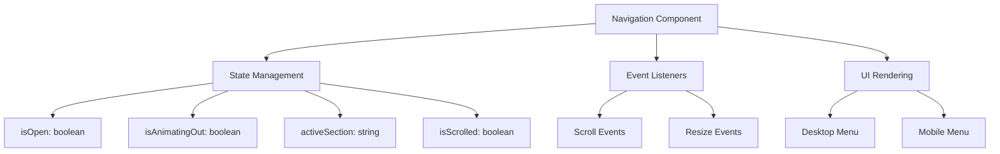
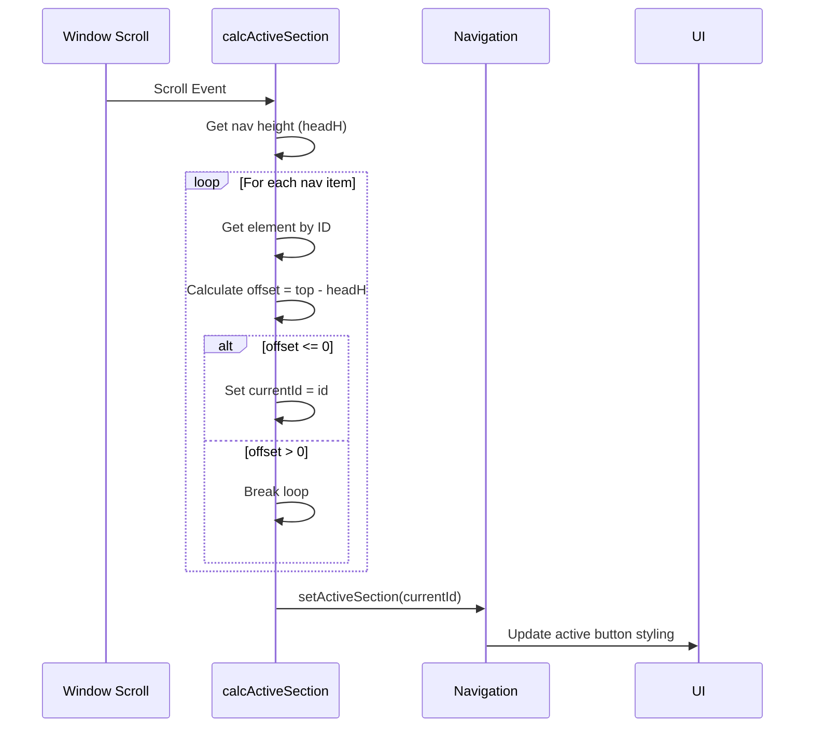
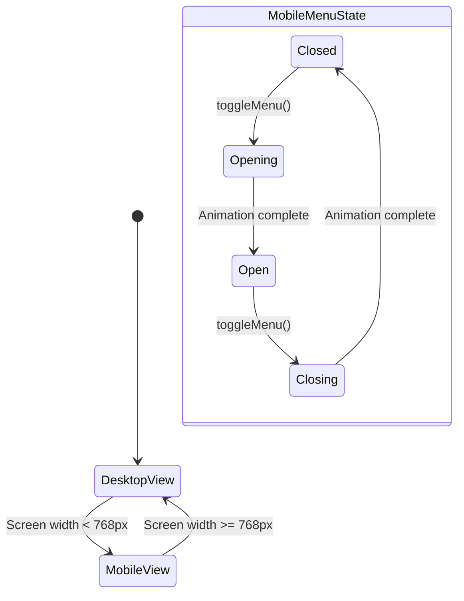
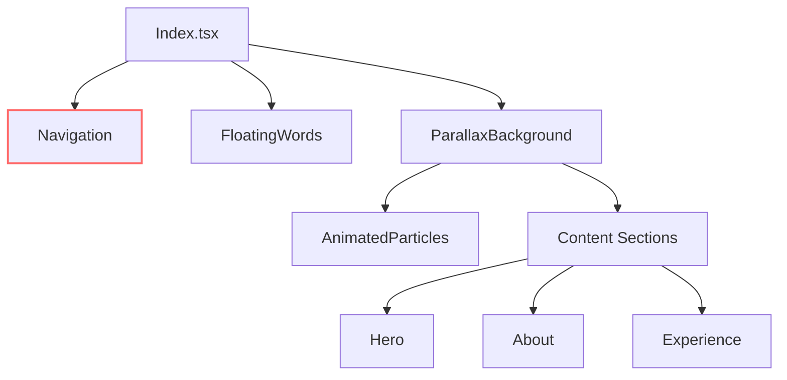

# Layout Components

<cite>
**Referenced Files in This Document**   
- [Navigation.tsx](file://src/components/layout/Navigation.tsx)
- [Index.tsx](file://src/pages/Index.tsx)
- [use-mobile.tsx](file://src/hooks/use-mobile.tsx)
- [Navigation.module.css](file://src/components/layout/Navigation.module.css)
- [ParallaxBackground.tsx](file://src/components/effects/ParallaxBackground.tsx)
</cite>

## Table of Contents
1. [Introduction](#introduction)
2. [Core Navigation Architecture](#core-navigation-architecture)
3. [Scroll-Spy Detection and Active Section Management](#scroll-spy-detection-and-active-section-management)
4. [Smooth Scrolling and Anchor Linking](#smooth-scrolling-and-anchor-linking)
5. [Responsive Behavior with Mobile Menu](#responsive-behavior-with-mobile-menu)
6. [Integration with Parallax Effects](#integration-with-parallax-effects)
7. [Accessibility Considerations](#accessibility-considerations)
8. [Troubleshooting Common Issues](#troubleshooting-common-issues)

## Introduction
The layout components in farruh-folio-wave provide the structural foundation for navigation, visual effects, and responsive behavior across the portfolio website. The primary component, `Navigation.tsx`, serves as the central hub for user interaction, managing scroll-spy detection, active section highlighting, smooth scrolling between sections, and mobile responsiveness through hamburger menu toggling. This documentation details how these components work together to create a seamless user experience while maintaining performance and accessibility standards.

## Core Navigation Architecture

The `Navigation` component is implemented as a fixed-position navbar that integrates tightly with the overall page structure defined in `Index.tsx`. It uses React hooks such as `useState`, `useEffect`, `useRef`, and `useCallback` to manage state, DOM references, and event handling efficiently. The navigation maintains several key states:

- **isOpen**: Controls visibility of the mobile menu
- **isAnimatingOut**: Manages animation state during menu closing
- **activeSection**: Tracks which content section is currently visible
- **isScrolled**: Determines whether the user has scrolled past the initial viewport

These states are managed through carefully optimized event listeners that respond to scroll and resize events without causing performance degradation.



**Diagram sources**
- [Navigation.tsx](file://src/components/layout/Navigation.tsx#L24-L48)

**Section sources**
- [Navigation.tsx](file://src/components/layout/Navigation.tsx#L0-L22)

## Scroll-Spy Detection and Active Section Management

The navigation implements a precise scroll-spy mechanism that automatically highlights the current section based on the user's scroll position. This functionality is achieved through the `calcActiveSection` function, which runs during scroll and resize events using requestAnimationFrame for optimal performance.

The algorithm works by:
1. Calculating the height of the navigation bar (`headH`)
2. Iterating through predefined navigation items in order
3. Using `getBoundingClientRect()` to determine when each section crosses the top boundary of the viewport
4. Setting the last section that has crossed this boundary as the active section

This approach ensures that only one section is highlighted at a time and correctly identifies the current section even during rapid scrolling.



**Diagram sources**
- [Navigation.tsx](file://src/components/layout/Navigation.tsx#L50-L77)

**Section sources**
- [Navigation.tsx](file://src/components/layout/Navigation.tsx#L76-L116)

## Smooth Scrolling and Anchor Linking

The navigation provides smooth scrolling functionality through the `scrollToSection` method, which handles both programmatic navigation and user interactions. When a navigation link is clicked, this function:

1. Retrieves the target element by its ID
2. Calculates the precise scroll position accounting for the fixed navigation height
3. Uses `window.scrollTo()` with smooth behavior
4. Immediately updates the active section indicator
5. Closes the mobile menu if open

The implementation includes safeguards against invalid targets and calculates the final scroll position using `Math.min()` to prevent overshooting the document boundaries.

```mermaid
flowchart LR
A[User Clicks Nav Item] --> B{scrollToSection(id)}
B --> C[Get Element by ID]
C --> D{Element Exists?}
D --> |Yes| E[Calculate Target Position]
D --> |No| F[Exit Function]
E --> G[Adjust for Nav Height]
G --> H[Apply Smooth Scroll]
H --> I[Set Active Section]
I --> J[Close Mobile Menu]
```

**Diagram sources**
- [Navigation.tsx](file://src/components/layout/Navigation.tsx#L118-L145)

**Section sources**
- [Navigation.tsx](file://src/components/layout/Navigation.tsx#L118-L145)

## Responsive Behavior with Mobile Menu

The navigation adapts to different screen sizes using the `useIsMobile` hook from `use-mobile.tsx`, which monitors window dimensions relative to a 768px breakpoint. On mobile devices, the desktop menu is replaced with a hamburger menu that animates in and out with CSS transitions.

Key features include:
- Conditional rendering of desktop vs. mobile menus based on screen width
- Animation state management using `isAnimatingOut` to ensure proper timing
- 250ms timeout for animation completion before updating `isOpen` state
- Touch-friendly button sizing and spacing for mobile interaction

The mobile menu appears as a full-width dropdown below the navigation bar with slide-down/slide-up animations controlled through CSS classes applied conditionally.



**Section sources**
- [Navigation.tsx](file://src/components/layout/Navigation.tsx#L147-L215)
- [use-mobile.tsx](file://src/hooks/use-mobile.tsx#L0-L18)

## Integration with Parallax Effects

The navigation system coexists with parallax background effects implemented in `ParallaxBackground.tsx`. These effects use independent scroll and mouse movement tracking but do not interfere with navigation functionality due to proper event delegation and passive event listeners.

The navigation's fixed positioning and z-index layering ensure it remains above all parallax elements while still allowing accurate scroll position detection. The parallax system respects the navigation's height through proper container structuring in `Index.tsx`, where the navigation is rendered outside the parallax wrapper but within the same parent container.



**Section sources**
- [Index.tsx](file://src/pages/Index.tsx#L0-L89)
- [ParallaxBackground.tsx](file://src/components/effects/ParallaxBackground.tsx#L0-L337)

## Accessibility Considerations

The navigation component incorporates several accessibility features to ensure usability for all users:

- **Keyboard Navigation**: All interactive elements are focusable and operable via keyboard
- **Focus Indicators**: Visible focus rings on buttons using `focus-visible` pseudo-class
- **ARIA Attributes**: Proper semantic markup for navigation landmarks
- **Screen Reader Support**: Logical tab order and meaningful labels
- **Color Contrast**: Sufficient contrast ratios for text and interactive elements

Interactive buttons include proper hover and focus states with transitions that don't cause discomfort. The mobile menu can be dismissed programmatically, and all actions are reversible through standard navigation patterns.

**Section sources**
- [Navigation.module.css](file://src/components/layout/Navigation.module.css#L0-L78)
- [Navigation.tsx](file://src/components/layout/Navigation.tsx#L147-L215)

## Troubleshooting Common Issues

### Incorrect Active States
If the active section highlighting appears incorrect:
1. Verify that all section IDs match exactly with navigation item IDs
2. Check that no CSS rules are interfering with element positioning
3. Ensure the `--nav-height` CSS variable is being updated properly
4. Confirm that `calcActiveSection` is running on both scroll and resize events

### Broken Scroll Targeting
For smooth scrolling issues:
1. Validate that target elements have correct IDs matching navigation links
2. Check for JavaScript errors in the console that might prevent execution
3. Verify that `window.scrollTo()` is supported in the target browser
4. Ensure no other scripts are intercepting or preventing default behavior

### Mobile Menu Animation Problems
If the mobile menu animation behaves unexpectedly:
1. Confirm the 250ms timeout matches the CSS transition duration
2. Check that `isAnimatingOut` state is properly synchronized
3. Verify that touch events aren't being intercepted by other components
4. Test on actual mobile devices to rule out emulator discrepancies

**Section sources**
- [Navigation.tsx](file://src/components/layout/Navigation.tsx#L0-L215)