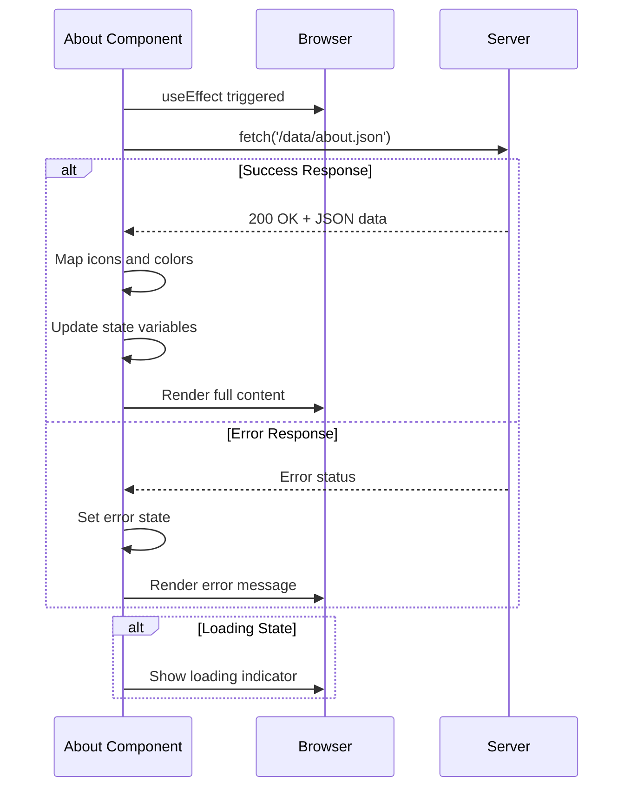
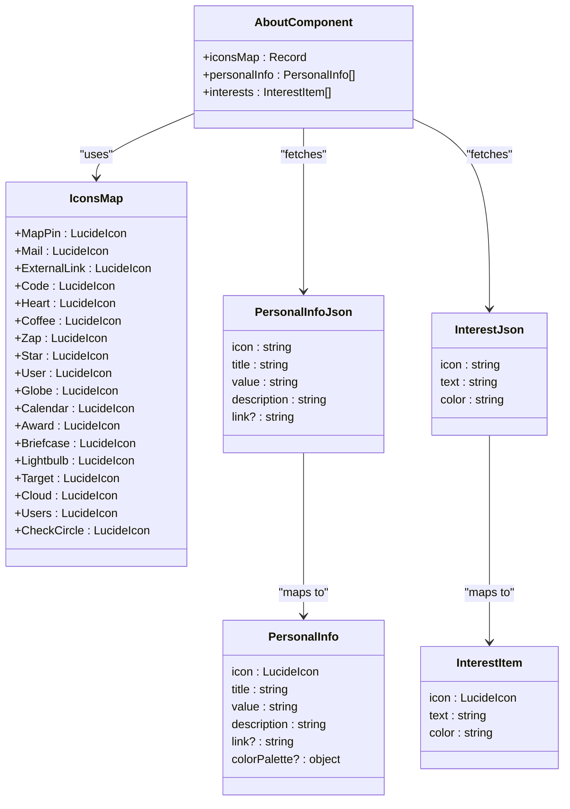
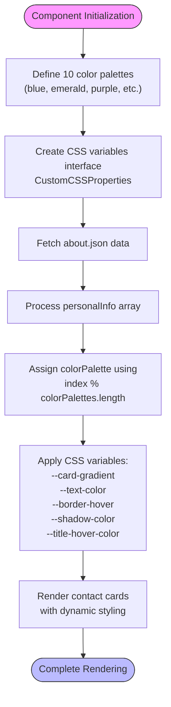
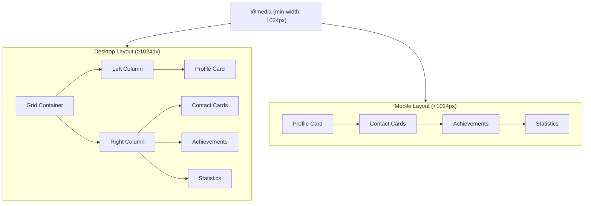
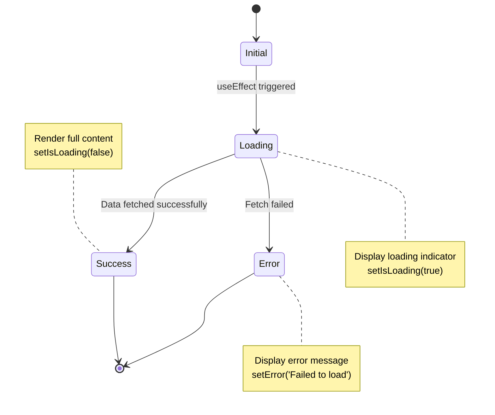

# About Section

<cite>
**Referenced Files in This Document**
- [About.tsx](file://src/components/pages/About.tsx)
- [about.json](file://public/data/about.json)
- [About.module.css](file://src/components/pages/About.module.css)
</cite>

## Table of Contents
1. [Introduction](#introduction)
2. [Data Fetching and State Management](#data-fetching-and-state-management)
3. [Dynamic Icon Mapping System](#dynamic-icon-mapping-system)
4. [Color Palette Assignment and CSS Variables](#color-palette-assignment-and-css-variables)
5. [Rich Text Formatting with parseHighlight Utility](#rich-text-formatting-with-parsehighlight-utility)
6. [Responsive Grid Layout Architecture](#responsive-grid-layout-architecture)
7. [Error Handling and Loading States](#error-handling-and-loading-states)
8. [Extensibility and Type Safety](#extensibility-and-type-safety)
9. [Troubleshooting Common Issues](#troubleshooting-common-issues)
10. [Performance Optimization Considerations](#performance-optimization-considerations)

## Introduction
The About section component is a React TypeScript implementation that dynamically renders personal information, bio, interests, achievements, and statistics for a portfolio website. It follows a data-driven architecture where content is fetched from an external JSON file (`about.json`) and rendered through a structured component hierarchy. The design emphasizes visual appeal with gradient backgrounds, hover effects, and animated transitions while maintaining accessibility and responsiveness. The component leverages Lucide React icons, CSS modules for styling, and TypeScript interfaces to ensure type safety throughout the data flow.

**Section sources**
- [About.tsx](file://src/components/pages/About.tsx#L0-L363)

## Data Fetching and State Management
The component implements asynchronous data fetching using the `useEffect` hook to retrieve content from `/data/about.json` during initialization. It manages state through multiple `useState` hooks for different content categories: personalInfo, interests, stats, bio, and achievements. The fetch process includes proper error handling with status code validation and network error catching. Upon successful response, the JSON data is transformed by mapping string-based icon names to actual Lucide React components and assigning color palettes based on index position. The loading state is tracked with an `isLoading` flag, while errors are captured in an `error` state variable for user feedback.



**Diagram sources**
- [About.tsx](file://src/components/pages/About.tsx#L147-L188)

**Section sources**
- [About.tsx](file://src/components/pages/About.tsx#L147-L188)
- [about.json](file://public/data/about.json#L0-L38)

## Dynamic Icon Mapping System
The component implements a robust icon mapping system that translates string identifiers from the JSON data into corresponding Lucide React components. This is achieved through the `iconsMap` constant, which is a TypeScript Record mapping icon name strings to their respective component references. When processing the JSON data, the component looks up each icon name in this map and assigns the corresponding React component. For example, "Zap" maps to the Zap Lucide icon component. A fallback mechanism ensures that if an icon name doesn't exist in the map (or is malformed), it defaults to the User icon for personal info items or Star for interest items, preventing rendering failures.



**Diagram sources**
- [About.tsx](file://src/components/pages/About.tsx#L45-L58)
- [about.json](file://public/data/about.json#L0-L38)

**Section sources**
- [About.tsx](file://src/components/pages/About.tsx#L45-L58)
- [about.json](file://public/data/about.json#L0-L38)

## Color Palette Assignment and CSS Variables
The component employs a sophisticated color management system using predefined color palettes and CSS custom properties. Ten distinct color palettes are defined in the `colorPalettes` array, each containing primary, secondary, and text color values corresponding to Tailwind's color spectrum (blue, emerald, purple, orange, etc.). These palettes are cyclically assigned to contact cards based on their index position using modulo arithmetic. The component uses a `CustomCSSProperties` interface extension to support CSS variables, which are dynamically applied to each contact card. Key variables include `--card-gradient` for background gradients, `--text-color` for text elements, `--border-hover` for border colors on hover, and `--shadow-color` for shadow effects. These variables enable consistent theming across different visual states (normal, hover) while maintaining flexibility for future extensions.



**Diagram sources**
- [About.tsx](file://src/components/pages/About.tsx#L15-L43)
- [About.module.css](file://src/components/pages/About.module.css#L0-L768)

**Section sources**
- [About.tsx](file://src/components/pages/About.tsx#L15-L43)
- [About.module.css](file://src/components/pages/About.module.css#L0-L768)

## Rich Text Formatting with parseHighlight Utility
The component features a powerful `parseHighlight` utility function that enables rich text formatting within the bio section using a custom markup syntax. This function processes paragraphs containing the pattern `[[text|color]]` and converts them into highlighted JSX elements. It uses a regular expression `/\[\[(.*?)\|(.*?)\]\]/g` to identify these patterns, extracting both the text content and color designation. For each match, it creates a span element with a dynamically determined CSS class following the naming convention `highlightColorName` (e.g., `highlightBlue`, `highlightEmerald`). The function carefully preserves non-matched text portions and returns an array of React nodes that can be directly rendered. This approach allows content creators to emphasize specific terms in the biography with color coding without requiring HTML editing capabilities.

```mermaid
flowchart LR
A[Input Paragraph] --> B{Contains [[text|color]]?}
B --> |Yes| C[Extract matches with regex]
C --> D[Process each match]
D --> E[Create span with className<br>highlight{Color}]
E --> F[Preserve surrounding text]
F --> G[Return mixed array of<br>strings and JSX elements]
B --> |No| H[Return original text]
G --> I[Render in DOM with<br>colored highlights]
H --> I
style A fill:#f9f,stroke:#333
style I fill:#bbf,stroke:#333
```

**Diagram sources**
- [About.tsx](file://src/components/pages/About.tsx#L118-L145)
- [About.module.css](file://src/components/pages/About.module.css#L224-L239)

**Section sources**
- [About.tsx](file://src/components/pages/About.tsx#L118-L145)
- [About.module.css](file://src/components/pages/About.module.css#L224-L239)

## Responsive Grid Layout Architecture
The component implements a responsive two-column layout that adapts to different screen sizes using CSS Grid. On mobile devices, the content stacks vertically with the profile information (left column) appearing first, followed by professional information (right column). At the 1024px breakpoint (desktop), the layout transforms into a side-by-side arrangement using `grid-template-columns: repeat(2, 1fr)`. The left column contains the profile card with the user's name, bio, and interests, while the right column houses contact cards for personal information, achievements, and statistics. Each section is implemented with semantic HTML structure and appropriate spacing. The grid container has a maximum width of 72rem to maintain readability on large screens, with responsive padding adjustments at different breakpoints.



**Diagram sources**
- [About.module.css](file://src/components/pages/About.module.css#L130-L145)
- [About.tsx](file://src/components/pages/About.tsx#L224-L251)

**Section sources**
- [About.module.css](file://src/components/pages/About.module.css#L130-L145)
- [About.tsx](file://src/components/pages/About.tsx#L224-L251)

## Error Handling and Loading States
The component implements comprehensive error handling and loading state management to ensure a smooth user experience during data retrieval. Three distinct states are managed: loading, error, and success. During the initial data fetch, a loading state is displayed with a centered message "Loading about information..." styled with subtle background and border effects. If the fetch fails due to network issues or server errors, an error state is activated, displaying a red-colored error message with appropriate contrast. As a final safeguard, if no personal information is loaded despite successful data retrieval, an additional error message prevents empty rendering. The component uses proper async/await syntax with try-catch blocks for error capture and ensures the loading state is always reset in the finally block, preventing permanent loading indicators.



**Diagram sources**
- [About.tsx](file://src/components/pages/About.tsx#L190-L222)

**Section sources**
- [About.tsx](file://src/components/pages/About.tsx#L190-L222)
- [About.module.css](file://src/components/pages/About.module.css#L0-L15)

## Extensibility and Type Safety
The component architecture prioritizes extensibility while maintaining strict type safety through TypeScript interfaces. The data structure is defined with clear separation between JSON input types (`PersonalInfoJson`, `InterestJson`, `AboutJson`) and component state types (`PersonalInfo`, `InterestItem`, `StatItem`) that include resolved icons and color palettes. This type separation allows for safe transformation of data during the fetch process. To extend the component with new personal info fields, developers can simply add entries to the `about.json` file with supported icon names. For customizing interest icons, new entries can be added to the JSON as long as they correspond to available Lucide icons in the `iconsMap`. The type system ensures that any mismatch between JSON data and expected structures will be caught at compile time, preventing runtime errors.

```mermaid
erDiagram
ABOUT_JSON {
array personalInfo
array interests
array stats
array bio
array achievements
}
PERSONAL_INFO_JSON {
string icon
string title
string value
string description
string? link
}
INTEREST_JSON {
string icon
string text
string color
}
STATS_ITEM {
string number
string label
string color
}
PERSONAL_INFO_STATE {
LucideIcon icon
string title
string value
string description
string? link
object? colorPalette
}
INTEREST_ITEM_STATE {
LucideIcon icon
string text
string color
}
ABOUT_JSON ||--o{ PERSONAL_INFO_JSON : contains
ABOUT_JSON ||--o{ INTEREST_JSON : contains
ABOUT_JSON ||--o{ STATS_ITEM : contains
PERSONAL_INFO_JSON }|--|| PERSONAL_INFO_STATE : maps to
INTEREST_JSON }|--|| INTEREST_ITEM_STATE : maps to
```

**Diagram sources**
- [About.tsx](file://src/components/pages/About.tsx#L60-L116)

**Section sources**
- [About.tsx](file://src/components/pages/About.tsx#L60-L116)
- [about.json](file://public/data/about.json#L0-L38)

## Troubleshooting Common Issues
Common rendering issues typically stem from mismatches between the JSON data and component expectations. If icons fail to display, verify that the icon name in `about.json` exactly matches one of the keys in the `iconsMap` object (e.g., "Zap" not "zap" or "lightning"). For missing color highlights in the bio section, ensure the color name in the `[[text|color]]` syntax matches existing CSS classes like "blue", "emerald", "purple", or "orange". If contact cards appear without gradients, check that the personalInfo array in JSON has sufficient items to cycle through the color palettes. Loading issues may occur if the `about.json` file is not properly placed in the public/data directory or if there are CORS restrictions in the deployment environment. Always verify the browser's developer tools network tab to confirm successful JSON retrieval.

**Section sources**
- [About.tsx](file://src/components/pages/About.tsx#L147-L188)
- [about.json](file://public/data/about.json#L0-L38)
- [About.module.css](file://src/components/pages/About.module.css#L224-L239)

## Performance Optimization Considerations
The component demonstrates several performance optimization techniques. The data fetch operation is wrapped in a `useEffect` hook with an empty dependency array, ensuring it only runs once during component mount rather than on every render. The `parseHighlight` function efficiently processes text using a single pass through the paragraph content with regex matching, minimizing computational overhead. CSS animations and transitions are hardware-accelerated using transform and opacity properties rather than layout-affecting changes. The component avoids unnecessary re-renders by storing all data in consolidated state variables rather than individual pieces of state. For larger datasets, consider implementing lazy loading of images or additional content sections, though this is not currently needed given the small size of the about.json file. The use of CSS variables for dynamic theming reduces the need for inline styles and improves render performance.

**Section sources**
- [About.tsx](file://src/components/pages/About.tsx#L147-L188)
- [About.module.css](file://src/components/pages/About.module.css#L0-L768)