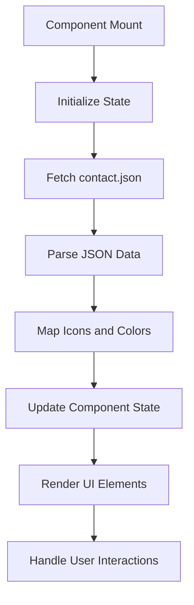
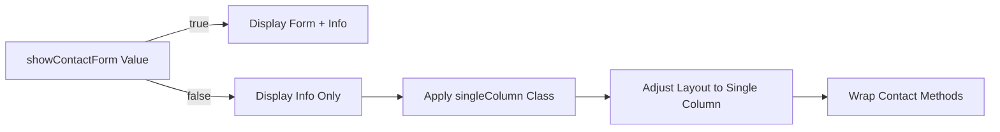
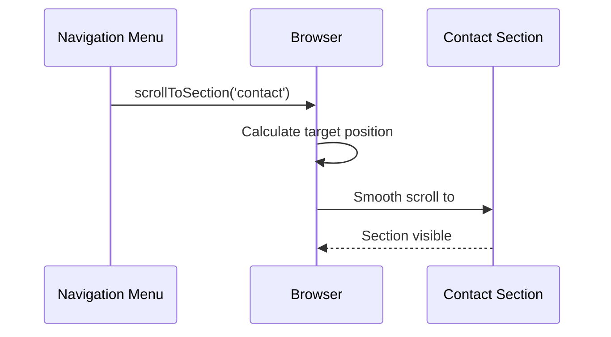

# Contact Section

<cite>
**Referenced Files in This Document**   
- [Contact.tsx](file://src/components/pages/Contact.tsx)
- [contact.json](file://public/data/contact.json)
- [Contact.module.css](file://src/components/pages/Contact.module.css)
- [Navigation.tsx](file://src/components/layout/Navigation.tsx)
</cite>

## Table of Contents
1. [Introduction](#introduction)
2. [Data Structure and Configuration](#data-structure-and-configuration)
3. [React and TypeScript Implementation](#react-and-typescript-implementation)
4. [UI Components and Styling](#ui-components-and-styling)
5. [Conditional Rendering Logic](#conditional-rendering-logic)
6. [Integration with Global Navigation](#integration-with-global-navigation)
7. [Security and Spam Prevention](#security-and-spam-prevention)
8. [Extensibility and Customization](#extensibility-and-customization)

## Introduction
The Contact section component provides a comprehensive communication interface for users to connect with the portfolio owner. Implemented using React and TypeScript, this component dynamically renders contact options sourced from a JSON configuration file. It features a responsive layout with interactive elements including clickable icons, hover effects, and conditional rendering based on configuration flags. The component integrates seamlessly with the global navigation system through the 'contact' anchor ID and implements secure communication methods while preventing spam exposure.

**Section sources**
- [Contact.tsx](file://src/components/pages/Contact.tsx#L0-L282)

## Data Structure and Configuration
The contact information is managed through a structured JSON configuration that defines various communication methods and display preferences. The data structure includes email, social media links, messaging platforms, and form configuration flags.

```json
{
  "showContactForm": false,
  "contactMethods": [
    {
      "icon": "Mail",
      "title": "Email",
      "value": "farruh.sheripov@fusioncode.org",
      "link": "mailto:farruh.sheripov@fusioncode.org"
    },
    {
      "icon": "Phone",
      "title": "Phone",
      "value": "+48 571 048 777",
      "link": "tel:+48571048777"
    },
    {
      "icon": "MapPin",
      "title": "Location",
      "value": "Kraków, Poland, 31-878"
    },
    {
      "icon": "Linkedin",
      "title": "LinkedIn",
      "value": "linkedin.com/in/farruh-sheripov",
      "link": "https://www.linkedin.com/in/farruh-sheripov/"
    }
  ]
}
```

The configuration supports four key properties for each contact method:
- **icon**: References Lucide icon components (e.g., Mail, Phone, MapPin)
- **title**: Display label for the contact method
- **value**: Visible text content shown to users
- **link**: Optional URL or URI scheme for external linking

Additionally, the root-level `showContactForm` flag controls whether the message submission form is displayed, allowing for flexible configuration without code changes.

**Section sources**
- [contact.json](file://public/data/contact.json#L0-L27)
- [Contact.tsx](file://src/components/pages/Contact.tsx#L45-L55)

## React and TypeScript Implementation
The Contact component is implemented as a functional React component with TypeScript typing for type safety. It utilizes React hooks for state management and side effects, fetching contact data asynchronously from the JSON file.



The implementation uses several React hooks:
- `useState` manages form data, submission status, contact methods, and form visibility
- `useEffect` handles the asynchronous loading of contact data on component mount
- `useToast` provides user feedback through toast notifications

TypeScript interfaces define the expected data structures:
- `ContactMethodJson`: Shape of individual contact methods in JSON
- `ContactJson`: Complete JSON structure with contact methods array and form flag
- `ContactMethod`: Enhanced runtime representation with icon components and color palettes

The component fetches data from `/data/contact.json` and maps string-based icon references to actual Lucide React components using an icon mapping object. Each contact method is assigned a dynamic color palette from a predefined set, creating visual variety across contact options.

**Diagram sources**
- [Contact.tsx](file://src/components/pages/Contact.tsx#L0-L58)
- [Contact.tsx](file://src/components/pages/Contact.tsx#L60-L95)

**Section sources**
- [Contact.tsx](file://src/components/pages/Contact.tsx#L0-L95)

## UI Components and Styling
The Contact section features a modern, responsive design with interactive elements and consistent styling. The UI components include clickable icons with external links, hover effects, and a two-column layout that adapts to different screen sizes.

```mermaid
classDiagram
class ContactMethod {
+icon : LucideIcon
+title : string
+value : string
+link? : string
+colorPalette : ColorPalette
}
class ContactCard {
+background : gradient
+border : 1px solid rgba(255,255,255,0.1)
+border-radius : 0.75rem
+padding : 1rem
+transition : all 0.3s ease
}
class IconContainer {
+padding : 0.75rem
+border-radius : 9999px
+background : var(--card-gradient)
+transition : transform 0.3s ease
}
ContactMethod --> ContactCard : "rendered as"
ContactMethod --> IconContainer : "contains"
ContactCard --> " : hover" : "box-shadow and border-color change"
IconContainer --> " : hover" : "transform : scale(1.1)"
```

Each contact method is rendered as a card with the following characteristics:
- Flex layout with icon and details side by side
- Dynamic background gradient using CSS variables
- Hover effects that enhance the shadow and border color
- Icon container with circular shape and scaling animation on hover
- Text links that change color on hover for better accessibility

The styling leverages CSS custom properties (variables) for dynamic theming, allowing each contact method to have unique colors while maintaining consistent visual language. The responsive layout switches from a two-column grid on desktop to a single column on mobile devices, ensuring optimal viewing experience across all screen sizes.

**Diagram sources**
- [Contact.module.css](file://src/components/pages/Contact.module.css#L130-L200)
- [Contact.module.css](file://src/components/pages/Contact.module.css#L327-L418)

**Section sources**
- [Contact.module.css](file://src/components/pages/Contact.module.css#L76-L270)
- [Contact.tsx](file://src/components/pages/Contact.tsx#L94-L136)

## Conditional Rendering Logic
The component implements conditional rendering based on the JSON configuration, specifically the `showContactForm` flag. This allows administrators to toggle the visibility of the contact form without modifying the component code.

When `showContactForm` is true, both the contact information cards and the message form are displayed in a two-column layout. When false, only the contact information is shown in a centered single-column layout with adjusted spacing and wrapping behavior.



The conditional rendering is implemented using React's JSX syntax with the logical AND operator (`&&`). The CSS class `singleColumn` is conditionally applied to the content grid, which modifies the grid template columns and adjusts the styling of child elements through CSS rules. On smaller screens, the contact methods wrap into a single column regardless of the form visibility setting, ensuring mobile-friendliness.

**Diagram sources**
- [Contact.module.css](file://src/components/pages/Contact.module.css#L414-L452)
- [Contact.tsx](file://src/components/pages/Contact.tsx#L169-L198)

**Section sources**
- [Contact.tsx](file://src/components/pages/Contact.tsx#L60-L95)
- [Contact.module.css](file://src/components/pages/Contact.module.css#L76-L134)

## Integration with Global Navigation
The Contact section is integrated into the global navigation system through the 'contact' anchor ID, enabling smooth scrolling from the navigation menu. This integration follows the same pattern used throughout the application for section navigation.



The navigation component contains a menu item with the ID 'contact' that corresponds to the section's ID attribute. When users click this menu item, the `scrollToSection` function calculates the appropriate scroll position, accounting for the fixed navigation height, and performs a smooth scroll animation to bring the Contact section into view. This ensures consistent user experience across all sections of the portfolio website.

**Diagram sources**
- [Navigation.tsx](file://src/components/layout/Navigation.tsx#L0-L22)
- [Navigation.tsx](file://src/components/layout/Navigation.tsx#L118-L145)

**Section sources**
- [Contact.tsx](file://src/components/pages/Contact.tsx#L169-L198)
- [Navigation.tsx](file://src/components/layout/Navigation.tsx#L0-L22)

## Security and Spam Prevention
The Contact section implements several security measures to protect against spam and unauthorized access while providing convenient communication options. Rather than exposing email addresses directly in the code, they are stored in a separate JSON file and accessed through controlled API calls.

For the message submission feature, instead of sending data through a server endpoint (which could be exploited for spam), the component generates a mailto link with pre-filled subject and body content. This approach:
- Prevents server-side form processing vulnerabilities
- Avoids storing sensitive contact information in JavaScript bundles
- Reduces attack surface by eliminating backend endpoints
- Maintains user privacy by keeping email communication client-side

The form submission process opens the user's default email client with pre-populated fields, requiring explicit user action to send the message. This prevents automated spam submissions while still providing a convenient way for legitimate users to initiate contact. Additionally, the use of relative paths for JSON data fetching ensures that contact information remains within the application's domain context.

**Section sources**
- [Contact.tsx](file://src/components/pages/Contact.tsx#L134-L167)
- [contact.json](file://public/data/contact.json#L0-L27)

## Extensibility and Customization
The Contact section is designed for easy extensibility and customization, allowing developers to add new contact methods, customize icons, and integrate with third-party messaging services while maintaining consistent styling and accessibility standards.

To add a new contact method:
1. Add an entry to the `contact.json` file with the required properties
2. Ensure the icon name matches a Lucide icon component
3. Optionally provide a deep link using appropriate URI schemes

Supported URI schemes include:
- `mailto:` for email clients
- `tel:` for phone dialers
- `https://` for external websites
- Platform-specific schemes for messaging apps

Customization options include:
- Adding new color palettes to the `colorPalettes` array
- Modifying CSS variables for consistent theme updates
- Extending the `iconsMap` object to support additional Lucide icons
- Adjusting responsive breakpoints in the CSS

When integrating third-party messaging services like WhatsApp or Telegram, developers can use their respective deep linking schemes (e.g., `https://wa.me/` for WhatsApp, `https://t.me/` for Telegram) to create seamless user experiences. All new contact methods automatically inherit the existing hover effects, animations, and responsive behaviors, ensuring visual consistency across the application.

**Section sources**
- [Contact.tsx](file://src/components/pages/Contact.tsx#L20-L58)
- [Contact.module.css](file://src/components/pages/Contact.module.css#L130-L200)