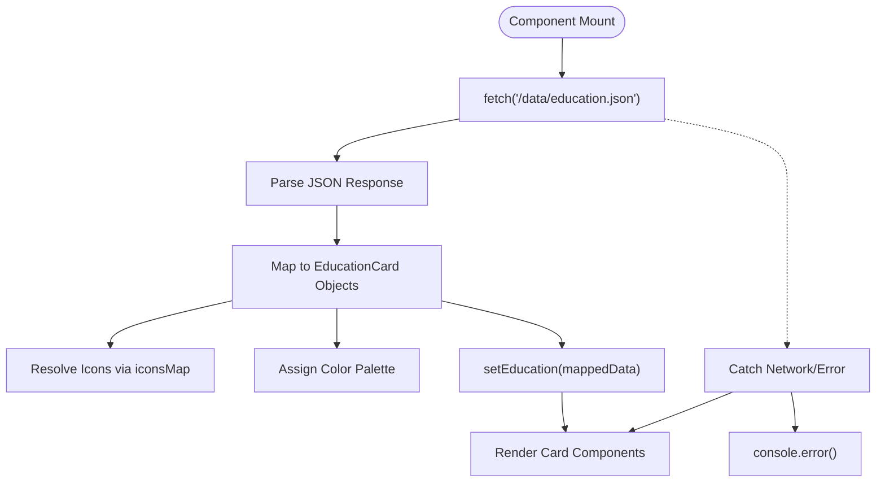
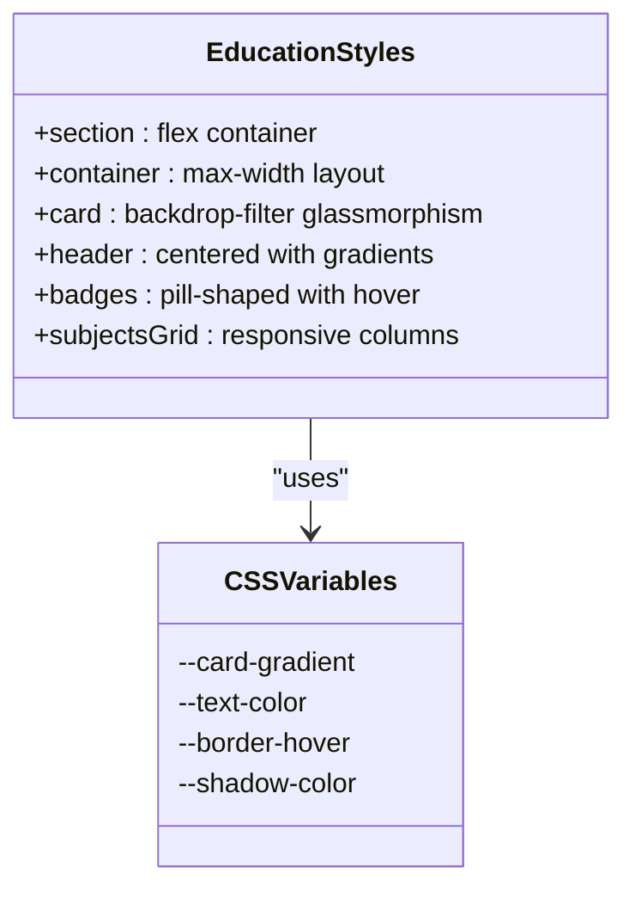

# Education Section

<cite>
**Referenced Files in This Document **   
- [Education.tsx](file://src/components/pages/Education.tsx)
- [education.json](file://public/data/education.json)
- [Education.module.css](file://src/components/pages/Education.module.css)
</cite>

## Table of Contents
1. [Introduction](#introduction)
2. [Data Model and JSON Structure](#data-model-and-json-structure)
3. [Component Implementation with React and TypeScript](#component-implementation-with-react-and-typescript)
4. [UI Layout and Design Patterns](#ui-layout-and-design-patterns)
5. [Styling Approach with CSS Modules and Design Tokens](#styling-approach-with-css-modules-and-design-tokens)
6. [Interactive Elements and Visual Feedback](#interactive-elements-and-visual-feedback)
7. [Accessibility Considerations](#accessibility-considerations)
8. [Content Management and Schema Extension](#content-management-and-schema-extension)
9. [Internationalization and Resume Standards Alignment](#internationalization-and-resume-standards-alignment)

## Introduction
The Education section component renders academic history using React and TypeScript, sourcing data from `education.json`. It displays educational credentials in a visually engaging card-based layout with dynamic color palettes, iconography, and interactive elements. The implementation emphasizes clean separation between data, logic, and presentation layers while maintaining accessibility and extensibility for future enhancements.

**Section sources**
- [Education.tsx](file://src/components/pages/Education.tsx#L0-L200)

## Data Model and JSON Structure
The education data model defines key academic attributes including institution, degree, dates, duration, description, and relevant coursework. The schema is implemented as a JSON array where each entry contains structured fields that map directly to UI components.

### Core Data Fields
- **icon**: String reference to Lucide icon component (e.g., "GraduationCap")
- **degree**: Full academic qualification name
- **university**: Institution name with optional country
- **universityIcon**: Optional secondary icon for university representation
- **years**: Chronological range of attendance (e.g., "2012 - 2017")
- **duration**: Time span in human-readable format (e.g., "5 Years")
- **description**: Narrative summary of academic experience
- **subjects**: Array of key courses, technologies, or areas of study

```json
[
  {
    "icon": "GraduationCap",
    "degree": "Bachelors, Information Technology (IT) Software Development",
    "university": "Belarusian National Technical University, Belarus",
    "universityIcon": "BookOpen",
    "years": "2012 - 2017",
    "duration": "5 Years",
    "description": "Gained a solid foundation in both theoretical and applied computer science...",
    "subjects": [
      "Python, C++, C#",
      "Relational Databases & SQL",
      "Cybersecurity & Encryption"
    ]
  }
]
```

The TypeScript interfaces `EducationJson` and `EducationCard` enforce type safety during data transformation, ensuring consistent property access throughout the component lifecycle.

**Section sources**
- [education.json](file://public/data/education.json#L0-L17)
- [Education.tsx](file://src/components/pages/Education.tsx#L45-L57)

## Component Implementation with React and TypeScript
The `Education` component uses React's functional component pattern with hooks to manage state and side effects. Data fetching occurs asynchronously via the Fetch API, retrieving education records from the public data directory.

### Key Implementation Features
- **useState Hook**: Manages the education state as an array of typed `EducationCard` objects
- **useEffect Hook**: Triggers data loading on component mount with error handling
- **TypeScript Interfaces**: Define strict contracts for JSON input and processed card data
- **Dynamic Icon Mapping**: Converts string identifiers to Lucide React components using `iconsMap`
- **Color Palette Cycling**: Assigns visual themes from predefined palettes using modulo indexing

The component transforms raw JSON data into enriched `EducationCard` objects by resolving icon components, applying color schemes, and preparing styled properties for CSS variable injection.



**Diagram sources **
- [Education.tsx](file://src/components/pages/Education.tsx#L61-L90)

**Section sources**
- [Education.tsx](file://src/components/pages/Education.tsx#L61-L90)

## UI Layout and Design Patterns
The UI employs a responsive card-based design similar to the Experience section, featuring horizontal layout on larger screens and vertical stacking on mobile devices.

### Layout Structure
- **Header Section**: Centered title with gradient text effect and decorative divider
- **Card Container**: Flexbox-based wrapper with maximum width constraint
- **Individual Cards**: Horizontal arrangement (desktop) / vertical stack (mobile)
- **Content Zones**: 
  - Icon container with colored background
  - Main content area with typographic hierarchy
  - Badges for temporal information
  - Descriptive paragraph box
  - Subjects grid with dot indicators

The design follows a timeline-like progression through multiple entries while maintaining visual consistency across different educational experiences.

**Section sources**
- [Education.tsx](file://src/components/pages/Education.tsx#L89-L198)
- [Education.module.css](file://src/components/pages/Education.module.css#L150-L180)

## Styling Approach with CSS Modules and Design Tokens
The component leverages CSS Modules for scoped styling combined with custom CSS variables for dynamic theming. This approach enables runtime style modifications based on data-driven properties.

### CSS Custom Properties
The component utilizes four dynamic CSS variables:
- `--card-gradient`: Background gradient for icon containers
- `--text-color`: Primary text and icon color
- `--border-hover`: Border color on hover states
- `--shadow-color`: Shadow tint for depth enhancement

These variables are computed in React and passed via inline styles, allowing seamless integration between JavaScript logic and CSS presentation.

### Global Design Token Integration
The styling aligns with project-wide design tokens through:
- Consistent color palette usage across components
- Shared spacing system (rem units)
- Typography scale matching other sections
- Motion durations and easing curves
- Z-index layering strategy

The dark-themed aesthetic with blue-indigo accent colors creates visual harmony with the overall portfolio design language.



**Diagram sources **
- [Education.module.css](file://src/components/pages/Education.module.css#L0-L76)
- [Education.tsx](file://src/components/pages/Education.tsx#L59-L60)

**Section sources**
- [Education.module.css](file://src/components/pages/Education.module.css#L0-L385)

## Interactive Elements and Visual Feedback
The component incorporates subtle animations and interactive states to enhance user engagement without distracting from content.

### Hover Interactions
- **Card Level**: Enhanced shadow depth on hover
- **Icon Container**: Slight scale transform (1.05x) with border color transition
- **Badges**: Border visibility increases on hover
- **Subject Items**: Subtle border and shadow elevation
- **Decorative Dots**: Opacity transitions on corner elements

### Animated Elements
- **Floating Dots**: Four animated particles with staggered delays and varying durations
- **Keyframe Animation**: Vertical floating motion using translateY()
- **Entrance Staggering**: Natural sequencing through animation delay increments

These micro-interactions create a sense of depth and responsiveness while maintaining professional presentation standards.

**Section sources**
- [Education.module.css](file://src/components/pages/Education.module.css#L367-L385)
- [Education.tsx](file://src/components/pages/Education.tsx#L190-L198)

## Accessibility Considerations
The implementation addresses accessibility requirements for chronological information and screen reader navigation through semantic HTML structure and ARIA best practices.

### Semantic Structure
- **Section Element**: Proper landmark with ID for page navigation
- **Heading Hierarchy**: Logical progression from h2 (section) to h3/h4 (content)
- **Time Representation**: Clear textual presentation of date ranges
- **List Alternatives**: Grid layout with proper tab order for subjects

### Screen Reader Optimization
- **Icon Decorativeness**: All icons marked as decorative with no alt text needed
- **Text Equivalents**: Comprehensive labels for all meaningful content
- **Focus Management**: Natural tab flow through interactive elements
- **Color Independence**: Information conveyed through position and text, not color alone

The design ensures that academic timelines remain understandable regardless of assistive technology usage.

**Section sources**
- [Education.tsx](file://src/components/pages/Education.tsx#L89-L198)

## Content Management and Schema Extension
Adding new educational entries or modifying existing ones follows a straightforward process enabled by the JSON-driven architecture.

### Adding New Entries
To add an educational record:
1. Open `education.json`
2. Append a new object to the array with required fields
3. Ensure icon names match available Lucide components
4. Verify date formatting consistency

### Modifying Date Formats
Date display can be standardized by:
- Updating the `years` field format across all entries
- Implementing date parsing utilities if needed
- Using consistent international formats (YYYY - YYYY)

### Schema Extension Opportunities
The data model can be extended to include additional academic details:

#### Potential Extensions
| Field | Type | Description |
|-------|------|-------------|
| gpa | string | Grade Point Average (e.g., "3.8/4.0") |
| thesis | string | Thesis title and abstract |
| honors | string[] | Academic awards or distinctions |
| courses | object[] | Detailed course list with grades |
| accreditation | string | International recognition status |

Extending the `EducationJson` and `EducationCard` interfaces would maintain type safety when adding these fields.

**Section sources**
- [education.json](file://public/data/education.json#L0-L17)
- [Education.tsx](file://src/components/pages/Education.tsx#L45-L57)

## Internationalization and Resume Standards Alignment
The component supports international credential systems through flexible data modeling and presentation options.

### International Credential Support
- **Multi-line Degree Names**: Accommodates longer academic titles common in European systems
- **Country-Specific Institutions**: University field includes country designation
- **Duration Clarity**: Explicit time spans help interpret non-standard academic calendars
- **Subject Terminology**: Course names preserve original technical vocabulary

### Resume Standard Compliance
The implementation aligns with professional resume conventions by:
- Presenting information in reverse chronological order
- Highlighting relevant technical subjects
- Including measurable outcomes in descriptions
- Maintaining concise yet informative content
- Using standard academic terminology

For enhanced internationalization, future improvements could include:
- Locale-aware date formatting
- Language-specific labels
- Region-specific credential explanations
- Export functionality for standard resume formats

**Section sources**
- [education.json](file://public/data/education.json#L0-L17)
- [Education.tsx](file://src/components/pages/Education.tsx#L0-L200)