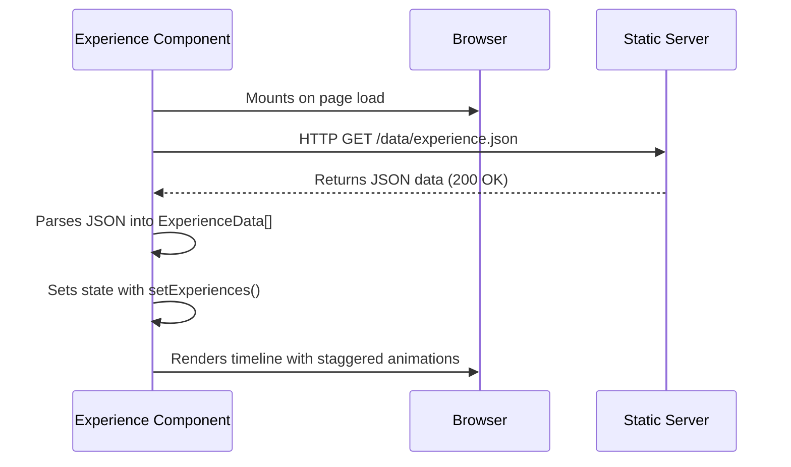
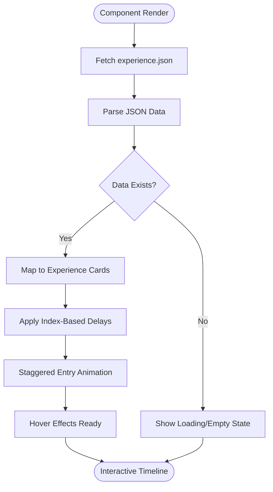
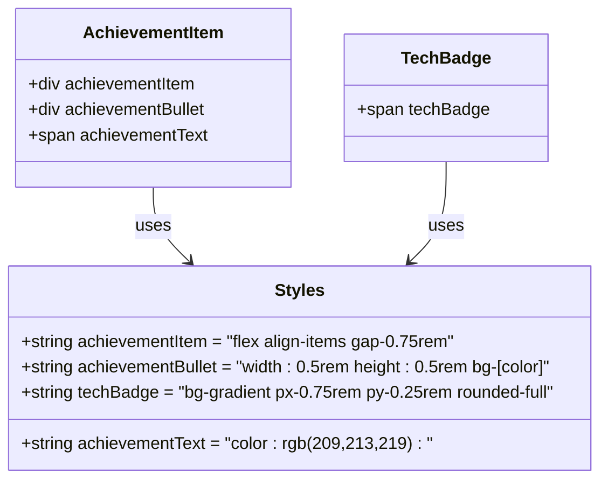

# Experience Section

<cite>
**Referenced Files in This Document **   
- [Experience.tsx](file://src/components/pages/Experience.tsx)
- [experience.json](file://public/data/experience.json)
- [Experience.module.css](file://src/components/pages/Experience.module.css)
</cite>

## Table of Contents
1. [Introduction](#introduction)
2. [Data Model Structure](#data-model-structure)
3. [Component Implementation](#component-implementation)
4. [Animated Timeline UI](#animated-timeline-ui)
5. [CSS Modules and Dynamic Styling](#css-modules-and-dynamic-styling)
6. [Achievement Lists and Technology Badges](#achievement-lists-and-technology-badges)
7. [Navigation Integration](#navigation-integration)
8. [Extending the Component](#extending-the-component)
9. [Accessibility and Responsiveness](#accessibility-and-responsiveness)

## Introduction
The Experience section component renders a professional timeline of job roles using React and TypeScript. It dynamically fetches data from experience.json, displays color-coded entries with animated effects, and integrates seamlessly into the portfolio website's navigation system. The implementation emphasizes visual consistency, performance, and maintainability through CSS Modules and dynamic class naming.

## Data Model Structure

The Experience section uses a structured data model defined in both JSON format and TypeScript interface to ensure type safety and consistent rendering:

**Experience Data Model**
| Field | Type | Description |
|-------|------|-------------|
| company | string | Name of the employer organization |
| title | string | Professional role or job title |
| dates | string | Employment period in "MMM YYYY - Present" format |
| duration | string | Duration summary (e.g., "2 years") |
| type | string | Employment type (typically "Full-time") |
| location | string | Geographic location with remote status |
| achievements | string[] | Array of key accomplishments in bullet points |
| technologies | string[] | Array of technical skills and tools used |
| color | string | Theme identifier for color-coding (blue, emerald, purple, rose, amber) |

This structure enables flexible representation of professional history while maintaining consistency across entries. The color field serves as a theme selector that coordinates styling across multiple visual elements within each experience card.

**Section sources**
- [Experience.tsx](file://src/components/pages/Experience.tsx#L5-L15)
- [experience.json](file://public/data/experience.json#L0-L86)

## Component Implementation

The Experience component is implemented as a React functional component using TypeScript for type safety. It follows a data-fetching pattern to load experience information from a JSON file during initialization.

Key implementation aspects:
- Uses `useState` to manage the experiences array state
- Implements `useEffect` for asynchronous data fetching on component mount
- Fetches data from `/data/experience.json` endpoint
- Handles loading states and error conditions gracefully
- Returns null when no experiences are available, allowing for clean conditional rendering

The component maps through the fetched experiences array to generate timeline entries, applying staggered animation delays based on index position to create a sequential reveal effect.



**Diagram sources **
- [Experience.tsx](file://src/components/pages/Experience.tsx#L17-L45)

**Section sources**
- [Experience.tsx](file://src/components/pages/Experience.tsx#L17-L45)

## Animated Timeline UI

The Experience section features an enhanced timeline interface with multiple visual effects that activate on hover and during entry:

**Timeline Elements:**
- Vertical gradient line with blur overlay visible on medium screens and up
- Color-coded circular dots positioned absolutely on the timeline
- Inner dot elements creating a concentric circle effect
- Staggered entry animations with 0.2-second delay increments
- Hover-triggered scale transformations on timeline dots

**Card Animation Features:**
- Background gradient overlays that fade in on hover
- Shimmer effects that sweep across cards during interaction
- Decorative dots that gradually appear with opacity transitions
- Smooth transform transitions for hover states
- Box shadows that intensify on hover for depth perception

The animation sequence creates a professional yet engaging presentation of career progression, with each role entering the view in chronological order.



**Diagram sources **
- [Experience.module.css](file://src/components/pages/Experience.module.css#L123-L155)
- [Experience.tsx](file://src/components/pages/Experience.tsx#L78-L85)

**Section sources**
- [Experience.module.css](file://src/components/pages/Experience.module.css#L123-L155)
- [Experience.tsx](file://src/components/pages/Experience.tsx#L78-L85)

## CSS Modules and Dynamic Styling

The component leverages CSS Modules for scoped styling and dynamic class naming to maintain theme consistency across job entries. This approach prevents style collisions and enables theme-based visual coordination.

**Theming System:**
- Each experience entry has a designated color property (blue, emerald, purple, rose, amber)
- CSS classes are dynamically composed using template literals: `${styles[`${exp.color}Dot`]}` 
- Color-specific variants exist for all visual elements: dots, overlays, icons, text, badges, bullets
- Hover states transition between color themes and neutral states

**Visual Element Mapping:**
| Element | Base Class | Color Variant Class | Purpose |
|--------|------------|---------------------|---------|
| Timeline Dot | timelineDot | [color]Dot | Outer circle with gradient |
| Dot Inner | timelineDotInner | [color]DotInner | Center highlight |
| Card Overlay | cardOverlay | [color]Overlay | Background gradient on hover |
| Icon Wrapper | iconWrapper | [color]Icon | Container background |
| Icon Color | icon | [color]IconColor | Lucide icon tint |
| Job Title | jobTitle | [color]Title | Text color transition |
| Company Name | companyName | [color]Company | Branding emphasis |
| Date Badge | dateBadge | [color]Badge | Period identification |
| Achievement Bullet | achievementBullet | [color]Bullet | List item marker |
| Technology Badge | techBadge | [color]Tech | Skill tag styling |
| Decorative Elements | decorativeDot1/2 | [color]Decor | Subtle accent points |

This systematic approach ensures visual harmony while allowing distinct identity for each role through its color theme.

**Section sources**
- [Experience.module.css](file://src/components/pages/Experience.module.css#L157-L680)
- [Experience.tsx](file://src/components/pages/Experience.tsx#L87-L165)

## Achievement Lists and Technology Badges

The component renders structured achievement lists and technology badges with category-specific styling that enhances readability and visual hierarchy.

**Achievement List Implementation:**
- Grid layout with consistent spacing
- Custom bullet points using colored circular divs
- Hover effects that scale bullets and brighten text
- Left-aligned layout with proper vertical rhythm
- Semantic HTML structure for accessibility

**Technology Badge System:**
- Flex-wrap container allowing responsive wrapping
- Pill-shaped badges with subtle gradients and borders
- Consistent padding and border-radius for uniform appearance
- Hover effects including border highlighting and shadow enhancement
- Color-coordinated styling matching the entry's theme

The achievement items use a two-part structure with decorative bullets separate from text content, enabling independent animation effects. Technology badges are rendered as inline-block elements that naturally wrap to new lines on smaller screens, maintaining readability across device sizes.



**Diagram sources **
- [Experience.module.css](file://src/components/pages/Experience.module.css#L482-L580)
- [Experience.tsx](file://src/components/pages/Experience.tsx#L120-L145)

**Section sources**
- [Experience.module.css](file://src/components/pages/Experience.module.css#L482-L580)
- [Experience.tsx](file://src/components/pages/Experience.tsx#L120-L145)

## Navigation Integration

The Experience section integrates with the global navigation system through anchor-based routing, enabling direct linking and smooth scrolling from the main navigation menu.

**Integration Details:**
- Section element uses `id="experience"` attribute for anchor targeting
- Navigation links point to `#experience` URL fragment
- Parent layout components handle smooth scrolling behavior
- Positioned within the document flow to maintain logical reading order
- Responsive design maintains visibility across screen sizes

Other components in the application, such as the Hero section, contain navigation functions that programmatically scroll to this section using `document.getElementById('experience')` and `window.scrollTo()` with smooth behavior.

**Section sources**
- [Experience.tsx](file://src/components/pages/Experience.tsx#L47)
- [Hero.tsx](file://src/components/pages/Hero.tsx#L78-L84)

## Extending the Component

The Experience section can be extended through both data updates and code modifications, following the established patterns for consistency.

**Adding New Experience Entries:**
1. Open `public/data/experience.json`
2. Add a new object to the array with required fields:
```json
{
  "company": "New Company",
  "title": "New Position",
  "dates": "Jan 2023 - Present",
  "duration": "1 year",
  "type": "Full-time",
  "location": "Location (Remote)",
  "achievements": [
    "First accomplishment",
    "Second accomplishment"
  ],
  "technologies": ["Technology1", "Technology2"],
  "color": "blue"
}
```

**Extending the TypeScript Interface:**
To add new metadata fields, modify the `ExperienceData` interface:
```typescript
interface ExperienceData {
  // existing fields...
  customField?: string;
  startDate: string;
  endDate: string | null;
  projectsCount: number;
}
```

When adding new color themes, corresponding CSS classes must be created in `Experience.module.css` following the naming convention `[color]Dot`, `[color]Overlay`, `[color]Icon`, etc., using appropriate gradient values and color codes.

**Section sources**
- [experience.json](file://public/data/experience.json#L0-L86)
- [Experience.tsx](file://src/components/pages/Experience.tsx#L5-L15)

## Accessibility and Responsiveness

The Experience section implements several features to ensure accessibility and responsiveness across devices.

**Accessibility Considerations:**
- Semantic HTML structure with proper heading hierarchy (h2 for section, h3 for job titles)
- ARIA roles implied through proper element usage
- Sufficient color contrast ratios for text and interactive elements
- Focus indicators maintained for keyboard navigation
- Meaningful link texts and interactive elements
- Screen reader-friendly content structure
- Programmatic focus management through navigation

**Responsive Design Features:**
- Mobile-first approach with progressive enhancement
- Timeline elements adapt to screen size:
  - Vertical line and dots hidden on small screens
  - Cards stack vertically with full width
  - Appropriate padding adjustments at different breakpoints
- Typography scales appropriately:
  - Font sizes adjust at 640px and 1024px breakpoints
  - Line heights optimized for readability
  - Spacing proportions maintained
- Layout reconfiguration:
  - Header items stack vertically on small screens
  - Information badges wrap appropriately
  - Technology tags wrap to multiple lines
- Touch targets sized for mobile interaction

The component uses CSS media queries at standard breakpoints (640px, 768px, 1024px) to adjust the layout, ensuring optimal viewing experience across device categories from mobile phones to large desktop displays.

**Section sources**
- [Experience.module.css](file://src/components/pages/Experience.module.css#L34-L37)
- [Experience.module.css](file://src/components/pages/Experience.module.css#L61-L64)
- [Experience.module.css](file://src/components/pages/Experience.module.css#L105-L108)
- [use-mobile.tsx](file://src/hooks/use-mobile.tsx#L3)