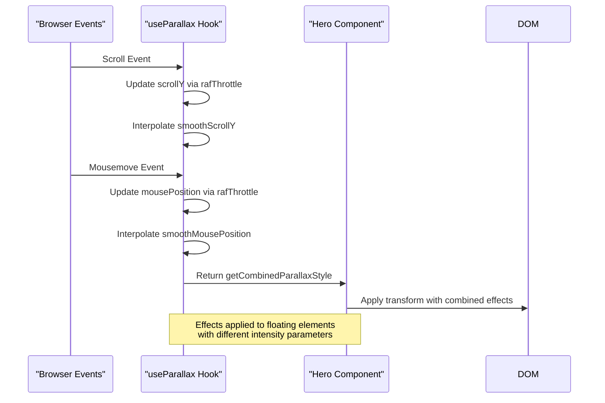

# Hero Section

<cite>
**Referenced Files in This Document**
- [Hero.tsx](file://src/components/pages/Hero.tsx)
- [hero.json](file://public/data/hero.json)
- [useParallax.ts](file://src/hooks/useParallax.ts)
- [Hero.module.css](file://src/components/pages/Hero.module.css)
</cite>

## Table of Contents
1. [Introduction](#introduction)
2. [Core Implementation](#core-implementation)
3. [Data Fetching and JSON Schema](#data-fetching-and-json-schema)
4. [Visual Effects with useParallax Hook](#visual-effects-with-useparallax-hook)
5. [Dynamic Styling and Color System](#dynamic-styling-and-color-system)
6. [Navigation and Smooth Scrolling](#navigation-and-smooth-scrolling)
7. [Customization and Extensibility](#customization-and-extensibility)
8. [Error Handling and Responsive Behavior](#error-handling-and-responsive-behavior)

## Introduction
The Hero section is the primary entry point of the portfolio application, designed to make a strong first impression with dynamic content, subtle visual effects, and intuitive navigation. Built using React and TypeScript, this component leverages modern web APIs and design patterns to deliver an engaging user experience. It dynamically loads personalized data from a JSON file, applies parallax effects based on mouse and scroll interactions, and provides smooth navigation between key sections of the site.

## Core Implementation
The Hero component is implemented as a functional React component using TypeScript for type safety. It follows a modular architecture that separates concerns between data fetching, state management, visual rendering, and user interaction handling. The component uses CSS Modules for scoped styling, ensuring style encapsulation and preventing naming conflicts. Key implementation features include asynchronous data loading, responsive layout design, and integration with custom hooks for enhanced interactivity.

**Section sources**
- [Hero.tsx](file://src/components/pages/Hero.tsx#L0-L186)

## Data Fetching and JSON Schema
The Hero component fetches its content from `hero.json` located in the public data directory using the browser's Fetch API. This decoupling of content from code allows for easy updates without requiring recompilation. The component defines strict TypeScript interfaces to ensure type safety when working with the JSON data.

### JSON Schema Structure
The hero.json file contains the following fields:
- **badge**: Professional title or designation displayed prominently
- **name**: Full name of the individual
- **subtitle**: Secondary professional description
- **description**: Detailed personal/professional summary
- **primaryButtonText**: Label for the primary action button
- **primaryButtonLink**: URL destination for the primary button
- **secondaryButtonText**: Label for the secondary action button
- **stats**: Array of statistical achievements with number and label pairs

```json
{
  "badge": "AI/ML Software Engineer",
  "name": "Farruh Sheripov",
  "subtitle": "AI/ML Engineer & Backend Architect",
  "description": "Results-driven AI/ML Engineer with a strong backend foundation...",
  "primaryButtonText": "Download Resume",
  "primaryButtonLink": "/media/farruh-sheripov-cv.pdf",
  "secondaryButtonText": "Get In Touch",
  "stats": [
    { "number": "7+", "label": "Years in AI/Backend" },
    { "number": "10+", "label": "AI/ML Projects" },
    { "number": "3", "label": "Languages" }
  ]
}
```

The component uses TypeScript interfaces to define the expected structure:
```typescript
interface StatJson {
  number: string;
  label: string;
}

interface HeroJson {
  badge: string;
  name: string;
  subtitle: string;
  description: string;
  primaryButtonText: string;
  primaryButtonLink: string;
  secondaryButtonText: string;
  stats: StatJson[];
}
```

**Section sources**
- [Hero.tsx](file://src/components/pages/Hero.tsx#L45-L84)
- [hero.json](file://public/data/hero.json#L0-L13)

## Visual Effects with useParallax Hook
The Hero section implements subtle visual effects through the `useParallax` custom hook, which creates dynamic movement based on both scroll position and mouse interactions. This enhances user engagement by making the interface feel more alive and responsive.

### Hook Implementation Details
The `useParallax` hook uses several advanced techniques:
- **requestAnimationFrame throttling** to optimize performance
- **Linear interpolation (lerp)** for smooth transitions
- **Separate tracking** of raw and smoothed values for different effect intensities
- **Passive event listeners** for improved scroll performance

The hook exposes three main functions:
- `getParallaxStyle`: Applies vertical movement based on scroll position
- `getMouseParallaxStyle`: Applies movement based on mouse position
- `getCombinedParallaxStyle`: Combines both scroll and mouse effects

In the Hero component, `getCombinedParallaxStyle` is used to create floating elements that respond to both scroll and mouse movements:



**Diagram sources**
- [useParallax.ts](file://src/hooks/useParallax.ts#L0-L109)
- [Hero.tsx](file://src/components/pages/Hero.tsx#L0-L186)

**Section sources**
- [useParallax.ts](file://src/hooks/useParallax.ts#L0-L109)
- [Hero.tsx](file://src/components/pages/Hero.tsx#L0-L186)

## Dynamic Styling and Color System
The Hero component implements a sophisticated color system that dynamically assigns colors to statistical elements while maintaining visual harmony.

### Color Palette Management
The component defines a set of predefined color palettes that are cyclically applied to stat items:

```typescript
const colorPalettes = [
  { primary: '#60a5fa', text: '#60a5fa' }, // blue
  { primary: '#34d399', text: '#34d399' }, // emerald
  { primary: '#c084fc', text: '#c084fc' }, // purple
  { primary: '#f59e0b', text: '#f59e0b' }, // amber
];
```

When data is loaded, the component maps each stat to a color palette using modulo arithmetic to cycle through available colors:

```typescript
const mappedStats: StatItem[] = data.stats.map((s, idx) => ({
  ...s,
  colorPalette: colorPalettes[idx % colorPalettes.length],
}));
```

### CSS Custom Properties Integration
The component uses CSS custom properties (variables) to pass color information from JavaScript to CSS:

```typescript
interface CustomCSSProperties extends CSSProperties {
  '--text-color'?: string;
}
```

This approach enables dynamic theming while leveraging CSS for rendering performance. The stats render with inline styles that set the `--text-color` variable, which is then used in the CSS Module:

```css
.statNumber {
  font-size: 2.25rem;
  font-weight: 700;
  margin-bottom: 0.5rem;
  color: var(--text-color);
}
```

```mermaid
flowchart TD
A[Load hero.json] --> B[Map stats to color palettes]
B --> C[Create StatItem objects with colorPalette]
C --> D[Render stat elements]
D --> E[Apply inline style with --text-color]
E --> F[CSS uses var(--text-color) for display]
F --> G[Dynamic colored statistics rendered]
style A fill:#f9f,stroke:#333
style B fill:#bbf,stroke:#333
style C fill:#bbf,stroke:#333
style D fill:#fbf,stroke:#333
style E fill:#fbf,stroke:#333
style F fill:#dfd,stroke:#333
style G fill:#dfd,stroke:#333
```

**Diagram sources**
- [Hero.tsx](file://src/components/pages/Hero.tsx#L0-L186)
- [Hero.module.css](file://src/components/pages/Hero.module.css#L0-L394)

**Section sources**
- [Hero.tsx](file://src/components/pages/Hero.tsx#L0-L186)
- [Hero.module.css](file://src/components/pages/Hero.module.css#L0-L394)

## Navigation and Smooth Scrolling
The Hero component includes built-in navigation functionality that enables smooth scrolling between different sections of the portfolio.

### Scroll Target Functions
The component implements two primary navigation functions:
- `scrollToContact`: Scrolls to the contact section
- `scrollToAbout`: Scrolls to the about section

These functions use the `window.scrollTo` method with smooth behavior:

```typescript
const scrollToContact = () => {
  const element = document.getElementById('contact');
  if (element) {
    const elementTop = element.getBoundingClientRect().top + window.pageYOffset;
    const maxScroll = document.body.scrollHeight - window.innerHeight;
    const target = Math.min(elementTop - 80, maxScroll);
    window.scrollTo({
      top: target,
      behavior: 'smooth'
    });
  }
};
```

### Safety Measures
The implementation includes several safety measures:
- Checks for element existence before attempting to scroll
- Calculates absolute position using `getBoundingClientRect()`
- Accounts for navigation bar height (80px offset)
- Prevents scrolling beyond the maximum scrollable height
- Uses `Math.min()` to ensure the target is within bounds

The smooth scrolling is triggered by buttons in the UI, providing users with intuitive navigation controls while maintaining a polished user experience.

**Section sources**
- [Hero.tsx](file://src/components/pages/Hero.tsx#L72-L86)
- [Hero.tsx](file://src/components/pages/Hero.tsx#L147-L175)

## Customization and Extensibility
The Hero component is designed to be easily customizable while maintaining type safety through TypeScript.

### JSON Data Modification
Users can customize the component by modifying the `hero.json` file. All text content, button labels, and statistical data can be updated without touching the codebase. This separation of content and presentation follows best practices for maintainability.

### TypeScript Interface Extension
For more advanced customization, developers can extend the existing TypeScript interfaces:

```typescript
// Example: Adding social media links
interface ExtendedHeroJson extends HeroJson {
  socialLinks: {
    platform: string;
    url: string;
    icon: string;
  }[];
}
```

When extending interfaces, developers should:
- Maintain backward compatibility
- Provide default values for new optional fields
- Update the data fetching logic to handle potential missing data
- Ensure the UI gracefully handles extended data structures

The component's modular design makes it straightforward to add new features while preserving the existing functionality and visual consistency.

**Section sources**
- [Hero.tsx](file://src/components/pages/Hero.tsx#L0-L186)
- [hero.json](file://public/data/hero.json#L0-L13)

## Error Handling and Responsive Behavior
The Hero component includes robust error handling and responsive design considerations to ensure reliability across different devices and network conditions.

### Error Handling Strategy
The data fetching implementation includes comprehensive error handling:

```typescript
useEffect(() => {
  const fetchHero = async () => {
    try {
      const res = await fetch('/data/hero.json');
      if (!res.ok) throw new Error(`Failed to fetch hero.json: ${res.status}`);
      const data: HeroJson = await res.json();
      // ... processing
      setHeroData(data);
    } catch (e) {
      console.error('Error loading hero.json', e);
    }
  };
  fetchHero();
}, []);
```

Key aspects of the error handling:
- Validates HTTP response status
- Catches network and parsing errors
- Logs errors to console for debugging
- Fails gracefully by not rendering until data is available (`if (!heroData) return null`)

### Responsive Design Features
The component adapts to different screen sizes through CSS media queries:

- **Mobile-first approach**: Base styles optimized for smaller screens
- **Typography scaling**: Font sizes increase on larger screens
- **Layout adjustments**: Button container and stats grid adapt to screen width
- **Touch-friendly targets**: Adequate sizing for mobile interaction

The CSS Module includes breakpoints at standard widths:
- Base styles for mobile devices
- Adjustments at 640px (small tablets)
- Enhancements at 768px (tablets and small desktops)
- Further refinements at 1024px (desktop)

This responsive approach ensures the Hero section looks and functions well across the full spectrum of devices, from smartphones to large desktop monitors.

**Section sources**
- [Hero.tsx](file://src/components/pages/Hero.tsx#L45-L84)
- [Hero.module.css](file://src/components/pages/Hero.module.css#L0-L394)