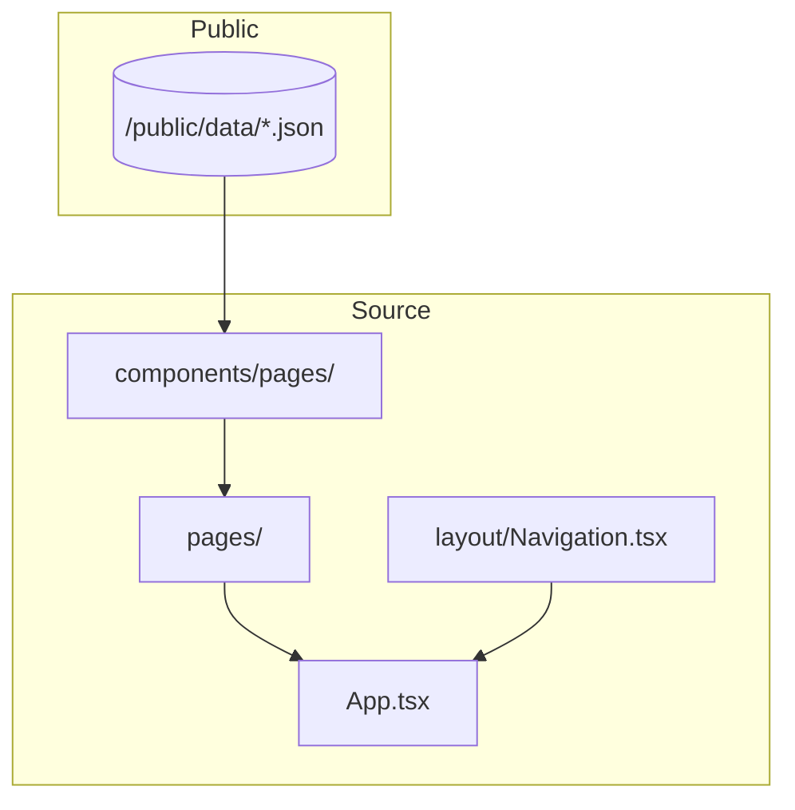
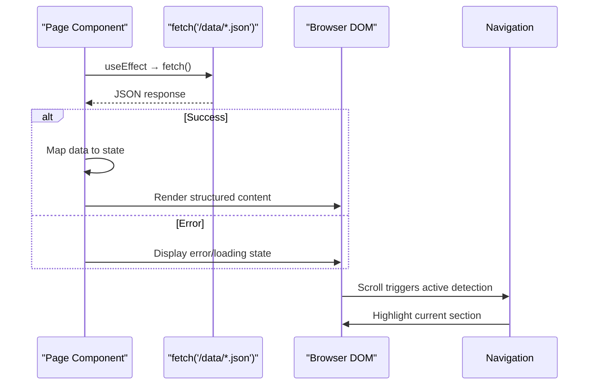
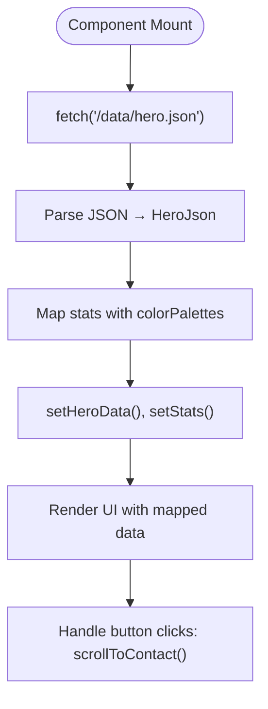
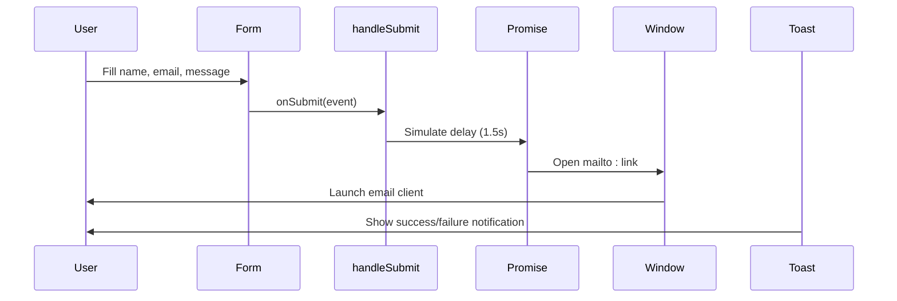

# Page Section Components

<cite>
**Referenced Files in This Document**   
- [Hero.tsx](file://src/components/pages/Hero.tsx)
- [About.tsx](file://src/components/pages/About.tsx)
- [Experience.tsx](file://src/components/pages/Experience.tsx)
- [Projects.tsx](file://src/components/pages/Projects.tsx)
- [Skills.tsx](file://src/components/pages/Skills.tsx)
- [Strengths.tsx](file://src/components/pages/Strengths.tsx)
- [Education.tsx](file://src/components/pages/Education.tsx)
- [Contact.tsx](file://src/components/pages/Contact.tsx)
- [hero.json](file://public/data/hero.json)
- [about.json](file://public/data/about.json)
- [experience.json](file://public/data/experience.json)
- [projects.json](file://public/data/projects.json)
- [skills.json](file://public/data/skills.json)
- [strengths.json](file://public/data/strengths.json)
- [education.json](file://public/data/education.json)
- [contact.json](file://public/data/contact.json)
- [Navigation.tsx](file://src/components/layout/Navigation.tsx)
- [App.tsx](file://src/App.tsx)
</cite>

## Table of Contents
1. [Introduction](#introduction)
2. [Project Structure](#project-structure)
3. [Core Components](#core-components)
4. [Architecture Overview](#architecture-overview)
5. [Detailed Component Analysis](#detailed-component-analysis)
6. [Dependency Analysis](#dependency-analysis)
7. [Performance Considerations](#performance-considerations)
8. [Troubleshooting Guide](#troubleshooting-guide)
9. [Conclusion](#conclusion)

## Introduction
This document provides comprehensive documentation for the page-level components of a portfolio application. Each component represents a distinct section—Hero, About, Experience, Projects, Skills, Strengths, Education, and Contact—and follows a consistent architectural pattern centered around JSON data loading, structured rendering, and responsive design. The system leverages modern React practices with TypeScript, CSS Modules, and direct `fetch` calls to load content from static JSON files located in `/public/data`. All components integrate seamlessly with global navigation and scroll-spy tracking, ensuring cohesive user experience across sections.

## Project Structure
The project is organized into modular directories that separate concerns between components, pages, hooks, and utilities. Page-level components reside under `src/components/pages`, each corresponding to a section of the portfolio. Data sources are stored as JSON files in `public/data`, enabling easy content updates without code changes. Styling uses CSS Modules (e.g., `*.module.css`) to ensure scoped styles and prevent conflicts. The overall structure supports scalability and maintainability through clear separation of UI logic, state management, and presentation.



**Diagram sources**
- [Hero.tsx](file://src/components/pages/Hero.tsx)
- [About.tsx](file://src/components/pages/About.tsx)
- [Contact.tsx](file://src/components/pages/Contact.tsx)
- [public/data](file://public/data)

**Section sources**
- [Hero.tsx](file://src/components/pages/Hero.tsx)
- [About.tsx](file://src/components/pages/About.tsx)
- [Contact.tsx](file://src/components/pages/Contact.tsx)
- [public/data](file://public/data)

## Core Components
Each page-level component follows a uniform pattern: fetching JSON data via `fetch`, mapping it to typed interfaces, managing loading/error states, and rendering structured content using consistent styling principles. Components are function-based with `useState` and `useEffect` for lifecycle control. They use dynamic color palettes and CSS variables for visual consistency while maintaining individual identity through unique layout patterns.

**Section sources**
- [Hero.tsx](file://src/components/pages/Hero.tsx#L1-L186)
- [About.tsx](file://src/components/pages/About.tsx#L1-L363)
- [Projects.tsx](file://src/components/pages/Projects.tsx#L1-L231)

## Architecture Overview
The architecture centers on decoupling content from presentation by sourcing all textual and structural data from external JSON files. This enables non-developers to update content independently. Components fetch their respective JSON file from `/public/data` using relative paths (e.g., `/data/about.json`). Upon mount, they initiate an asynchronous fetch within `useEffect`, handle errors gracefully, and render either a loading state, error message, or final content based on internal state (`isLoading`, `error`, etc.).

Integration with global navigation is achieved through shared `id` attributes (e.g., `id="about"`) that align with navigation links. Scroll-spy functionality in `Navigation.tsx` dynamically highlights active sections as users scroll, enhancing usability.



**Diagram sources**
- [Hero.tsx](file://src/components/pages/Hero.tsx#L45-L84)
- [About.tsx](file://src/components/pages/About.tsx#L147-L188)
- [Navigation.tsx](file://src/components/layout/Navigation.tsx#L100-L130)

## Detailed Component Analysis

### Hero Section
The `Hero` component serves as the landing view, displaying a badge, name, subtitle, description, call-to-action buttons, and key stats. It loads data from `hero.json` and maps statistics with dynamic color palettes applied via inline CSS variables. Unique behaviors include smooth scrolling to the "About" section and handling external link navigation for resume download.

#### Data Flow and Rendering Logic


**Diagram sources**
- [Hero.tsx](file://src/components/pages/Hero.tsx#L45-L84)
- [hero.json](file://public/data/hero.json)

**Section sources**
- [Hero.tsx](file://src/components/pages/Hero.tsx#L1-L186)

### About Section
The `About` component presents personal information, interests, bio, achievements, and quick stats. It parses rich text markup like `[[text|color]]` to apply colored highlights dynamically. Data comes from `about.json`, which includes arrays for `personalInfo`, `interests`, and `bio`. Icons are resolved at runtime using a map from string names to Lucide icons.

#### Rich Text Parsing Mechanism
```mermaid
flowchart LR
Input["Bio paragraph with [[highlighted|color]] syntax"] --> Regex{Match \[\[.*\|.*\]\]}
Regex --> |Yes| Extract["Extract text & color"]
Extract --> ApplyClass["Apply CSS class via styles.highlightColor"]
ApplyClass --> Output["Render span with highlight"]
Regex --> |No| PlainText["Render plain text"]
```

**Diagram sources**
- [About.tsx](file://src/components/pages/About.tsx#L118-L145)
- [about.json](file://public/data/about.json)

**Section sources**
- [About.tsx](file://src/components/pages/About.tsx#L1-L363)

### Projects Section
The `Projects` component renders a grid of featured projects loaded from `projects.json`. Each project card uses the `TiltCard` component for interactive 3D effects. Dynamic styling applies gradient backgrounds using CSS variables tied to predefined color palettes. A filtering mechanism could be extended here but is currently not implemented.

#### Card Styling with CSS Variables
```mermaid
classDiagram
class ProjectCard {
+string title
+string description
+string[] technologies
+string category
+string impact
+string role
+string challenges
+string[] highlights
+string? github
+string? demo
+colorPalette : {primary, secondary, text}
}
class CustomCSSProperties {
+string '--card-gradient'
+string '--text-color'
+string '--border-hover'
+string '--shadow-color'
}
ProjectCard --> CustomCSSProperties : "uses for style"
ProjectCard --> TiltCard : "renders inside"
```

**Diagram sources**
- [Projects.tsx](file://src/components/pages/Projects.tsx#L39-L70)
- [Project.module.css](file://src/components/pages/Project.module.css)

**Section sources**
- [Projects.tsx](file://src/components/pages/Projects.tsx#L1-L231)

### Contact Section
The `Contact` component displays contact methods (email, phone, location) and optionally renders a form for direct messaging. It loads configuration from `contact.json`, including whether to show the form. Form submission opens the default email client via `mailto:` link with pre-filled subject and body. Loading state and toast notifications enhance UX during interaction.

#### Form Submission Workflow


**Diagram sources**
- [Contact.tsx](file://src/components/pages/Contact.tsx#L60-L95)
- [contact.json](file://public/data/contact.json)

**Section sources**
- [Contact.tsx](file://src/components/pages/Contact.tsx#L1-L282)

## Dependency Analysis
All page components depend only on core React, TypeScript types, Lucide icons, and CSS Modules. There are no circular dependencies. External integrations include:
- `lucide-react` for scalable SVG icons
- `@tanstack/react-query` indirectly via `App.tsx`, though not directly used in components
- Global navigation via shared IDs and scroll handlers

```mermaid
erDiagram
HERO_JSON {
string badge
string name
string subtitle
string description
string primaryButtonText
string primaryButtonLink
string secondaryButtonText
array stats
}
ABOUT_JSON {
array personalInfo
array interests
array stats
array bio
array achievements
}
PROJECTS_JSON {
array title
array description
array technologies
array category
array impact
array role
array challenges
array highlights
string? github
string? demo
}
CONTACT_JSON {
array contactMethods
boolean showContactForm
}
HERO_JSON ||--o{ Hero : "used by"
ABOUT_JSON ||--o{ About : "used by"
PROJECTS_JSON ||--o{ Projects : "used by"
CONTACT_JSON ||--o{ Contact : "used by"
```

**Diagram sources**
- [go.mod](file://package.json#L1-L10)
- [App.tsx](file://src/App.tsx#L1-L27)

**Section sources**
- [App.tsx](file://src/App.tsx#L1-L27)
- [package.json](file://package.json#L1-L10)

## Performance Considerations
Components use lightweight `fetch` instead of heavier libraries like Axios, minimizing bundle size. Data is fetched once on mount and cached in component state. No unnecessary re-renders occur due to stable dependencies in `useEffect`. Lazy loading isn't required since all sections are visible on a single-page app. Future optimizations could include suspense boundaries or React Query for caching and background refetching.

## Troubleshooting Guide
Common issues and solutions when extending or modifying components:

| Issue | Cause | Solution |
|------|-------|----------|
| Component fails to load data | Incorrect JSON path | Ensure file exists in `/public/data` and path is `/data/filename.json` |
| Icons not rendering | Invalid icon name in JSON | Verify icon name matches key in `iconsMap` object |
| Styles not applying | Missing CSS Module import | Confirm `styles` is imported from correct `*.module.css` file |
| Scroll-spy not working | Missing or duplicate `id` attribute | Ensure each section has unique `id` matching navigation target |
| Form submit fails silently | Browser blocks `mailto:` popup | Inform user to allow popups or provide fallback email address |

**Section sources**
- [Navigation.tsx](file://src/components/layout/Navigation.tsx#L100-L130)
- [Contact.tsx](file://src/components/pages/Contact.tsx#L200-L250)

## Conclusion
The portfolio's page-level components follow a clean, maintainable architecture centered on JSON-driven content, consistent styling via CSS Modules, and robust error handling. Each component operates independently yet integrates seamlessly with global navigation and scroll behavior. The use of TypeScript ensures type safety, while dynamic theming and rich text parsing add visual depth. Extending these components requires only updating JSON files or adding fields with corresponding interface updates, making the system highly adaptable for future enhancements.