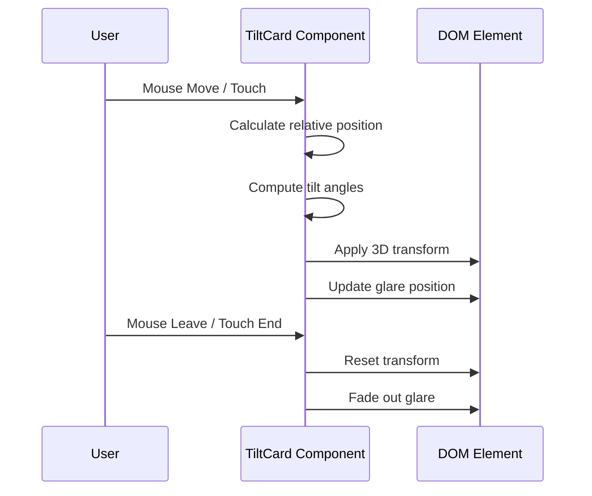

# Projects Section

<cite>
**Referenced Files in This Document**   
- [Projects.tsx](file://src/components/pages/Projects.tsx)
- [projects.json](file://public/data/projects.json)
- [TiltCard.tsx](file://src/components/shared/TiltCard.tsx)
- [Project.module.css](file://src/components/pages/Project.module.css)
</cite>

## Table of Contents
1. [Introduction](#introduction)
2. [Component Composition and Architecture](#component-composition-and-architecture)
3. [Data Schema and Structure](#data-schema-and-structure)
4. [Dynamic Color Assignment and Styling](#dynamic-color-assignment-and-styling)
5. [TiltCard Integration and Interactive Effects](#tiltcard-integration-and-interactive-effects)
6. [Conditional Rendering Logic](#conditional-rendering-logic)
7. [Responsive Grid Layout and Section Organization](#responsive-grid-layout-and-section-organization)
8. [Extensibility and Customization](#extensibility-and-customization)
9. [Performance and Accessibility Considerations](#performance-and-accessibility-considerations)

## Introduction
The Projects section is a core component of the portfolio website, designed to showcase featured projects with an engaging, interactive interface. Built using React and TypeScript, it dynamically renders project cards from a JSON data source, applying visual enhancements through the TiltCard wrapper for 3D tilt effects. The component emphasizes user experience with responsive design, dynamic color themes, and structured presentation of project details including impact, challenges, technologies, and key features.

## Component Composition and Architecture

The Projects component is implemented as a functional React component using TypeScript, following modern compositional patterns. It leverages React's `useState` and `useEffect` hooks to manage state and side effects, specifically fetching project data asynchronously from `/data/projects.json`. The component structure follows a modular approach by integrating reusable UI elements such as icons from Lucide React and the shared `TiltCard` component for enhanced interactivity.

Each project card is rendered within a responsive grid layout, ensuring optimal display across device sizes. The architecture separates concerns effectively: data handling occurs at the container level, while presentation logic is encapsulated within styled components and CSS modules. This separation enables maintainability and scalability when adding new projects or modifying existing ones.

**Section sources**
- [Projects.tsx](file://src/components/pages/Projects.tsx#L0-L231)

## Data Schema and Structure

The Projects component consumes data from `projects.json`, which defines a consistent schema for each project entry. The schema includes the following required fields:

- **title**: Name of the project
- **description**: Brief overview of the project scope and purpose
- **technologies**: Array of strings listing key technologies used
- **category**: Project classification (e.g., AI/ML & NLP, Cloud & Data Engineering)
- **impact**: Description of business or technical outcomes achieved
- **role**: User’s role in the project
- **challenges**: Key obstacles encountered during development
- **highlights**: Array of notable achievements or features

Optional fields include:
- **github**: URL to the GitHub repository
- **demo**: URL to a live demo
- **hideCode**: Boolean flag to conditionally hide the code link
- **hideDemo**: Boolean flag to conditionally hide the demo link
- **colorPalette**: Optional override for custom color assignment

This schema ensures consistency in presentation while allowing flexibility for diverse project types.

```mermaid
erDiagram
PROJECT {
string title PK
string description
array technologies
string category
string impact
string role
string challenges
array highlights
string github?
string demo?
boolean hideCode?
boolean hideDemo?
object colorPalette?
}
```

**Diagram sources**
- [projects.json](file://public/data/projects.json#L0-L87)
- [Projects.tsx](file://src/components/pages/Projects.tsx#L25-L70)

## Dynamic Color Assignment and Styling

The component implements dynamic color theming using a predefined palette of ten distinct color schemes. Each scheme includes primary, secondary, and text color values that are programmatically assigned based on the project's index modulo the palette length. This ensures visual variety without repetition in typical viewports.

CSS variables are utilized to control styling dynamically:
- `--card-gradient`: Background gradient using primary and secondary colors
- `--text-color`: Accent color for badges and icons
- `--border-hover`: Border color on hover states
- `--shadow-color`: Shadow tint derived from primary color

These variables are passed via inline styles to each `TiltCard`, enabling real-time theme adaptation without requiring additional CSS rules. The use of CSS custom properties allows seamless integration with the component’s hover and animation effects defined in `Project.module.css`.

**Section sources**
- [Projects.tsx](file://src/components/pages/Projects.tsx#L6-L37)
- [Project.module.css](file://src/components/pages/Project.module.css#L0-L438)

## TiltCard Integration and Interactive Effects

The `TiltCard` component serves as a wrapper for all project cards, providing interactive 3D tilt effects based on mouse or touch movement. Implemented with performance optimization in mind, it uses `requestAnimationFrame` to throttle updates and prevent jank during motion tracking.

Key features of `TiltCard` include:
- **Perspective transformation**: Applies 3D transforms using rotateX, rotateY, translate, and scale
- **Glare effect**: Displays a subtle radial gradient that follows cursor position
- **Mobile support**: Touch event handling with inertia damping
- **Reset behavior**: Smooth return to neutral state on mouse leave or touch end

The component also supports configurable props such as `intensity`, `maxTilt`, `scale`, and `perspective`, allowing fine-tuning of the interaction feel. These settings ensure responsiveness across devices while maintaining accessibility for users who may prefer reduced motion.



**Diagram sources**
- [TiltCard.tsx](file://src/components/shared/TiltCard.tsx#L0-L293)
- [Projects.tsx](file://src/components/pages/Projects.tsx#L100-L120)

## Conditional Rendering Logic

The component employs conditional rendering to handle optional links gracefully. When either `github` or `demo` URLs are missing, placeholder spans with disabled styling are rendered instead of anchor tags. Additionally, the `hideCode` and `hideDemo` boolean flags allow explicit suppression of respective links regardless of URL presence.

The logic ensures that the links container only appears if at least one link type should be visible:
```tsx
{(!project.hideCode || !project.hideDemo) && (
  <div className={styles.links}>...</div>
)}
```
Within this block, each link is conditionally rendered based on both visibility flag and URL availability. Disabled links receive the `linkDisabled` class, applying opacity reduction and grayscale filters to indicate non-interactivity.

This approach maintains layout consistency while preventing broken or misleading navigation options.

**Section sources**
- [Projects.tsx](file://src/components/pages/Projects.tsx#L189-L230)

## Responsive Grid Layout and Section Organization

The Projects section uses CSS Grid for layout management, adapting column count based on viewport width:
- Single column on mobile (<768px)
- Two columns on tablet and desktop (≥768px)

Each project card is organized into logical sections:
1. **Header**: Contains title and category badge
2. **Role Info**: Displays user’s role with icon
3. **Description**: Summarizes project scope
4. **Impact & Challenges**: Highlights outcomes and difficulties
5. **Key Features**: Lists accomplishments in a two-column grid
6. **Technologies**: Tags showing stack components
7. **Links**: Code and demo access points

Icons from Lucide React (`Users`, `Zap`, `Calendar`, `Code`) provide visual cues for each section. Decorative animated elements appear on hover to enhance engagement without distracting from content.

**Section sources**
- [Project.module.css](file://src/components/pages/Project.module.css#L0-L438)
- [Projects.tsx](file://src/components/pages/Projects.tsx#L110-L188)

## Extensibility and Customization

Adding new projects requires updating `projects.json` with a properly structured object matching the expected schema. The system automatically assigns colors and renders the card without additional code changes.

To customize categories, developers can modify the `category` field values in JSON entries; these are displayed as colored badges using dynamic gradients. For advanced theming, individual projects can override the default palette by specifying a `colorPalette` object.

Highlight rendering logic can be adjusted by modifying the `.highlightsGrid` and `.highlightItem` styles in `Project.module.css`. Developers may change grid behavior, dot styling, or add animations to emphasize feature items.

For global style changes, the color palette array in `Projects.tsx` can be edited or extended to influence all cards' appearance.

**Section sources**
- [projects.json](file://public/data/projects.json#L0-L87)
- [Projects.tsx](file://src/components/pages/Projects.tsx#L6-L37)
- [Project.module.css](file://src/components/pages/Project.module.css#L0-L438)

## Performance and Accessibility Considerations

To maintain performance with multiple animated cards:
- Transform operations are hardware-accelerated using `preserve-3d` and `backface-visibility`
- Event listeners are throttled via `requestAnimationFrame`
- DOM rect calculations are cached per card
- Will-change hints optimize rendering pipeline awareness

Accessibility best practices include:
- Semantic HTML structure with proper heading hierarchy
- Focus visibility on interactive elements
- ARIA attributes where applicable
- Reduced motion detection respected in animations
- Keyboard navigable links with proper focus indicators

The implementation avoids excessive re-renders through efficient state management and leverages CSS transitions over JavaScript-driven animations where possible. Glare effects and shimmers are optimized for paint efficiency using layered compositing.

**Section sources**
- [TiltCard.tsx](file://src/components/shared/TiltCard.tsx#L0-L293)
- [Project.module.css](file://src/components/pages/Project.module.css#L0-L438)