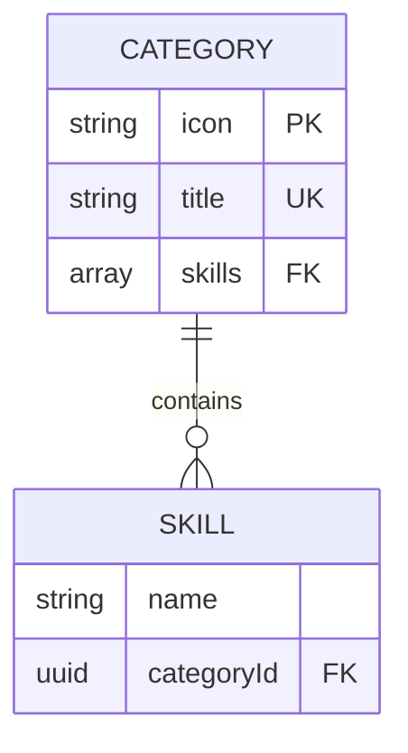
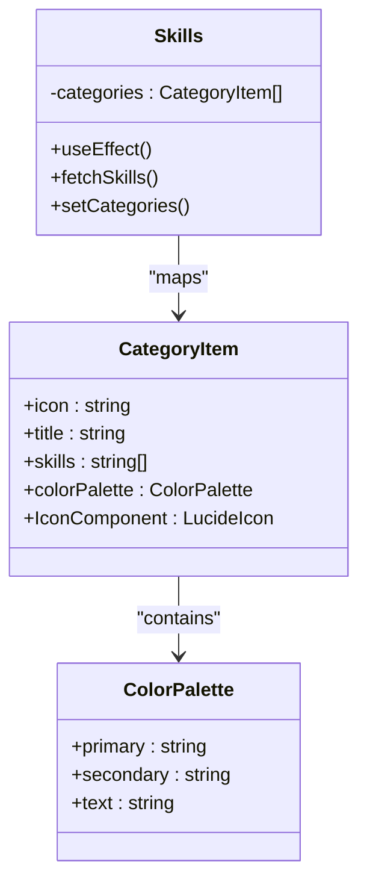
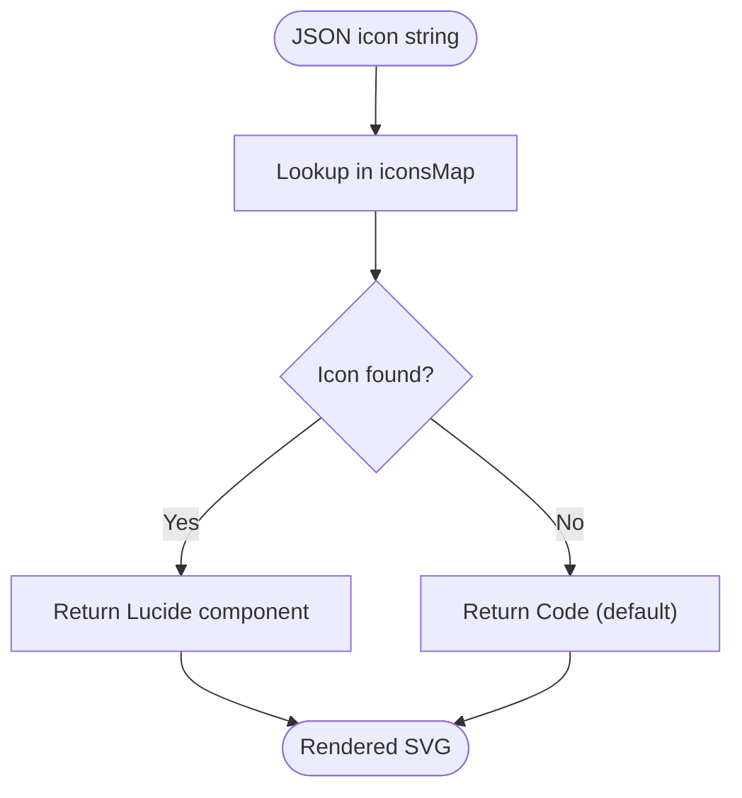
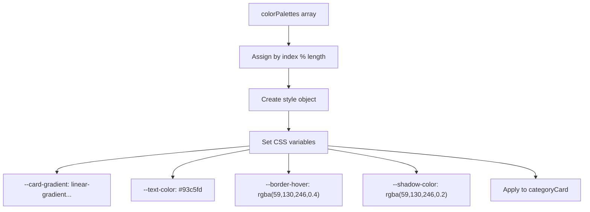
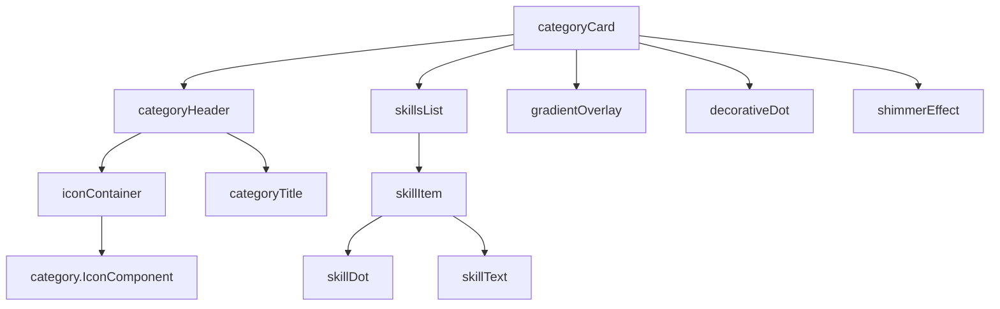
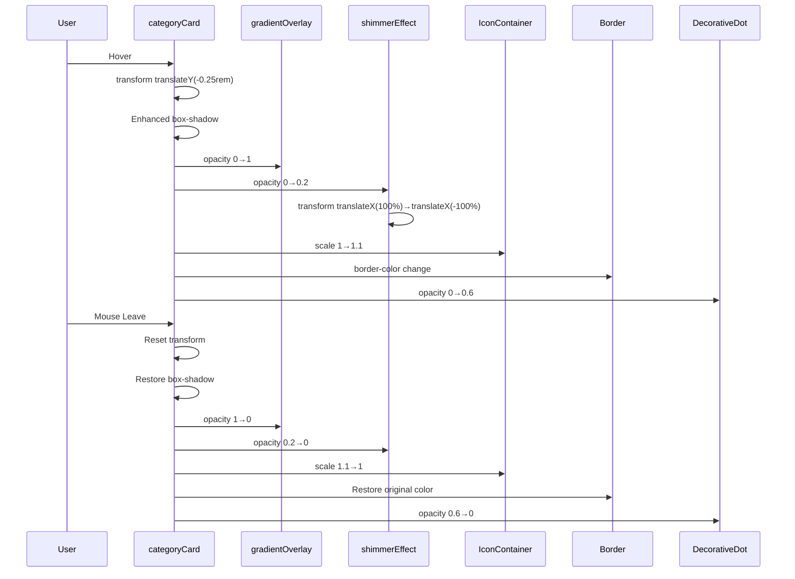
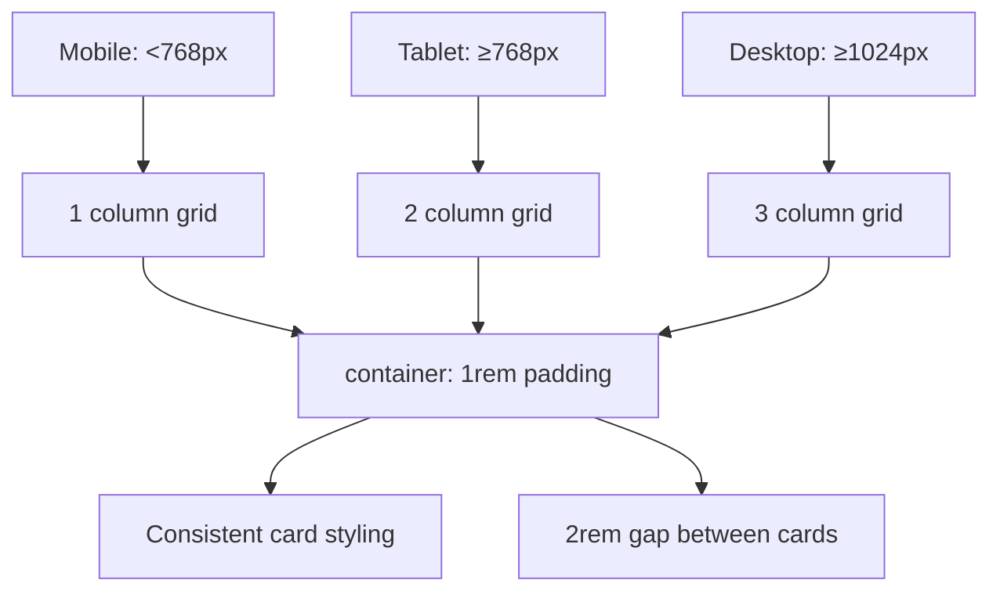

# Skills Section

<cite>
**Referenced Files in This Document**   
- [Skills.tsx](file://src/components/pages/Skills.tsx)
- [skills.json](file://public/data/skills.json)
- [Skills.module.css](file://src/components/pages/Skills.module.css)
- [About.tsx](file://src/components/pages/About.tsx)
</cite>

## Table of Contents
1. [Introduction](#introduction)
2. [Data Structure and JSON Schema](#data-structure-and-json-schema)
3. [Component Architecture](#component-architecture)
4. [Icon Mapping Mechanism](#icon-mapping-mechanism)
5. [Dynamic Color Palette System](#dynamic-color-palette-system)
6. [UI Elements and Visual Design](#ui-elements-and-visual-design)
7. [Animation and Interaction Effects](#animation-and-interaction-effects)
8. [Responsive Layout Behavior](#responsive-layout-behavior)
9. [Extensibility and Maintenance](#extensibility-and-maintenance)
10. [Error Handling and Performance Considerations](#error-handling-and-performance-considerations)

## Introduction

The Skills section component is a React TypeScript implementation that displays categorized technical skills in a visually engaging grid layout. It dynamically loads skill data from an external JSON file, renders category cards with interactive effects, and implements a sophisticated styling system using CSS variables for consistent theming. The component features animated entrance effects, hover interactions with gradient overlays, and shimmer animations to enhance user experience.

**Section sources**
- [Skills.tsx](file://src/components/pages/Skills.tsx#L0-L152)
- [skills.json](file://public/data/skills.json#L0-L32)

## Data Structure and JSON Schema

The Skills component relies on structured data loaded from `skills.json`, which defines the content and organization of technical skills. The JSON structure follows a consistent schema with three primary fields per category:

- **icon**: String identifier that maps to a Lucide React icon component (e.g., "Zap", "Code")
- **title**: Display name for the skill category (e.g., "AI/ML & NLP", "Backend & APIs")
- **skills**: Array of strings representing individual technical competencies within the category

Each category object in the JSON array represents a distinct domain of expertise, allowing for clear categorization of diverse technical abilities. The component processes this data at runtime, transforming the raw JSON into enriched objects with additional properties like icon components and color palettes.

**Diagram sources**
- [skills.json](file://public/data/skills.json#L0-L32)
- [Skills.tsx](file://src/components/pages/Skills.tsx#L40-L50)

**Section sources**
- [skills.json](file://public/data/skills.json#L0-L32)
- [Skills.tsx](file://src/components/pages/Skills.tsx#L40-L50)

## Component Architecture

The Skills component follows a clean architectural pattern combining React hooks, TypeScript interfaces, and modular styling. It uses the `useEffect` hook to asynchronously load data from `skills.json` upon mounting, ensuring the UI only renders when data is available. The component state manages an array of `CategoryItem` objects that extend the basic JSON structure with resolved icons and assigned color palettes.

TypeScript interfaces define the expected data shapes:
- `CategoryJson`: Represents the raw JSON structure
- `CategoryItem`: Extends CategoryJson with `colorPalette` and `IconComponent`
- `CustomCSSProperties`: Extends standard CSSProperties to support custom CSS variables

The component employs a functional programming approach, mapping over the categories array to generate the UI. Each category card receives dynamic styles through inline style objects that utilize CSS variables for theming consistency.

**Diagram sources**
- [Skills.tsx](file://src/components/pages/Skills.tsx#L0-L152)

**Section sources**
- [Skills.tsx](file://src/components/pages/Skills.tsx#L0-L152)

## Icon Mapping Mechanism

The component implements a robust icon resolution system that bridges string-based identifiers from JSON with actual Lucide React components. This is achieved through an `iconsMap` object that serves as a registry, mapping icon names (like "Zap" or "Code") to their corresponding imported component references.

When processing each category, the component looks up the icon name in the map using bracket notation (`iconsMap[cat.icon]`). If the lookup fails (e.g., for an unrecognized icon name), it gracefully falls back to the `Code` icon as a default. This fallback mechanism ensures visual consistency even when data errors occur.

The implementation imports specific Lucide icons at the top of the file, creating a curated set of available icons. This selective import approach optimizes bundle size by including only the icons actually used in the application rather than the entire Lucide library.

**Diagram sources**
- [Skills.tsx](file://src/components/pages/Skills.tsx#L30-L38)

**Section sources**
- [Skills.tsx](file://src/components/pages/Skills.tsx#L30-L38)
- [About.tsx](file://src/components/pages/About.tsx#L25-L45)

## Dynamic Color Palette System

The component features a sophisticated color management system that assigns unique visual identities to each category card. A predefined array of color palettes contains objects with three complementary colors:
- **primary**: Dominant color for gradients and borders
- **secondary**: Complementary color for gradient effects
- **text**: Accent color for text and decorative elements

During data processing, each category is assigned a palette based on its index using modulo arithmetic (`idx % colorPalettes.length`), enabling infinite category support with repeating color patterns. These colors are then converted into CSS variables that control various visual aspects of the card.

The CSS variable system allows for dynamic theming without requiring multiple CSS classes. Key variables include:
- `--card-gradient`: Background gradient using primary and secondary colors with transparency
- `--text-color`: Text and accent color derived from the palette
- `--border-hover`: Border color on hover state
- `--shadow-color`: Shadow color for depth effects

This approach enables consistent, themeable design while maintaining separation between logic and presentation.

**Diagram sources**
- [Skills.tsx](file://src/components/pages/Skills.tsx#L10-L28)
- [Skills.module.css](file://src/components/pages/Skills.module.css#L170-L185)

**Section sources**
- [Skills.tsx](file://src/components/pages/Skills.tsx#L10-L28)
- [Skills.module.css](file://src/components/pages/Skills.module.css#L170-L185)

## UI Elements and Visual Design

The Skills component implements a rich visual design with multiple layered elements that create depth and interactivity. Each category card contains several distinct UI components that work together to produce a polished appearance.

Key UI elements include:
- **Category Header**: Contains an icon container with the category's Lucide icon and the category title
- **Skills List**: Grid of skill items, each featuring a colored dot indicator and skill name text
- **Gradient Overlay**: Semi-transparent background layer that appears on hover, enhancing visual feedback
- **Decorative Dot**: Small circular element in the top-right corner that fades in on hover
- **Shimmer Effect**: Animated gradient overlay that sweeps across the card on hover

The design employs subtle visual hierarchy through typography, spacing, and color. Skill items use a dot-based bullet system with hover effects that scale the dot and change text color. The overall aesthetic combines glassmorphism (frosted glass effect) with modern gradient accents, creating a contemporary look that aligns with current design trends.

**Diagram sources**
- [Skills.tsx](file://src/components/pages/Skills.tsx#L96-L150)
- [Skills.module.css](file://src/components/pages/Skills.module.css#L187-L293)

**Section sources**
- [Skills.tsx](file://src/components/pages/Skills.tsx#L96-L150)
- [Skills.module.css](file://src/components/pages/Skills.module.css#L187-L293)

## Animation and Interaction Effects

The component incorporates multiple animation effects to enhance user engagement and provide visual feedback. These effects are implemented through a combination of CSS transitions and dynamic style properties.

The most prominent animation is the staggered entrance effect, where category cards appear sequentially with incremental delays. This is achieved by setting the `animationDelay` property in the inline style object, calculated as `categoryIndex * 0.1s`. This creates a cascading reveal effect that guides the user's attention through the content.

Hover interactions trigger several simultaneous effects:
- Card elevation through `transform: translateY(-0.25rem)` and enhanced box-shadow
- Gradient overlay fade-in with `opacity: 1`
- Icon container scaling and border color change
- Shimmer effect animation that sweeps across the card
- Decorative dot fade-in
- Skill item border and shadow enhancement

These micro-interactions are coordinated through CSS transitions with a 0.3-0.5 second duration, creating a smooth, responsive feel. The effects are designed to be noticeable but not distracting, enhancing usability without compromising performance.

**Diagram sources**
- [Skills.module.css](file://src/components/pages/Skills.module.css#L170-L293)

**Section sources**
- [Skills.module.css](file://src/components/pages/Skills.module.css#L170-L293)
- [Skills.tsx](file://src/components/pages/Skills.tsx#L96-L150)

## Responsive Layout Behavior

The Skills component implements a responsive grid layout that adapts to different screen sizes using CSS Grid and media queries. The layout system ensures optimal content presentation across device types while maintaining visual consistency.

The base layout uses a single-column grid (`grid-template-columns: 1fr`) for mobile devices. At tablet resolution (768px), it expands to two columns, and at desktop resolution (1024px), it utilizes a three-column layout. This progressive enhancement approach prioritizes readability on smaller screens while maximizing space utilization on larger displays.

The responsive behavior is defined entirely in CSS, separating layout concerns from component logic. The container maintains appropriate padding across breakpoints, with increasing horizontal padding at larger screen sizes. All interactive elements maintain sufficient touch targets on mobile devices, and text remains legible across all viewport sizes.

**Diagram sources**
- [Skills.module.css](file://src/components/pages/Skills.module.css#L140-L169)

**Section sources**
- [Skills.module.css](file://src/components/pages/Skills.module.css#L140-L169)

## Extensibility and Maintenance

The Skills component is designed with extensibility in mind, allowing developers to easily add new skill categories, update icons, or modify the styling system while preserving type safety. The separation of data (JSON) from presentation (React component) enables content updates without code changes.

To add a new skill category, developers simply append a new object to `skills.json` with the required fields. The component automatically assigns a color palette and processes the icon mapping. For new icons not already in the import list, developers must add the import statement and include it in the `iconsMap` object.

The TypeScript interfaces provide compile-time validation, ensuring that any modifications to the data structure are caught during development. The `CustomCSSProperties` interface extends standard CSS properties to include the custom variables used in the component, providing type safety for inline styles.

Modifications to the color palette system can be made by editing the `colorPalettes` array, with changes automatically propagating to all category cards. The modular CSS architecture allows for styling updates without affecting component logic, facilitating design iterations.

**Section sources**
- [Skills.tsx](file://src/components/pages/Skills.tsx#L0-L152)
- [skills.json](file://public/data/skills.json#L0-L32)

## Error Handling and Performance Considerations

The component includes robust error handling to ensure graceful degradation when issues occur. The `fetchSkills` function wraps data loading in a try-catch block, logging errors to the console if `skills.json` fails to load or parse. This prevents the entire component from breaking due to data issues.

The fallback mechanism for icon resolution ensures that even if an icon name in the JSON doesn't match any registered component, the UI continues to render using the default `Code` icon. This fault tolerance protects against data entry errors or synchronization issues between the JSON file and component code.

Performance considerations include:
- Efficient data fetching with a single HTTP request
- Minimal re-renders through proper useEffect dependency management
- Optimized hover effects using CSS transitions rather than JavaScript animations
- Selective icon imports to reduce bundle size
- Virtualized rendering of skill lists to minimize DOM nodes

The staggered animation delays prevent overwhelming the browser's rendering engine by synchronizing multiple animations. The use of `will-change: transform` and `backface-visibility: hidden` hints helps browsers optimize GPU compositing for smoother animations.

**Section sources**
- [Skills.tsx](file://src/components/pages/Skills.tsx#L55-L94)