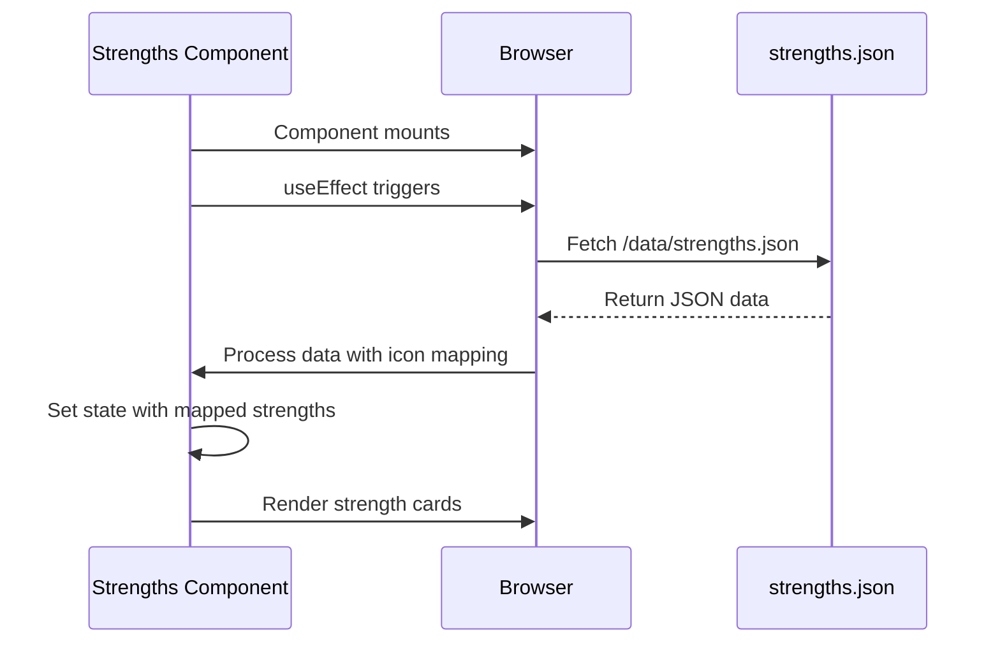
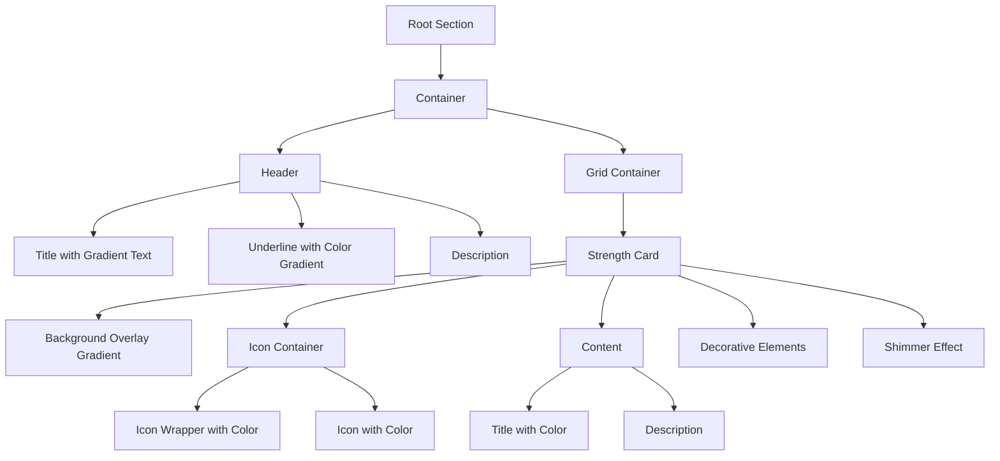

# Strengths Section

<cite>
**Referenced Files in This Document**
- [Strengths.tsx](file://src/components/pages/Strengths.tsx)
- [strengths.json](file://public/data/strengths.json)
- [Strengths.module.css](file://src/components/pages/Strengths.module.css)
- [Index.tsx](file://src/pages/Index.tsx)
</cite>

## Table of Contents
1. [Introduction](#introduction)
2. [Component Implementation](#component-implementation)
3. [JSON Data Structure](#json-data-structure)
4. [Styling and CSS Modules](#styling-and-css-modules)
5. [Interactive Behaviors](#interactive-behaviors)
6. [Integration with Portfolio Narrative](#integration-with-portfolio-narrative)
7. [Customization and Maintenance](#customization-and-maintenance)
8. [Mobile Responsiveness](#mobile-responsiveness)

## Introduction
The Strengths section is a key component of the portfolio website that showcases core competencies through an engaging visual interface. This component displays professional strengths loaded from a JSON data file, using React and TypeScript for implementation. Each strength is presented with an icon, title, description, and color-coded styling to create a cohesive and visually appealing presentation. The component integrates seamlessly with the overall design language of the portfolio while providing interactive elements that enhance user engagement.

**Section sources**
- [Strengths.tsx](file://src/components/pages/Strengths.tsx#L1-L10)
- [Index.tsx](file://src/pages/Index.tsx#L6)

## Component Implementation
The Strengths component is implemented as a React functional component using TypeScript, following modern React patterns with hooks for state management and side effects. The component fetches its data asynchronously from the public/data/strengths.json file using the useEffect hook during component initialization. It utilizes React's useState hook to manage the component's state, storing the fetched strengths data.

The component implements type safety through TypeScript interfaces that define the structure of both the JSON data (StrengthJson) and the processed data (StrengthItem). An icon mapping system converts string identifiers from the JSON into actual Lucide React components, supporting Clock, Zap, Target, Lightbulb, Users, and Star icons. The component uses dynamic import resolution to match icon names from the JSON data to their corresponding React components.



**Diagram sources**
- [Strengths.tsx](file://src/components/pages/Strengths.tsx#L1-L53)

**Section sources**
- [Strengths.tsx](file://src/components/pages/Strengths.tsx#L1-L53)

## JSON Data Structure
The Strengths component relies on a structured JSON file located at public/data/strengths.json that defines each strength with specific properties. The expected JSON structure is an array of objects, each containing four required fields: icon, title, description, and color.

The icon field contains a string that corresponds to one of the supported Lucide icons (Clock, Zap, Target, Lightbulb, Users, or Star). The title field provides the name of the strength, while the description field contains a detailed explanation of the competency. The color field specifies the visual theme for the strength card, with supported values including emerald, amber, rose, violet, blue, and purple.

```json
[
  {
    "icon": "Clock",
    "title": "Time Management",
    "description": "Efficient project planning and deadline adherence with proven track record of on-time deliveries.",
    "color": "emerald"
  },
  {
    "icon": "Zap",
    "title": "Adaptability",
    "description": "Thrives in dynamic environments, quickly adopts new technologies and methodologies.",
    "color": "amber"
  }
]
```

**Diagram sources**
- [strengths.json](file://public/data/strengths.json#L1-L38)

**Section sources**
- [strengths.json](file://public/data/strengths.json#L1-L38)
- [Strengths.tsx](file://src/components/pages/Strengths.tsx#L11-L25)

## Styling and CSS Modules
The Strengths component employs CSS Modules for consistent and isolated styling, preventing class name collisions and ensuring style encapsulation. The component uses a comprehensive system of color-based classes that are dynamically applied based on the color property in the JSON data. Each supported color (emerald, amber, rose, violet, blue, purple) has corresponding CSS classes for different visual elements including gradients, icon wrappers, icons, titles, and decorative dots.

The styling implements a sophisticated visual hierarchy with multiple layers: a base card with backdrop blur effect, a hover-activated background gradient overlay, an icon container with rounded wrapper, and decorative elements that appear on hover. The CSS includes responsive design rules that adjust the grid layout from a flexible single column on mobile devices to a fixed three-column layout on larger screens.



**Diagram sources**
- [Strengths.module.css](file://src/components/pages/Strengths.module.css#L1-L402)

**Section sources**
- [Strengths.module.css](file://src/components/pages/Strengths.module.css#L1-L402)
- [Strengths.tsx](file://src/components/pages/Strengths.tsx#L54-L102)

## Interactive Behaviors
The Strengths component incorporates several interactive behaviors that enhance user engagement and provide visual feedback. On hover, each strength card transforms with multiple simultaneous effects: it elevates with a box shadow and upward translation, scales the icon wrapper slightly, applies a shimmer effect that sweeps across the card, and reveals decorative dot elements in the corners.

The hover interaction also changes the color of text elements and icons according to the card's designated color theme, creating a cohesive visual transformation. A subtle shimmer effect animates across the card from right to left when hovered, adding a dynamic quality to the interface. The component implements staggered animation delays for cards in the grid (0s, 0.1s, 0.2s, etc.) to create a cascading entrance effect when the page loads.

These interactions are implemented entirely through CSS transitions and transforms, ensuring smooth performance without requiring additional JavaScript event handlers beyond the initial rendering logic. The transitions use a 0.3-0.5 second duration with cubic-bezier easing functions to create natural movement.

**Section sources**
- [Strengths.module.css](file://src/components/pages/Strengths.module.css#L100-L300)
- [Strengths.tsx](file://src/components/pages/Strengths.tsx#L103-L144)

## Integration with Portfolio Narrative
The Strengths section is strategically positioned within the portfolio's narrative flow, serving as a bridge between the Experience and Education sections. It complements other sections by focusing on qualitative attributes rather than quantitative achievements or technical skills. While the Skills section details specific technologies and tools, the Strengths section highlights personal and professional qualities that enable successful project execution.

The component is integrated into the main application flow through the Index.tsx file, which imports and renders the Strengths component in sequence with other portfolio sections. This placement ensures a logical progression from professional experience to core competencies, then to educational background, creating a comprehensive professional profile.

The visual design of the Strengths section aligns with the overall aesthetic of the portfolio, using the same dark theme, gradient effects, and card-based layout as other sections. The color coding system provides visual variety while maintaining consistency with the site's established color palette derived from Tailwind CSS.

**Section sources**
- [Index.tsx](file://src/pages/Index.tsx#L1-L90)
- [Strengths.tsx](file://src/components/pages/Strengths.tsx#L103-L144)

## Customization and Maintenance
Customizing the Strengths section involves modifying the strengths.json data file, which allows for easy updates without touching the component code. To add a new strength, simply append an object to the JSON array with the required fields: icon (matching one of the supported Lucide icons), title, description, and color (from the supported palette).

To extend the visual options, developers can add new color themes to both the getColorClasses function in the component and the corresponding CSS classes in Strengths.module.css. Each new color requires definitions for gradient, iconWrapper, icon, title, and dot classes to maintain visual consistency across all card elements.

For enhanced descriptions that align with professional branding, update the description field in the JSON to reflect specific achievements or metrics that demonstrate the strength in practice. For example, instead of "Proven track record of on-time deliveries," consider "Delivered 15+ projects 10% ahead of schedule with zero critical bugs."

When updating icons, ensure the icon name in the JSON exactly matches both the imported component name and the key in the iconsMap object to prevent rendering issues.

**Section sources**
- [strengths.json](file://public/data/strengths.json#L1-L38)
- [Strengths.tsx](file://src/components/pages/Strengths.tsx#L27-L53)
- [Strengths.module.css](file://src/components/pages/Strengths.module.css#L1-L402)

## Mobile Responsiveness
The Strengths component is designed with mobile responsiveness as a core principle, adapting its layout and interactions for various screen sizes. On mobile devices (below 768px), the grid system switches from a fixed three-column layout to a flexible auto-fit configuration that displays cards in a single column, ensuring optimal readability on smaller screens.

The touch interface is fully supported, with hover effects gracefully degrading on touch devices while maintaining visual clarity. The card dimensions are set using relative units (rem) and percentage-based widths to ensure proper scaling across devices. Typography adjusts appropriately, with font sizes remaining legible on small screens.

The component's performance is optimized for mobile devices through efficient CSS transitions and minimal JavaScript execution after the initial data load. The use of will-change and transform properties leverages hardware acceleration for smoother animations on mobile browsers.

Media queries in the CSS module handle breakpoints at 640px (small), 768px (medium), and 1024px (large) to provide tailored experiences across device categories, ensuring the strengths are presented effectively regardless of the viewing context.

**Section sources**
- [Strengths.module.css](file://src/components/pages/Strengths.module.css#L50-L100)
- [Strengths.module.css](file://src/components/pages/Strengths.module.css#L150-L200)