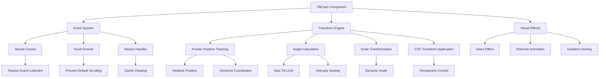
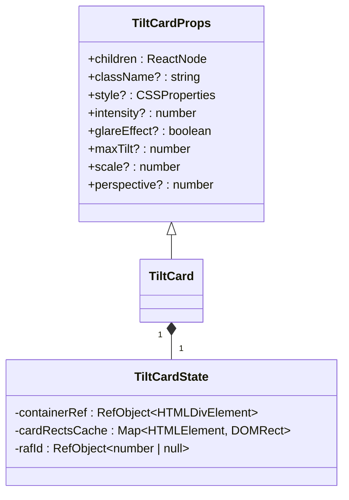
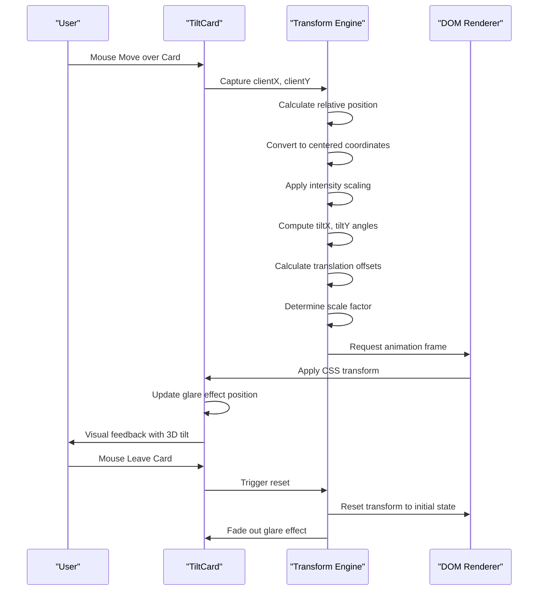
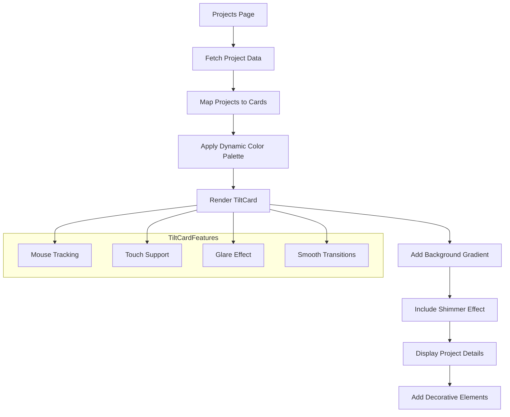
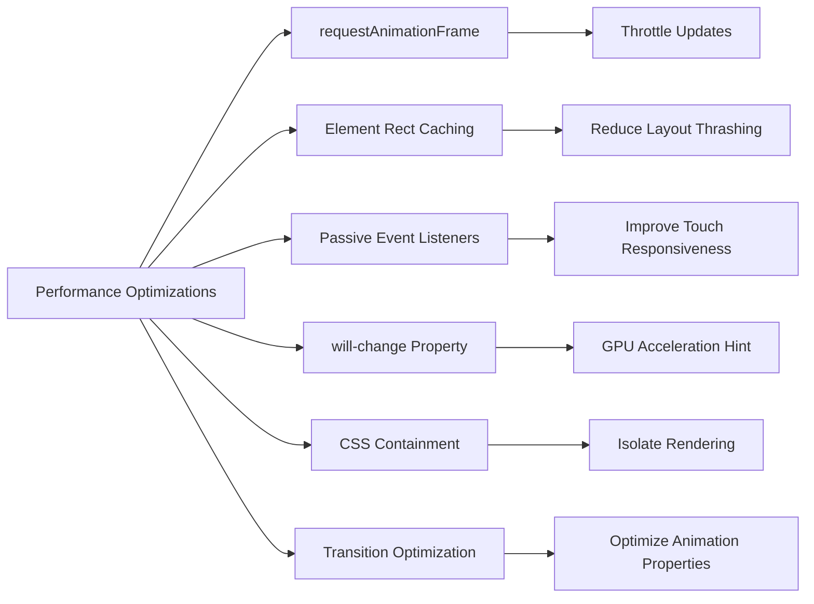

# Shared UI Components

<cite>
**Referenced Files in This Document**   
- [TiltCard.tsx](file://src/components/shared/TiltCard.tsx)
- [Projects.tsx](file://src/components/pages/Projects.tsx)
- [Skills.tsx](file://src/components/pages/Skills.tsx)
- [About.tsx](file://src/components/pages/About.tsx)
</cite>

## Table of Contents
1. [Introduction](#introduction)
2. [Core Components](#core-components)
3. [Architecture Overview](#architecture-overview)
4. [Detailed Component Analysis](#detailed-component-analysis)
5. [Performance Considerations](#performance-considerations)
6. [Accessibility and Fallbacks](#accessibility-and-fallbacks)
7. [Conclusion](#conclusion)

## Introduction

The TiltCard component is a shared UI element designed to enhance user engagement through interactive 3D tilt effects that respond to mouse movement. This documentation provides a comprehensive analysis of its implementation, functionality, and integration across the portfolio application. The component leverages CSS transforms and JavaScript event listeners to create subtle motion feedback, improving the overall user experience while maintaining performance and accessibility.

**Section sources**
- [TiltCard.tsx](file://src/components/shared/TiltCard.tsx#L1-L293)

## Core Components

The TiltCard component serves as an interactive container that responds to pointer position with realistic 3D transformations. It's implemented as a React functional component with extensive customization options through props. The component is strategically used across multiple sections of the application including Projects, Skills, and About pages to maintain visual consistency and enhance interactivity.

The implementation combines several advanced techniques:
- CSS 3D transforms for realistic card tilting
- RequestAnimationFrame for smooth animation throttling
- Passive event listeners for optimal touch performance
- Glare effect with radial gradients for enhanced realism
- Device detection for appropriate behavior on mobile vs desktop

**Section sources**
- [TiltCard.tsx](file://src/components/shared/TiltCard.tsx#L1-L293)
- [Projects.tsx](file://src/components/pages/Projects.tsx#L1-L231)
- [Skills.tsx](file://src/components/pages/Skills.tsx#L1-L151)
- [About.tsx](file://src/components/pages/About.tsx#L1-L363)

## Architecture Overview

**Diagram sources**
- [TiltCard.tsx](file://src/components/shared/TiltCard.tsx#L1-L293)

## Detailed Component Analysis

### TiltCard Implementation Analysis

The TiltCard component implements a sophisticated interaction model that tracks pointer position relative to the card element and applies corresponding 3D transformations. The core functionality revolves around calculating tilt angles based on cursor position and applying them through CSS transforms.

#### Props Interface and Customization Options

**Diagram sources**
- [TiltCard.tsx](file://src/components/shared/TiltCard.tsx#L40-L293)

The component accepts several customizable props that allow fine-tuning of the tilt effect:

| Prop Name | Type | Default Value | Description |
|---------|------|---------------|-------------|
| children | ReactNode | required | Content to be rendered inside the tilted card |
| className | string | '' | Additional CSS classes to apply to the card container |
| style | CSSProperties | {} | Inline styles to merge with default card styles |
| intensity | number | 0.8 | Controls sensitivity of tilt response (0-1) |
| glareEffect | boolean | true | Enables/disables the light reflection effect |
| maxTilt | number | 10 | Maximum tilt angle in degrees |
| scale | number | 0.00 | Additional scale factor applied during tilt |
| perspective | number | 10000 | CSS perspective value for 3D effect depth |

**Section sources**
- [TiltCard.tsx](file://src/components/shared/TiltCard.tsx#L40-L293)

#### Interaction Flow and Event Handling

**Diagram sources**
- [TiltCard.tsx](file://src/components/shared/TiltCard.tsx#L100-L250)

The interaction flow demonstrates how the component processes pointer events and translates them into visual transformations. The sequence diagram illustrates the complete lifecycle from user interaction to visual feedback, highlighting the requestAnimationFrame throttling mechanism that ensures smooth performance.

### Usage Contexts and Integration

The TiltCard component is integrated across multiple sections of the application, each demonstrating different use cases and styling approaches.

#### Projects Page Integration

**Diagram sources**
- [Projects.tsx](file://src/components/pages/Projects.tsx#L1-L231)
- [TiltCard.tsx](file://src/components/shared/TiltCard.tsx#L1-L293)

On the Projects page, TiltCard wraps individual project showcases, providing an engaging way to present technical details, impact statements, and key features. Each card uses a dynamically assigned color palette from a predefined set, creating visual variety while maintaining design coherence.

#### Skills Page Integration

In the Skills section, TiltCard principles are applied to category cards that group related technologies. While not explicitly using the TiltCard component, the implementation follows similar patterns with gradient overlays, shimmer effects, and interactive hover states, demonstrating the reusability of the design system concepts.

**Section sources**
- [Skills.tsx](file://src/components/pages/Skills.tsx#L1-L151)

#### About Page Integration

The About section utilizes similar interactive card patterns for personal information and achievements. The contact cards implement comparable visual effects including gradient backgrounds, shimmer animations, and decorative elements, showing how the TiltCard design language extends throughout the application.

**Section sources**
- [About.tsx](file://src/components/pages/About.tsx#L1-L363)

## Performance Considerations

The TiltCard implementation incorporates several performance optimizations to ensure smooth interactions without compromising user experience:

**Diagram sources**
- [TiltCard.tsx](file://src/components/shared/TiltCard.tsx#L1-L293)

Key performance strategies include:
- **requestAnimationFrame throttling**: Limits transform updates to the browser's refresh rate, preventing excessive calculations
- **DOMRect caching**: Stores element dimensions to avoid repeated getBoundingClientRect calls
- **Passive event listeners**: Improves scroll performance on touch devices by indicating that preventDefault won't be called
- **will-change property**: Hints to the browser which properties will change, enabling optimization
- **CSS containment**: Uses 'layout style paint' containment to isolate rendering work
- **Selective transitions**: Applies transitions only to properties that benefit from animation

The component also implements device-specific behavior adjustments, reducing the intensity of the tilt effect on mobile devices to account for smaller screens and different interaction patterns.

**Section sources**
- [TiltCard.tsx](file://src/components/shared/TiltCard.tsx#L1-L293)

## Accessibility and Fallbacks

The TiltCard component addresses accessibility concerns through several mechanisms:

- **Progressive enhancement**: The core content remains fully accessible even if JavaScript is disabled or fails to load
- **Touch device support**: Implements touch event handling with preventDefault to enable the tilt effect on mobile while managing scroll conflicts
- **Reduced motion consideration**: While not explicitly checking for prefers-reduced-motion, the subtle nature of the effect minimizes potential issues
- **Focus management**: Maintains standard focus behavior for interactive elements within the card
- **Semantic HTML**: Uses appropriate HTML structure to ensure screen reader compatibility

The fallback behavior ensures that when JavaScript is unavailable, users still receive the complete content in a static format, preserving information accessibility at the cost of interactive enhancements.

**Section sources**
- [TiltCard.tsx](file://src/components/shared/TiltCard.tsx#L1-L293)

## Conclusion

The TiltCard component exemplifies modern interactive UI design, combining aesthetic appeal with technical sophistication. By leveraging CSS 3D transforms and optimized JavaScript event handling, it creates an engaging user experience that enhances content presentation across multiple sections of the portfolio application.

The component's architecture demonstrates thoughtful consideration of performance, accessibility, and cross-device compatibility. Its modular design allows for easy integration and customization, making it a versatile tool in the application's design system. The implementation balances visual richness with technical efficiency, ensuring smooth interactions while maintaining accessibility standards.

Through its use in Projects, Skills, and About sections, the TiltCard establishes a cohesive interactive language that guides user engagement throughout the application, transforming static content displays into dynamic, responsive experiences.