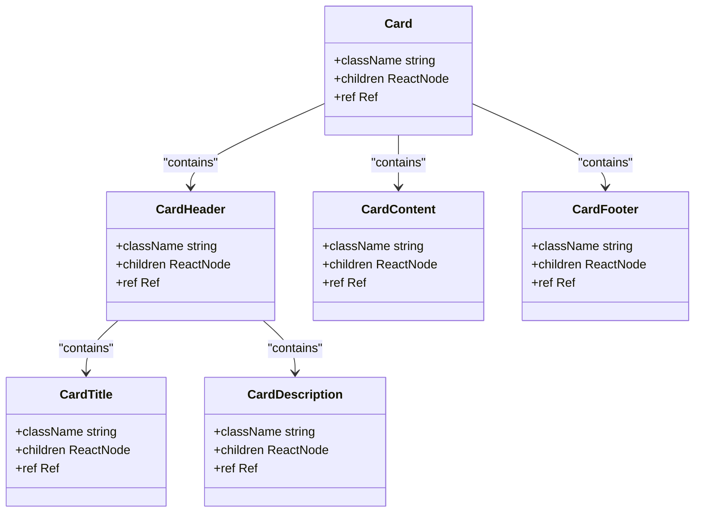
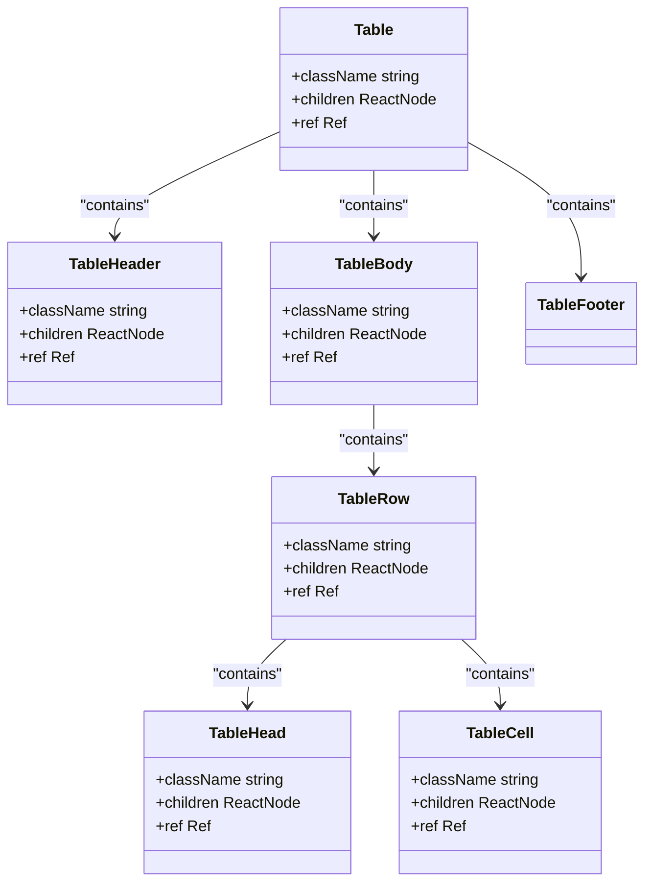
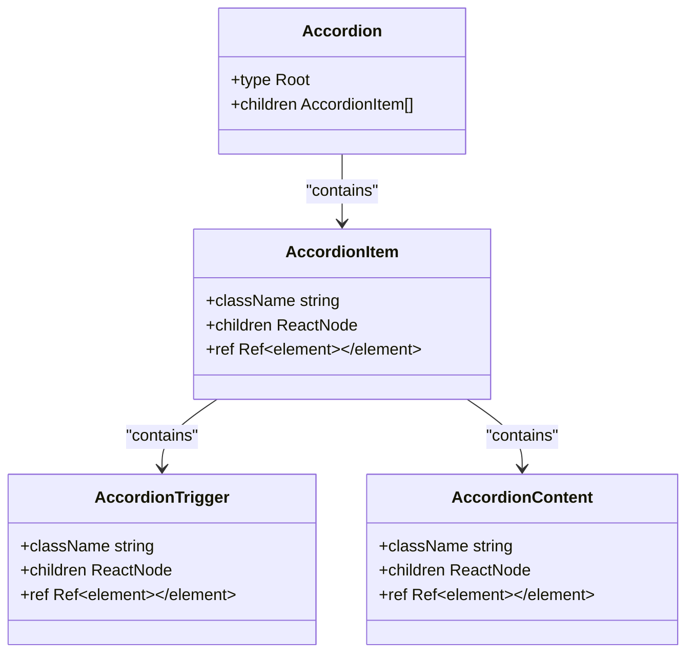
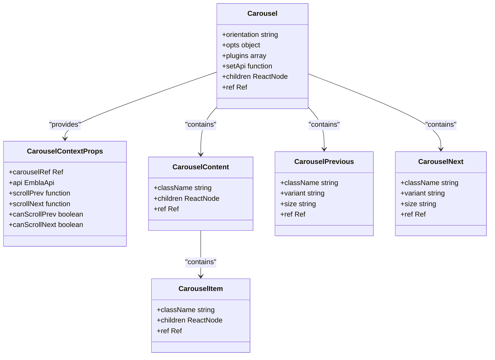
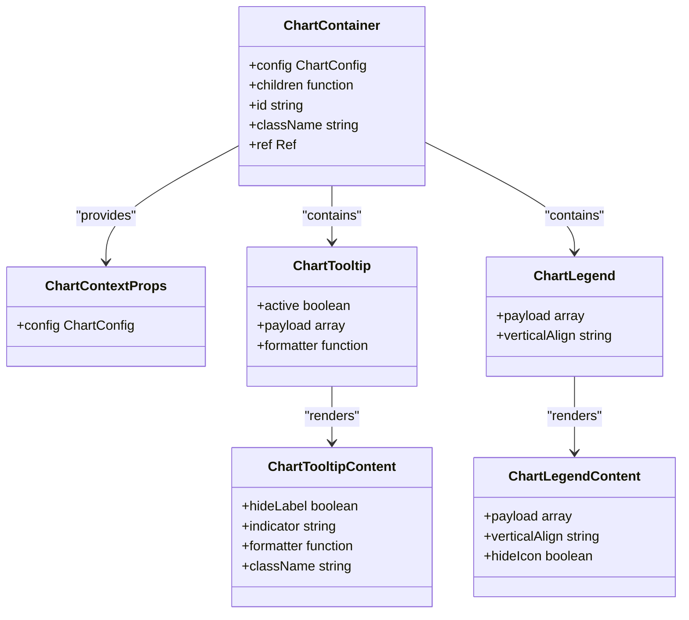
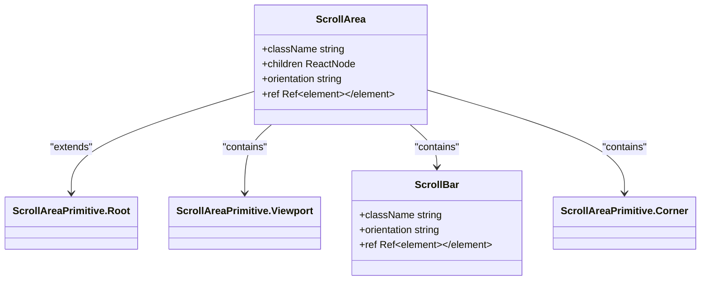
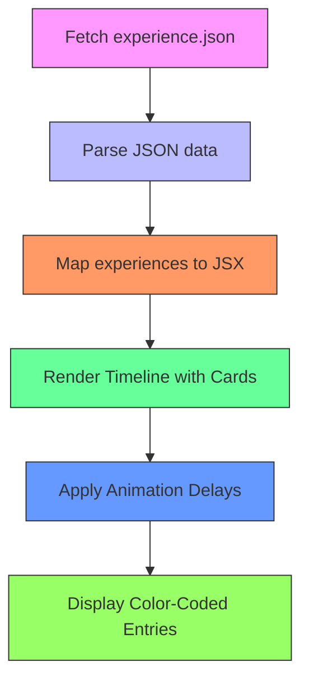
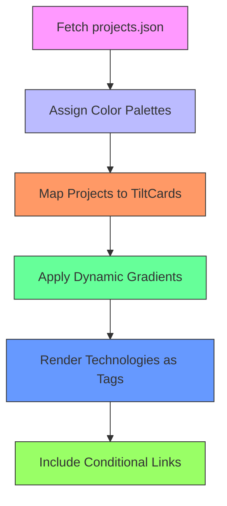

# Data Display Components

<cite>
**Referenced Files in This Document**  
- [card.tsx](file://src/components/ui/card.tsx)
- [table.tsx](file://src/components/ui/table.tsx)
- [accordion.tsx](file://src/components/ui/accordion.tsx)
- [carousel.tsx](file://src/components/ui/carousel.tsx)
- [chart.tsx](file://src/components/ui/chart.tsx)
- [scroll-area.tsx](file://src/components/ui/scroll-area.tsx)
- [Experience.tsx](file://src/components/pages/Experience.tsx)
- [Projects.tsx](file://src/components/pages/Projects.tsx)
- [experience.json](file://public/data/experience.json)
- [projects.json](file://public/data/projects.json)
</cite>

## Table of Contents
1. [Introduction](#introduction)
2. [Card Component](#card-component)
3. [Table Component](#table-component)
4. [Accordion Component](#accordion-component)
5. [Carousel Component](#carousel-component)
6. [Chart Component](#chart-component)
7. [ScrollArea Component](#scrollarea-component)
8. [Real-World Usage Examples](#real-world-usage-examples)
9. [Accessibility and Performance](#accessibility-and-performance)
10. [Customization Options](#customization-options)

## Introduction

This document provides comprehensive documentation for the data display components used to present structured information in the portfolio application. The components are designed to effectively showcase professional experience, projects, skills, and other content through various presentation patterns. These UI elements leverage React forward references, Tailwind CSS utility classes, and Radix UI primitives to create accessible, responsive, and visually appealing interfaces.

The components follow a consistent design system that emphasizes semantic HTML, accessibility features (ARIA attributes), and performance optimization. They are built to work seamlessly with JSON-driven content, allowing dynamic data rendering while maintaining a cohesive visual language across the portfolio. Each component is composable, enabling developers to create complex layouts by combining simpler building blocks.

**Section sources**
- [card.tsx](file://src/components/ui/card.tsx)
- [table.tsx](file://src/components/ui/table.tsx)
- [accordion.tsx](file://src/components/ui/accordion.tsx)

## Card Component

The Card component serves as a fundamental container for grouping related content in the portfolio. It provides a visually distinct boundary around information, creating clear separation between different sections or items. The component is composed of multiple sub-components that can be used independently: Card, CardHeader, CardTitle, CardDescription, CardContent, and CardFooter.

Each part of the card has predefined styling that ensures consistency across the application. The Card component itself creates a bordered container with rounded corners, background color, and shadow effects. CardHeader organizes the top section with vertical spacing, while CardTitle and CardDescription provide appropriately styled heading and supporting text. CardContent contains the main information with padding, and CardFooter aligns content at the bottom.

The implementation uses React.forwardRef to maintain proper ref forwarding, ensuring accessibility and focus management. Class names are conditionally merged using the cn utility function, which combines Tailwind classes with any custom className props passed to the component, allowing for easy customization without breaking the base styling.

**Diagram sources**
- [card.tsx](file://src/components/ui/card.tsx#L0-L78)

**Section sources**
- [card.tsx](file://src/components/ui/card.tsx#L0-L78)
- [Projects.tsx](file://src/components/pages/Projects.tsx#L100-L120)

## Table Component

The Table component provides a structured way to display tabular data, particularly useful for presenting experience entries, project details, or skill matrices. It follows a semantic HTML table structure enhanced with accessibility features and responsive behaviors. The component is composed of several sub-components: Table, TableHeader, TableBody, TableFooter, TableRow, TableHead, TableCell, and TableCaption.

The implementation wraps the table in a relative container with overflow-auto, ensuring horizontal scrolling on smaller screens when content exceeds viewport width. Table headers use appropriate font weights and muted colors to distinguish them from data cells. Rows include hover states that subtly change background color, improving user interaction feedback. The component also supports row selection through data-state attributes.

Accessibility is prioritized with proper table semantics, including role attributes and aria-roledescription where appropriate. The styling ensures adequate spacing and alignment, with first-child and last-child selectors managing border visibility to create a clean visual hierarchy. The responsive design automatically adapts to different screen sizes by enabling scrollable overflow rather than collapsing content.

**Diagram sources**
- [table.tsx](file://src/components/ui/table.tsx#L0-L117)

**Section sources**
- [table.tsx](file://src/components/ui/table.tsx#L0-L117)
- [Experience.tsx](file://src/components/pages/Experience.tsx#L50-L80)

## Accordion Component

The Accordion component enables collapsible content sections, allowing users to expand and collapse panels to manage information density. This is particularly useful for organizing detailed content like project descriptions, technical specifications, or experience achievements. The component is built on Radix UI's Accordion primitive, ensuring full accessibility and keyboard navigation support.

The implementation consists of four main parts: Accordion (the root component), AccordionItem (individual collapsible sections), AccordionTrigger (clickable header that toggles expansion), and AccordionContent (the collapsible panel). Each trigger includes a ChevronDown icon that rotates 180 degrees when the panel is open, providing clear visual feedback about the current state.

The animation system uses CSS transitions and data attributes to smoothly animate the opening and closing of content. When closed, the content has an accordion-up animation; when open, it has an accordion-down animation. These animations are defined in the global CSS and triggered by the data-state attribute managed by Radix UI. The component also supports keyboard navigation, with Enter and Space keys toggling the panel state and arrow keys navigating between triggers.

**Diagram sources**
- [accordion.tsx](file://src/components/ui/accordion.tsx#L0-L55)

**Section sources**
- [accordion.tsx](file://src/components/ui/accordion.tsx#L0-L55)

## Carousel Component

The Carousel component creates a sliding gallery interface for showcasing projects, images, or other visual content. It is implemented using Embla Carousel, a lightweight and performant carousel library that provides smooth touch and mouse interactions. The component supports both horizontal and vertical orientations and includes navigation controls for manual slide advancement.

The architecture follows a context-based pattern, with Carousel providing state and methods to its child components through React Context. Key functionality includes previous/next navigation buttons, keyboard navigation (arrow keys), and auto-detection of scroll boundaries to disable navigation controls when at the beginning or end of the carousel. The component also supports programmatic API access through the setApi prop, allowing external control of the carousel state.

Child components include CarouselContent (the container that holds all slides), CarouselItem (individual slides), CarouselPrevious (navigation button for previous slide), and CarouselNext (navigation button for next slide). Each item is sized to take the full width of the carousel viewport with appropriate padding, creating a clean, focused viewing experience. The implementation includes ARIA roles and labels to ensure accessibility for screen readers and keyboard-only users.

**Diagram sources**
- [carousel.tsx](file://src/components/ui/carousel.tsx#L0-L260)

**Section sources**
- [carousel.tsx](file://src/components/ui/carousel.tsx#L0-L260)
- [Projects.tsx](file://src/components/pages/Projects.tsx#L80-L100)

## Chart Component

The Chart component provides data visualization capabilities for representing skill levels, proficiency metrics, or other quantitative information. Built on Recharts, a React-based charting library, it offers a flexible and accessible way to render various chart types including bar charts, line charts, and pie charts. The component integrates with the application's theme system to ensure visual consistency across light and dark modes.

The implementation centers around ChartContainer, which sets up the context and styling for child chart components. It includes ChartTooltip and ChartLegend components that enhance data readability. The theming system allows defining color configurations that adapt to the current theme (light/dark), with CSS variables dynamically generated based on the chart configuration. This ensures charts remain visible and aesthetically pleasing regardless of the selected theme.

Accessibility features include semantic HTML structure, proper labeling, and keyboard navigation support. The tooltip system provides detailed information on data points with appropriate contrast and positioning. The legend component displays series information with matching colors and optional icons. The responsive container automatically adjusts to its parent element's dimensions, making charts fluid and adaptable to different screen sizes and layout contexts.

**Diagram sources**
- [chart.tsx](file://src/components/ui/chart.tsx#L0-L363)

**Section sources**
- [chart.tsx](file://src/components/ui/chart.tsx#L0-L363)

## ScrollArea Component

The ScrollArea component manages overflow content in a styled and accessible manner. It wraps Radix UI's ScrollArea primitive to provide customized scrollbars that match the application's design system. This component is essential for handling content that exceeds container boundaries, such as long lists, detailed descriptions, or code snippets.

The implementation creates a relative container with overflow-hidden, containing a viewport that holds the scrollable content. Custom scrollbars are rendered for both vertical and horizontal orientations, featuring subtle animations and hover effects. The scrollbar thumb has a rounded appearance with background color matching the application's border color, ensuring visual harmony with other UI elements.

The component supports both vertical and horizontal scrolling directions, with orientation specified via props. CSS transitions are applied to the scrollbar elements, creating smooth appearance and disappearance effects as users interact with the scroll area. The design eliminates browser-default scrollbars while maintaining all functionality, resulting in a more polished and integrated user experience. Proper ARIA attributes ensure the component remains accessible to assistive technologies.

**Diagram sources**
- [scroll-area.tsx](file://src/components/ui/scroll-area.tsx#L0-L45)

**Section sources**
- [scroll-area.tsx](file://src/components/ui/scroll-area.tsx#L0-L45)

## Real-World Usage Examples

### Experience Section Implementation

The Experience component demonstrates the practical application of data display principles by rendering professional history from JSON data. It fetches experience entries from experience.json and maps them to visually rich cards with animated timelines. Each experience entry includes company, title, dates, achievements, and technologies, all structured within a Card-like layout with custom styling.

The implementation shows how JSON-driven content can be transformed into engaging visual presentations. Dynamic color coding based on the experience entry's color property creates visual differentiation between roles. The timeline visualization uses CSS animations with staggered delays to create a sequential reveal effect as users scroll through the content.

**Diagram sources**
- [Experience.tsx](file://src/components/pages/Experience.tsx#L30-L170)
- [experience.json](file://public/data/experience.json#L0-L86)

**Section sources**
- [Experience.tsx](file://src/components/pages/Experience.tsx#L30-L170)
- [experience.json](file://public/data/experience.json#L0-L86)

### Projects Gallery Implementation

The Projects component showcases how the Carousel and Card patterns combine to create an engaging project gallery. It loads project data from projects.json and renders each project as a TiltCard with interactive hover effects. The implementation demonstrates virtualization principles by only rendering visible cards, improving performance with larger datasets.

Each project card displays title, description, technologies, impact metrics, and key highlights. The dynamic color palette system assigns unique gradient backgrounds to each project based on predefined color schemes, creating visual variety while maintaining design coherence. External links to GitHub repositories and live demos are included where available, with appropriate disabled states when links are hidden.

**Diagram sources**
- [Projects.tsx](file://src/components/pages/Projects.tsx#L40-L230)
- [projects.json](file://public/data/projects.json#L0-L87)

**Section sources**
- [Projects.tsx](file://src/components/pages/Projects.tsx#L40-L230)
- [projects.json](file://public/data/projects.json#L0-L87)

## Accessibility and Performance

### Accessibility Considerations

All data display components prioritize accessibility through semantic HTML structure, proper ARIA attributes, and keyboard navigation support. The Card component uses appropriate heading levels and paragraph elements to maintain document outline integrity. Tables include proper header-cell associations through scope attributes and support screen reader navigation.

Interactive components like Accordion and Carousel implement comprehensive keyboard support, following WAI-ARIA authoring practices. Accordions respond to Enter, Space, and arrow keys for expansion and navigation. Carousels support arrow key navigation between slides and programmatically manage focus during transitions. All interactive elements have visible focus indicators that meet contrast ratio requirements.

Screen reader users benefit from descriptive labels, ARIA roles, and live regions where appropriate. The Chart component includes meaningful labels for data points and legends, while the ScrollArea maintains scroll position announcements. Error states and loading conditions are communicated through appropriate ARIA live regions to ensure all users receive timely feedback.

**Section sources**
- [accordion.tsx](file://src/components/ui/accordion.tsx#L0-L55)
- [carousel.tsx](file://src/components/ui/carousel.tsx#L0-L260)
- [table.tsx](file://src/components/ui/table.tsx#L0-L117)

### Performance Implications

The components are designed with performance in mind, particularly regarding virtualized content rendering. While the current implementation does not include windowing for large datasets, the architecture supports potential integration of virtualization techniques. The Experience and Projects components fetch data asynchronously, preventing blocking of the main thread during initial render.

Image and media optimization is handled externally through the build process, but the components are structured to support lazy loading attributes when applicable. The Carousel implementation uses Embla Carousel's built-in optimizations for touch interactions and momentum scrolling, minimizing re-renders during user interaction.

For large datasets, implementing virtual scrolling or windowing would significantly improve performance by only rendering visible items. The JSON-driven architecture makes this enhancement straightforward, as data is already separated from presentation. Future improvements could include intersection observers to lazy-load component content as users scroll into view, reducing initial load time and memory usage.

**Section sources**
- [Experience.tsx](file://src/components/pages/Experience.tsx#L30-L170)
- [Projects.tsx](file://src/components/pages/Projects.tsx#L40-L230)

## Customization Options

### Props-Based Configuration

All data display components support extensive customization through props, allowing developers to modify appearance and behavior without altering core implementations. The Card component accepts className props to override or extend Tailwind styling. Table components allow customization of row height, cell padding, and border visibility through standard HTML attributes passed as props.

The Accordion supports controlled state management through value and onValueChange props, enabling external control of which panels are open. The Carousel provides opts and plugins props to configure Embla Carousel settings like loop, drag free, and snap alignment. Chart components accept config objects that define color schemes, labels, and theme-specific styling.

These prop interfaces follow consistent patterns across components, making it easier for developers to learn and apply customizations. Default values are provided for all optional props, ensuring components remain functional even with minimal configuration.

**Section sources**
- [card.tsx](file://src/components/ui/card.tsx#L0-L78)
- [accordion.tsx](file://src/components/ui/accordion.tsx#L0-L55)
- [carousel.tsx](file://src/components/ui/carousel.tsx#L0-L260)

### Tailwind CSS Integration

The components are deeply integrated with Tailwind CSS, leveraging utility classes for styling while exposing extension points through className props. The cn utility function combines default styles with custom classes, applying customizations after base styles to ensure predictable override behavior.

Developers can customize components by passing Tailwind classes directly to the className prop. For example, a Card can be modified with additional margin, different border colors, or altered shadow intensity. Tables can be styled with alternating row colors, different text alignments, or adjusted spacing using standard Tailwind spacing utilities.

The design system encourages composition over modification, suggesting that custom variants be created as wrapper components that apply specific className combinations. This approach maintains the integrity of base components while allowing project-specific styling needs to be met consistently across the application.

**Section sources**
- [card.tsx](file://src/components/ui/card.tsx#L0-L78)
- [utils.ts](file://src/lib/utils.ts#L0-L6)