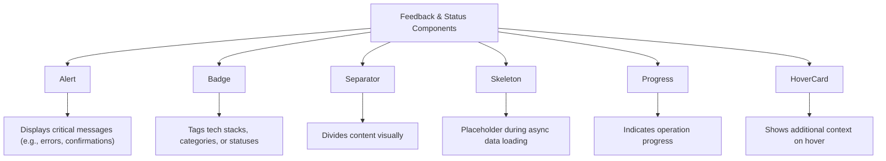
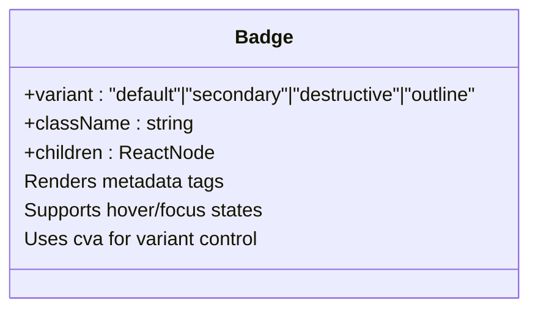
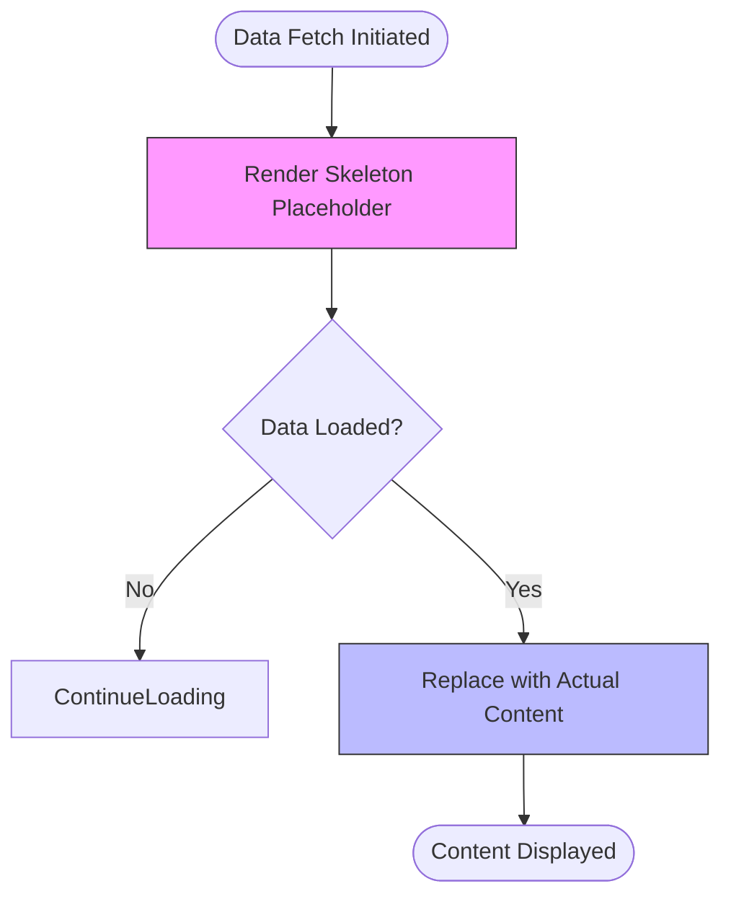

# Feedback and Status Components

<cite>
**Referenced Files in This Document**
- [alert.tsx](file://src/components/ui/alert.tsx)
- [badge.tsx](file://src/components/ui/badge.tsx)
- [separator.tsx](file://src/components/ui/separator.tsx)
- [skeleton.tsx](file://src/components/ui/skeleton.tsx)
- [progress.tsx](file://src/components/ui/progress.tsx)
- [hover-card.tsx](file://src/components/ui/hover-card.tsx)
- [tailwind.config.ts](file://tailwind.config.ts)
- [utils.ts](file://src/lib/utils.ts)
- [Hero.module.css](file://src/components/pages/Hero.module.css)
</cite>

## Table of Contents
1. [Introduction](#introduction)
2. [Core Components Overview](#core-components-overview)
3. [Alert Component](#alert-component)
4. [Badge Component](#badge-component)
5. [Separator Component](#separator-component)
6. [Skeleton Component](#skeleton-component)
7. [Progress Indicator](#progress-indicator)
8. [HoverCard Component](#hovercard-component)
9. [Theming and Styling with Tailwind CSS](#theming-and-styling-with-tailwind-css)
10. [Accessibility Guidelines](#accessibility-guidelines)
11. [Performance Benefits](#performance-benefits)
12. [Integration Examples](#integration-examples)

## Introduction
This document provides comprehensive documentation for UI components that communicate status, hierarchy, and loading states within the application. These elements—Alert, Badge, Separator, Skeleton, Progress, and HoverCard—play a crucial role in enhancing user experience by delivering immediate visual feedback. Built using React and styled via Tailwind CSS, these components are designed for seamless integration across pages and maintain consistent design language through utility-first styling principles.

## Core Components Overview
The following components serve distinct roles in conveying information to users:
- **Alert**: Communicates important messages or system statuses.
- **Badge**: Displays metadata tags such as technology stack labels.
- **Separator**: Provides visual grouping between content sections.
- **Skeleton**: Acts as a loading placeholder during data fetch operations.
- **Progress**: Visualizes task completion or loading progress.
- **HoverCard**: Offers contextual tooltips on hover interactions.

These components collectively improve perceived performance, guide user attention, and clarify interface hierarchy.



**Diagram sources**
- [alert.tsx](file://src/components/ui/alert.tsx#L1-L58)
- [badge.tsx](file://src/components/ui/badge.tsx#L1-L35)
- [separator.tsx](file://src/components/ui/separator.tsx#L1-L29)
- [skeleton.tsx](file://src/components/ui/skeleton.tsx#L1-L15)
- [progress.tsx](file://src/components/ui/progress.tsx#L1-L26)
- [hover-card.tsx](file://src/components/ui/hover-card.tsx#L1-L27)

## Alert Component
The `Alert` component is used to display prominent messages such as success notifications, warnings, or error alerts. It supports multiple variants including default and destructive (error) states. The component uses semantic HTML with `role="alert"` for accessibility compliance.

It consists of three subcomponents:
- `AlertTitle`: Emphasized heading within the alert.
- `AlertDescription`: Supporting text providing further details.

Styling leverages `cva` for variant management and integrates seamlessly with Tailwind’s utility classes via the `cn` helper function.

**Section sources**
- [alert.tsx](file://src/components/ui/alert.tsx#L1-L58)

## Badge Component
The `Badge` component renders small, pill-shaped labels used for tagging metadata like technology stacks, project categories, or status indicators. It supports several variants:
- **default**: Primary color scheme
- **secondary**: Secondary accent color
- **destructive**: Red tone for error/warning tags
- **outline**: Minimalist border-only style

Badges are implemented as inline flex containers with responsive padding and font sizing using Tailwind's `text-xs` and `px-2.5 py-0.5`. They also include hover effects and focus rings for interactive feedback.

Notably, custom badge styles in `Hero.module.css` override default Tailwind properties to achieve a glassmorphic effect with backdrop blur and subtle borders.



**Diagram sources**
- [badge.tsx](file://src/components/ui/badge.tsx#L1-L35)
- [Hero.module.css](file://src/components/pages/Hero.module.css#L76-L180)

**Section sources**
- [badge.tsx](file://src/components/ui/badge.tsx#L1-L35)
- [Hero.module.css](file://src/components/pages/Hero.module.css#L76-L180)

## Separator Component
The `Separator` component creates a thin horizontal or vertical divider to group related content sections. It is built on `@radix-ui/react-separator` and styled with dynamic height/width based on orientation.

By default, it renders a 1px high horizontal line (`h-[1px] w-full`) with a muted border color. Vertical separators use `h-full w-[1px]`. The component ensures proper spacing and alignment within layouts and maintains consistency across themes.

**Section sources**
- [separator.tsx](file://src/components/ui/separator.tsx#L1-L29)

## Skeleton Component
The `Skeleton` component serves as a loading state placeholder, typically shown while content is being fetched asynchronously. It features an animated pulse effect using Tailwind’s `animate-pulse` class, simulating activity and improving perceived responsiveness.

Minimal in implementation, it applies `rounded-md` and `bg-muted` styles to mimic the shape and color of expected content. Commonly used in conjunction with data-fetching patterns (e.g., fetching `/data/skills.json`), it enhances UX by reducing blank screen time.

Its simplicity enables broad reuse across cards, lists, and profile sections where loading latency exists.



**Diagram sources**
- [skeleton.tsx](file://src/components/ui/skeleton.tsx#L1-L15)
- [Skills.tsx](file://src/components/pages/Skills.tsx#L55-L150)

**Section sources**
- [skeleton.tsx](file://src/components/ui/skeleton.tsx#L1-L15)

## Progress Indicator
The `Progress` component visualizes the completion status of an operation using a horizontal bar. Built with `@radix-ui/react-progress`, it supports controlled value input (0–100) and smooth transitions via CSS transforms.

The outer container has a `rounded-full bg-secondary` appearance, while the inner indicator fills from left to right with `bg-primary`. The animation is achieved by translating the indicator element: `transform: translateX(-${100 - value}%)`.

This component is ideal for file uploads, form steps, or any process requiring visual progress tracking.

**Section sources**
- [progress.tsx](file://src/components/ui/progress.tsx#L1-L26)

## HoverCard Component
The `HoverCard` component displays contextual information when users hover over a trigger element. It comprises three parts:
- `HoverCard`: Root container
- `HoverCardTrigger`: Element that activates the card
- `HoverCardContent`: Popover panel with additional details

Styled with `z-50`, rounded corners, shadow, and smooth entrance animations (`data-[state=open]:animate-in`), the content appears with fade and zoom effects. Positioning is handled automatically with side offset support.

Useful for tooltips, definitions, or supplementary data without cluttering the main interface.

**Section sources**
- [hover-card.tsx](file://src/components/ui/hover-card.tsx#L1-L27)

## Theming and Styling with Tailwind CSS
All components integrate with the project’s Tailwind configuration defined in `tailwind.config.ts`. Key theming features include:
- **CSS Variables**: Theme colors mapped to HSL variables (e.g., `--primary`, `--foreground`)
- **Dark Mode Support**: Enabled via `darkMode: ["class"]`
- **Responsive Design**: Configured container padding and breakpoints
- **Animation Extensions**: Custom keyframes for accordion, fade-in, scale-in, and floating effects

The `cn()` utility combines class names safely using `clsx` and `tailwind-merge`, ensuring no duplicate or conflicting classes.

Color variants across components align with the global theme, enabling consistent rendering whether in light or dark mode.

**Section sources**
- [tailwind.config.ts](file://tailwind.config.ts#L1-L127)
- [utils.ts](file://src/lib/utils.ts#L1-L6)

## Accessibility Guidelines
Each component adheres to WCAG standards:
- **Alert**: Uses `role="alert"` for screen readers; titles use semantic `<h5>`.
- **Separator**: Marked `decorative={true}` by default, avoiding unnecessary announcements.
- **HoverCard**: Implements proper focus management and dismissible behavior.
- **Focus States**: All interactive elements have visible focus rings (`focus:ring-2 ring-ring`).
- **Contrast Ratios**: Text and background colors meet minimum contrast requirements via HSL-based theming.

Ensure keyboard navigation compatibility when implementing triggers or dismissible behaviors.

## Performance Benefits
Using lightweight components like `Skeleton` improves **perceived performance** during asynchronous operations. Instead of showing empty space, skeleton loaders provide visual continuity, making loading feel faster even if actual load time remains unchanged.

Additionally:
- Tailwind’s JIT compiler minimizes unused CSS
- Radix UI primitives are optimized for minimal re-renders
- Animation classes are declarative and GPU-accelerated
- No heavy dependencies beyond core utilities

This results in fast initial loads and smooth runtime performance.

## Integration Examples
### Example 1: Project Tags with Badges
```tsx
<Badge variant="default">React</Badge>
<Badge variant="secondary">TypeScript</Badge>
<Badge variant="outline">Node.js</Badge>
```

### Example 2: Loading State with Skeleton
While fetching skills data from `/data/skills.json`, render:
```tsx
{!categories.length ? (
  <Skeleton className="h-8 w-full" />
) : (
  // Render actual list
)}
```

### Example 3: Error Alert
```tsx
<Alert variant="destructive">
  <AlertTitle>Error</AlertTitle>
  <AlertDescription>Failed to load skills data.</AlertDescription>
</Alert>
```

### Example 4: Progress During Upload
```tsx
<Progress value={uploadProgress} />
```

These patterns ensure clarity, responsiveness, and professional polish across the application.