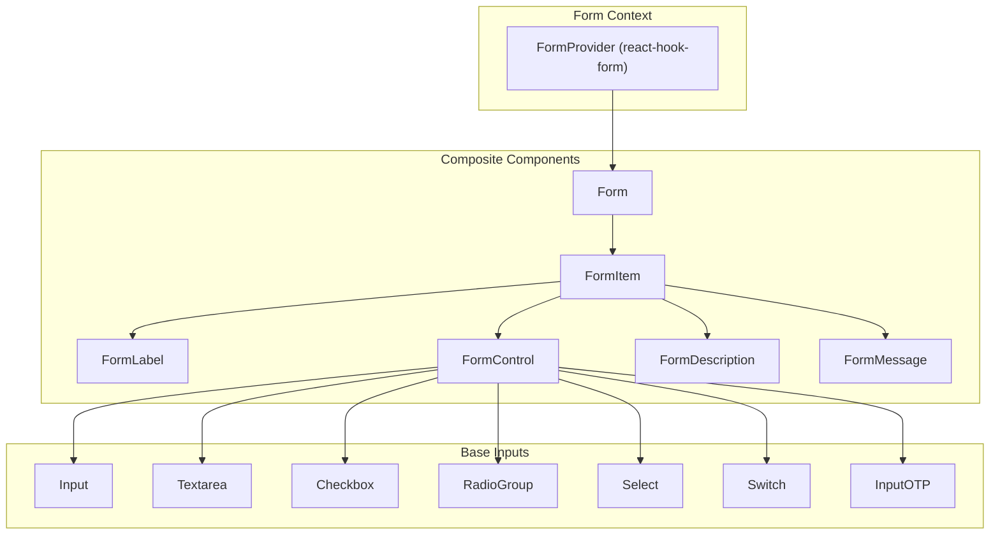
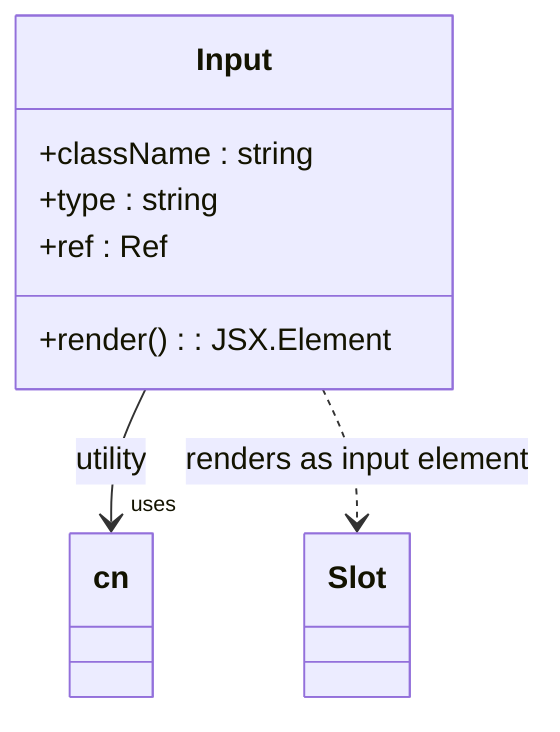
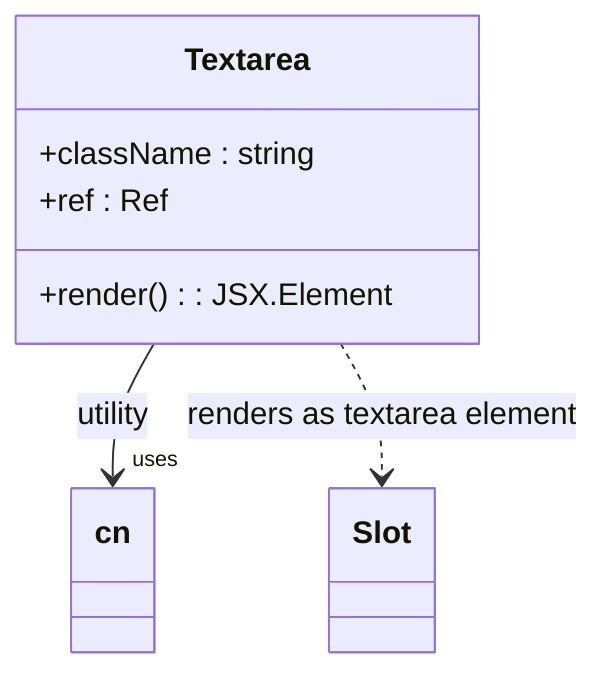
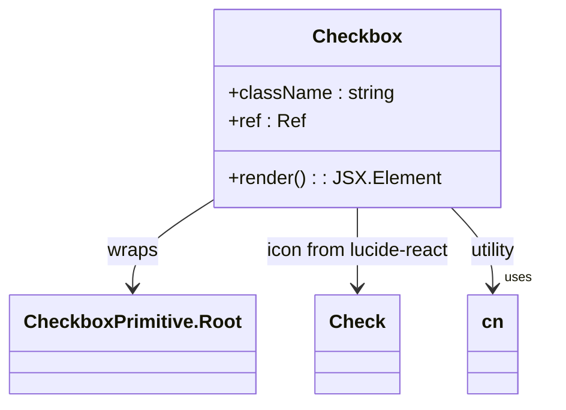
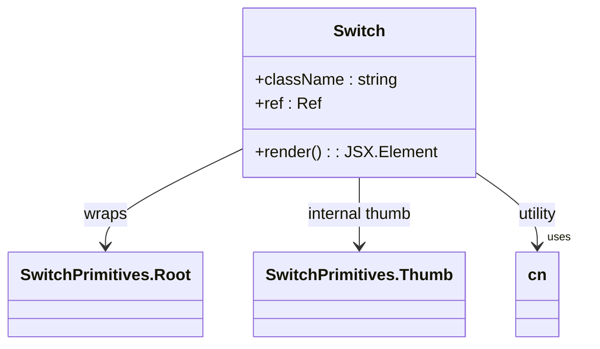
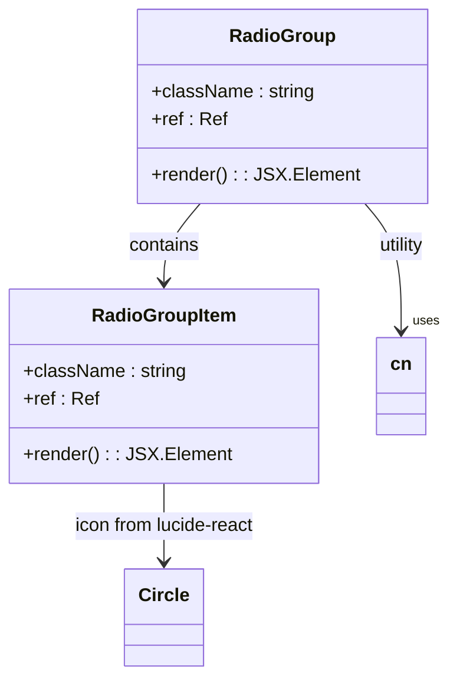
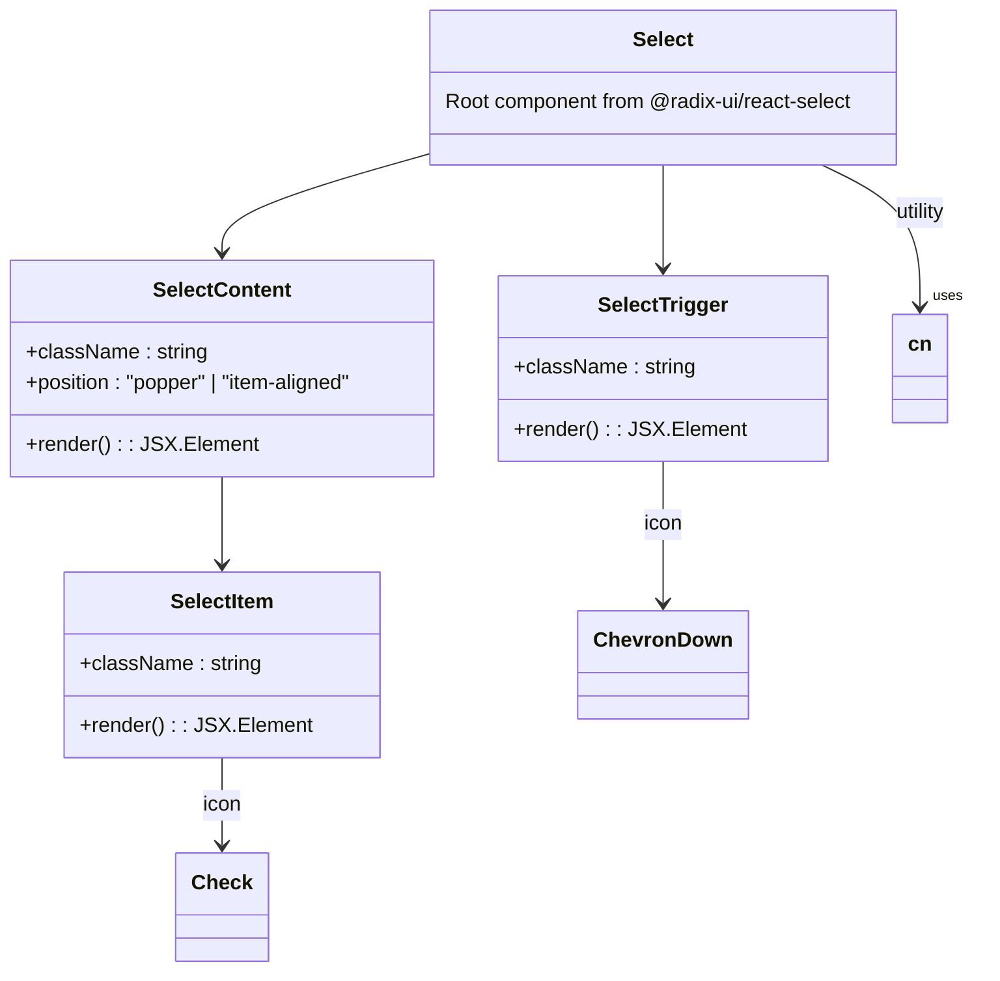
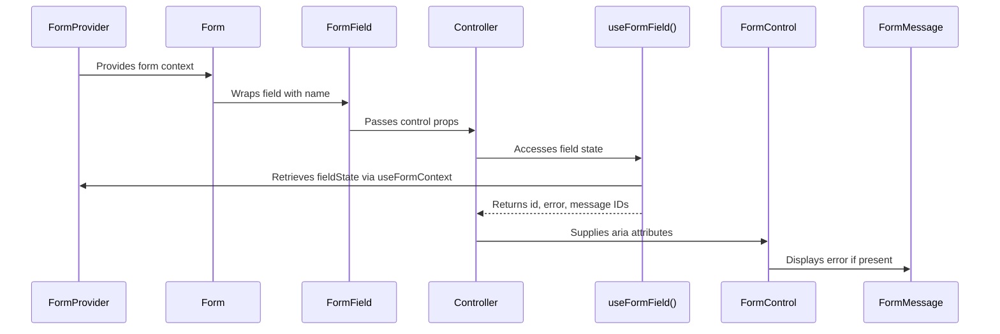

# Form Controls

<cite>
**Referenced Files in This Document**
- [form.tsx](file://src/components/ui/form.tsx)
- [input.tsx](file://src/components/ui/input.tsx)
- [textarea.tsx](file://src/components/ui/textarea.tsx)
- [checkbox.tsx](file://src/components/ui/checkbox.tsx)
- [radio-group.tsx](file://src/components/ui/radio-group.tsx)
- [select.tsx](file://src/components/ui/select.tsx)
- [switch.tsx](file://src/components/ui/switch.tsx)
- [input-otp.tsx](file://src/components/ui/input-otp.tsx)
- [label.tsx](file://src/components/ui/label.tsx)
</cite>

## Table of Contents
1. [Introduction](#introduction)
2. [Core Components](#core-components)
3. [Architecture Overview](#architecture-overview)
4. [Detailed Component Analysis](#detailed-component-analysis)
5. [Form Integration with react-hook-form](#form-integration-with-react-hook-form)
6. [Accessibility and UX Best Practices](#accessibility-and-ux-best-practices)
7. [Styling and Dark Mode Support](#styling-and-dark-mode-support)
8. [Performance Considerations](#performance-considerations)
9. [Troubleshooting Common Issues](#troubleshooting-common-issues)
10. [Conclusion](#conclusion)

## Introduction
This document provides comprehensive documentation for the form control components used in the shadcn/ui library within the portfolio project. It details the implementation, integration, and usage patterns of accessible form elements such as inputs, textareas, checkboxes, radio groups, selects, switches, and OTP inputs. The analysis includes how these components integrate with `react-hook-form` for validation, error handling, and state management, along with best practices for building user-friendly forms.

## Core Components
The form system is built using a collection of reusable UI components that follow consistent design principles and accessibility standards. These components are designed to work seamlessly together and provide a cohesive experience across different form types.

**Section sources**
- [form.tsx](file://src/components/ui/form.tsx#L1-L176)
- [input.tsx](file://src/components/ui/input.tsx#L1-L22)
- [textarea.tsx](file://src/components/ui/textarea.tsx#L1-L24)

## Architecture Overview
The form architecture leverages React's context API and composition model to create a structured, maintainable system for managing form state and rendering controls. At its core, it integrates `react-hook-form` for efficient state management while providing accessible wrappers around native HTML form elements.



**Diagram sources**
- [form.tsx](file://src/components/ui/form.tsx#L10-L176)
- [input.tsx](file://src/components/ui/input.tsx#L5-L22)

## Detailed Component Analysis

### Input and Textarea Components
These components provide styled, accessible text input fields with consistent styling and behavior.

#### Input Implementation


**Diagram sources**
- [input.tsx](file://src/components/ui/input.tsx#L5-L22)

#### Textarea Implementation


**Diagram sources**
- [textarea.tsx](file://src/components/ui/textarea.tsx#L7-L24)

**Section sources**
- [input.tsx](file://src/components/ui/input.tsx#L1-L22)
- [textarea.tsx](file://src/components/ui/textarea.tsx#L1-L24)

### Checkbox and Switch Components
Binary selection controls with visual feedback and accessibility support.

#### Checkbox Implementation


**Diagram sources**
- [checkbox.tsx](file://src/components/ui/checkbox.tsx#L8-L28)

#### Switch Implementation


**Diagram sources**
- [switch.tsx](file://src/components/ui/switch.tsx#L8-L27)

**Section sources**
- [checkbox.tsx](file://src/components/ui/checkbox.tsx#L1-L28)
- [switch.tsx](file://src/components/ui/switch.tsx#L1-L27)

### Selection Controls
Components for multiple choice selections including radio groups and select dropdowns.

#### Radio Group Implementation


**Diagram sources**
- [radio-group.tsx](file://src/components/ui/radio-group.tsx#L7-L42)

#### Select Implementation


**Diagram sources**
- [select.tsx](file://src/components/ui/select.tsx#L10-L158)

**Section sources**
- [radio-group.tsx](file://src/components/ui/radio-group.tsx#L1-L42)
- [select.tsx](file://src/components/ui/select.tsx#L1-L158)

### Specialized Input: OTP
One-time password input component with individual digit slots.

#### Input OTP Implementation
```mermaid
classDiagram
class InputOTP {
+containerClassName : string
+ref : Ref<OTPInput>
+render() : JSX.Element
}
class InputOTPGroup {
+className : string
+render() : JSX.Element
}
class InputOTPSlot {
+index : number
+className : string
+render() : JSX.Element
}
class InputOTPSeparator {
+render() : JSX.Element
}
InputOTP --> InputOTPGroup
InputOTPGroup --> InputOTPSlot
InputOTPGroup --> InputOTPSeparator
InputOTPSlot --> "uses" OTPInputContext
InputOTPSlot --> "animate-caret-blink" : visual indicator
```

**Diagram sources**
- [input-otp.tsx](file://src/components/ui/input-otp.tsx#L5-L69)

**Section sources**
- [input-otp.tsx](file://src/components/ui/input-otp.tsx#L1-L69)

## Form Integration with react-hook-form
The form system is tightly integrated with `react-hook-form` to provide efficient state management, validation, and error handling without unnecessary re-renders.

### Form Context Architecture


**Diagram sources**
- [form.tsx](file://src/components/ui/form.tsx#L10-L176)

### Validation and Error Flow
The validation process follows a unidirectional data flow where errors are automatically propagated through context:

1. Field value changes trigger validation
2. `useFormContext()` retrieves current field state
3. `useFormField()` extracts error status and message
4. `FormMessage` conditionally renders error content
5. `FormControl` updates ARIA attributes (`aria-invalid`, `aria-describedby`)

This creates an accessible experience where screen readers can announce validation errors immediately.

**Section sources**
- [form.tsx](file://src/components/ui/form.tsx#L30-L176)

## Accessibility and UX Best Practices
The form components prioritize accessibility through proper labeling, keyboard navigation, and ARIA attribute management.

### Label and Association System
Labels are properly associated with their controls using generated IDs:
- `FormLabel` uses `htmlFor={formItemId}`
- `FormControl` generates unique `id={formItemId}`
- Descriptions and messages are referenced via `aria-describedby`

This ensures assistive technologies can correctly associate labels and instructions with form controls.

### Usage Example: Complete Form Field
```tsx
<FormField
  control={form.control}
  name="email"
  render={({ field }) => (
    <FormItem>
      <FormLabel>Email</FormLabel>
      <FormControl>
        <Input placeholder="john@example.com" {...field} />
      </FormControl>
      <FormDescription>Your primary email address.</FormDescription>
      <FormMessage />
    </FormItem>
  )}
/>
```

**Section sources**
- [form.tsx](file://src/components/ui/form.tsx#L50-L176)
- [label.tsx](file://src/components/ui/label.tsx#L1-L24)

## Styling and Dark Mode Support
All components use Tailwind CSS with dynamic class composition for responsive design and theme adaptation.

### Styling Mechanism
Components leverage the `cn()` utility to merge:
- Base styles (size, spacing, borders)
- State variants (focus, disabled, checked)
- User-provided className overrides

Dark mode support is achieved through:
- CSS variables defined in `tailwind.config.ts`
- Theme-aware color classes (e.g., `bg-background`, `text-foreground`)
- Radix UI's data attributes for component states

**Section sources**
- [input.tsx](file://src/components/ui/input.tsx#L8-L22)
- [checkbox.tsx](file://src/components/ui/checkbox.tsx#L12-L28)
- [tailwind.config.ts](file://tailwind.config.ts)

## Performance Considerations
When handling large forms, consider these performance optimizations:

### Minimize Re-renders
- Use `shouldUnregister: true` when appropriate
- Leverage `mode: 'onBlur'` or `mode: 'onChange'` based on UX needs
- Avoid inline functions in render props

### Optimize Complex Forms
- Split large forms into tabs or steps
- Use `useController` for complex custom inputs
- Implement virtualization for long lists of options

The current implementation already benefits from `react-hook-form`'s uncontrolled component approach, which minimizes re-renders compared to controlled components.

**Section sources**
- [form.tsx](file://src/components/ui/form.tsx#L1-L176)
- [lib/utils.ts](file://src/lib/utils.ts)

## Troubleshooting Common Issues

### Uncontrolled to Controlled Warnings
Ensure consistent use of `defaultValue` vs `value`:
- Provide `defaultValue` in `useForm()` initialization
- Never directly set `value` on form fields
- Let `react-hook-form` manage the value via `field` prop

### Missing Validation Messages
Verify the component hierarchy:
- Must have `FormField` → `FormItem` → `FormMessage`
- Ensure `name` in `FormField` matches schema definition
- Check that validation rules are properly defined in schema

### Focus Management Issues
Use proper ref forwarding:
- All input components use `React.forwardRef`
- Ensure refs are correctly passed through HOCs
- Test keyboard navigation thoroughly

**Section sources**
- [form.tsx](file://src/components/ui/form.tsx#L80-L176)
- [input.tsx](file://src/components/ui/input.tsx#L5-L22)

## Conclusion
The shadcn/ui form components provide a robust, accessible foundation for building modern web forms. By combining `react-hook-form` for state management with carefully crafted UI components, the system delivers excellent developer experience and user accessibility. The consistent architecture allows for easy composition of complex forms while maintaining performance and usability standards. Following the documented patterns ensures reliable behavior across different input types and usage scenarios.