# Navigation Components

<cite>
**Referenced Files in This Document**
- [Navigation.tsx](file://src/components/layout/Navigation.tsx)
- [Navigation.module.css](file://src/components/layout/Navigation.module.css)
- [navigation-menu.tsx](file://src/components/ui/navigation-menu.tsx)
- [tabs.tsx](file://src/components/ui/tabs.tsx)
- [dropdown-menu.tsx](file://src/components/ui/dropdown-menu.tsx)
- [command.tsx](file://src/components/ui/command.tsx)
- [sidebar.tsx](file://src/components/ui/sidebar.tsx)
- [use-mobile.tsx](file://src/hooks/use-mobile.tsx)
</cite>

## Table of Contents
1. [Introduction](#introduction)
2. [Core Navigation Components](#core-navigation-components)
3. [Global Navigation System](#global-navigation-system)
4. [Contextual Navigation Patterns](#contextual-navigation-patterns)
5. [Accessibility Implementation](#accessibility-implementation)
6. [Responsive Design Strategies](#responsive-design-strategies)
7. [Integration and Composition](#integration-and-composition)
8. [Common Pitfalls and Solutions](#common-pitfalls-and-solutions)

## Introduction
This document provides comprehensive documentation for the navigation component suite in the portfolio application. The system comprises multiple interconnected components that support both global site navigation and contextual content organization. The architecture combines custom implementations with Radix UI primitives to create a cohesive navigation experience across desktop and mobile devices. Key features include scroll-spy functionality, keyboard accessibility, responsive adaptations, and seamless integration between different navigation patterns.

## Core Navigation Components

The navigation system consists of five primary component types that serve distinct purposes within the application:

- **NavigationMenu**: Top-level site section navigation with hierarchical capabilities
- **Tabs**: Content organization within individual pages
- **DropdownMenu and Menubar**: Hierarchical actions and context menus
- **Command**: Palette-style search interface for quick navigation
- **Sidebar**: Layout structuring and secondary navigation

These components are built using Radix UI primitives for accessibility and enhanced with Tailwind CSS for styling consistency. The system follows a modular design pattern where each component can be used independently or composed together for complex navigation scenarios.

**Section sources**
- [navigation-menu.tsx](file://src/components/ui/navigation-menu.tsx#L0-L127)
- [tabs.tsx](file://src/components/ui/tabs.tsx#L0-L53)
- [dropdown-menu.tsx](file://src/components/ui/dropdown-menu.tsx#L0-L198)
- [command.tsx](file://src/components/ui/command.tsx#L0-L153)
- [sidebar.tsx](file://src/components/ui/sidebar.tsx#L0-L761)

## Global Navigation System

### Main Navigation Component Architecture
The primary navigation system is implemented in the Navigation component, which serves as the global navigation bar for the portfolio. It features a responsive design that adapts from desktop menu to mobile hamburger menu at the 768px breakpoint.

```mermaid
classDiagram
class Navigation {
+navItems : Array{id : string, label : string}
-isOpen : boolean
-isAnimatingOut : boolean
-activeSection : string
-isScrolled : boolean
+calcActiveSection() : void
+scrollToSection(id : string) : void
+toggleMenu() : void
+closeMobileMenu() : void
}
class NavigationModuleCSS {
+nav : string
+scrolled : string
+notScrolled : string
+mobileNavEnter : string
+mobileNavLeave : string
+desktopNav : string
+menuToggleWrapper : string
}
Navigation --> NavigationModuleCSS : "uses styles"
Navigation --> Window : "listens to scroll/resize"
Navigation --> DOM : "manipulates --nav-height variable"
```

**Diagram sources**
- [Navigation.tsx](file://src/components/layout/Navigation.tsx#L0-L215)
- [Navigation.module.css](file://src/components/layout/Navigation.module.css#L0-L78)

### Scroll-Spy Functionality
The navigation system implements scroll-spy functionality to automatically highlight the current section as users navigate through the page. This is achieved through a combination of scroll event listeners and requestAnimationFrame for performance optimization.

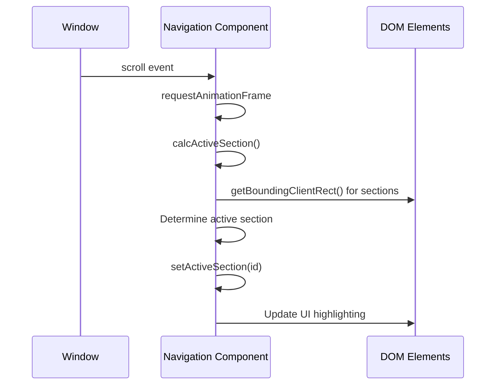

**Diagram sources**
- [Navigation.tsx](file://src/components/layout/Navigation.tsx#L50-L77)
- [Navigation.tsx](file://src/components/layout/Navigation.tsx#L76-L116)

### Dynamic Height Management
The navigation component dynamically updates a CSS variable (--nav-height) to ensure proper spacing for anchor links. This prevents content from being obscured by the fixed-position navigation bar when using fragment identifiers.

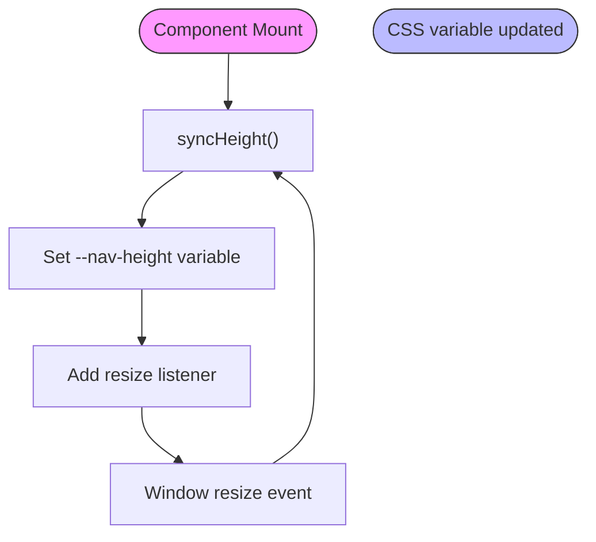

**Diagram sources**
- [Navigation.tsx](file://src/components/layout/Navigation.tsx#L24-L48)
- [Navigation.module.css](file://src/components/layout/Navigation.module.css#L0-L16)

**Section sources**
- [Navigation.tsx](file://src/components/layout/Navigation.tsx#L24-L48)
- [Navigation.module.css](file://src/components/layout/Navigation.module.css#L0-L16)

## Contextual Navigation Patterns

### Tab-Based Content Organization
The Tabs component provides a way to organize content within pages, allowing users to switch between different views without leaving the current page. Built on Radix UI's Tabs primitive, it ensures proper ARIA attributes and keyboard navigation.

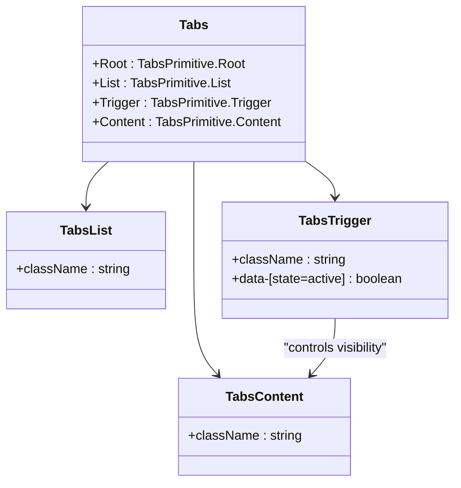

**Diagram sources**
- [tabs.tsx](file://src/components/ui/tabs.tsx#L0-L53)

### Hierarchical Action Menus
DropdownMenu and Menubar components provide hierarchical access to actions and navigation options. These components support nested submenus and various item types including checkboxes, radio groups, and separators.

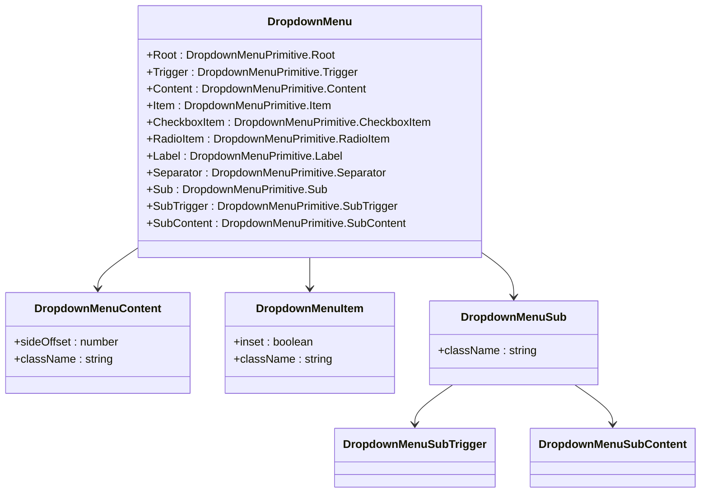

**Diagram sources**
- [dropdown-menu.tsx](file://src/components/ui/dropdown-menu.tsx#L0-L198)

### Command Palette Interface
The Command component implements a Spotlight-like interface for quick navigation and action execution. It can be triggered globally and provides fuzzy search capabilities for finding content or executing commands.

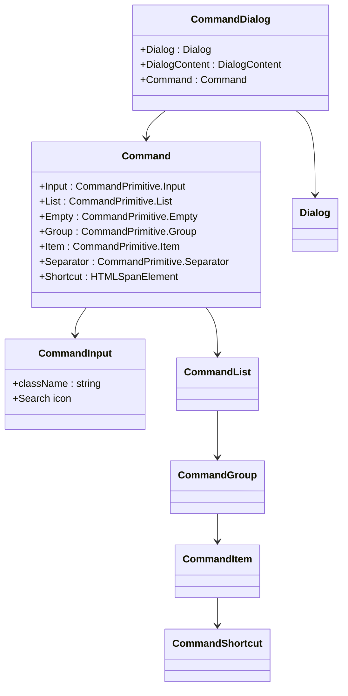

**Diagram sources**
- [command.tsx](file://src/components/ui/command.tsx#L0-L153)

**Section sources**
- [tabs.tsx](file://src/components/ui/tabs.tsx#L0-L53)
- [dropdown-menu.tsx](file://src/components/ui/dropdown-menu.tsx#L0-L198)
- [command.tsx](file://src/components/ui/command.tsx#L0-L153)

## Accessibility Implementation

### Keyboard Navigation Support
All navigation components implement comprehensive keyboard accessibility following WAI-ARIA best practices. The main navigation supports arrow key navigation, Enter/Space for activation, and Escape to close menus.

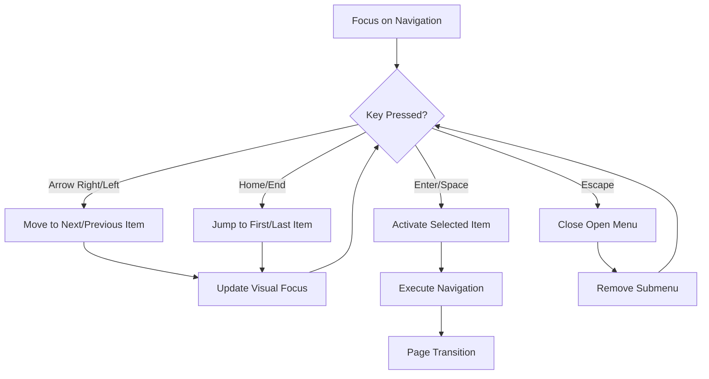

**Diagram sources**
- [navigation-menu.tsx](file://src/components/ui/navigation-menu.tsx#L40-L62)
- [dropdown-menu.tsx](file://src/components/ui/dropdown-menu.tsx#L35-L198)

### Screen Reader Compatibility
The navigation components include appropriate ARIA attributes to ensure screen reader compatibility. Landmark roles, labels, and state information are provided to assistive technologies.

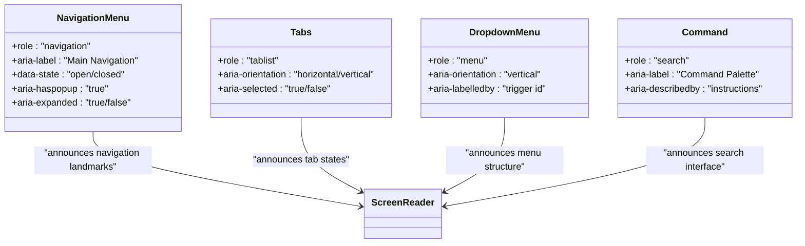

**Diagram sources**
- [navigation-menu.tsx](file://src/components/ui/navigation-menu.tsx#L0-L127)
- [tabs.tsx](file://src/components/ui/tabs.tsx#L0-L53)
- [dropdown-menu.tsx](file://src/components/ui/dropdown-menu.tsx#L0-L198)
- [command.tsx](file://src/components/ui/command.tsx#L0-L153)

**Section sources**
- [navigation-menu.tsx](file://src/components/ui/navigation-menu.tsx#L0-L127)
- [tabs.tsx](file://src/components/ui/tabs.tsx#L0-L53)
- [dropdown-menu.tsx](file://src/components/ui/dropdown-menu.tsx#L0-L198)
- [command.tsx](file://src/components/ui/command.tsx#L0-L153)

## Responsive Design Strategies

### Mobile Adaptation System
The navigation system uses a mobile-first approach with breakpoints defined at 768px. The useIsMobile hook determines the current device type and triggers appropriate layout changes.

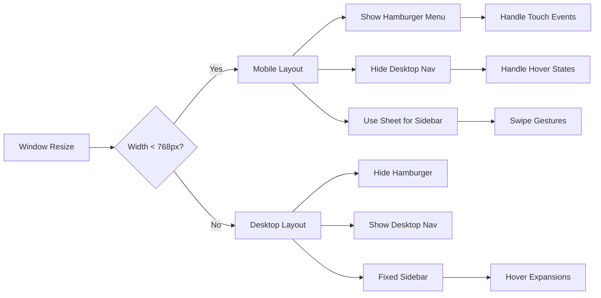

**Diagram sources**
- [use-mobile.tsx](file://src/hooks/use-mobile.tsx#L0-L18)
- [Navigation.tsx](file://src/components/layout/Navigation.tsx#L0-L215)
- [sidebar.tsx](file://src/components/ui/sidebar.tsx#L44-L175)

### Sidebar Responsive Behavior
The Sidebar component implements multiple responsive behaviors including off-canvas sliding on mobile and collapsible/icon modes on desktop.

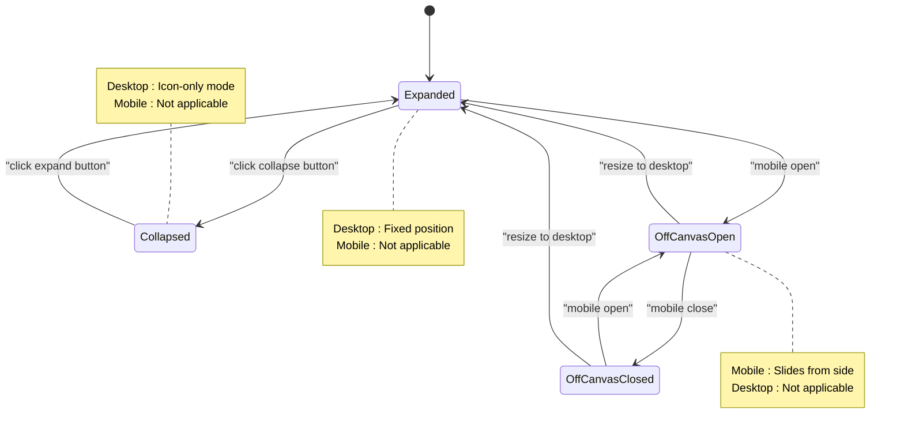

**Diagram sources**
- [sidebar.tsx](file://src/components/ui/sidebar.tsx#L44-L175)

**Section sources**
- [use-mobile.tsx](file://src/hooks/use-mobile.tsx#L0-L18)
- [Navigation.tsx](file://src/components/layout/Navigation.tsx#L0-L215)
- [sidebar.tsx](file://src/components/ui/sidebar.tsx#L44-L175)

## Integration and Composition

### Main Navigation Integration
The Navigation component integrates with the main application layout, providing seamless navigation between portfolio sections. It coordinates with the scroll-spy system to maintain accurate section tracking.

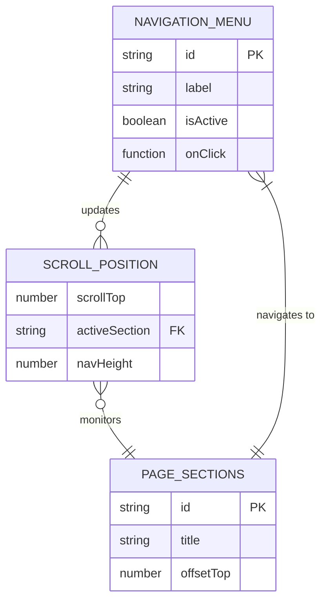

**Section sources**
- [Navigation.tsx](file://src/components/layout/Navigation.tsx#L118-L145)
- [Navigation.tsx](file://src/components/layout/Navigation.tsx#L147-L180)

### Component Composition Patterns
Navigation components can be composed together to create complex navigation structures. Common patterns include sidebar navigation with collapsible groups and top navigation with dropdown menus.

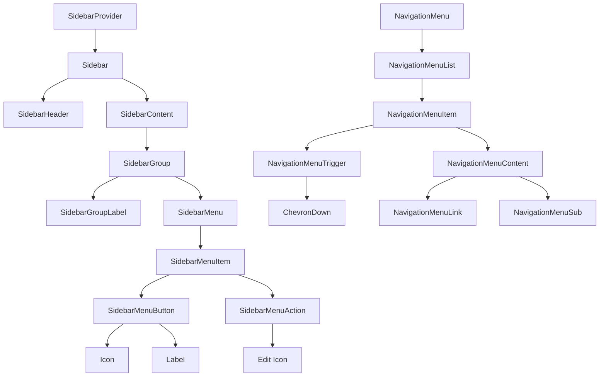

**Diagram sources**
- [sidebar.tsx](file://src/components/ui/sidebar.tsx#L428-L509)
- [navigation-menu.tsx](file://src/components/ui/navigation-menu.tsx#L0-L127)

**Section sources**
- [sidebar.tsx](file://src/components/ui/sidebar.tsx#L428-L703)
- [navigation-menu.tsx](file://src/components/ui/navigation-menu.tsx#L0-L127)

## Common Pitfalls and Solutions

### Event Propagation Issues
A common issue in navigation components is unintended event propagation, particularly with nested interactive elements. The system addresses this through careful event handling and stopPropagation calls where necessary.

```mermaid
flowchart TD
A[User Clicks Menu Item] --> B{Event Propagates?}
B --> |Yes| C[Parent Handler Executes]
C --> D[Unintended Behavior]
B --> |No| E[Only Intended Action]
E --> F[Smooth Navigation]
G[Solution] --> H[Stop Propagation]
H --> I[event.stopPropagation()]
I --> J[Prevent Parent Handling]
J --> E
```

**Section sources**
- [Navigation.tsx](file://src/components/layout/Navigation.tsx#L118-L145)
- [sidebar.tsx](file://src/components/ui/sidebar.tsx#L592-L621)

### Focus Management Challenges
Maintaining proper focus order in dynamic navigation interfaces can be challenging, especially with animated entrances and exits. The system implements focus trapping and restoration to ensure keyboard accessibility.

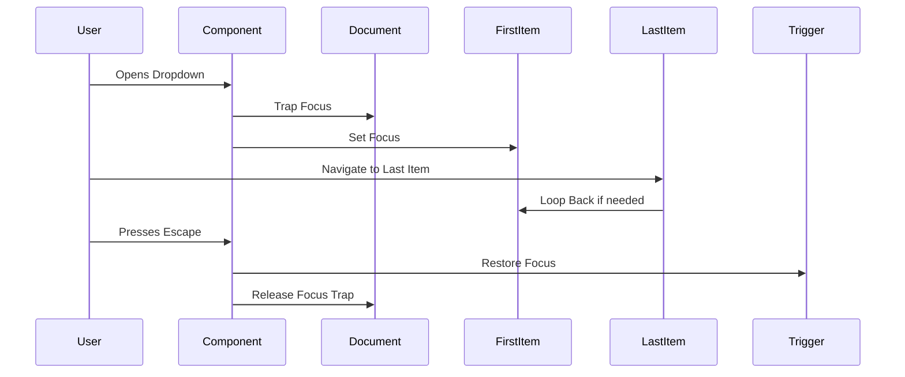

**Section sources**
- [dropdown-menu.tsx](file://src/components/ui/dropdown-menu.tsx#L35-L198)
- [command.tsx](file://src/components/ui/command.tsx#L35-L153)