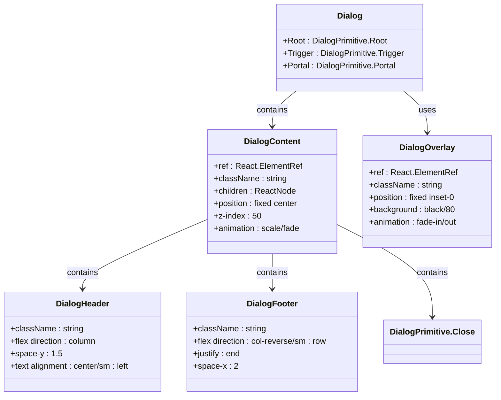
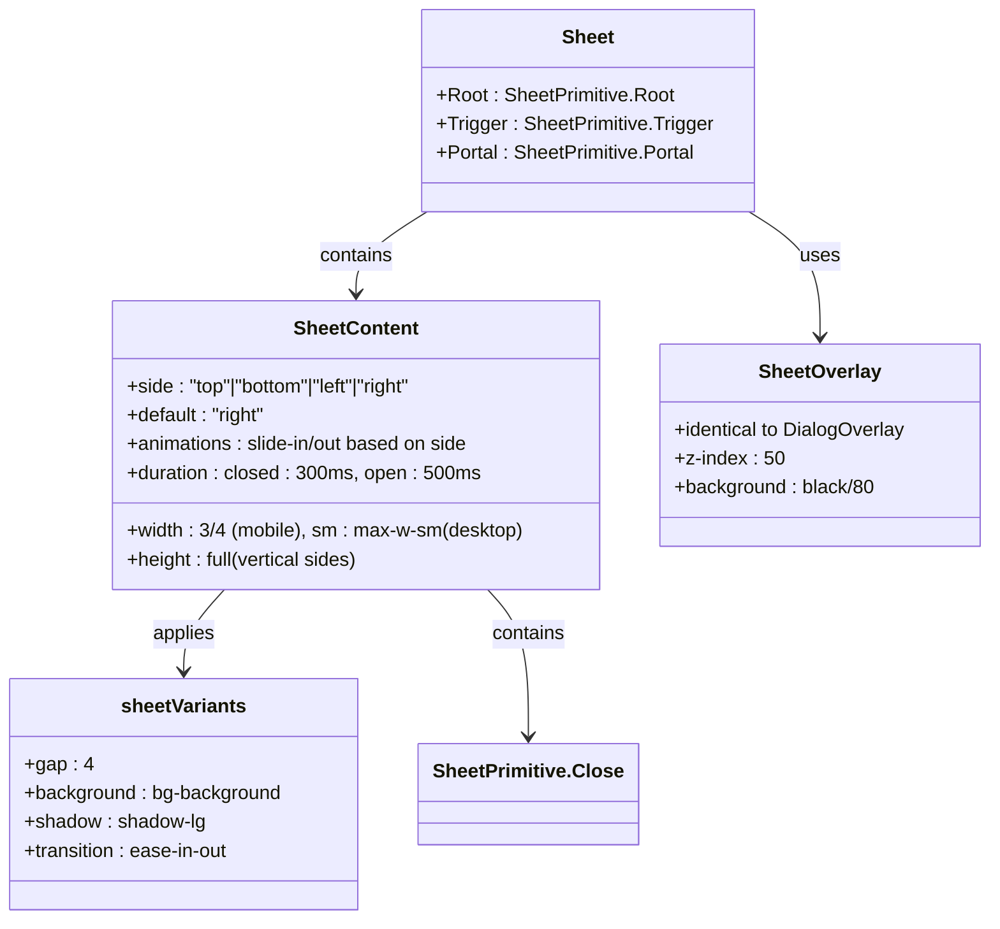
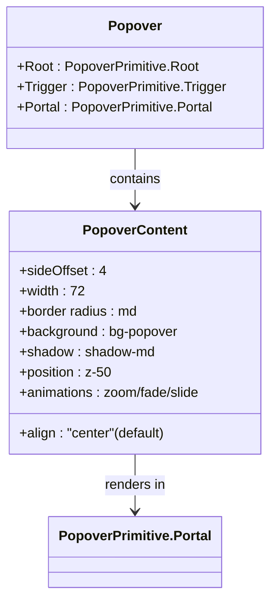
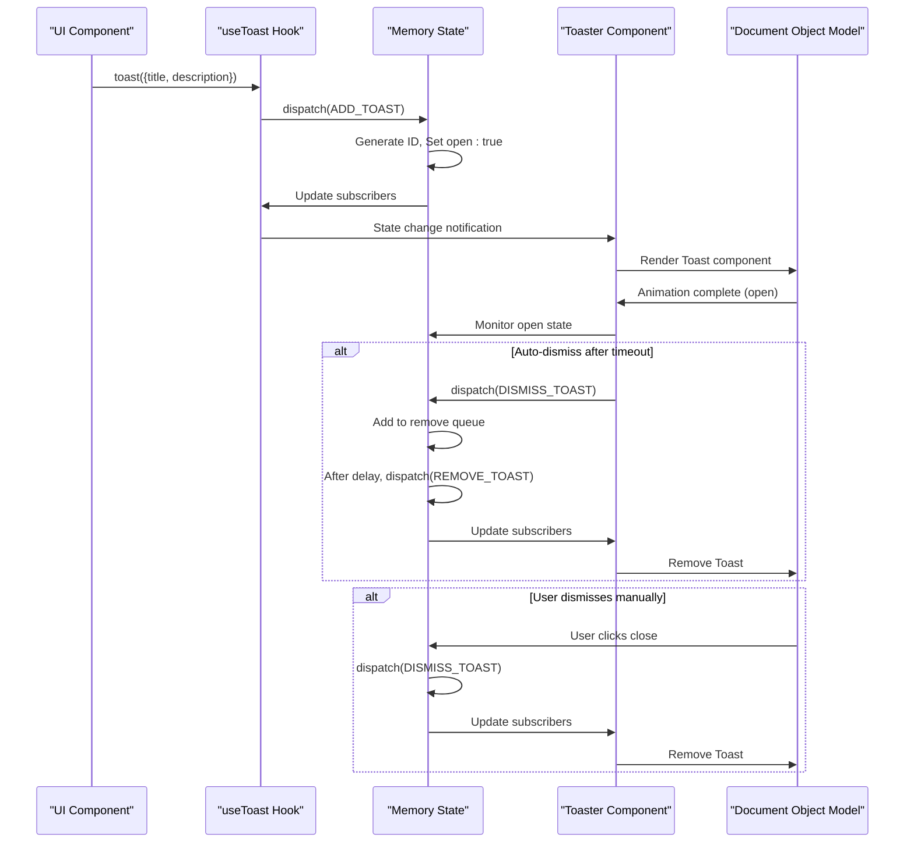
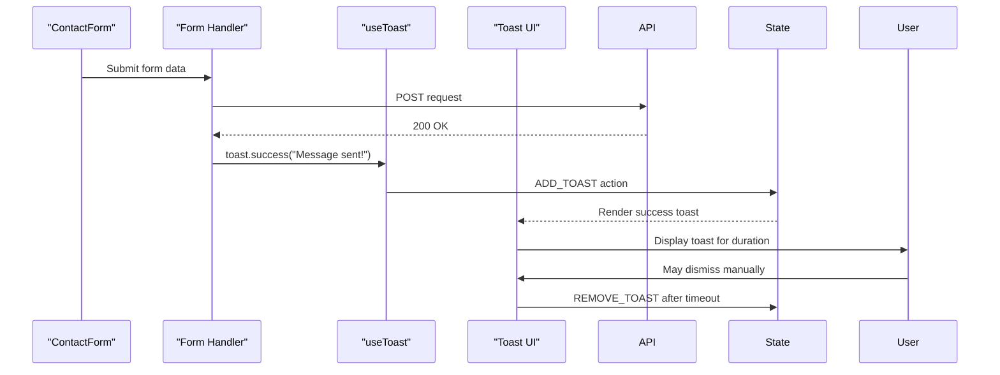
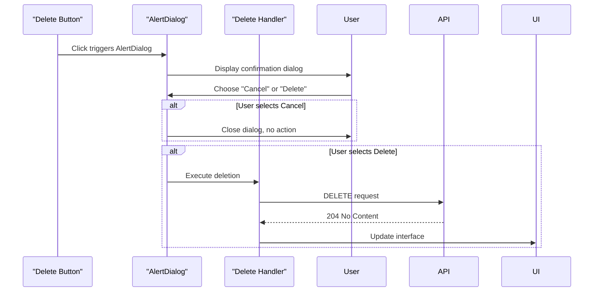

# Overlays and Modals

<cite>
**Referenced Files in This Document **   
- [dialog.tsx](file://src/components/ui/dialog.tsx)
- [sheet.tsx](file://src/components/ui/sheet.tsx)
- [popover.tsx](file://src/components/ui/popover.tsx)
- [alert-dialog.tsx](file://src/components/ui/alert-dialog.tsx)
- [sonner.tsx](file://src/components/ui/sonner.tsx)
- [toast.tsx](file://src/components/ui/toast.tsx)
- [toaster.tsx](file://src/components/ui/toaster.tsx)
- [use-toast.ts](file://src/hooks/use-toast.ts)
- [App.tsx](file://src/App.tsx)
</cite>

## Table of Contents
1. [Introduction](#introduction)
2. [Core Overlay Components](#core-overlay-components)
3. [Accessibility and User Interaction](#accessibility-and-user-interaction)
4. [Toast Notification System](#toast-notification-system)
5. [Z-Index Management and Stacking Context](#z-index-management-and-stacking-context)
6. [Responsive Behavior Across Devices](#responsive-behavior-across-devices)
7. [Theming and Animation Customization](#theming-and-animation-customization)
8. [Performance Optimization](#performance-optimization)
9. [Practical Implementation Examples](#practical-implementation-examples)
10. [Conclusion](#conclusion)

## Introduction
This document provides comprehensive documentation for the overlay and modal components within the application, including Dialog, Sheet, Popover, AlertDialog, and Toast notifications. These components play a critical role in user interaction by providing contextual information, collecting user input, and delivering feedback without disrupting the primary user flow. The implementation leverages Radix UI primitives for robust accessibility features and predictable behavior, while integrating Sonner for toast notifications with theming support through Next Themes. The components are designed with responsive behavior in mind, ensuring optimal user experience across various device sizes and input methods.

## Core Overlay Components

The application implements several overlay components that share common architectural patterns while serving distinct user experience purposes. All components utilize portals for proper DOM structure and maintain consistent styling through utility classes.

### Dialog Component
The Dialog component provides a traditional modal interface for focused user interactions. It is implemented using Radix UI's Dialog primitive with custom styling and positioning logic.



**Diagram sources**
- [dialog.tsx](file://src/components/ui/dialog.tsx#L0-L120)

**Section sources**
- [dialog.tsx](file://src/components/ui/dialog.tsx#L0-L120)

### Sheet Component
The Sheet component provides a sliding panel interface that can appear from any edge of the screen. It extends the same Radix UI Dialog primitive as Dialog but with different positioning and animation characteristics based on the specified side.



**Diagram sources**
- [sheet.tsx](file://src/components/ui/sheet.tsx#L0-L130)

**Section sources**
- [sheet.tsx](file://src/components/ui/sheet.tsx#L0-L130)

### Popover Component
The Popover component creates a floating panel that appears near its trigger element, typically used for contextual menus or additional information. Unlike modals, popovers do not block interaction with the rest of the page.



**Diagram sources**
- [popover.tsx](file://src/components/ui/popover.tsx#L0-L29)

**Section sources**
- [popover.tsx](file://src/components/ui/popover.tsx#L0-L29)

### AlertDialog Component
The AlertDialog component is a specialized dialog for important confirmations or alerts that require user acknowledgment. It follows accessibility guidelines for alert dialogs and includes dedicated action and cancel buttons with appropriate styling.

```mermaid
classDiagram
class AlertDialog {
+Root : AlertDialogPrimitive.Root
+Trigger : AlertDialogPrimitive.Trigger
+Portal : AlertDialogPrimitive.Portal
}
class AlertDialogContent {
+identical positioning to Dialog
+centered modal
+max-width : lg
+animations : scale/fade/slide
}
class AlertDialogAction {
+applies buttonVariants()
+primary action styling
}
class AlertDialogCancel {
+applies buttonVariants({ variant : "outline" })
+margin-top : 2 (mobile), 0 (desktop)
}
AlertDialog --> AlertDialogContent : contains
AlertDialogContent --> AlertDialogAction : contains
AlertDialogContent --> AlertDialogCancel : contains
AlertDialogContent --> AlertDialogOverlay : uses
```

**Diagram sources**
- [alert-dialog.tsx](file://src/components/ui/alert-dialog.tsx#L0-L139)

**Section sources**
- [alert-dialog.tsx](file://src/components/ui/alert-dialog.tsx#L0-L139)

## Accessibility and User Interaction

All overlay components implement comprehensive accessibility features following WAI-ARIA guidelines to ensure usability for all users, including those relying on assistive technologies.

### ARIA Roles and Semantics
Each component utilizes appropriate ARIA roles to convey its purpose to screen readers:
- **Dialog**: Implements `role="dialog"` with `aria-modal="true"` to indicate a modal window that blocks interaction with the rest of the page
- **AlertDialog**: Uses `role="alertdialog"` to indicate a high-priority alert that requires user response
- **Popover**: Applies `role="dialog"` but functions more like a tooltip or menu depending on context
- **Sheet**: Functions as `role="dialog"` when active, with orientation-specific semantics based on slide direction

The components automatically manage focus trapping, ensuring keyboard navigation remains within the overlay until dismissed. When an overlay opens, focus is programmatically moved to the first interactive element (typically the close button or primary action), and the tab order cycles within the overlay content.

### Keyboard Navigation
All overlays support standard keyboard interactions:
- **Escape key**: Closes the overlay and returns focus to the triggering element
- **Tab/Shift+Tab**: Cycles through interactive elements within the overlay with proper focus trapping
- **Enter/Space**: Activates the currently focused button or control
- **Click outside**: Dismisses the overlay (configurable per component)

The implementation ensures that screen reader users receive appropriate announcements when overlays open and close, with proper labeling through title and description elements that are referenced via `aria-labelledby` and `aria-describedby` attributes.

**Section sources**
- [dialog.tsx](file://src/components/ui/dialog.tsx#L0-L120)
- [sheet.tsx](file://src/components/ui/sheet.tsx#L0-L130)
- [popover.tsx](file://src/components/ui/popover.tsx#L0-L29)
- [alert-dialog.tsx](file://src/components/ui/alert-dialog.tsx#L0-L139)

## Toast Notification System

The application implements a robust toast notification system using both Radix UI's Toast primitive and Sonner for enhanced theming capabilities, providing users with timely feedback about application events.

### Architecture Overview
The toast system follows a publish-subscribe pattern where components can programmatically trigger notifications that are then managed by a central state system.



**Diagram sources**
- [use-toast.ts](file://src/hooks/use-toast.ts#L0-L191)
- [toaster.tsx](file://src/components/ui/toaster.tsx#L0-L33)
- [toast.tsx](file://src/components/ui/toast.tsx#L0-L127)

### useToast Hook Implementation
The `useToast` hook provides the primary API for programmatically triggering toast notifications throughout the application. It maintains a global state of active toasts and provides methods for adding, updating, and dismissing notifications.

```mermaid
classDiagram
class useToast {
+state : { toasts : ToasterToast[] }
+listeners : Array<(state) => void>
+memoryState : State (singleton)
+toast() : function
+dismiss() : function
+reducer() : function
}
class Toast {
+id : string
+title? : React.ReactNode
+description? : React.ReactNode
+action? : ToastActionElement
+variant? : "default"|"destructive"
+duration? : number
+onOpenChange? : (open) => void
}
class ToastOptions {
+TOAST_LIMIT : 1
+TOAST_REMOVE_DELAY : 1000000ms
+toastTimeouts : Map<string, Timeout>
}
useToast --> Toast : manages
useToast --> ToastOptions : uses constants
useToast --> memoryState : reads/writes
useToast --> listeners : notifies on change
```

The hook uses a singleton pattern with `memoryState` to maintain toast state across component re-renders, ensuring notifications persist even when components unmount. The `dispatch` function updates the state and notifies all subscribers (components using the hook) of changes.

**Section sources**
- [use-toast.ts](file://src/hooks/use-toast.ts#L0-L191)

### Sonner Integration
The application integrates Sonner alongside the Radix UI toast system to provide enhanced theming capabilities that respond to the user's preferred color scheme.

```mermaid
classDiagram
class SonnerToaster {
+theme : "system" (from useTheme)
+className : "toaster group"
+toastOptions : { classNames : {...} }
}
class ThemeIntegration {
+useTheme() : hook from next-themes
+theme : "light"|"dark"|"system"
+propagates theme to Sonner
}
class ClassNames {
+toast : group-[.toaster] : bg-background, etc.
+description : group-[.toast] : text-muted-foreground
+actionButton : group-[.toast] : bg-primary
+cancelButton : group-[.toast] : bg-muted
}
ThemeIntegration --> SonnerToaster : provides theme
SonnerToaster --> ClassNames : applies styling
SonnerToaster --> App.tsx : rendered in app root
```

The Sonner implementation in `sonner.tsx` wraps the Sonner library's Toaster component with theme-aware styling that automatically adapts to the application's current theme, ensuring visual consistency across light and dark modes.

**Diagram sources**
- [sonner.tsx](file://src/components/ui/sonner.tsx#L0-L29)
- [App.tsx](file://src/App.tsx#L0-L26)

## Z-Index Management and Stacking Context

The overlay components implement a deliberate stacking context strategy to ensure proper layering and prevent visual conflicts between multiple overlays.

### Z-Index Hierarchy
The application establishes a clear z-index hierarchy:
- **Toast Viewport**: `z-[100]` - Highest priority to ensure notifications appear above all other content
- **Overlay Components**: `z-50` - Consistent level for dialogs, sheets, popovers, and alert dialogs
- **Backdrop Elements**: Share the same `z-50` level as their corresponding content, positioned behind through DOM ordering
- **Regular Content**: Default stacking context (`z-auto`) or explicitly set lower values

This hierarchy ensures that toast notifications remain visible even when other overlays are active, while maintaining consistent behavior among modal-type components.

### Backdrop Interactions
All modal components (Dialog, Sheet, AlertDialog) include backdrop overlays that serve multiple purposes:
- Visual dimming of background content to focus attention on the overlay
- Click-to-dismiss functionality that closes the overlay when clicking outside
- Touch event handling for mobile devices
- Proper pointer event management to prevent interaction with underlying content

The backdrops use CSS transitions with `data-[state]` attributes to animate opacity changes, providing smooth entry and exit effects that enhance the user experience.

**Section sources**
- [dialog.tsx](file://src/components/ui/dialog.tsx#L0-L120)
- [sheet.tsx](file://src/components/ui/sheet.tsx#L0-L130)
- [alert-dialog.tsx](file://src/components/ui/alert-dialog.tsx#L0-L139)
- [toast.tsx](file://src/components/ui/toast.tsx#L0-L127)

## Responsive Behavior Across Devices

The overlay components are designed with responsive behavior to provide an optimal user experience across different screen sizes and device types.

### Mobile Adaptations
On smaller screens, several components adjust their presentation:
- **Dialog**: Uses full width with centered positioning, scaling animation from 95% to 100%
- **Sheet**: Defaults to 3/4 width on mobile, expanding to `sm:max-w-sm` on larger screens
- **Toast**: Renders in a bottom stack on desktop (`sm:bottom-0`) but top-aligned on mobile (`top-0`)
- **Popover**: Maintains 72 width but adjusts positioning based on available space

The components leverage Tailwind's breakpoint system (prefixes like `sm:`, `md:`) to apply different styles at various screen widths, ensuring touch targets are appropriately sized and content is readable without excessive scrolling.

### Device-Specific Animations
Animations are tailored to device capabilities and user expectations:
- **Mobile**: Emphasizes slide animations (especially for Sheet) which align with native mobile UI patterns
- **Desktop**: Uses more subtle fade and scale effects that feel natural in a mouse-driven environment
- **All Devices**: Includes `data-[state]` attributes that trigger appropriate animations (`data-[state=open]:animate-in`, `data-[state=closed]:animate-out`)

The transition durations are also optimized, with slightly longer animations for opening states (500ms) compared to closing states (300ms) to provide a more satisfying user experience.

**Section sources**
- [dialog.tsx](file://src/components/ui/dialog.tsx#L0-L120)
- [sheet.tsx](file://src/components/ui/sheet.tsx#L0-L130)
- [popover.tsx](file://src/components/ui/popover.tsx#L0-L29)
- [toast.tsx](file://src/components/ui/toast.tsx#L0-L127)

## Theming and Animation Customization

The overlay components support extensive customization through CSS classes and configuration options, allowing for brand-consistent styling while maintaining functional integrity.

### Theme Integration
The components integrate with the application's theme system through several mechanisms:
- **CSS Variables**: Utilize semantic class names that reference design tokens (`bg-background`, `text-foreground`, `border-border`)
- **Next Themes**: Sonner integration reads the current theme setting and applies appropriate styling
- **Dark Mode Support**: All color references are defined in terms of semantic roles rather than fixed colors, enabling seamless light/dark mode switching

The `cn()` utility function combines base styles with custom className props, allowing developers to override specific aspects while preserving core functionality.

### Animation System
The components leverage a data-state-driven animation system:
- **State Attributes**: Use `data-[state=open]` and `data-[state=closed]` to trigger different animation states
- **Tailwind Animations**: Apply predefined animation classes like `animate-in`, `fade-in-0`, `zoom-in-95`
- **Transform Transitions**: Use `translate-x-[-50%]` and `translate-y-[-50%]` for precise centering with smooth transitions
- **Duration Control**: Specify `duration-200` for consistent timing across related animations

Developers can customize animations by overriding the className prop with alternative Tailwind animation utilities or by defining custom CSS animations that respond to the same data attributes.

**Section sources**
- [dialog.tsx](file://src/components/ui/dialog.tsx#L0-L120)
- [sheet.tsx](file://src/components/ui/sheet.tsx#L0-L130)
- [sonner.tsx](file://src/components/ui/sonner.tsx#L0-L29)
- [toast.tsx](file://src/components/ui/toast.tsx#L0-L127)

## Performance Optimization

The overlay components implement several performance optimizations to ensure smooth rendering and minimal impact on application responsiveness.

### Rendering Efficiency
- **Portals**: Use React portals to render overlays at the document body level, preventing layout thrashing in complex component trees
- **Memoization**: Leverage React.forwardRef and implicit memoization of component definitions to prevent unnecessary re-renders
- **Conditional Rendering**: Only render overlay content when active, using the open/closed state to control visibility
- **Event Delegation**: Centralize state management in hooks like `useToast` to minimize re-renders across multiple components

### Memory Management
The toast system includes specific optimizations for memory usage:
- **Toast Limit**: Enforces `TOAST_LIMIT = 1` to prevent accumulation of notifications
- **Cleanup Queue**: Uses `addToRemoveQueue` with setTimeout to ensure proper cleanup of dismissed toasts
- **Singleton State**: Maintains toast state in a module-level `memoryState` rather than component state to survive remounts
- **Listener Management**: Properly cleans up state listeners in useEffect cleanup functions to prevent memory leaks

These optimizations ensure that even with frequent toast notifications, the application maintains stable performance and memory usage over extended periods.

**Section sources**
- [use-toast.ts](file://src/hooks/use-toast.ts#L0-L191)
- [toaster.tsx](file://src/components/ui/toaster.tsx#L0-L33)

## Practical Implementation Examples

### Contact Form Success Messages
The toast system is used to provide feedback after form submissions, such as confirming successful contact form submission:



This pattern provides immediate feedback to users without requiring page navigation or modal interruptions, enhancing the overall user experience.

### Confirmation Dialogs
AlertDialog is used for critical actions that require user confirmation, such as deleting content or making irreversible changes:



This implementation ensures that destructive actions cannot be performed accidentally, providing a safety mechanism that aligns with user expectations for data protection.

**Section sources**
- [use-toast.ts](file://src/hooks/use-toast.ts#L0-L191)
- [alert-dialog.tsx](file://src/components/ui/alert-dialog.tsx#L0-L139)
- [toaster.tsx](file://src/components/ui/toaster.tsx#L0-L33)

## Conclusion
The overlay and modal components in this application provide a comprehensive system for managing user interactions that require focused attention or temporary context. By leveraging Radix UI primitives, the implementation ensures robust accessibility, consistent behavior, and adherence to web standards. The toast notification system, enhanced with Sonner, delivers timely feedback with theming support that adapts to user preferences. Through careful attention to z-index management, responsive design, and performance optimization, these components create a cohesive user experience that works seamlessly across devices and usage scenarios. Developers can confidently use these components knowing they follow best practices for accessibility, internationalization, and maintainability.