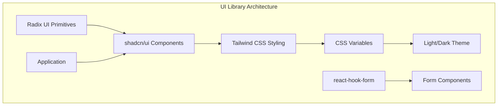
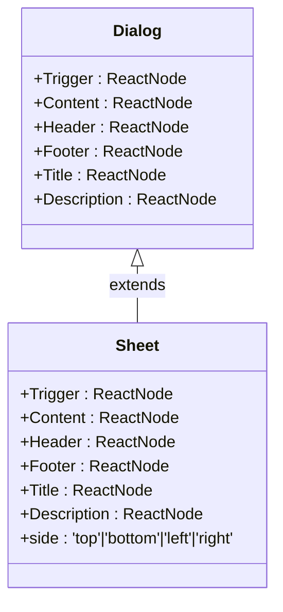
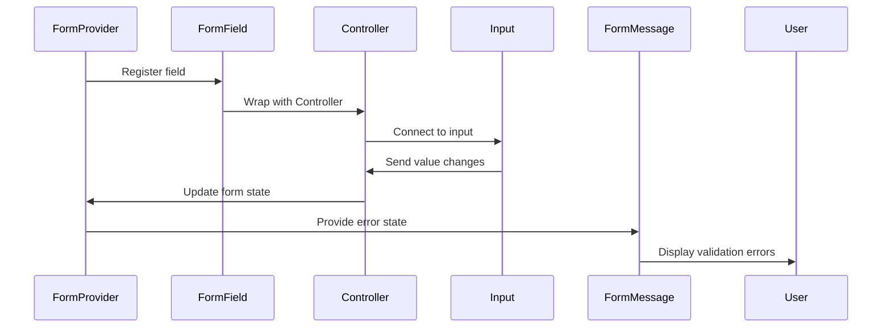
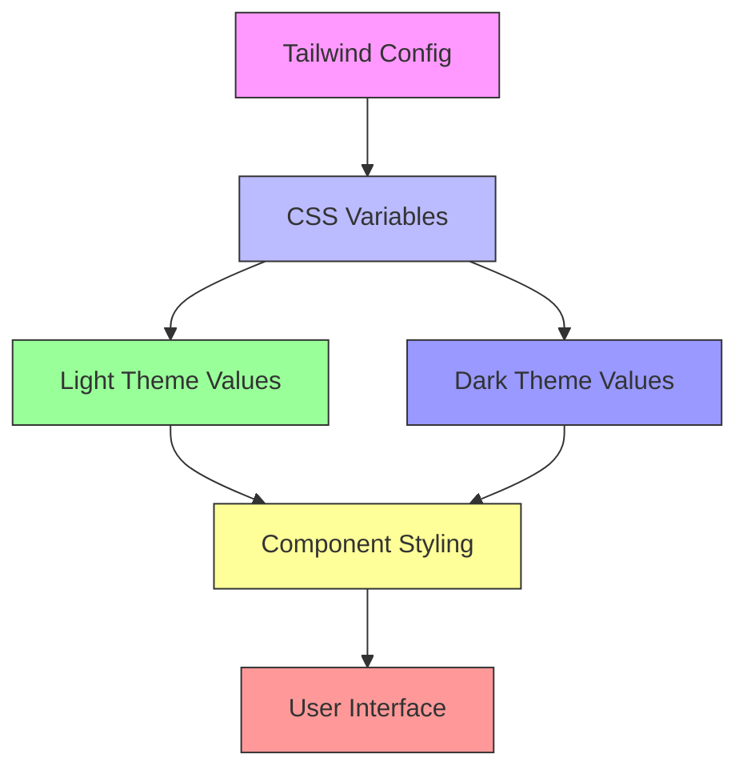

# UI Library Components

<cite>
**Referenced Files in This Document**   
- [button.tsx](file://src/components/ui/button.tsx)
- [card.tsx](file://src/components/ui/card.tsx)
- [dialog.tsx](file://src/components/ui/dialog.tsx)
- [sheet.tsx](file://src/components/ui/sheet.tsx)
- [navigation-menu.tsx](file://src/components/ui/navigation-menu.tsx)
- [alert.tsx](file://src/components/ui/alert.tsx)
- [form.tsx](file://src/components/ui/form.tsx)
- [accordion.tsx](file://src/components/ui/accordion.tsx)
- [tabs.tsx](file://src/components/ui/tabs.tsx)
- [input.tsx](file://src/components/ui/input.tsx)
- [tailwind.config.ts](file://tailwind.config.ts)
- [index.css](file://src/index.css)
- [components.json](file://components.json)
- [utils.ts](file://src/lib/utils.ts)
</cite>

## Table of Contents
1. [Introduction](#introduction)
2. [Design System Overview](#design-system-overview)
3. [Core Component Primitives](#core-component-primitives)
4. [Form Handling and Validation](#form-handling-and-validation)
5. [State Management for Interactive Components](#state-management-for-interactive-components)
6. [Theming and Dark Mode Support](#theming-and-dark-mode-support)
7. [Component Composition and Extension](#component-composition-and-extension)
8. [Accessibility and Responsiveness](#accessibility-and-responsiveness)
9. [Migration and Best Practices](#migration-and-best-practices)
10. [Conclusion](#conclusion)

## Introduction

This document provides comprehensive documentation for the shadcn/ui-based component library used throughout the application. The library serves as the foundation for consistent, accessible, and responsive user interface development across all pages and features. Built on top of Radix UI primitives and enhanced with Tailwind CSS, these components ensure design consistency while providing flexibility for customization.

The component library includes essential UI elements such as buttons, cards, forms, dialogs, sheets, navigation menus, and alerts. Each component is designed with accessibility (WCAG) compliance, responsiveness, and developer experience in mind. The integration with react-hook-form through form.tsx enables robust form handling, while CSS variables and Tailwind configuration support theming and dark mode capabilities.

**Section sources**
- [components.json](file://components.json#L1-L20)
- [tailwind.config.ts](file://tailwind.config.ts#L1-L128)

## Design System Overview

The application's design system is built around shadcn/ui components that wrap Radix UI primitives with consistent styling using Tailwind CSS. This approach combines the accessibility and functionality of Radix UI with the design flexibility of Tailwind CSS. The system uses CSS variables for theming, allowing seamless switching between light and dark modes.

All components are located in the `src/components/ui` directory and follow a consistent naming pattern. The library leverages the `cn` utility function from `src/lib/utils.ts` for conditional class composition, ensuring clean and maintainable styling. The `components.json` configuration file defines aliases that simplify imports throughout the application.

**Diagram sources**
- [components.json](file://components.json#L1-L20)
- [tailwind.config.ts](file://tailwind.config.ts#L1-L128)
- [utils.ts](file://src/lib/utils.ts#L1-L7)

**Section sources**
- [components.json](file://components.json#L1-L20)
- [tailwind.config.ts](file://tailwind.config.ts#L1-L128)
- [utils.ts](file://src/lib/utils.ts#L1-L7)

## Core Component Primitives

### Button Component

The Button component provides multiple variants including default, destructive, outline, secondary, ghost, and link styles. It supports various sizes (default, sm, lg, icon) and can render as any element using the `asChild` prop. The component uses `class-variance-authority` (cva) to manage variant styles consistently.

**Section sources**
- [button.tsx](file://src/components/ui/button.tsx#L1-L57)

### Card Component

The Card component offers a structured layout with header, title, description, content, and footer sections. It provides a consistent container for information display with proper spacing and typography. The card has a subtle border and shadow to distinguish it from the background while maintaining accessibility contrast ratios.

**Section sources**
- [card.tsx](file://src/components/ui/card.tsx#L1-L80)

### Dialog and Sheet Components

The Dialog and Sheet components provide modal interfaces for displaying additional content. Dialog appears centered on screen, while Sheet slides in from a specified side (top, bottom, left, right). Both components include proper focus management, close buttons with screen reader labels, and overlay backgrounds. They use data-state attributes for animation transitions.

**Diagram sources**
- [dialog.tsx](file://src/components/ui/dialog.tsx#L1-L121)
- [sheet.tsx](file://src/components/ui/sheet.tsx#L1-L132)

**Section sources**
- [dialog.tsx](file://src/components/ui/dialog.tsx#L1-L121)
- [sheet.tsx](file://src/components/ui/sheet.tsx#L1-L132)

### Navigation Menu

The NavigationMenu component creates accessible horizontal navigation with dropdown support. It includes indicators for active states and supports keyboard navigation. The component uses viewport positioning to ensure dropdown content remains visible within the screen boundaries.

**Section sources**
- [navigation-menu.tsx](file://src/components/ui/navigation-menu.tsx#L1-L129)

### Alert Component

The Alert component displays important messages with two variants: default and destructive. It includes optional title and description elements with appropriate semantic markup. The component uses role="alert" for accessibility and provides visual distinction through color and icon placement.

**Section sources**
- [alert.tsx](file://src/components/ui/alert.tsx#L1-L60)

## Form Handling and Validation

### Form Component Architecture

The form.tsx file implements a comprehensive form system integrated with react-hook-form. It provides higher-order components that connect form fields with validation state management. The architecture includes Form, FormItem, FormLabel, FormControl, FormDescription, and FormMessage components that work together to create accessible and validated forms.

**Diagram sources**
- [form.tsx](file://src/components/ui/form.tsx#L1-L177)

**Section sources**
- [form.tsx](file://src/components/ui/form.tsx#L1-L177)

### Field-Level Components

Each form component serves a specific purpose:
- **FormItem**: Wrapper with space-y-2 spacing
- **FormLabel**: Accessible label connected to field ID
- **FormControl**: Slot for actual input component
- **FormDescription**: Helper text below the input
- **FormMessage**: Displays validation errors with destructive styling

These components use React Context to share field state, including error status and generated IDs, eliminating the need for manual ID management.

## State Management for Interactive Components

### Accordion Component

The Accordion component manages expandable/collapsible content sections. It uses Radix UI's Accordion primitive with custom styling for triggers and content areas. The component supports multiple items and controlled/uncontrolled states. Animation is handled through Tailwind's animation utilities linked to data-state attributes.

**Section sources**
- [accordion.tsx](file://src/components/ui/accordion.tsx#L1-L57)

### Tabs Component

The Tabs component provides a tabbed interface for organizing content. It includes TabsList, TabsTrigger, and TabsContent components that work together to manage selection state. The selected tab receives visual emphasis through background color and shadow, with smooth transitions between states.

**Section sources**
- [tabs.tsx](file://src/components/ui/tabs.tsx#L1-L54)

### Input Component

The base Input component provides consistent styling for text inputs, including proper focus states and disabled appearance. It integrates with the form system through the FormControl component and supports all standard HTML input attributes.

**Section sources**
- [input.tsx](file://src/components/ui/input.tsx#L1-L23)

## Theming and Dark Mode Support

### CSS Variables Configuration

The application uses CSS variables defined in index.css for theming, with values mapped to Tailwind's theme configuration in tailwind.config.ts. The color palette includes semantic variables like --primary, --secondary, --background, and --foreground that automatically adjust between light and dark modes.

**Diagram sources**
- [tailwind.config.ts](file://tailwind.config.ts#L1-L128)
- [index.css](file://src/index.css#L1-L44)

### Dark Mode Implementation

Dark mode is enabled through Tailwind's darkMode configuration set to "class". The .dark class applied to the html element triggers the dark theme variables. The transition between themes is smooth, with all components automatically adapting their colors based on the current theme context.

**Section sources**
- [tailwind.config.ts](file://tailwind.config.ts#L1-L128)
- [index.css](file://src/index.css#L46-L87)

## Component Composition and Extension

### Utility Functions

The cn function from utils.ts combines class names using clsx and tailwind-merge, automatically resolving conflicting Tailwind classes. This utility is used throughout all components to merge default styles with custom className props.

**Section sources**
- [utils.ts](file://src/lib/utils.ts#L1-L7)

### Variant Management

Components use class-variance-authority (cva) to define and manage style variants consistently. This approach centralizes styling logic and ensures that variant combinations work correctly across different components. The buttonVariants in button.tsx demonstrate this pattern with variant and size dimensions.

### Responsive Design

All components are designed to be responsive by default. The Tailwind configuration includes responsive prefixes (sm, md, etc.) that allow components to adapt their appearance at different breakpoints. For example, dialog sheets have different max-widths on mobile versus desktop screens.

## Accessibility and Responsiveness

### WCAG Compliance

All components adhere to WCAG 2.1 guidelines through:
- Proper semantic HTML structure
- Sufficient color contrast ratios
- Keyboard navigation support
- Screen reader accessibility (sr-only elements)
- Focus visibility with customized focus rings
- ARIA attributes where appropriate

### Responsive Behavior

The component library responds to different screen sizes through Tailwind's responsive design system. Key aspects include:
- Mobile-first approach with progressive enhancement
- Appropriate touch target sizes
- Flexible layouts that adapt to available space
- Viewport-aware positioning for overlays and dropdowns
- Typography scaling based on device characteristics

**Section sources**
- [tailwind.config.ts](file://tailwind.config.ts#L1-L128)
- [index.css](file://src/index.css#L265-L319)

## Migration and Best Practices

### Version Upgrades

When upgrading shadcn/ui versions, follow these steps:
1. Check the changelog for breaking changes
2. Update components.json configuration if needed
3. Review any changes to component APIs or props
4. Test all component variants and interactions
5. Verify accessibility features remain functional

### Style Conflict Prevention

To avoid style conflicts:
- Always use the cn utility for class composition
- Avoid global CSS overrides when possible
- Use component-specific className props instead of direct styling
- Leverage the provided variants rather than adding custom classes
- Follow the established naming conventions and patterns

### Usage Guidelines

Best practices for using the component library:
- Compose components using the provided sub-components (e.g., CardHeader, CardContent)
- Use semantic component variants appropriately (e.g., destructive for dangerous actions)
- Ensure forms use the complete form component hierarchy
- Maintain consistent spacing using the provided utility classes
- Test components in both light and dark modes

## Conclusion

The shadcn/ui-based component library provides a robust foundation for building consistent, accessible, and maintainable user interfaces. By combining the reliability of Radix UI primitives with the flexibility of Tailwind CSS, the library enables rapid development while ensuring high-quality user experiences across devices and accessibility requirements.

The integration with react-hook-form simplifies complex form handling, while the CSS variable-based theming system supports seamless dark mode switching. As the application evolves, this component library can be extended with new primitives while maintaining design consistency through established patterns and utilities.