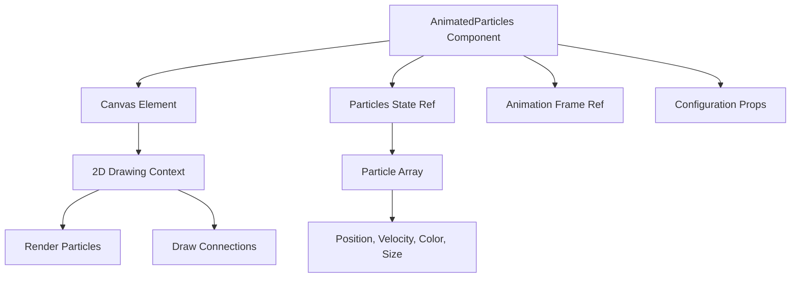
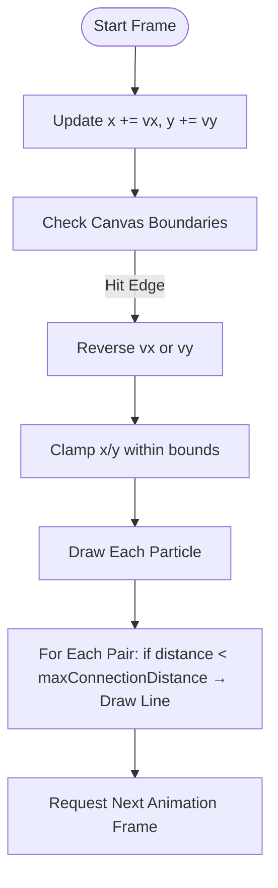
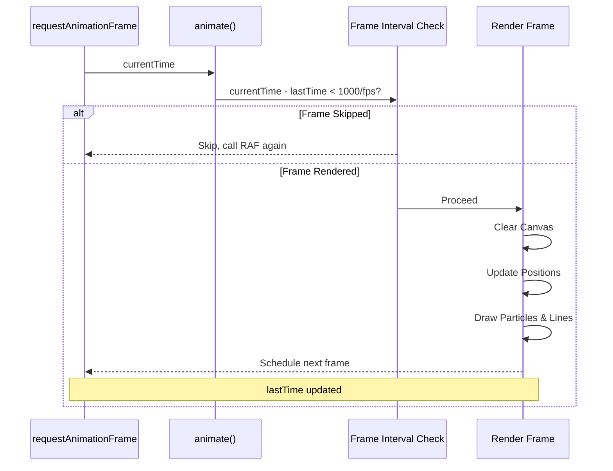

# Animated Particles

<cite>
**Referenced Files in This Document **  
- [AnimatedParticles.tsx](file://src/components/effects/AnimatedParticles.tsx)
- [AnimatedParticles.module.css](file://src/components/effects/AnimatedParticles.module.css)
- [Index.tsx](file://src/pages/Index.tsx)
</cite>

## Table of Contents
1. [Introduction](#introduction)
2. [Core Components](#core-components)
3. [Particle Physics Simulation](#particle-physics-simulation)
4. [Configuration Interface](#configuration-interface)
5. [Animation Loop and Performance Control](#animation-loop-and-performance-control)
6. [Canvas Rendering and Responsive Design](#canvas-rendering-and-responsive-design)
7. [Performance Considerations](#performance-considerations)
8. [Usage Examples](#usage-examples)
9. [Troubleshooting Guide](#troubleshooting-guide)
10. [Integration and Accessibility](#integration-and-accessibility)

## Introduction
The `AnimatedParticles` component renders a dynamic particle system on a full-screen canvas, creating an immersive background effect with moving particles and connecting lines. It is implemented using React and the HTML5 Canvas API to ensure smooth animations while maintaining responsiveness across devices. The component supports extensive customization through a configuration interface and is optimized for performance on both desktop and mobile platforms.

**Section sources**
- [AnimatedParticles.tsx](file://src/components/effects/AnimatedParticles.tsx#L1-L32)

## Core Components

The `AnimatedParticles` component is built around a canvas element that overlays the entire viewport. It manages particle state via React refs and uses `requestAnimationFrame` for efficient animation loops. The visual layer is styled using CSS modules to ensure encapsulation and prevent style conflicts.



**Diagram sources**
- [AnimatedParticles.tsx](file://src/components/effects/AnimatedParticles.tsx#L34-L72)
- [AnimatedParticles.module.css](file://src/components/effects/AnimatedParticles.module.css#L0-L9)

**Section sources**
- [AnimatedParticles.tsx](file://src/components/effects/AnimatedParticles.tsx#L34-L183)
- [AnimatedParticles.module.css](file://src/components/effects/AnimatedParticles.module.css#L0-L9)

## Particle Physics Simulation

Each particle is represented as an object containing position (x, y), velocity vector (vx, vy), size, opacity, and color. During each animation frame, particles are updated based on their velocity vectors. When a particle reaches the edge of the canvas, its velocity is reversed along the corresponding axis, creating a "bounce" effect.

Particles are constrained within canvas boundaries using `Math.max` and `Math.min` to clamp coordinates. Connection lines are drawn between particles that are within a specified distance threshold (`maxConnectionDistance`). To optimize rendering, only forward pairs are evaluated (i.e., each pair is processed once), reducing computational complexity from O(n²) to approximately half.



**Diagram sources**
- [AnimatedParticles.tsx](file://src/components/effects/AnimatedParticles.tsx#L74-L123)

**Section sources**
- [AnimatedParticles.tsx](file://src/components/effects/AnimatedParticles.tsx#L74-L123)

## Configuration Interface

The `ParticlesConfig` interface allows fine-tuning of the particle system's behavior and appearance:

| Property | Type | Default Value | Description |
|--------|------|---------------|-------------|
| particleCount | number | 1000 | Total number of particles rendered; higher values increase visual density but impact performance |
| colors | string[] | ['rgba(139, 92, 246, 0.3)', ...] | Array of RGBA color strings used to randomly assign colors to particles |
| maxConnectionDistance | number | 60 | Maximum pixel distance between particles to draw a connection line |
| speedRange | [number, number] | [-0.1, 0.1] | Range for random initial horizontal and vertical velocities |
| sizeRange | [number, number] | [0.5, 2] | Minimum and maximum radius (in pixels) for particle circles |
| opacityRange | [number, number] | [0.1, 0.3] | Opacity range applied during particle creation |
| fps | number | 24 | Target frames per second; used for delta-time-based frame limiting |

These properties can be customized when instantiating the component, enabling adaptation to different design themes and performance requirements.

**Section sources**
- [AnimatedParticles.tsx](file://src/components/effects/AnimatedParticles.tsx#L24-L32)

## Animation Loop and Performance Control

The animation loop is powered by `requestAnimationFrame`, ensuring synchronization with the browser's refresh rate. A frame interval is calculated from the configured FPS value (e.g., 24 FPS = ~41.67ms). Before rendering each frame, the current timestamp is compared against the last rendered time. If insufficient time has passed, the frame is skipped, effectively throttling the animation to maintain consistent speed regardless of device capability.

This delta-time-based approach prevents overly fast animations on high-performance devices and maintains visual consistency across environments. The use of `useCallback` ensures stable function references for event listeners and animation callbacks.



**Diagram sources**
- [AnimatedParticles.tsx](file://src/components/effects/AnimatedParticles.tsx#L74-L123)

**Section sources**
- [AnimatedParticles.tsx](file://src/components/effects/AnimatedParticles.tsx#L74-L123)

## Canvas Rendering and Responsive Design

The canvas is sized responsively using `getBoundingClientRect()` and scaled according to the device's pixel ratio (`devicePixelRatio`) to ensure sharp rendering on high-DPI screens such as Retina displays. The actual canvas dimensions are multiplied by the DPR, while CSS styles maintain layout size at 100vw × 100vh.

The 2D context is scaled by the same DPR factor, allowing drawing operations to occur in logical pixels while outputting crisp visuals. On window resize, the canvas is repositioned and redrawn to match new dimensions, preserving visual integrity across orientation changes and viewport adjustments.

```mermaid
flowchart LR
A[Window Resize Event] --> B[Get Bounding Rect]
B --> C[Get Device Pixel Ratio]
C --> D[Set canvas.width/height = rect * DPR]
D --> E[Set ctx.scale(DPR, DPR)]
E --> F[Adjust CSS width/height to rect]
F --> G[Recreate Particles]
```

**Diagram sources**
- [AnimatedParticles.tsx](file://src/components/effects/AnimatedParticles.tsx#L121-L183)

**Section sources**
- [AnimatedParticles.tsx](file://src/components/effects/AnimatedParticles.tsx#L121-L183)

## Performance Considerations

Key performance optimizations include:
- **Frame Rate Limiting**: Using `fps` config to cap update frequency and reduce GPU load.
- **Efficient Pairing**: Only checking particle pairs where `i < j`, cutting connection calculations in half.
- **Context Scaling**: Leveraging `ctx.scale()` instead of manual coordinate transformation.
- **Hardware Acceleration**: Enabling image smoothing and high-quality rendering settings.
- **Memory Management**: Proper cleanup of animation frames and event listeners on unmount.

Higher particle counts significantly affect frame rate, especially on low-end devices. For optimal performance, consider reducing `particleCount`, lowering `fps`, or disabling connections entirely via `maxConnectionDistance = 0`.

**Section sources**
- [AnimatedParticles.tsx](file://src/components/effects/AnimatedParticles.tsx#L74-L183)

## Usage Examples

### Custom Color Theme
```tsx
<AnimatedParticles
  config={{
    colors: [
      'rgba(255, 193, 7, 0.3)',   // Amber
      'rgba(220, 53, 69, 0.3)',   // Red
      'rgba(40, 167, 69, 0.3)',   // Green
    ],
    particleCount: 600,
    maxConnectionDistance: 50,
  }}
/>
```

### Low-Resource Mode
```tsx
<AnimatedParticles
  config={{
    particleCount: 300,
    fps: 15,
    maxConnectionDistance: 0, // Disable connections
    sizeRange: [0.3, 1],
  }}
/>
```

### Minimalist Effect
```tsx
<AnimatedParticles
  config={{
    particleCount: 200,
    colors: ['rgba(255, 255, 255, 0.2)'],
    speedRange: [-0.05, 0.05],
    opacityRange: [0.05, 0.15],
    maxConnectionDistance: 40,
  }}
/>
```

**Section sources**
- [Index.tsx](file://src/pages/Index.tsx#L50-L65)

## Troubleshooting Guide

### Canvas Not Rendering
Ensure the parent container does not restrict z-index stacking. The canvas uses `z-index: 0` and must appear behind content layers (which typically use `z-index: 10+`).

### Memory Bloat or Lag
High `particleCount` (>1000) may cause memory pressure. Monitor FPS using browser dev tools. Reduce count or disable connections if needed.

### Flickering on Mobile
Some mobile browsers struggle with frequent canvas redraws. Lower `fps` to 15–18 and reduce `particleCount` below 500 for smoother playback.

### No Responsive Behavior
Verify that no parent elements apply `overflow: hidden` or fixed dimensions that interfere with full-viewport layout.

**Section sources**
- [AnimatedParticles.tsx](file://src/components/effects/AnimatedParticles.tsx#L121-L183)
- [AnimatedParticles.module.css](file://src/components/effects/AnimatedParticles.module.css#L0-L9)

## Integration and Accessibility

The `AnimatedParticles` component is designed to integrate seamlessly with other visual effects like `ParallaxBackground` and `FloatingWords`. It appears in the root layout (`Index.tsx`) beneath all page content, serving purely as a decorative backdrop.

Due to its non-interactive nature and low-opacity styling, it minimally impacts accessibility. However, users sensitive to motion may find animated backgrounds distracting. Future enhancements could include respecting `prefers-reduced-motion` media queries to disable or simplify animations when requested by user preferences.

**Section sources**
- [Index.tsx](file://src/pages/Index.tsx#L12-L89)
- [AnimatedParticles.tsx](file://src/components/effects/AnimatedParticles.tsx#L34-L183)