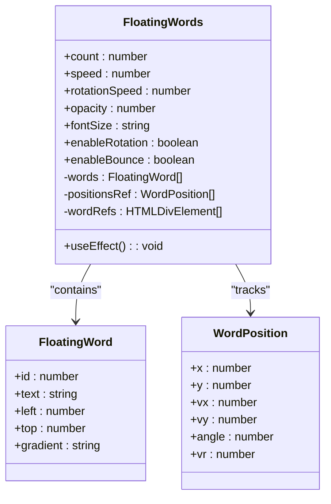
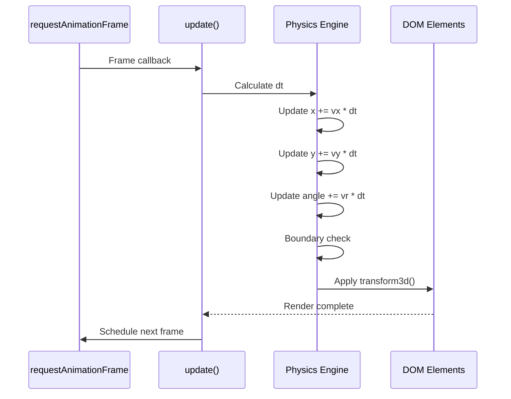
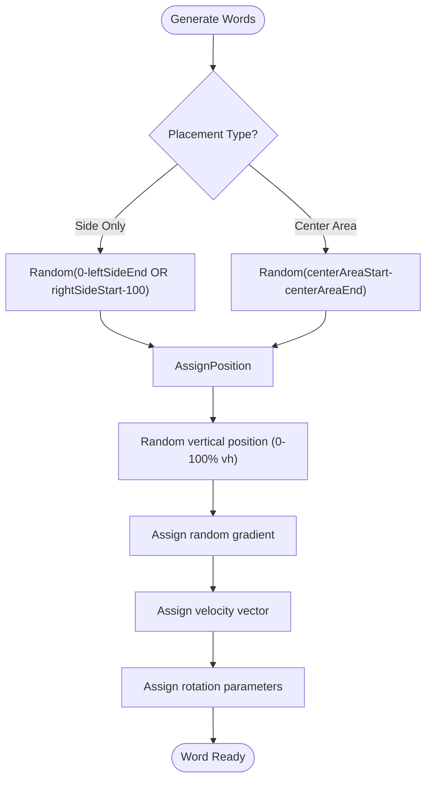
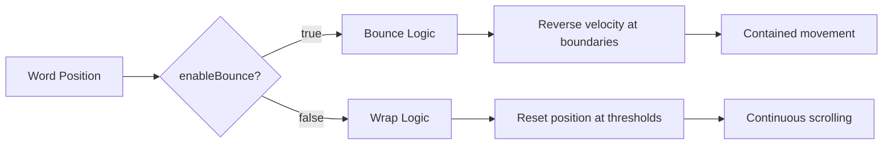
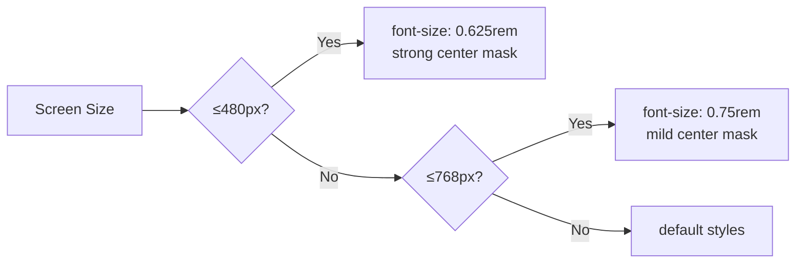

# Floating Words

<cite>
**Referenced Files in This Document**
- [FloatingWords.tsx](file://src/components/effects/FloatingWords.tsx)
- [FloatingWords.module.css](file://src/components/effects/FloatingWords.module.css)
- [Index.tsx](file://src/pages/Index.tsx)
</cite>

## Table of Contents
1. [Introduction](#introduction)
2. [Core Components](#core-components)
3. [Physics-Based Animation System](#physics-based-animation-system)
4. [Props Configuration](#props-configuration)
5. [Word Generation and Positioning](#word-generation-and-positioning)
6. [Movement Modes](#movement-modes)
7. [Styling and Visual Effects](#styling-and-visual-effects)
8. [Customization Examples](#customization-examples)
9. [Responsive Behavior](#responsive-behavior)
10. [Debugging Guidance](#debugging-guidance)

## Introduction
The FloatingWords component creates an animated background effect with technology-related keywords that float and rotate across the viewport. It uses a physics-based animation system driven by velocity vectors and requestAnimationFrame for smooth, frame-rate-independent motion. The component is designed to enhance visual appeal while maintaining performance through optimized rendering techniques.

**Section sources**
- [FloatingWords.tsx](file://src/components/effects/FloatingWords.tsx#L1-L50)

## Core Components
The FloatingWords component consists of two main files: the React component implementation and its associated CSS module. The component manages state for word positions, velocities, and rotations using useRef and useState hooks, enabling real-time updates without re-renders.



**Diagram sources**
- [FloatingWords.tsx](file://src/components/effects/FloatingWords.tsx#L10-L64)

**Section sources**
- [FloatingWords.tsx](file://src/components/effects/FloatingWords.tsx#L1-L192)

## Physics-Based Animation System
The animation system uses velocity vectors (vx/vy) and rotation velocity (vr) updated via requestAnimationFrame with delta time (dt) for frame-rate independence. Each frame calculates the time difference since the last update, ensuring consistent motion regardless of refresh rate.

The system tracks real-time coordinates and angles in the positionsRef array, which stores current position, velocity, and rotation data for each word. These values are updated every animation frame and applied to DOM elements using transform3d and rotate transforms.



**Diagram sources**
- [FloatingWords.tsx](file://src/components/effects/FloatingWords.tsx#L105-L192)

**Section sources**
- [FloatingWords.tsx](file://src/components/effects/FloatingWords.tsx#L105-L192)

## Props Configuration
The FloatingWords component accepts several props to customize its behavior and appearance:

<table>
  <thead>
    <tr>
      <th>Prop Name</th>
      <th>Type</th>
      <th>Default Value</th>
      <th>Description</th>
    </tr>
  </thead>
  <tbody>
    <tr>
      <td>count</td>
      <td>number</td>
      <td>15</td>
      <td>Number of words to display</td>
    </tr>
    <tr>
      <td>speed</td>
      <td>number</td>
      <td>5</td>
      <td>Movement speed in vw/vh per second</td>
    </tr>
    <tr>
      <td>rotationSpeed</td>
      <td>number</td>
      <td>30</td>
      <td>Rotation speed in degrees per second</td>
    </tr>
    <tr>
      <td>opacity</td>
      <td>number</td>
      <td>0.6</td>
      <td>Opacity of words</td>
    </tr>
    <tr>
      <td>fontSize</td>
      <td>string</td>
      <td>'0.875rem'</td>
      <td>Font size of words</td>
    </tr>
    <tr>
      <td>sideOnlyPercentage</td>
      <td>number</td>
      <td>0.8</td>
      <td>Percentage of words placed on sides</td>
    </tr>
    <tr>
      <td>centerAreaStart</td>
      <td>number</td>
      <td>30</td>
      <td>Start of center area percentage</td>
    </tr>
    <tr>
      <td>centerAreaEnd</td>
      <td>number</td>
      <td>70</td>
      <td>End of center area percentage</td>
    </tr>
    <tr>
      <td>leftSideEnd</td>
      <td>number</td>
      <td>25</td>
      <td>End of left side area percentage</td>
    </tr>
    <tr>
      <td>rightSideStart</td>
      <td>number</td>
      <td>75</td>
      <td>Start of right side area percentage</td>
    </tr>
    <tr>
      <td>enableRotation</td>
      <td>boolean</td>
      <td>true</td>
      <td>Enable/disable word rotation</td>
    </tr>
    <tr>
      <td>enableBounce</td>
      <td>boolean</td>
      <td>true</td>
      <td>Enable/disable bouncing off edges</td>
    </tr>
  </tbody>
</table>

**Section sources**
- [FloatingWords.tsx](file://src/components/effects/FloatingWords.tsx#L3-L47)

## Word Generation and Positioning
Words are randomly selected from a predefined techWords array containing 32 technology-related terms. Each word is assigned a random gradient from six available CSS classes (gradient1-6) that create colorful text effects using background-clip: text.

The positioning system uses percentage-based coordinates relative to viewport width (vw) and height (vh). Words can be configured to appear primarily on the sides or distributed throughout the viewport using placement parameters like sideOnlyPercentage, centerAreaStart/end, and leftSideEnd/rightSideStart.



**Diagram sources**
- [FloatingWords.tsx](file://src/components/effects/FloatingWords.tsx#L64-L102)

**Section sources**
- [FloatingWords.tsx](file://src/components/effects/FloatingWords.tsx#L55-L102)

## Movement Modes
The component supports two distinct movement modes controlled by the enableBounce prop:

### Bouncing Mode (enableBounce = true)
When enabled, words bounce off the viewport boundaries. Upon collision with an edge, the word's position is reset to the boundary (0 or 100%) and its velocity is reversed. This creates a contained animation where words remain within the visible area.

### Wrapping Mode (enableBounce = false)
When disabled, words wrap around the edges. Instead of bouncing, they disappear on one side and reappear on the opposite side after crossing a threshold (-10% to 110%). This creates a continuous scrolling effect that simulates infinite movement.



**Diagram sources**
- [FloatingWords.tsx](file://src/components/effects/FloatingWords.tsx#L128-L155)

**Section sources**
- [FloatingWords.tsx](file://src/components/effects/FloatingWords.tsx#L128-L155)

## Styling and Visual Effects
The component uses CSS modules for styling with several key features:

- **Fixed positioning**: The container uses position: fixed to cover the entire viewport
- **Pointer events disabled**: pointer-events: none allows interaction with underlying elements
- **Hardware acceleration**: will-change: transform optimizes rendering performance
- **Text gradients**: Six gradient classes create colorful text effects using background-clip: text
- **No transitions**: transition: none prevents interference with JavaScript animations

The gradients use 45-degree linear gradients with vibrant color combinations including blue-green, purple-orange, and pink-blue schemes.

**Section sources**
- [FloatingWords.module.css](file://src/components/effects/FloatingWords.module.css#L0-L62)

## Customization Examples
The FloatingWords component can be customized in various ways:

### Themed Word Lists
Create custom word arrays for specific themes:
```jsx
// Example usage in Index.tsx
<FloatingWords 
  count={20}
  speed={3}
  rotationSpeed={20}
  opacity={0.2}
  fontSize="0.8rem"
/>
```

### Spatial Distribution
Adjust placement parameters to control word distribution:
- Increase sideOnlyPercentage to concentrate words on edges
- Modify centerAreaStart/end to change the central exclusion zone
- Adjust leftSideEnd/rightSideStart to fine-tune side regions

### Performance Optimization
For mobile devices:
- Reduce count to lower rendering load
- Decrease speed for smoother animation
- Set enableRotation to false to reduce transform complexity
- Lower opacity to minimize overdraw

**Section sources**
- [Index.tsx](file://src/pages/Index.tsx#L30-L42)
- [FloatingWords.tsx](file://src/components/effects/FloatingWords.tsx#L46-L47)

## Responsive Behavior
The component includes responsive adjustments for different screen sizes:

- **Desktop (>768px)**: Full functionality with default styling
- **Tablet (≤768px)**: Font size reduced to 0.75rem with mask gradient creating more space in the center
- **Mobile (≤480px)**: Font size further reduced to 0.625rem with stronger mask gradient hiding the center completely

The mask property creates transparent zones in the center area, preventing words from obscuring content on smaller screens.



**Diagram sources**
- [FloatingWords.module.css](file://src/components/effects/FloatingWords.module.css#L98-L145)

**Section sources**
- [FloatingWords.module.css](file://src/components/effects/FloatingWords.module.css#L98-L145)

## Debugging Guidance
Common issues and their solutions:

### Layout Shifts
- **Cause**: Dynamic content affecting layout
- **Solution**: Ensure parent containers have proper z-index stacking
- **Check**: Verify floatingWords has z-index: 40 and doesn't interfere with navigation

### Text Clipping
- **Cause**: Words positioned near viewport edges
- **Solution**: Adjust bounce boundaries or wrapping thresholds
- **Check**: Review enableBounce logic and position constraints

### Animation Stuttering
- **Cause**: High component count or complex transforms
- **Solutions**:
  - Reduce word count on lower-end devices
  - Disable rotation with enableRotation={false}
  - Ensure will-change: transform is properly utilized
  - Verify no unnecessary re-renders are occurring

### Performance Monitoring
Use browser dev tools to:
- Check FPS in the performance tab
- Monitor memory usage for potential leaks
- Verify GPU acceleration is active for transforms
- Inspect paint operations for excessive rendering

**Section sources**
- [FloatingWords.tsx](file://src/components/effects/FloatingWords.tsx#L105-L192)
- [FloatingWords.module.css](file://src/components/effects/FloatingWords.module.css#L0-L62)