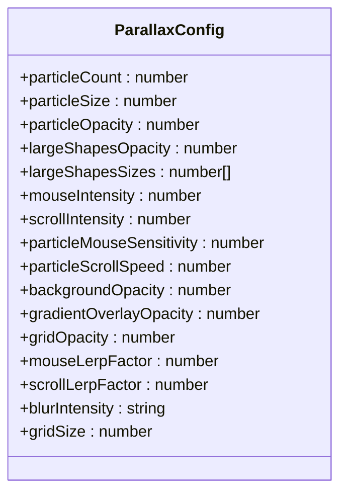
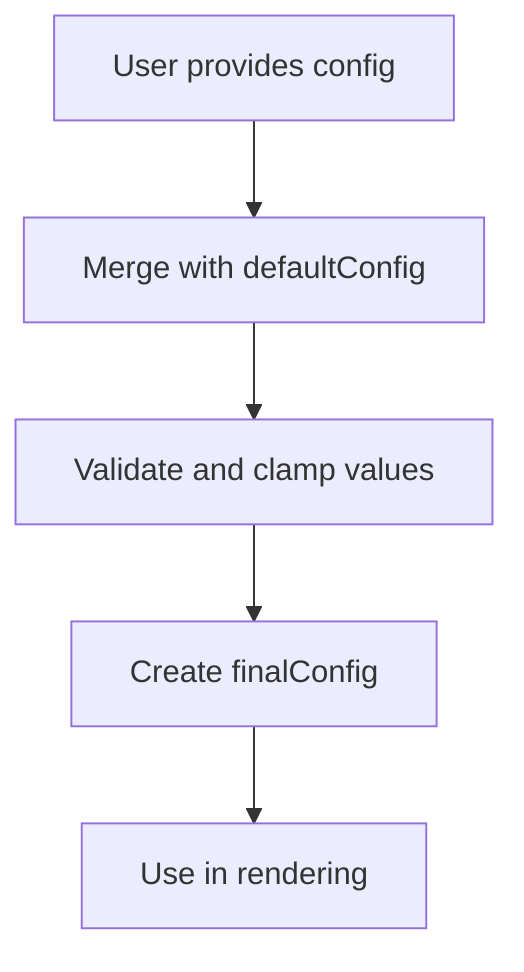
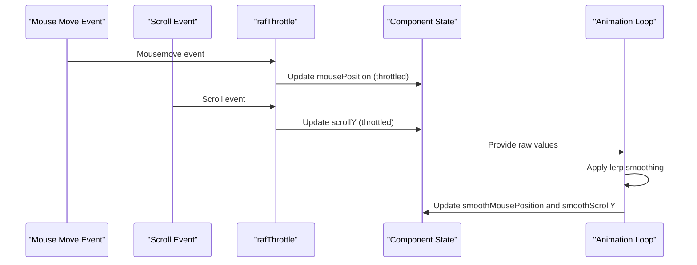
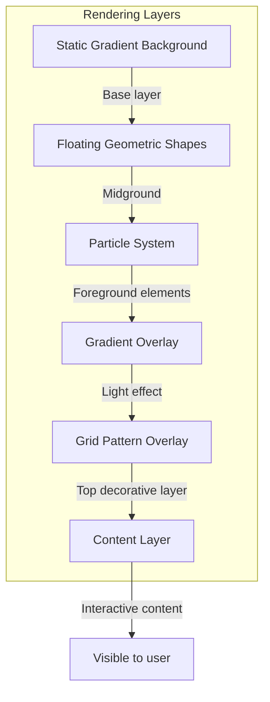
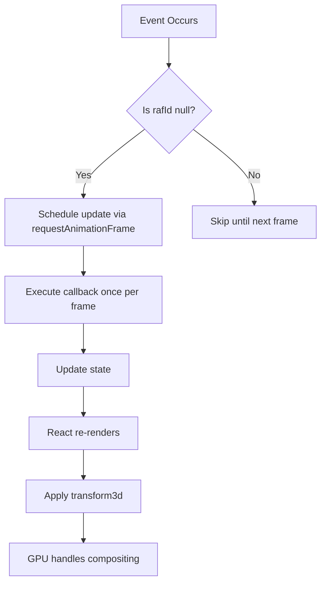
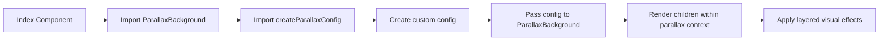

# Parallax Background

<cite>
**Referenced Files in This Document**   
- [ParallaxBackground.tsx](file://src/components/effects/ParallaxBackground.tsx)
- [ParallaxConfig.ts](file://src/components/effects/ParallaxConfig.ts)
- [useParallax.ts](file://src/hooks/useParallax.ts)
- [ParallaxBackground.module.css](file://src/components/effects/ParallaxBackground.module.css)
- [Index.tsx](file://src/pages/Index.tsx)
</cite>

## Table of Contents
1. [Introduction](#introduction)
2. [Configuration Interface](#configuration-interface)
3. [Core Implementation](#core-implementation)
4. [Rendering Layers](#rendering-layers)
5. [Performance Optimizations](#performance-optimizations)
6. [Integration and Usage](#integration-and-usage)
7. [Debugging Guidance](#debugging-guidance)

## Introduction
The ParallaxBackground component creates a multi-layered depth effect using mouse movement and scroll position data. It implements smooth animations through requestAnimationFrame throttling and linear interpolation (lerp) for fluid motion. The component provides extensive customization options through its configuration interface, allowing developers to fine-tune visual effects, animation intensity, and performance characteristics.

**Section sources**
- [ParallaxBackground.tsx](file://src/components/effects/ParallaxBackground.tsx#L0-L337)

## Configuration Interface
The `ParallaxConfig` interface defines all configurable properties for the parallax effect:

### Element Configuration
- **particleCount**: Number of floating particles (1-100, default: 20)
- **particleSize**: Size of particles in pixels (1-20px, default: 4px)
- **particleOpacity**: Opacity of particles (0-1, default: 0.3)

### Large Shapes Configuration
- **largeShapesOpacity**: Opacity of large geometric shapes (0-1, default: 0.2)
- **largeShapesSizes**: Array of five values defining sizes of large floating circles [first, second, third, fourth, fifth] in pixels

### Movement Sensitivity
- **mouseIntensity**: Intensity factor for mouse movement effects (0-1, default: 0.12)
- **scrollIntensity**: Intensity factor for scroll position effects (0-1, default: 0.3)
- **particleMouseSensitivity**: Mouse sensitivity for individual particles (0-1, default: 0.03)
- **particleScrollSpeed**: Scroll speed for particle animation (0-1, default: 0.05)

### Background Settings
- **backgroundOpacity**: Opacity of the base gradient background (0-1, default: 0.95)
- **gradientOverlayOpacity**: Opacity of the radial gradient overlay (0-1, default: 0.2)
- **gridOpacity**: Opacity of the grid pattern overlay (0-1, default: 0.15)

### Animation Smoothness
- **mouseLerpFactor**: Linear interpolation factor for mouse position smoothing (0-1, default: 0.06)
- **scrollLerpFactor**: Linear interpolation factor for scroll position smoothing (0-1, default: 0.08)

### Visual Effects
- **blurIntensity**: CSS blur filter level ('sm', 'md', 'lg', 'xl', '2xl', '3xl', default: '3xl')
- **gridSize**: Size of grid cells in pixels (10-200px, default: 40px)

All configuration values are validated and clamped to safe ranges during initialization to prevent invalid inputs from breaking the visual effect.



**Diagram sources**
- [ParallaxBackground.tsx](file://src/components/effects/ParallaxBackground.tsx#L8-L37)

**Section sources**
- [ParallaxBackground.tsx](file://src/components/effects/ParallaxBackground.tsx#L8-L37)

## Core Implementation
The ParallaxBackground component implements several key techniques to create its depth effect:

### Default Configuration and Merging
The component uses a `defaultConfig` object with predefined values that are merged with user-provided configuration. This merging process ensures all required properties exist while allowing customization:



**Diagram sources**
- [ParallaxBackground.tsx](file://src/components/effects/ParallaxBackground.tsx#L33-L86)

### Input Processing
The component processes two primary input sources:
- **Mouse movement**: Captured via mousemove events, converted to percentage-based coordinates
- **Scroll position**: Captured via scroll events, using window.scrollY value

These inputs are processed through:
- **rafThrottle**: Limits event processing to animation frame rate using requestAnimationFrame
- **Smooth interpolation (lerp)**: Creates fluid transitions between states rather than abrupt changes



**Diagram sources**
- [ParallaxBackground.tsx](file://src/components/effects/ParallaxBackground.tsx#L33-L86)
- [ParallaxBackground.tsx](file://src/components/effects/ParallaxBackground.tsx#L145-L175)

**Section sources**
- [ParallaxBackground.tsx](file://src/components/effects/ParallaxBackground.tsx#L33-L86)

## Rendering Layers
The component renders multiple layered effects that combine to create the parallax depth:

### Static Gradient Background
The base layer consists of a fixed gradient background with configurable opacity. This layer remains completely static regardless of mouse or scroll position.

### Floating Geometric Shapes
This layer contains large circular shapes that move based on both mouse position and scroll offset. Each shape has:
- Configurable size and position
- Linear gradient fill
- Blur effect based on blurIntensity setting
- 3D translation using translate3d for GPU acceleration

### Particle System
A collection of small particles that float across the screen with individualized movement patterns. Each particle has:
- Random initial position and animation delay
- Movement influenced by both mouse and scroll
- Speed modulated by particleScrollSpeed and particleMouseSensitivity

### Gradient Overlay
A radial gradient that follows the mouse cursor position, creating a spotlight-like effect. The gradient's center point tracks the smoothed mouse position.

### Grid Pattern Overlay
A dynamic grid pattern where:
- Cell count is calculated based on viewport dimensions
- Grid size determined by gridSize configuration
- Opacity controlled by gridOpacity setting
- Layout created using CSS Grid with auto-fill



**Diagram sources**
- [ParallaxBackground.tsx](file://src/components/effects/ParallaxBackground.tsx#L216-L337)
- [ParallaxBackground.module.css](file://src/components/effects/ParallaxBackground.module.css#L0-L66)

**Section sources**
- [ParallaxBackground.tsx](file://src/components/effects/ParallaxBackground.tsx#L216-L337)

## Performance Optimizations
The component implements several performance optimizations to ensure smooth animations:

### RequestAnimationFrame Throttling
The `rafThrottle` function prevents excessive event handler execution by batching updates to align with the browser's refresh rate, avoiding jank from too-frequent state updates.

### Smooth Interpolation (Lerp)
Instead of directly applying raw input values, the component uses linear interpolation to create smooth transitions between states, eliminating jerky movements.

### CSS will-change and GPU Acceleration
The component uses `translate3d` transforms which trigger GPU acceleration and includes `will-change: transform` hints to optimize rendering performance.

### Dynamic Grid Calculation
The grid cell count is calculated based on current viewport dimensions and memoized using React's useMemo hook to prevent unnecessary recalculations.

### Passive Event Listeners
Event listeners for scroll and mousemove use the passive option to improve scrolling performance by indicating that event.preventDefault() will not be called.

### Memoization
Expensive calculations like floating element positions and grid cell counts are memoized to prevent unnecessary re-computation during re-renders.



**Diagram sources**
- [ParallaxBackground.tsx](file://src/components/effects/ParallaxBackground.tsx#L70-L86)
- [ParallaxBackground.tsx](file://src/components/effects/ParallaxBackground.tsx#L145-L175)

**Section sources**
- [ParallaxBackground.tsx](file://src/components/effects/ParallaxBackground.tsx#L70-L86)

## Integration and Usage
The ParallaxBackground component can be integrated into applications using several approaches:

### Preset Configurations
The component provides predefined presets through the `parallaxPresets` object:
- **minimal**: Subtle effect with fewer elements
- **standard**: Balanced effect with moderate intensity
- **intense**: Dynamic effect with higher particle count and movement
- **elegant**: Smooth, refined effect with graceful motion
- **performance**: Optimized for low-end devices with reduced complexity

### Custom Configuration
Developers can create custom configurations using the `createParallaxConfig` helper function:

```typescript
const customConfig = createParallaxConfig('intense', {
  particleCount: 10,
  mouseIntensity: 1.0,
  backgroundOpacity: 0.8,
});
```

### Responsive Adjustments
The component supports responsive design through the `adjustedParticleCount` prop, allowing different particle counts based on device characteristics:

```typescript
<ParallaxBackground 
  config={parallaxConfig} 
  adjustedParticleCount={window.innerWidth < 768 ? 
    Math.floor(parallaxConfig.particleCount / 2) : 
    parallaxConfig.particleCount
  }
/>
```

### Hook Integration
The `useParallax` hook provides access to the same parallax functionality for other components, enabling consistent effects throughout the application.



**Diagram sources**
- [Index.tsx](file://src/pages/Index.tsx#L10-L89)
- [ParallaxConfig.ts](file://src/components/effects/ParallaxConfig.ts#L0-L121)

**Section sources**
- [Index.tsx](file://src/pages/Index.tsx#L10-L89)
- [ParallaxConfig.ts](file://src/components/effects/ParallaxConfig.ts#L0-L121)

## Debugging Guidance
When troubleshooting issues with the ParallaxBackground component, consider the following common problems:

### Janky Animations
- Ensure no unnecessary re-renders are occurring
- Verify that rafThrottle is properly limiting event frequency
- Check for expensive calculations outside of useMemo hooks
- Confirm that transform3d is being used for GPU acceleration

### Cross-Browser Inconsistencies
- Test CSS Grid implementation across target browsers
- Verify requestAnimationFrame compatibility
- Check pointer-events handling in different browsers
- Ensure passive event listener syntax is supported

### Memory Leaks
- Confirm cleanup functions remove event listeners
- Verify cancelAnimationFrame is called when unmounting
- Check for closure references that might prevent garbage collection
- Ensure useCallback dependencies are correctly specified

### Integration Issues
- Validate that z-index values don't conflict with other elements
- Check that pointer-events: none is applied to non-interactive layers
- Verify that content layer has sufficient z-index to remain interactive
- Ensure viewport units are correctly calculated

**Section sources**
- [ParallaxBackground.tsx](file://src/components/effects/ParallaxBackground.tsx#L177-L214)
- [useParallax.ts](file://src/hooks/useParallax.ts#L0-L109)