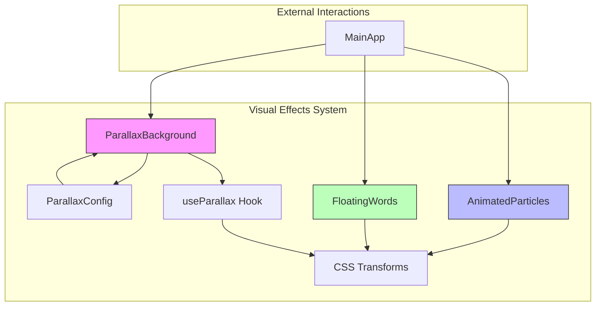
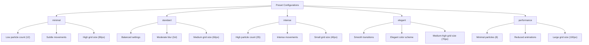
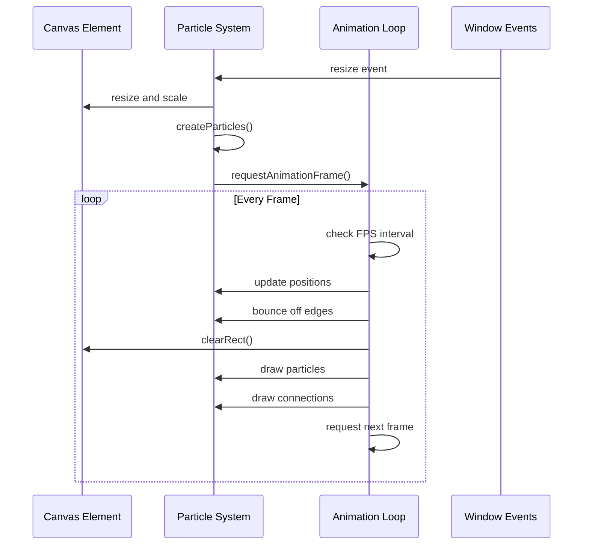
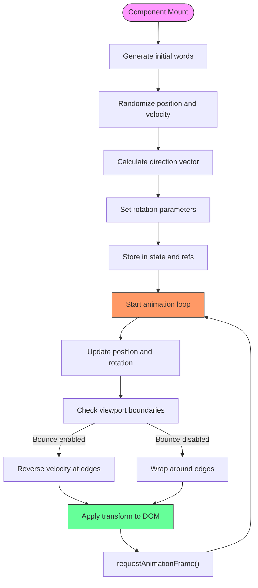
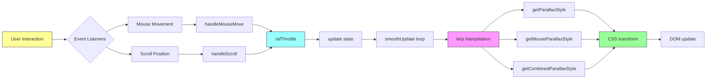

# Visual Effects Components

<cite>
**Referenced Files in This Document **  
- [ParallaxBackground.tsx](file://src/components/effects/ParallaxBackground.tsx)
- [ParallaxConfig.ts](file://src/components/effects/ParallaxConfig.ts)
- [AnimatedParticles.tsx](file://src/components/effects/AnimatedParticles.tsx)
- [FloatingWords.tsx](file://src/components/effects/FloatingWords.tsx)
- [useParallax.ts](file://src/hooks/useParallax.ts)
- [ParallaxBackground.module.css](file://src/components/effects/ParallaxBackground.module.css)
- [AnimatedParticles.module.css](file://src/components/effects/AnimatedParticles.module.css)
- [FloatingWords.module.css](file://src/components/effects/FloatingWords.module.css)
</cite>

## Table of Contents
1. [Introduction](#introduction)
2. [Core Architecture Overview](#core-architecture-overview)
3. [Parallax System Implementation](#parallax-system-implementation)
4. [Preset Configuration System](#preset-configuration-system)
5. [Dynamic Particle Animation](#dynamic-particle-animation)
6. [Typographic Motion Effects](#typographic-motion-effects)
7. [Data Flow and Hook Integration](#data-flow-and-hook-integration)
8. [Performance Optimization Strategies](#performance-optimization-strategies)
9. [Customization and Practical Usage](#customization-and-practical-usage)
10. [Debugging and Cross-Browser Considerations](#debugging-and-cross-browser-considerations)

## Introduction
The visual effects system implements a sophisticated parallax environment that creates multi-layered depth effects through mouse movement and scroll position tracking. The system combines three primary components: ParallaxBackground for layered depth effects, AnimatedParticles for canvas-based particle systems, and FloatingWords for typographic motion. These components work together to create an immersive user experience with configurable intensity levels and performance optimizations.

## Core Architecture Overview



**Diagram sources**
- [ParallaxBackground.tsx](file://src/components/effects/ParallaxBackground.tsx)
- [AnimatedParticles.tsx](file://src/components/effects/AnimatedParticles.tsx)
- [FloatingWords.tsx](file://src/components/effects/FloatingWords.tsx)

**Section sources**
- [ParallaxBackground.tsx](file://src/components/effects/ParallaxBackground.tsx)
- [AnimatedParticles.tsx](file://src/components/effects/AnimatedParticles.tsx)
- [FloatingWords.tsx](file://src/components/effects/FloatingWords.tsx)

## Parallax System Implementation

The ParallaxBackground component implements a multi-layered depth effect using fixed-position elements with transform animations based on mouse and scroll position. The system uses five distinct layers:

1. Static gradient background (z-index: 1)
2. Floating geometric shapes layer (z-index: 2)
3. Gradient overlay with radial positioning (z-index: 3)
4. Grid pattern overlay (z-index: 4)
5. Content layer (z-index: 20)

Each layer responds differently to user interaction, creating a sense of depth through differential movement speeds. Large floating shapes move with both mouse and scroll inputs, while smaller particles exhibit independent movement patterns based on their configuration.

```mermaid
classDiagram
class ParallaxBackground {
+children : ReactNode
+config : ParallaxConfig
+adjustedParticleCount : number
-finalConfig : Required~ParallaxConfig~
-scrollY : number
-mousePosition : {x : number, y : number}
-smoothScrollY : number
-smoothMousePosition : {x : number, y : number}
-windowSize : {width : number, height : number}
+ParallaxBackground()
}
class ParallaxConfig {
+particleCount : number
+particleSize : number
+particleOpacity : number
+largeShapesOpacity : number
+largeShapesSizes : [number, number, number, number, number]
+mouseIntensity : number
+scrollIntensity : number
+particleMouseSensitivity : number
+particleScrollSpeed : number
+backgroundOpacity : number
+gradientOverlayOpacity : number
+gridOpacity : number
+mouseLerpFactor : number
+scrollLerpFactor : number
+blurIntensity : 'sm'|'md'|'lg'|'xl'|'2xl'|'3xl'
+gridSize : number
}
ParallaxBackground --> ParallaxConfig : "uses"
```

**Diagram sources**
- [ParallaxBackground.tsx](file://src/components/effects/ParallaxBackground.tsx#L0-L337)
- [ParallaxConfig.ts](file://src/components/effects/ParallaxConfig.ts#L0-L121)

**Section sources**
- [ParallaxBackground.tsx](file://src/components/effects/ParallaxBackground.tsx#L0-L337)
- [ParallaxBackground.module.css](file://src/components/effects/ParallaxBackground.module.css#L0-L66)

## Preset Configuration System

The parallax system provides five predefined configuration presets that offer different visual intensities and performance characteristics:



The `createParallaxConfig` function allows developers to extend any preset with custom overrides while maintaining the base configuration's integrity. Each preset is validated and clamped to ensure values remain within acceptable ranges (e.g., opacity between 0-1, particle count between 1-100).

**Section sources**
- [ParallaxConfig.ts](file://src/components/effects/ParallaxConfig.ts#L0-L121)

## Dynamic Particle Animation

The AnimatedParticles component renders a dynamic particle system on an HTML canvas element, creating connections between nearby particles. The system uses requestAnimationFrame throttling to maintain consistent frame rates across devices.



The particle system supports configurable parameters including particle count, colors, connection distance, speed ranges, size ranges, opacity ranges, and frames per second. The canvas is properly scaled for device pixel ratio to ensure sharp rendering on high-DPI displays.

**Diagram sources**
- [AnimatedParticles.tsx](file://src/components/effects/AnimatedParticles.tsx#L0-L183)
- [AnimatedParticles.module.css](file://src/components/effects/AnimatedParticles.module.css#L0-L9)

**Section sources**
- [AnimatedParticles.tsx](file://src/components/effects/AnimatedParticles.tsx#L0-L183)

## Typographic Motion Effects

The FloatingWords component creates animated text elements that float across the viewport with rotation effects. Words are selected from a predefined technology stack list and assigned random gradients from six available color schemes.



The component includes responsive design features that adjust font sizes and apply masking on smaller screens to prevent text from obscuring content in the center of the viewport.

**Diagram sources**
- [FloatingWords.tsx](file://src/components/effects/FloatingWords.tsx#L0-L192)
- [FloatingWords.module.css](file://src/components/effects/FloatingWords.module.css#L0-L145)

**Section sources**
- [FloatingWords.tsx](file://src/components/effects/FloatingWords.tsx#L0-L192)

## Data Flow and Hook Integration

The visual effects system follows a unidirectional data flow from configuration through hooks to CSS transforms. The useParallax hook serves as the central data provider for all parallax-related components.



The system uses linear interpolation (lerp) to smooth transitions between raw input values and rendered positions, creating fluid animations without abrupt changes. The rafThrottle function ensures events are processed at optimal frame rates by batching updates through requestAnimationFrame.

**Diagram sources**
- [useParallax.ts](file://src/hooks/useParallax.ts#L0-L109)
- [ParallaxBackground.tsx](file://src/components/effects/ParallaxBackground.tsx#L0-L337)

**Section sources**
- [useParallax.ts](file://src/hooks/useParallax.ts#L0-L109)

## Performance Optimization Strategies

The visual effects system implements multiple performance optimization techniques to ensure smooth animations across various devices:

### Throttling and Frame Rate Management
- **requestAnimationFrame throttling**: Event handlers are wrapped in rafThrottle to prevent excessive processing
- **FPS limiting in AnimatedParticles**: Configurable frames per second to balance visual quality and performance
- **Passive event listeners**: Scroll and mousemove listeners use passive mode to improve scrolling performance

### Rendering Optimizations
- **will-change property**: Applied to frequently animated elements to promote them to their own compositor layers
- **GPU acceleration**: translate3d transforms trigger GPU rendering instead of CPU-based painting
- **Device pixel ratio scaling**: Canvas elements are properly scaled for high-DPI displays without sacrificing performance

### Memory and Computation Efficiency
- **Memoization**: useMemo is used to prevent unnecessary recalculations of configurations and computed values
- **Ref usage**: useRef stores mutable values without triggering re-renders
- **Object pooling**: Particle arrays are reused rather than recreated on each animation frame

These optimizations work together to maintain high frame rates even on lower-end devices while providing visually rich effects.

**Section sources**
- [ParallaxBackground.tsx](file://src/components/effects/ParallaxBackground.tsx#L0-L337)
- [AnimatedParticles.tsx](file://src/components/effects/AnimatedParticles.tsx#L0-L183)
- [useParallax.ts](file://src/hooks/useParallax.ts#L0-L109)

## Customization and Practical Usage

The visual effects system can be customized through several mechanisms:

### Configuration Overrides
Developers can extend preset configurations with custom values:
```typescript
const customConfig = createParallaxConfig('intense', {
  particleCount: 10,
  mouseIntensity: 1.0,
  backgroundOpacity: 0.8,
});
```

### Component Integration
Components are designed for easy integration into page layouts:
```typescript
<ParallaxBackground config={customConfig}>
  <AnimatedParticles config={{ particleCount: 500 }} />
  <FloatingWords count={20} speed={3} />
  {/* Page content */}
</ParallaxBackground>
```

### Responsive Adjustments
All components include built-in responsive behavior:
- FloatingWords reduces font size and applies masking on mobile devices
- Particle density can be adjusted based on device capabilities
- Performance preset automatically optimizes for mobile devices

The system's modular design allows components to be used independently or in combination, providing flexibility for different design requirements.

**Section sources**
- [ParallaxConfig.ts](file://src/components/effects/ParallaxConfig.ts#L0-L121)
- [Index.tsx](file://src/pages/Index.tsx#L0-L27)

## Debugging and Cross-Browser Considerations

When troubleshooting animation issues, consider the following common problems and solutions:

### Janky Animations
- **Cause**: Excessive repaints or layout thrashing
- **Solution**: Ensure will-change is used appropriately and avoid animating properties that trigger layout changes
- **Tool**: Use browser DevTools Performance tab to identify bottlenecks

### Cross-Browser Inconsistencies
- **Firefox**: May require additional vendor prefixes for certain CSS properties
- **Safari**: Has stricter limits on canvas size and memory usage
- **Mobile browsers**: May throttle animations when tab is not active

### Debugging Techniques
1. Temporarily disable smoothing to isolate input vs. output issues
2. Monitor FPS using browser developer tools
3. Test on actual devices, not just emulators
4. Use the performance preset to determine if issues are load-related

The system's modular architecture makes it easier to isolate and address specific issues by testing components independently.

**Section sources**
- [ParallaxBackground.tsx](file://src/components/effects/ParallaxBackground.tsx#L0-L337)
- [AnimatedParticles.tsx](file://src/components/effects/AnimatedParticles.tsx#L0-L183)
- [FloatingWords.tsx](file://src/components/effects/FloatingWords.tsx#L0-L192)