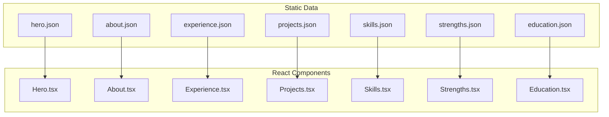
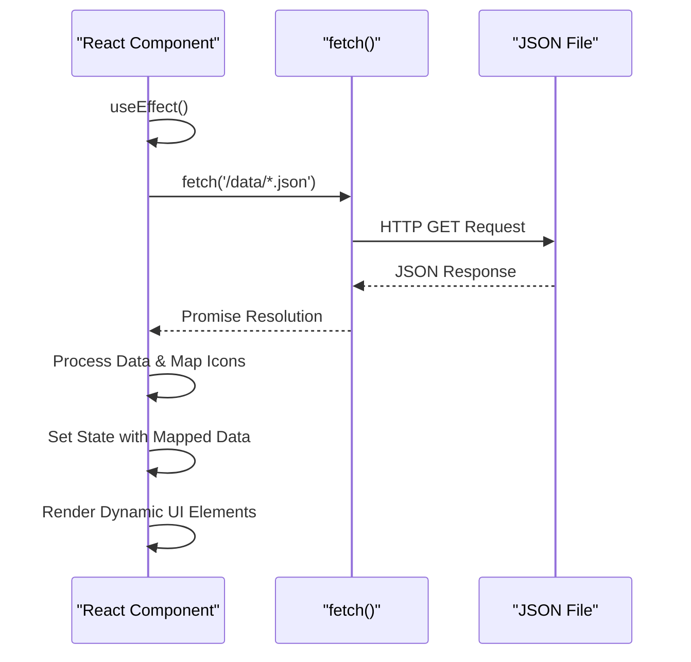
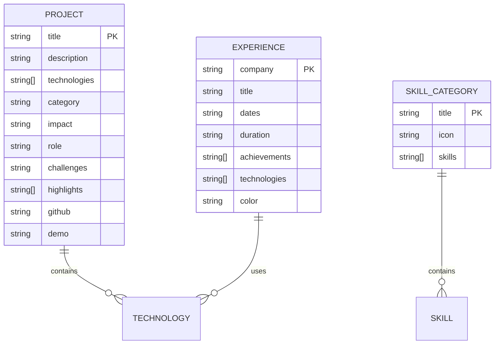

# Content Management

<cite>
**Referenced Files in This Document**   
- [hero.json](file://public/data/hero.json)
- [about.json](file://public/data/about.json)
- [experience.json](file://public/data/experience.json)
- [projects.json](file://public/data/projects.json)
- [skills.json](file://public/data/skills.json)
- [strengths.json](file://public/data/strengths.json)
- [education.json](file://public/data/education.json)
- [Hero.tsx](file://src/components/pages/Hero.tsx)
- [About.tsx](file://src/components/pages/About.tsx)
- [Experience.tsx](file://src/components/pages/Experience.tsx)
- [Projects.tsx](file://src/components/pages/Projects.tsx)
- [Skills.tsx](file://src/components/pages/Skills.tsx)
- [Strengths.tsx](file://src/components/pages/Strengths.tsx)
- [Education.tsx](file://src/components/pages/Education.tsx)
</cite>

## Table of Contents
1. [Introduction](#introduction)
2. [Data Model Overview](#data-model-overview)
3. [JSON Schema Definitions](#json-schema-definitions)
4. [Data Flow and Component Integration](#data-flow-and-component-integration)
5. [Structural Conventions and Naming Consistency](#structural-conventions-and-naming-consistency)
6. [Localization Readiness and Extensibility Patterns](#localization-readiness-and-extensibility-patterns)
7. [Entity Relationships and Sample Data Structures](#entity-relationships-and-sample-data-structures)
8. [Data Validation and Error Handling](#data-validation-and-error-handling)
9. [Caching Strategies with React Query](#caching-strategies-with-react-query)
10. [Contributor Guidelines](#contributor-guidelines)
11. [Performance Impacts and Mitigation Strategies](#performance-impacts-and-mitigation-strategies)
12. [Migration Paths to Headless CMS](#migration-paths-to-headless-cms)

## Introduction
The content management system in farruh-folio-wave utilizes static JSON files stored in the public/data directory to manage portfolio content. This documentation details how data is structured, loaded, validated, and rendered across various sections of the website including hero, about, experience, projects, skills, strengths, and education. The system leverages client-side data fetching with error handling and dynamic rendering through React components.

## Data Model Overview
The content management system uses a collection of JSON files to store structured data for different sections of the portfolio. Each file corresponds to a specific section and contains data in a predefined schema format that matches the expected structure of the React components. Data flows from these static assets into components via fetch operations during component initialization.

**Diagram sources**
- [hero.json](file://public/data/hero.json)
- [about.json](file://public/data/about.json)
- [experience.json](file://public/data/experience.json)
- [projects.json](file://public/data/projects.json)
- [skills.json](file://public/data/skills.json)
- [strengths.json](file://public/data/strengths.json)
- [education.json](file://public/data/education.json)
- [Hero.tsx](file://src/components/pages/Hero.tsx)
- [About.tsx](file://src/components/pages/About.tsx)
- [Experience.tsx](file://src/components/pages/Experience.tsx)
- [Projects.tsx](file://src/components/pages/Projects.tsx)
- [Skills.tsx](file://src/components/pages/Skills.tsx)
- [Strengths.tsx](file://src/components/pages/Strengths.tsx)
- [Education.tsx](file://src/components/pages/Education.tsx)

**Section sources**
- [hero.json](file://public/data/hero.json)
- [about.json](file://public/data/about.json)
- [experience.json](file://public/data/experience.json)
- [projects.json](file://public/data/projects.json)
- [skills.json](file://public/data/skills.json)
- [strengths.json](file://public/data/strengths.json)
- [education.json](file://public/data/education.json)

## JSON Schema Definitions
Each JSON file follows a specific schema tailored to its corresponding component's requirements. The schemas define field types, required properties, and structural conventions for consistent data representation across the application.

### Hero Section Schema
The hero.json file contains personal introduction data with badge, name, subtitle, description, button links, and statistics.

**Section sources**
- [hero.json](file://public/data/hero.json)
- [Hero.tsx](file://src/components/pages/Hero.tsx#L45-L84)

### About Section Schema
The about.json file includes personal information, interests, statistics, bio text, and achievements organized in arrays with icon references and color coding.

**Section sources**
- [about.json](file://public/data/about.json)
- [About.tsx](file://src/components/pages/About.tsx#L147-L188)

### Experience Section Schema
The experience.json file stores professional work history as an array of objects containing company, title, dates, achievements, technologies used, and visual styling information.

**Section sources**
- [experience.json](file://public/data/experience.json)
- [Experience.tsx](file://src/components/pages/Experience.tsx#L0-L170)

### Projects Section Schema
The projects.json file contains project showcases with detailed information including title, description, technologies, impact metrics, challenges faced, key highlights, and optional code/demo links.

**Section sources**
- [projects.json](file://public/data/projects.json)
- [Projects.tsx](file://src/components/pages/Projects.tsx#L39-L70)

### Skills Section Schema
The skills.json file organizes technical competencies into categorized groups with icons, titles, and lists of individual skills within each category.

**Section sources**
- [skills.json](file://public/data/skills.json)
- [Skills.tsx](file://src/components/pages/Skills.tsx#L0-L151)

### Strengths Section Schema
The strengths.json file defines core professional strengths with icons, titles, descriptive text, and color-coded visual presentation attributes.

**Section sources**
- [strengths.json](file://public/data/strengths.json)
- [Strengths.tsx](file://src/components/pages/Strengths.tsx#L0-L160)

### Education Section Schema
The education.json file contains academic background information including degree, institution, years attended, duration, description, and key subjects studied.

**Section sources**
- [education.json](file://public/data/education.json)
- [Education.tsx](file://src/components/pages/Education.tsx#L0-L199)

## Data Flow and Component Integration
Data flows from static JSON assets into React components through asynchronous fetch operations initiated during component mounting via useEffect hooks. The fetched data is then processed, mapped to appropriate UI elements, and rendered dynamically within their respective page components.

**Diagram sources**
- [Hero.tsx](file://src/components/pages/Hero.tsx#L45-L84)
- [About.tsx](file://src/components/pages/About.tsx#L147-L188)
- [Experience.tsx](file://src/components/pages/Experience.tsx#L0-L170)
- [Projects.tsx](file://src/components/pages/Projects.tsx#L39-L70)
- [Skills.tsx](file://src/components/pages/Skills.tsx#L0-L151)
- [Strengths.tsx](file://src/components/pages/Strengths.tsx#L0-L160)
- [Education.tsx](file://src/components/pages/Education.tsx#L0-L199)

**Section sources**
- [Hero.tsx](file://src/components/pages/Hero.tsx#L45-L84)
- [About.tsx](file://src/components/pages/About.tsx#L147-L188)
- [Experience.tsx](file://src/components/pages/Experience.tsx#L0-L170)
- [Projects.tsx](file://src/components/pages/Projects.tsx#L39-L70)
- [Skills.tsx](file://src/components/pages/Skills.tsx#L0-L151)
- [Strengths.tsx](file://src/components/pages/Strengths.tsx#L0-L160)
- [Education.tsx](file://src/components/pages/Education.tsx#L0-L199)

## Structural Conventions and Naming Consistency
The system maintains naming consistency across all JSON files and corresponding components using standardized property names and structural patterns. Icon references use consistent naming aligned with Lucide React component names, while color palettes follow predefined schemes applied uniformly across components.

**Section sources**
- [Hero.tsx](file://src/components/pages/Hero.tsx#L45-L84)
- [About.tsx](file://src/components/pages/About.tsx#L147-L188)
- [Skills.tsx](file://src/components/pages/Skills.tsx#L0-L151)
- [Strengths.tsx](file://src/components/pages/Strengths.tsx#L0-L160)

## Localization Readiness and Extensibility Patterns
The data model supports localization readiness through plain text fields that can be easily translated. Extensibility patterns allow for adding new fields or sections by following existing structural conventions, maintaining type safety through TypeScript interfaces, and ensuring backward compatibility with default values.

**Section sources**
- [hero.json](file://public/data/hero.json)
- [about.json](file://public/data/about.json)
- [experience.json](file://public/data/experience.json)
- [projects.json](file://public/data/projects.json)

## Entity Relationships and Sample Data Structures
The data model establishes clear relationships between entities such as projects containing multiple technologies, experience entries listing associated technologies, and skills organized into categorical groups. These relationships enable rich, interconnected content presentation.

**Diagram sources**
- [projects.json](file://public/data/projects.json)
- [experience.json](file://public/data/experience.json)
- [skills.json](file://public/data/skills.json)

**Section sources**
- [projects.json](file://public/data/projects.json)
- [experience.json](file://public/data/experience.json)
- [skills.json](file://public/data/skills.json)

## Data Validation and Error Handling
The system implements robust error handling for missing or malformed JSON data through try-catch blocks around fetch operations, status code validation, and fallback rendering mechanisms. Components gracefully handle loading states and errors without breaking the user interface.

**Section sources**
- [Hero.tsx](file://src/components/pages/Hero.tsx#L45-L84)
- [About.tsx](file://src/components/pages/About.tsx#L147-L188)
- [Experience.tsx](file://src/components/pages/Experience.tsx#L0-L170)
- [Projects.tsx](file://src/components/pages/Projects.tsx#L39-L70)

## Caching Strategies with React Query
While currently using direct fetch operations, the architecture supports migration to React Query for advanced caching strategies including automatic refetching, stale-while-revalidate patterns, and optimized network requests that reduce redundant data fetching and improve performance.

**Section sources**
- [Hero.tsx](file://src/components/pages/Hero.tsx#L45-L84)
- [About.tsx](file://src/components/pages/About.tsx#L147-L188)

## Contributor Guidelines
Contributors can update content without touching code by modifying JSON files following established schemas. Beginners should understand basic JSON syntax including objects, arrays, strings, and proper comma placement, while maintaining alignment with existing structural patterns and data types.

**Section sources**
- [hero.json](file://public/data/hero.json)
- [about.json](file://public/data/about.json)
- [experience.json](file://public/data/experience.json)
- [projects.json](file://public/data/projects.json)

## Performance Impacts and Mitigation Strategies
Client-side data loading has minimal performance impact due to small JSON file sizes and efficient parsing. Mitigation strategies include potential implementation of React Query for intelligent caching, code splitting for large datasets, and lazy loading of non-critical section data to optimize initial page load times.

**Section sources**
- [Hero.tsx](file://src/components/pages/Hero.tsx#L45-L84)
- [Projects.tsx](file://src/components/pages/Projects.tsx#L39-L70)

## Migration Paths to Headless CMS
The current static JSON approach can evolve into a headless CMS integration by replacing local fetch calls with API endpoints, implementing authentication for content editors, and establishing webhook-based synchronization between external CMS platforms and the frontend application while maintaining the same data contract.

**Section sources**
- [Hero.tsx](file://src/components/pages/Hero.tsx#L45-L84)
- [About.tsx](file://src/components/pages/About.tsx#L147-L188)
- [Experience.tsx](file://src/components/pages/Experience.tsx#L0-L170)
- [Projects.tsx](file://src/components/pages/Projects.tsx#L39-L70)