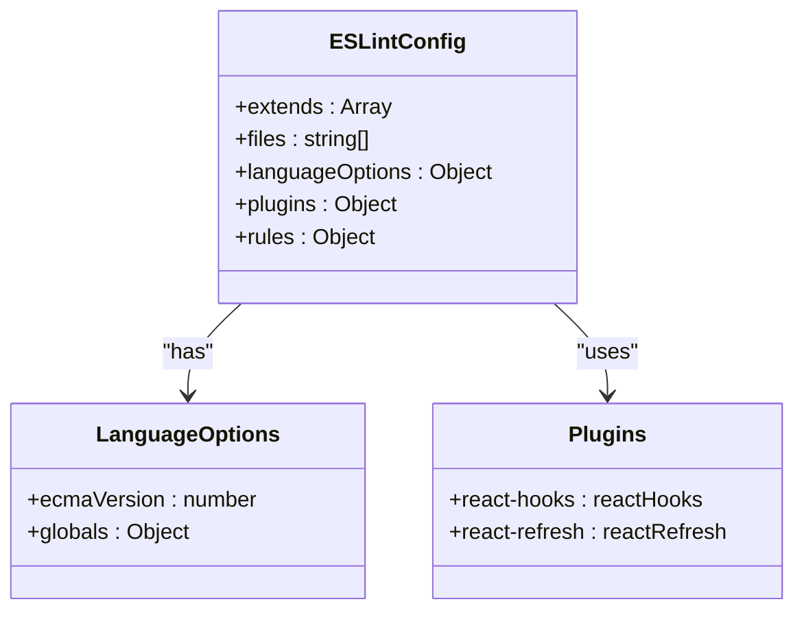
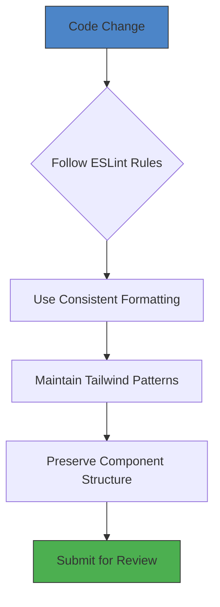

# Contribution Guidelines

<cite>
**Referenced Files in This Document**   
- [README.md](file://README.md)
- [eslint.config.js](file://eslint.config.js)
- [package.json](file://package.json)
- [tailwind.config.ts](file://tailwind.config.ts)
</cite>

## Table of Contents
1. [Introduction](#introduction)
2. [Contribution Workflow](#contribution-workflow)
3. [Code Style Standards](#code-style-standards)
4. [Testing Requirements](#testing-requirements)
5. [Issue Reporting Procedures](#issue-reporting-procedures)
6. [Licensing and Attribution](#licensing-and-attribution)
7. [Documentation Updates](#documentation-updates)
8. [Onboarding for Beginners](#onboarding-for-beginners)
9. [Maintainer Guidelines](#maintainer-guidelines)

## Introduction

This document outlines the contribution guidelines for the farruh-folio-wave project, a modern portfolio website built with React, TypeScript, and Tailwind CSS. The guidelines are designed to ensure consistent code quality, maintainability, and collaboration efficiency across contributors of all experience levels.

The project welcomes contributions from the community while maintaining high standards for code quality, security, and user experience. Whether you're a beginner looking to make your first open-source contribution or an experienced developer interested in enhancing the portfolio framework, these guidelines provide the necessary information to contribute effectively.

**Section sources**
- [README.md](file://README.md#L0-L145)

## Contribution Workflow

The contribution workflow for farruh-folio-wave follows standard open-source practices with a focus on code quality and collaborative development:

1. **Fork the Repository**: Create your own copy of the repository on GitHub to work independently.

2. **Create Feature Branches**: Use descriptive branch names following the pattern `feature/descriptive-name` or `fix/issue-description`. For example:
   ```bash
   git checkout -b feature/add-dark-mode-toggle
   ```

3. **Make Changes**: Implement your changes following the project's code style and architecture patterns.

4. **Commit Changes**: Use clear, descriptive commit messages that explain what was changed and why.

5. **Submit Pull Request**: Open a pull request from your fork to the main repository with a detailed description of your changes.

The project uses Vite as its build tool and follows modern web development practices. All contributions should maintain compatibility with the existing technology stack including React 18, TypeScript, and Tailwind CSS.

**Section sources**
- [README.md](file://README.md#L120-L145)

## Code Style Standards

### ESLint Configuration

The project enforces code quality through ESLint with a comprehensive configuration defined in `eslint.config.js`. The ESLint setup includes:

- **TypeScript Support**: Integration with `typescript-eslint` for type-aware linting
- **React Hooks Rules**: Enforcement of React Hooks best practices
- **React Refresh Plugin**: Support for React Fast Refresh during development
- **Browser Environment**: Configuration for browser-based JavaScript execution

Key rules include:
- React Hooks rules from `eslint-plugin-react-hooks`
- React Refresh component export validation
- Disabled `@typescript-eslint/no-unused-vars` rule (likely handled by TypeScript compiler)
- Targeting ECMAScript 2020 syntax



**Diagram sources**
- [eslint.config.js](file://eslint.config.js#L0-L28)

### Prettier and Formatting

While no explicit Prettier configuration file is present in the repository, the package.json suggests formatting tools may be used indirectly through dependencies. Contributors should maintain consistent formatting by:

- Following existing code style patterns in the project
- Using 2-space indentation
- Maintaining consistent brace placement
- Keeping line lengths reasonable
- Preserving the existing file structure and organization

The Tailwind CSS configuration in `tailwind.config.ts` defines the design system and should be extended rather than modified for custom styling needs.



**Diagram sources**
- [eslint.config.js](file://eslint.config.js#L0-L28)
- [tailwind.config.ts](file://tailwind.config.ts#L0-L127)

**Section sources**
- [eslint.config.js](file://eslint.config.js#L0-L28)
- [tailwind.config.ts](file://tailwind.config.ts#L0-L127)

## Testing Requirements

Currently, the repository does not contain explicit test files, as confirmed by the search for test-related files. However, establishing a comprehensive testing strategy is strongly recommended for future development.

### Recommended Testing Framework

Contributors should implement unit and integration tests using either **Vitest** or **Jest**, with Vitest being the preferred choice due to its excellent Vite integration. The testing strategy should include:

- **Unit Tests**: Test individual components and utility functions in isolation
- **Integration Tests**: Verify interactions between components and hooks
- **Snapshot Tests**: Capture component render output for regression detection
- **Accessibility Tests**: Ensure compliance with WCAG standards

### Test Implementation Plan

When adding tests to the project:

1. Create a `__tests__` directory adjacent to the components being tested
2. Use the naming convention `ComponentName.test.tsx`
3. Test component rendering, user interactions, and state changes
4. Mock external dependencies and API calls
5. Ensure 80%+ code coverage for critical functionality

The absence of current tests presents an opportunity for contributors to establish the testing infrastructure, which would significantly improve the project's long-term maintainability.

**Section sources**
- [package.json](file://package.json#L0-L87)

## Issue Reporting Procedures

### Searching Existing Issues

Before reporting a new issue, search the existing issues to avoid duplicates. Check both open and closed issues, as your reported problem may have already been addressed.

### Writing Effective Bug Reports

When reporting bugs, include the following information:

- **Environment Details**: Browser, operating system, and device information
- **Reproduction Steps**: Clear, step-by-step instructions to reproduce the issue
- **Expected Behavior**: What you expected to happen
- **Actual Behavior**: What actually happened
- **Screenshots or Videos**: Visual evidence when applicable
- **Console Errors**: Any relevant error messages from the browser console

For example:
```
## Environment
- Browser: Chrome 120 on macOS
- Device: MacBook Pro

## Steps to Reproduce
1. Navigate to the Projects section
2. Click on any project card
3. Observe the animation behavior

## Expected Behavior
Card should scale smoothly on hover

## Actual Behavior
Card flickers during animation transition
```

### Proposing New Features

Feature requests should include:
- **Use Case**: Explanation of the problem the feature solves
- **Proposed Solution**: Detailed description of the implementation approach
- **Design Considerations**: How it fits with the existing design language
- **Potential Alternatives**: Other approaches considered

**Section sources**
- [README.md](file://README.md#L120-L145)

## Licensing and Attribution

The project is licensed under the MIT License, as stated in the README.md. This permissive open-source license allows for:

- Free use, modification, and distribution of the code
- Use in commercial projects
- Private use without disclosure requirements
- Distribution with proper attribution

When contributing to the project, you agree to license your contributions under the same MIT License terms. Proper attribution should be maintained by:

- Preserving original copyright notices
- Adding contributor acknowledgments when significant changes are made
- Documenting major architectural changes in the README or documentation

The MIT License requires that the copyright notice and permission disclaimer be included in all copies or substantial portions of the software.

**Section sources**
- [README.md](file://README.md#L135-L145)

## Documentation Updates

Contributors are encouraged to update documentation alongside code changes to ensure the project remains well-documented and accessible. Documentation updates should accompany:

- **New Features**: Add descriptions to the README and relevant inline comments
- **API Changes**: Update any exposed interfaces or configuration options
- **Configuration Modifications**: Document changes to build processes or deployment
- **Bug Fixes**: Note resolved issues that users should be aware of

The project's README.md serves as the primary documentation source and should be kept up-to-date with:
- Installation and setup instructions
- Configuration options
- Usage examples
- Contribution guidelines
- Deployment procedures

Inline code comments should be used to explain complex logic, algorithms, or non-obvious implementation decisions, particularly in animation and interaction code.

**Section sources**
- [README.md](file://README.md#L0-L145)

## Onboarding for Beginners

For developers new to open-source contributions or the project's technology stack, the following onboarding path is recommended:

### Step 1: Environment Setup
1. Install Node.js v18 or higher
2. Clone the repository and install dependencies:
   ```bash
   npm install
   ```
3. Start the development server:
   ```bash
   npm run dev
   ```

### Step 2: Code Exploration
- Study the component structure in the `src/components` directory
- Understand data flow through props and state
- Examine the Tailwind CSS utility-first approach in component styles
- Review the responsive design implementation

### Step 3: First Contributions
Beginners can start with:
- Fixing minor UI inconsistencies
- Improving accessibility attributes
- Correcting typos in content
- Enhancing code comments
- Adding missing TypeScript types

The project's modular component architecture makes it easy to work on isolated features without needing to understand the entire codebase at once.

**Section sources**
- [README.md](file://README.md#L50-L80)

## Maintainer Guidelines

For project maintainers, the following review processes and merge criteria are recommended:

### Pull Request Review Process
1. **Code Quality Check**: Verify adherence to ESLint rules and coding standards
2. **Functionality Verification**: Test the changes thoroughly across browsers
3. **Performance Impact**: Assess any potential performance implications
4. **Security Review**: Check for potential security vulnerabilities
5. **Documentation Update**: Ensure accompanying documentation is complete

### Merge Criteria
Pull requests should meet the following criteria before merging:
- **Passes Linting**: No ESLint errors or warnings
- **Maintains Design Consistency**: Aligns with the project's visual language
- **Includes Documentation**: Updates README or inline comments as needed
- **No Breaking Changes**: Maintains backward compatibility
- **Test Coverage**: Includes appropriate tests for new functionality

### Suggested Technical Enforcement
Although not currently implemented, maintainers should consider adding:
- **Pre-commit Hooks**: To run linting before commits
- **GitHub Actions**: For automated linting and build verification
- **Branch Protection**: To require status checks before merging

The current absence of GitHub Actions workflows (confirmed by file search) represents an opportunity to enhance the project's CI/CD capabilities.

**Section sources**
- [package.json](file://package.json#L0-L87)
- [README.md](file://README.md#L0-L145)