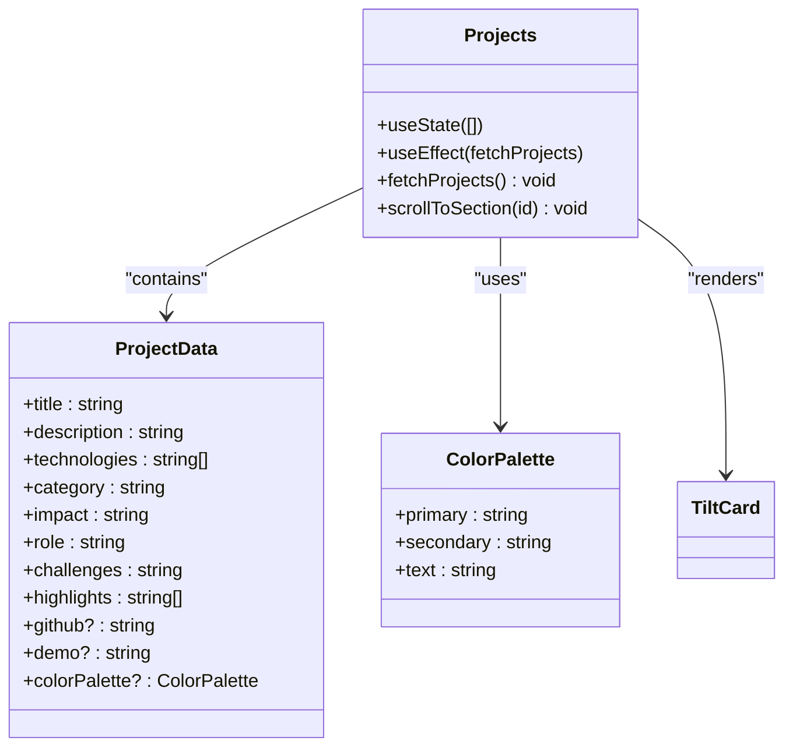
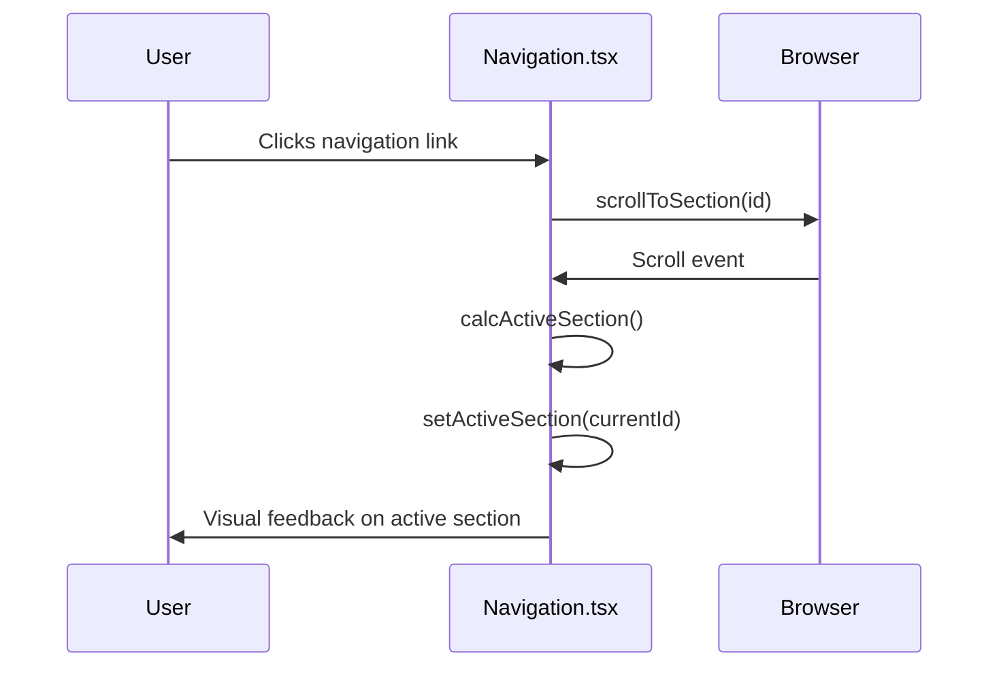

# Customization Guide

<cite>
**Referenced Files in This Document**
- [hero.json](file://public/data/hero.json)
- [about.json](file://public/data/about.json)
- [projects.json](file://public/data/projects.json)
- [tailwind.config.ts](file://tailwind.config.ts)
- [index.html](file://index.html)
- [Projects.tsx](file://src/components/pages/Projects.tsx)
- [Navigation.tsx](file://src/components/layout/Navigation.tsx)
- [Index.tsx](file://src/pages/Index.tsx)
</cite>

## Table of Contents
1. [Introduction](#introduction)
2. [Personal Information Updates](#personal-information-updates)
3. [Resume Replacement](#resume-replacement)
4. [Project Details Customization](#project-details-customization)
5. [Theme Customization](#theme-customization)
6. [Adding New Sections](#adding-new-sections)
7. [Branding Updates](#branding-updates)
8. [Code Quality Best Practices](#code-quality-best-practices)
9. [Beginner Safety Guidelines](#beginner-safety-guidelines)
10. [Advanced Customizations](#advanced-customizations)

## Introduction
This guide provides comprehensive instructions for customizing the farruh-folio-wave portfolio template for personal use. The documentation covers updating personal information, modifying visual themes, adding new sections, and implementing advanced features while maintaining code integrity.

## Personal Information Updates
Update personal details by modifying JSON files located in `/public/data`. Each section has a dedicated JSON file that controls its content.

### Hero Section Configuration
Modify `hero.json` to update the main landing page content:
- **badge**: Professional title or designation
- **name**: Full name display
- **subtitle**: Secondary professional title
- **description**: Detailed professional summary
- **primaryButtonText**: Label for resume download button
- **secondaryButtonText**: Call-to-action text for contact
- **stats**: Array of achievement statistics with number and label pairs

```json
{
  "badge": "AI/ML Software Engineer",
  "name": "Farruh Sheripov",
  "subtitle": "AI/ML Engineer & Backend Architect",
  "description": "Results-driven AI/ML Engineer with a strong backend foundation...",
  "primaryButtonText": "Download Resume",
  "primaryButtonLink": "/media/farruh-sheripov-cv.pdf",
  "secondaryButtonText": "Get In Touch",
  "stats": [
    { "number": "7+", "label": "Years in AI/Backend" },
    { "number": "10+", "label": "AI/ML Projects" }
  ]
}
```

**Section sources**
- [hero.json](file://public/data/hero.json#L1-L14)

### About Section Configuration
Update `about.json` to customize the personal information section:
- **personalInfo**: Array of personal details with icon, title, value, and description
- **interests**: Technical interests with associated icons and color coding
- **bio**: Array of paragraphs with optional highlighted text using `[[text|color]]` syntax
- **stats**: Achievement statistics with number, label, and color properties

The bio field supports rich text formatting where `[[text|color]]` creates highlighted text segments with specified colors (e.g., blue, emerald, violet).

**Section sources**
- [about.json](file://public/data/about.json#L1-L39)

## Resume Replacement
Replace the default resume PDF by uploading your document to the `/public/media` directory. Update the `primaryButtonLink` field in `hero.json` to point to your resume file:

```json
"primaryButtonLink": "/media/your-name-cv.pdf"
```

Ensure the PDF file is optimized for web viewing with appropriate compression to maintain fast loading times. The file should be placed in the `/public/media` directory and referenced with the correct filename in the JSON configuration.

**Section sources**
- [hero.json](file://public/data/hero.json#L8-L9)

## Project Details Customization
Update project showcases by modifying both the data source and component implementation.

### Projects Data Configuration
Edit `projects.json` to update project listings. Each project entry includes:
- **title**: Project name
- **description**: Detailed project overview
- **technologies**: Array of technology stack items
- **category**: Project classification
- **impact**: Business or technical impact metrics
- **role**: Your role in the project
- **challenges**: Key challenges overcome
- **highlights**: Array of key achievements or features
- **github**: GitHub repository URL
- **demo**: Live demo URL
- **hideCode/hideDemo**: Boolean flags to hide links

```json
[
  {
    "title": "PII Redaction & NER Pipeline",
    "description": "Production-grade pipeline for Named Entity Recognition...",
    "technologies": ["Python", "BERT", "Transformers"],
    "category": "AI/ML & NLP",
    "impact": "Enabled secure document processing for financial institutions...",
    "role": "Lead ML Engineer",
    "challenges": "Balancing model accuracy with inference speed...",
    "highlights": [
      "Fine-tuned transformer models for NER",
      "Integrated Presidio for document anonymization"
    ],
    "github": "https://github.com/username/project",
    "demo": "https://demo.yourdomain.com"
  }
]
```

**Section sources**
- [projects.json](file://public/data/projects.json#L1-L88)

### Projects Component Structure
The `Projects.tsx` component dynamically loads project data and applies color palettes from a predefined array. Each project card uses CSS variables for styling consistency and includes interactive elements like tilt effects and shimmer animations.

The component implements responsive design principles and accessibility features, including proper ARIA labels and keyboard navigation support.



**Diagram sources**
- [Projects.tsx](file://src/components/pages/Projects.tsx#L1-L232)
- [TiltCard.tsx](file://src/components/shared/TiltCard.tsx)

**Section sources**
- [Projects.tsx](file://src/components/pages/Projects.tsx#L1-L232)

## Theme Customization
Modify the visual appearance through Tailwind configuration and CSS variables.

### Color Palette Configuration
Customize colors by editing `tailwind.config.ts`. The theme extends default colors using CSS variables that can be overridden in CSS:

```typescript
theme: {
  extend: {
    colors: {
      primary: {
        DEFAULT: 'hsl(var(--primary))',
        foreground: 'hsl(var(--primary-foreground))'
      },
      secondary: {
        DEFAULT: 'hsl(var(--secondary))',
        foreground: 'hsl(var(--secondary-foreground))'
      }
    }
  }
}
```

To change the color scheme, modify the CSS variables in the relevant component CSS files or create a custom CSS file that overrides the default values.

**Section sources**
- [tailwind.config.ts](file://tailwind.config.ts#L20-L70)

### Font and Typography Updates
Update fonts by modifying the `index.css` file or adding custom font imports. The current configuration uses system-ui fonts with fallbacks for cross-platform consistency.

To add custom fonts:
1. Import font files in `index.css`
2. Define font families in the CSS
3. Apply fonts to specific elements using Tailwind classes
4. Ensure web-safe fallbacks are maintained

### Layout Adjustments
Adjust layout spacing and sizing through Tailwind's configuration options. Modify padding, margins, and container sizes in `tailwind.config.ts`:

```typescript
theme: {
  container: {
    center: true,
    padding: '2rem',
    screens: {
      '2xl': '1400px'
    }
  }
}
```

## Adding New Sections
Extend functionality by creating new components and integrating them into the site structure.

### Creating New Components
1. Create a new component file in `/src/components/pages/`
2. Implement the component with proper TypeScript interfaces
3. Style using CSS modules following existing patterns
4. Include necessary animations and effects

Example component structure:
```tsx
import React from 'react';
import styles from './NewSection.module.css';

export const NewSection = () => {
  return (
    <section id="new-section" className={styles.section}>
      <div className={styles.container}>
        {/* Component content */}
      </div>
    </section>
  );
};
```

### Integration with Index.tsx
Add the new component to the main page flow in `Index.tsx`:

```tsx
import { NewSection } from '@/components/pages/NewSection';

const Index = () => {
  return (
    <div>
      <Navigation />
      <ParallaxBackground config={parallaxConfig}>
        <AnimatedParticles config={particleConfig} />
        <div className="relative z-10">
          <Hero />
          <About />
          {/* ... other sections */}
          <NewSection />
          <Contact />
        </div>
      </ParallaxBackground>
      <footer>...</footer>
    </div>
  );
};
```

**Section sources**
- [Index.tsx](file://src/pages/Index.tsx#L1-L89)

### Navigation Integration
Update the navigation menu in `Navigation.tsx` by adding the new section to the `navItems` array:

```typescript
const navItems = [
  { id: 'hero', label: 'Home' },
  { id: 'about', label: 'About' },
  // ... existing items
  { id: 'new-section', label: 'New Section' },
  { id: 'contact', label: 'Contact' },
];
```

The navigation automatically handles scroll targeting and active state management through the `scrollToSection` function and scroll-spy functionality.



**Diagram sources**
- [Navigation.tsx](file://src/components/layout/Navigation.tsx#L1-L215)

**Section sources**
- [Navigation.tsx](file://src/components/layout/Navigation.tsx#L1-L215)

## Branding Updates
Enhance brand identity through various touchpoints.

### Favicon Configuration
Replace the favicon by updating `/public/icons/favicon.png` with your custom icon. Ensure the image is 32x32 pixels and in PNG format for optimal compatibility across browsers.

### Meta Tags Management
Update SEO and social sharing metadata in `index.html`:
- **title**: Page title for search engines
- **description**: Content summary for search results
- **author**: Your name
- **keywords**: SEO keywords
- **og:title**: Open Graph title for social sharing
- **og:description**: Social media description
- **og:url**: Canonical URL

```html
<title>Farruh Sheripov - Senior Python Developer & Cloud Architect</title>
<meta name="description" content="Senior Python Developer specializing in Django, Google Cloud Platform..." />
<meta property="og:title" content="Farruh Sheripov - Senior Python Developer & Cloud Architect" />
```

**Section sources**
- [index.html](file://index.html#L1-L23)

### Social Sharing Images
Add Open Graph images by including additional meta tags:
```html
<meta property="og:image" content="/media/og-image.jpg" />
<meta property="og:image:width" content="1200" />
<meta property="og:image:height" content="630" />
```

Create a 1200x630 pixel image in `/public/media/` that represents your professional brand for optimal social media sharing.

## Code Quality Best Practices
Maintain code integrity during customization.

### Type Safety
Preserve TypeScript interfaces when modifying data structures. When extending JSON schemas, update corresponding TypeScript types in component files to maintain type checking.

### Responsive Design
Test all changes across device breakpoints (mobile, tablet, desktop). Use the built-in mobile detection hook (`useIsMobile`) for conditional rendering when necessary.

### Performance Optimization
- Compress images and assets
- Minimize JSON file sizes
- Avoid unnecessary re-renders with proper useEffect dependencies
- Maintain efficient DOM structures

## Beginner Safety Guidelines
Follow these recommendations for safe modifications.

### Safe Edit Zones
Focus on these areas for risk-free customization:
- JSON data files (`/public/data/*.json`)
- Text content within components
- Color values in CSS variables
- Meta tags in `index.html`

### Backup Strategy
1. Create a Git repository before making changes
2. Commit the original state as baseline
3. Make incremental changes with descriptive commit messages
4. Use branches for experimental modifications

### Version Control
Initialize Git if not already present:
```bash
git init
git add .
git commit -m "Initial commit - original template"
```

## Advanced Customizations
Extend functionality for experienced developers.

### Analytics Integration
Add analytics by:
1. Creating an analytics service module
2. Implementing tracking hooks
3. Integrating with popular providers (Google Analytics, Plausible, etc.)
4. Adding consent management for GDPR compliance

### CMS Backend
Connect to headless CMS platforms:
- **Contentful**: Use Contentful.js SDK
- **Sanity**: Implement Sanity client
- **Strapi**: Create API endpoints
- **Direct Markdown**: Process markdown files through Vite

### Internationalization
Implement multi-language support:
1. Create language JSON files
2. Develop translation context/provider
3. Implement language switcher component
4. Handle date/number formatting localization

### Custom Animations
Extend animation capabilities by:
- Modifying existing Parallax configurations
- Creating new AnimatedParticles presets
- Implementing GSAP for complex sequences
- Adding scroll-triggered animations