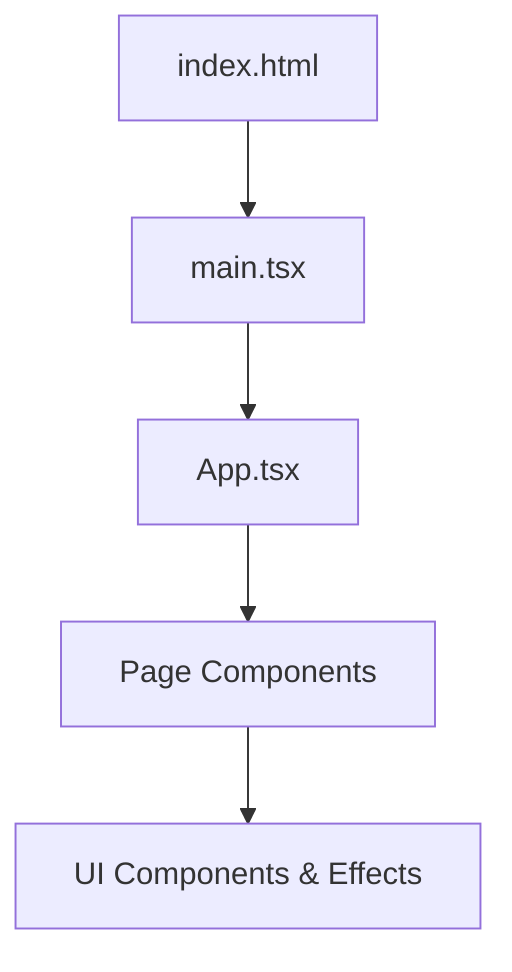

# Getting Started

<cite>
**Referenced Files in This Document**   
- [package.json](file://package.json)
- [vite.config.ts](file://vite.config.ts)
- [index.html](file://index.html)
- [main.tsx](file://src/main.tsx)
- [README.md](file://README.md)
</cite>

## Table of Contents
1. [Introduction](#introduction)
2. [Prerequisites](#prerequisites)
3. [Installation Process](#installation-process)
4. [Running the Development Server](#running-the-development-server)
5. [Building for Production](#building-for-production)
6. [Project Configuration Overview](#project-configuration-overview)
7. [Environment and Port Configuration](#environment-and-port-configuration)
8. [Understanding Key Files](#understanding-key-files)
9. [Troubleshooting Common Issues](#troubleshooting-common-issues)

## Introduction
This guide provides comprehensive instructions for setting up and running the **farruh-folio-wave** project locally. The application is a modern portfolio website built with React, TypeScript, and Vite, styled using Tailwind CSS. It features responsive design, interactive components, and optimized performance.

The setup process includes cloning the repository, installing dependencies, launching the development server, and building for production. This documentation caters to both beginners and advanced users by explaining core concepts such as the development server and build process while also offering customization options through Vite configuration.

**Section sources**
- [README.md](file://README.md#L0-L145)

## Prerequisites
Before beginning the installation, ensure your system meets the following requirements:

- **Node.js**: Version 18 or higher
- **Package Manager**: npm (included with Node.js) or yarn

You can verify your Node.js version by running:
```bash
node --version
```

If Node.js is not installed or an outdated version is present, download and install it from [https://nodejs.org](https://nodejs.org).

**Section sources**
- [README.md](file://README.md#L65-L68)

## Installation Process
Follow these steps to set up the project on your local machine:

### Step 1: Clone the Repository
Begin by cloning the project from its GitHub repository:
```bash
git clone https://github.com/farruh-sheripov/portfolio.git
cd portfolio
```

### Step 2: Install Dependencies
Install all required packages listed in `package.json` using npm:
```bash
npm install
```

This command installs both production and development dependencies, including React, Vite, Tailwind CSS, and associated tooling.

**Section sources**
- [package.json](file://package.json#L0-L87)
- [README.md](file://README.md#L70-L78)

## Running the Development Server
Once dependencies are installed, start the development server using the following command:
```bash
npm run dev
```

This executes the `dev` script defined in `package.json`, which runs the Vite development server.

After starting, you should see output similar to:
```
vite v6.3.5 dev server running at:
> Local: http://localhost:8080/
> Network: use `--host` to expose
```

Navigate to [http://localhost:8080](http://localhost:8080) in your browser to view the application.

> **Note**: Although the default URL shown may vary, the actual port used is configured in `vite.config.ts`.

**Section sources**
- [package.json](file://package.json#L6-L8)
- [vite.config.ts](file://vite.config.ts#L5-L12)
- [README.md](file://README.md#L80-L84)

## Building for Production
To generate a production-ready build of the application, run:
```bash
npm run build
```

This command triggers Vite’s build process, which:
- Compiles and optimizes all assets
- Minifies JavaScript and CSS
- Generates static files ready for deployment

The output is placed in the `dist/` directory. You can customize this behavior using additional flags:
```bash
npm run build:dev   # Build in development mode
NODE_ENV=production vite build  # Explicit production environment
```

For deployment to GitHub Pages:
```bash
npm run build:gh-pages
```

**Section sources**
- [package.json](file://package.json#L9-L11)
- [vite.config.ts](file://vite.config.ts#L20-L27)

## Project Configuration Overview
The project uses several key configuration files that control behavior during development and production.

### Vite Configuration (`vite.config.ts`)
Controls how the development server operates and how builds are generated. Key settings include:
- `base`: Sets the base public path for assets
- `server.port`: Specifies the port number (currently set to 8080)
- `resolve.alias`: Enables `@` alias for `/src` directory imports
- `build.sourcemap`: Disabled in production for security

### Entry Point (`index.html`)
Serves as the root HTML file loaded by the browser. It:
- Defines metadata (title, description, CSP headers)
- Contains the `<div id="root">` where React mounts the app
- References `main.tsx` as the entry script

### Main Application Bootstrap (`main.tsx`)
Initializes the React application by:
- Importing necessary modules
- Rendering the `App` component into the DOM



**Diagram sources**
- [index.html](file://index.html#L1-L24)
- [main.tsx](file://src/main.tsx#L1-L6)
- [vite.config.ts](file://vite.config.ts#L1-L28)

**Section sources**
- [index.html](file://index.html#L1-L24)
- [main.tsx](file://src/main.tsx#L1-L6)
- [vite.config.ts](file://vite.config.ts#L1-L28)

## Environment and Port Configuration
By default, the development server runs on port `8080`, as specified in `vite.config.ts`. To change this:

1. Edit the `server.port` value in `vite.config.ts`
2. Restart the development server

To allow network access (e.g., from other devices), start the server with:
```bash
vite --host
```

Or modify the config:
```ts
server: {
  host: true,
  port: 8080,
}
```

HTTPS can be enabled by adding SSL configuration to Vite, though it's not currently implemented.

**Section sources**
- [vite.config.ts](file://vite.config.ts#L7-L11)

## Understanding Key Files
Below is a summary of critical files involved in setup and execution.

| File | Purpose | Relevant Scripts/Config |
|------|-------|------------------------|
| `package.json` | Defines project metadata, dependencies, and scripts | `"dev"`, `"build"` |
| `vite.config.ts` | Configures Vite behavior for dev and build | `server`, `build`, `plugins` |
| `index.html` | Entry HTML page; defines structure and metadata | `<div id="root">`, meta tags |
| `src/main.tsx` | Bootstraps React app | `createRoot`, renders `<App />` |
| `tailwind.config.ts` | Customizes Tailwind CSS | theme, plugins, content paths |

Advanced users can pass CLI flags directly to Vite:
```bash
vite --port 3000 --open
vite build --outDir custom-dist --minify false
```

See [Vite CLI documentation](https://vitejs.dev/guide/cli.html) for more options.

**Section sources**
- [package.json](file://package.json#L0-L87)
- [vite.config.ts](file://vite.config.ts#L1-L28)
- [index.html](file://index.html#L1-L24)
- [main.tsx](file://src/main.tsx#L1-L6)
- [tailwind.config.ts](file://tailwind.config.ts#L1-L128)

## Troubleshooting Common Issues
Here are solutions to frequently encountered problems during setup.

### Issue: Incorrect Node.js Version
**Symptom**: `Error: The engine "node" is incompatible with this module`
**Solution**: Upgrade Node.js to v18+
```bash
node --version
# If below v18, update via nvm or official installer
```

### Issue: Missing Dependencies
**Symptom**: Module not found errors after `npm install`
**Solution**: Clear cache and reinstall
```bash
rm -rf node_modules package-lock.json
npm cache clean --force
npm install
```

### Issue: Port Already in Use
**Symptom**: `Error: listen EADDRINUSE: address already in use`
**Solution**: Change port in `vite.config.ts` or terminate the conflicting process:
```bash
lsof -i :8080
kill -9 <PID>
```

### Issue: Blank Page on Load
**Symptom**: White screen with no content
**Check**:
- Ensure `main.tsx` correctly mounts to `#root`
- Confirm `index.html` has not been modified
- Check browser console for JS errors

### Issue: Build Output Not Generated
**Symptom**: No `dist/` folder after `npm run build`
**Solution**: Verify disk space and permissions, then re-run:
```bash
npm run build
ls dist/
```

**Section sources**
- [README.md](file://README.md#L65-L84)
- [package.json](file://package.json#L6-L11)
- [vite.config.ts](file://vite.config.ts#L7-L12)