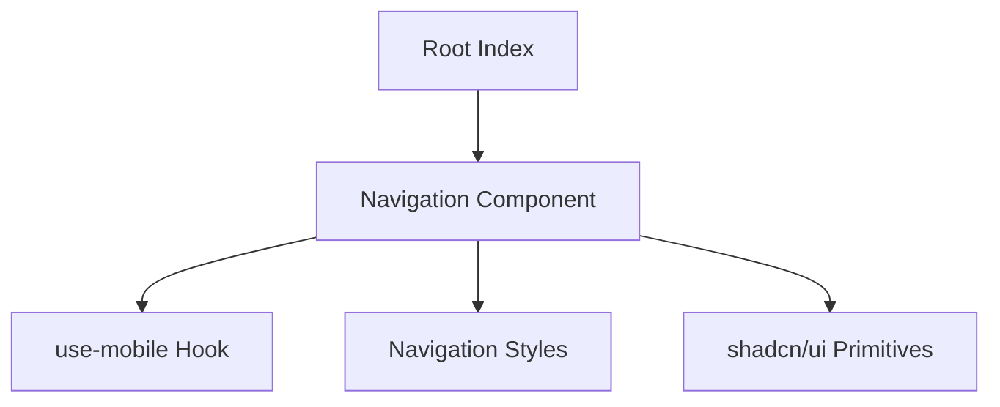
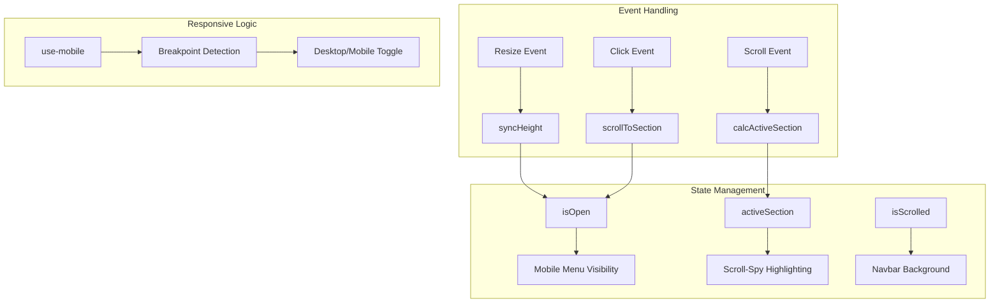
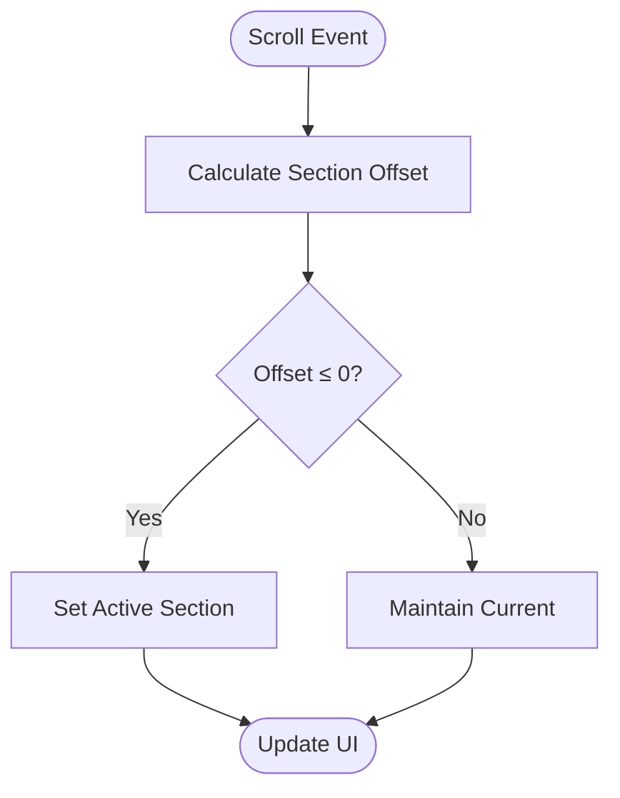
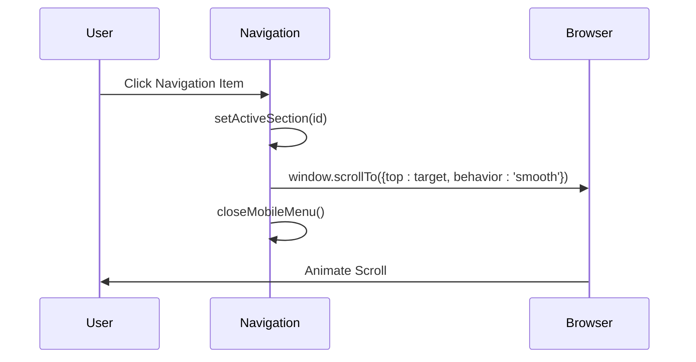
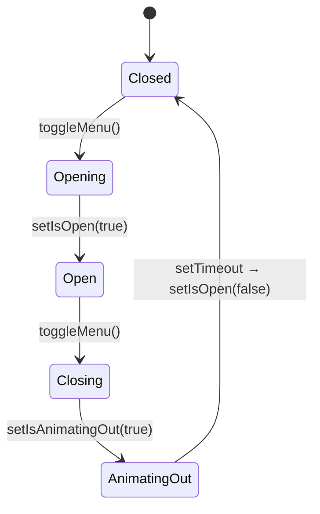
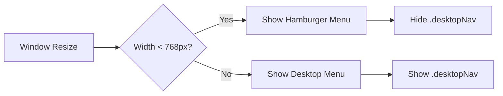

# Navigation System

<cite>
**Referenced Files in This Document**   
- [Navigation.tsx](file://src/components/layout/Navigation.tsx)
- [use-mobile.tsx](file://src/hooks/use-mobile.tsx)
- [Navigation.module.css](file://src/components/layout/Navigation.module.css)
</cite>

## Table of Contents
1. [Introduction](#introduction)
2. [Project Structure](#project-structure)
3. [Core Components](#core-components)
4. [Architecture Overview](#architecture-overview)
5. [Detailed Component Analysis](#detailed-component-analysis)
6. [Dependency Analysis](#dependency-analysis)
7. [Performance Considerations](#performance-considerations)
8. [Troubleshooting Guide](#troubleshooting-guide)
9. [Conclusion](#conclusion)

## Introduction
The navigation system in farruh-folio-wave provides a responsive, interactive interface for navigating between page sections via anchor links. It features both desktop and mobile implementations with smooth scrolling, scroll-spy detection, and accessibility support. The core component `Navigation.tsx` uses shadcn/ui's navigation-menu pattern while implementing custom hamburger toggle functionality through `use-mobile.tsx`. This documentation details the implementation, behavior, and usage patterns of this navigation system.

## Project Structure
The navigation system is organized within the component hierarchy as follows:
- **src/components/layout/**: Contains `Navigation.tsx` and its associated CSS module
- **src/hooks/**: Houses the `use-mobile.tsx` hook for responsive breakpoint detection
- **src/components/ui/**: Includes shadcn/ui primitives like `navigation-menu.tsx`
- **src/pages/Index.tsx**: Integrates the Navigation component at the root level



**Diagram sources**
- [Index.tsx](file://src/pages/Index.tsx#L1-L90)
- [Navigation.tsx](file://src/components/layout/Navigation.tsx#L1-L216)

**Section sources**
- [Index.tsx](file://src/pages/Index.tsx#L1-L90)
- [Navigation.tsx](file://src/components/layout/Navigation.tsx#L1-L216)

## Core Components
The navigation system consists of three primary components:
1. **Navigation.tsx**: Main navigation component handling state, scroll events, and rendering
2. **use-mobile.tsx**: Custom hook detecting mobile viewport size
3. **Navigation.module.css**: Styling with responsive breakpoints and animations

These components work together to provide a seamless navigation experience across devices.

**Section sources**
- [Navigation.tsx](file://src/components/layout/Navigation.tsx#L1-L216)
- [use-mobile.tsx](file://src/hooks/use-mobile.tsx#L1-L20)
- [Navigation.module.css](file://src/components/layout/Navigation.module.css#L1-L79)

## Architecture Overview
The navigation architecture implements a hybrid approach combining React state management with DOM manipulation for optimal performance. Key architectural decisions include requestAnimationFrame throttling for scroll events, CSS variable synchronization for layout measurement, and conditional rendering based on mobile detection.



**Diagram sources**
- [Navigation.tsx](file://src/components/layout/Navigation.tsx#L24-L145)
- [use-mobile.tsx](file://src/hooks/use-mobile.tsx#L1-L20)

## Detailed Component Analysis

### Navigation Component Analysis
The `Navigation` component implements several sophisticated features for modern web navigation.

#### Scroll-Spy Detection
The scroll-spy mechanism determines the currently active section by comparing element positions against the viewport. It uses `getBoundingClientRect()` to calculate offsets relative to the navbar height, updating the active state when sections cross the navigation boundary.



**Diagram sources**
- [Navigation.tsx](file://src/components/layout/Navigation.tsx#L50-L77)

#### Smooth Scrolling Implementation
Smooth scrolling is achieved through the native `window.scrollTo()` method with `{ behavior: 'smooth' }`. The implementation includes immediate active section highlighting upon click, providing instant visual feedback while the smooth animation occurs.



**Diagram sources**
- [Navigation.tsx](file://src/components/layout/Navigation.tsx#L118-L145)

#### Mobile Menu State Management
The mobile menu uses a two-stage animation process with `isOpen` and `isAnimatingOut` states to ensure proper CSS transition sequencing. This prevents abrupt disappearance during the exit animation.



**Diagram sources**
- [Navigation.tsx](file://src/components/layout/Navigation.tsx#L147-L159)

### Responsive Breakpoints and Layout Switching
The system uses a 768px breakpoint to switch between desktop and mobile layouts. This is implemented through both CSS media queries and JavaScript detection.



**Diagram sources**
- [Navigation.module.css](file://src/components/layout/Navigation.module.css#L1-L79)
- [use-mobile.tsx](file://src/hooks/use-mobile.tsx#L1-L20)

## Dependency Analysis
The navigation system has minimal external dependencies, relying primarily on React and Lucide icons. It integrates with shadcn/ui components while maintaining independent state management.

```mermaid
dependency-graph
Navigation --> React
Navigation --> LucideIcons
Navigation --> use-mobile
Navigation --> NavigationStyles
Navigation --> shadcn-ui
use-mobile --> React
shadcn-ui --> @radix-ui/react-navigation-menu
```

**Diagram sources**
- [Navigation.tsx](file://src/components/layout/Navigation.tsx#L1-L216)
- [package-lock.json](file://package-lock.json#L1464-L1498)

**Section sources**
- [Navigation.tsx](file://src/components/layout/Navigation.tsx#L1-L216)
- [use-mobile.tsx](file://src/hooks/use-mobile.tsx#L1-L20)

## Performance Considerations
The navigation system implements several optimization techniques:
- **requestAnimationFrame throttling**: Prevents excessive recalculations during scroll events
- **Passive event listeners**: Improves scroll performance by indicating non-cancellable handlers
- **CSS variable synchronization**: Eliminates layout thrashing by caching navbar height
- **useCallback memoization**: Optimizes function references for event handlers

The scroll handler specifically uses a "ticking" pattern to limit execution to one frame per animation cycle, significantly reducing computational overhead while maintaining responsiveness.

**Section sources**
- [Navigation.tsx](file://src/components/layout/Navigation.tsx#L76-L116)

## Troubleshooting Guide
Common issues and their solutions:

### Incorrect Active States
**Symptom**: Wrong section highlighted during scroll  
**Cause**: Navbar height mismatch between JS and CSS  
**Solution**: Ensure `--nav-height` CSS variable is properly synchronized via `syncHeight()` effect

### Mobile Menu Animation Issues
**Symptom**: Menu disappears without animation  
**Cause**: Missing `isAnimatingOut` state management  
**Solution**: Verify timeout sequence in `closeMobileMenu()` function

### Smooth Scrolling Not Working
**Symptom**: Instant jump instead of smooth transition  
**Cause**: Browser compatibility or CSS `scroll-behavior` override  
**Solution**: Check for conflicting CSS rules and verify browser support

### Responsive Layout Problems
**Symptom**: Desktop menu visible on mobile or vice versa  
**Cause**: Media query breakpoint mismatch  
**Solution**: Verify consistency between CSS (`768px`) and JavaScript (`MOBILE_BREAKPOINT`) values

**Section sources**
- [Navigation.tsx](file://src/components/layout/Navigation.tsx#L24-L48)
- [Navigation.module.css](file://src/components/layout/Navigation.module.css#L1-L79)

## Conclusion
The navigation system in farruh-folio-wave demonstrates a robust implementation of modern web navigation patterns. By combining React state management with efficient DOM manipulation, it delivers a responsive, accessible user experience across devices. The architecture balances performance considerations with rich interactive features, including smooth scrolling, scroll-spy detection, and animated transitions. For developers, the clear separation of concerns and well-documented code make it maintainable and extensible.