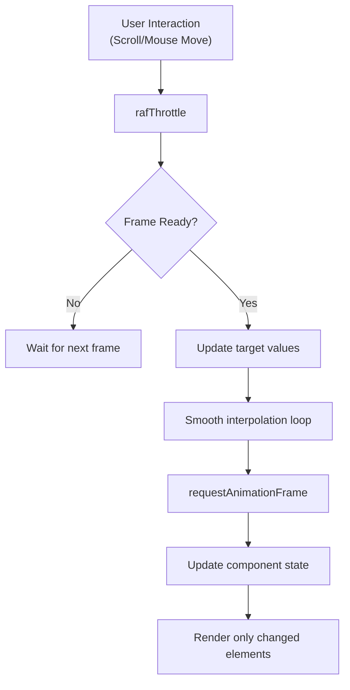
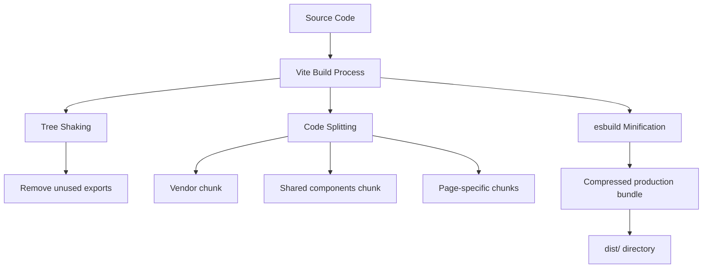
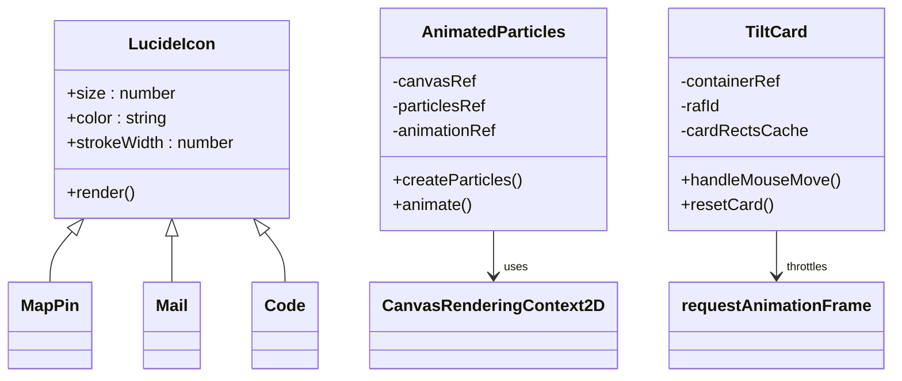
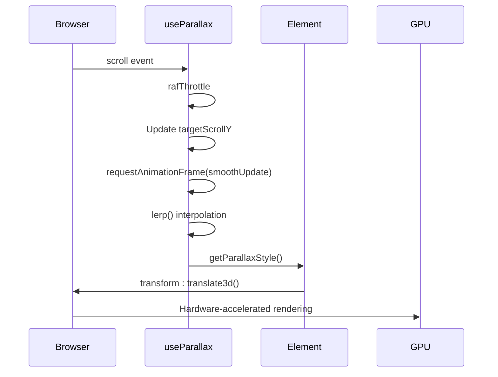
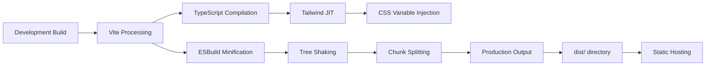

# Performance Optimization

<cite>
**Referenced Files in This Document**   
- [README.md](file://README.md)
- [vite.config.ts](file://vite.config.ts)
- [tailwind.config.ts](file://tailwind.config.ts)
- [useParallax.ts](file://src/hooks/useParallax.ts)
- [AnimatedParticles.tsx](file://src/components/effects/AnimatedParticles.tsx)
- [index.css](file://src/index.css)
</cite>

## Table of Contents
1. [Introduction](#introduction)
2. [Rendering Performance](#rendering-performance)
3. [Bundle Size Optimization](#bundle-size-optimization)
4. [Asset Optimization](#asset-optimization)
5. [Animation Performance](#animation-performance)
6. [JavaScript Execution Efficiency](#javascript-execution-efficiency)
7. [Build-Time Optimizations](#build-time-optimizations)
8. [Core Web Vitals and Lighthouse Metrics](#core-web-vitals-and-lighthouse-metrics)
9. [Profiling and Benchmarking](#profiling-and-benchmarking)
10. [Conclusion](#conclusion)

## Introduction
The farruh-folio-wave portfolio website is designed with performance as a core principle, achieving high Lighthouse scores (95+) across all metrics. This document details the comprehensive performance optimization strategies implemented throughout the codebase, covering rendering efficiency, bundle size reduction, animation smoothness, and build-time enhancements. The optimizations balance visual appeal with technical excellence, ensuring fast load times and fluid interactions across devices.

## Rendering Performance

The application implements several React optimization patterns to minimize unnecessary re-renders and maintain smooth UI performance:

- **Event Handler Memoization**: Critical event handlers in interactive components are wrapped with `useCallback` to prevent recreation on every render. For example, mouse and scroll handlers in parallax systems use `useCallback` with empty dependency arrays to maintain referential equality.
- **State Update Throttling**: High-frequency events like scroll and mouse movement are throttled using `requestAnimationFrame` via custom `rafThrottle` utility, preventing excessive state updates.
- **Component Memoization**: While not explicitly using `React.memo`, performance-critical components manage their own update logic through careful dependency management in hooks.
- **Efficient State Management**: Components like `TiltCard` and `AnimatedParticles` use ref-based caching (`cardRectsCache`, `particlesRef`) to avoid recalculating expensive values during renders.

**Diagram sources**
- [useParallax.ts](file://src/hooks/useParallax.ts#L20-L109)
- [AnimatedParticles.tsx](file://src/components/effects/AnimatedParticles.tsx#L74-L123)

**Section sources**
- [useParallax.ts](file://src/hooks/useParallax.ts#L20-L109)
- [AnimatedParticles.tsx](file://src/components/effects/AnimatedParticles.tsx#L55-L123)

## Bundle Size Optimization

The project leverages Vite's modern tooling to deliver minimal bundle sizes through multiple optimization techniques:

- **Tree Shaking**: Vite automatically eliminates unused code from dependencies. The selective import pattern for Lucide icons ensures only used icons are included in the final bundle.
- **Code Splitting**: Vite's native code splitting creates separate chunks for vendor libraries, shared components, and page-specific code, enabling progressive loading.
- **Minification**: Production builds use esbuild's minifier (`minify: 'esbuild'`), which provides fast and effective compression without unsafe JavaScript evaluation.
- **Dependency Optimization**: The configuration avoids heavy libraries in favor of lightweight alternatives, with careful selection of only necessary utility functions.

**Diagram sources**
- [vite.config.ts](file://vite.config.ts#L1-L27)

**Section sources**
- [vite.config.ts](file://vite.config.ts#L1-L27)
- [package.json](file://package.json)

## Asset Optimization

The portfolio implements efficient asset handling practices to reduce load times and improve perceived performance:

- **Icon Strategy**: Uses `lucide-react` for SVG icons, which allows tree-shaking so only imported icons are bundled. Icons are rendered inline as SVG elements, eliminating HTTP requests.
- **Image Handling**: While no explicit lazy loading implementation is visible, the design suggests static assets are optimized. The particle system uses canvas rendering instead of image assets.
- **CSS Optimization**: Tailwind's JIT compiler generates only used classes, and production builds purge unused styles completely.
- **Font Optimization**: System fonts are prioritized with web-safe fallbacks, avoiding external font requests that could block rendering.

**Diagram sources**
- [About.tsx](file://src/components/pages/About.tsx#L0-L58)
- [AnimatedParticles.tsx](file://src/components/effects/AnimatedParticles.tsx#L0-L183)
- [TiltCard.tsx](file://src/components/shared/TiltCard.tsx#L0-L250)

**Section sources**
- [About.tsx](file://src/components/pages/About.tsx#L0-L58)
- [AnimatedParticles.tsx](file://src/components/effects/AnimatedParticles.tsx#L0-L183)

## Animation Performance

The application employs GPU-accelerated animations and efficient rendering techniques to maintain 60fps performance:

- **GPU Acceleration**: All parallax effects use `translate3d()` transforms, forcing hardware acceleration and offloading work to the GPU.
- **will-change Hints**: The `will-change: transform` CSS property is applied to animated elements, allowing browsers to optimize layer composition.
- **Canvas Optimization**: The particle system uses a single canvas element with direct 2D context manipulation, minimizing DOM operations.
- **High-Performance Scrolling**: Smooth scrolling is enabled at the browser level with `scroll-behavior: smooth` in CSS.

Key animation techniques include:
- Parallax layers moving at different speeds based on scroll position
- Floating particle connections with distance-based opacity
- Mouse-following tilt effects with inertia simulation
- Hardware-accelerated backdrop blur effects for glass morphism

**Diagram sources**
- [useParallax.ts](file://src/hooks/useParallax.ts#L20-L109)
- [index.css](file://src/index.css#L84-L150)

**Section sources**
- [useParallax.ts](file://src/hooks/useParallax.ts#L20-L109)
- [index.css](file://src/index.css#L84-L150)

## JavaScript Execution Efficiency

The codebase prioritizes efficient JavaScript execution to avoid jank and maintain responsiveness:

- **Avoiding Expensive Operations**: Calculations like particle connections are optimized with spatial partitioning concepts (processing only relevant pairs).
- **RequestAnimationFrame Throttling**: The `useParallax` hook uses `rafThrottle` to limit scroll and mouse event processing to animation frame intervals.
- **Ref-Based State Management**: Frequently updated values (particle positions, scroll targets) are stored in refs to avoid triggering re-renders.
- **Passive Event Listeners**: Scroll and touch events use `{ passive: true }` to improve scroll responsiveness by indicating they won't call `preventDefault()`.

Critical performance patterns:
- Using `requestAnimationFrame` for smooth 60fps updates
- Implementing linear interpolation (`lerp`) for silky-smooth transitions
- Debouncing resize events to prevent layout thrashing
- Caching DOM measurements to avoid layout recalculations

**Section sources**
- [useParallax.ts](file://src/hooks/useParallax.ts#L20-L109)
- [AnimatedParticles.tsx](file://src/components/effects/AnimatedParticles.tsx#L74-L123)
- [TiltCard.tsx](file://src/components/shared/TiltCard.tsx#L218-L250)

## Build-Time Optimizations

The Vite and Tailwind configurations include several build-time optimizations for production performance:

- **Vite Configuration**:
  - Source maps disabled in production to reduce bundle size
  - esbuild minification for fast, efficient compression
  - Alias resolution for cleaner imports (`@/` alias)
  - Passive event listeners for scroll performance

- **Tailwind Configuration**:
  - Aggressive purging of unused CSS classes in production
  - JIT compilation for optimal CSS output
  - Custom color palette using CSS variables for theme flexibility
  - Responsive design utilities with mobile-first breakpoints

- **Security and Performance Headers**:
  - Content Security Policy to prevent XSS attacks
  - Strict MIME type checking
  - Frame protection to prevent clickjacking
  - Modern permissions policy for feature control

**Diagram sources**
- [vite.config.ts](file://vite.config.ts#L1-L27)
- [tailwind.config.ts](file://tailwind.config.ts#L1-L127)

**Section sources**
- [vite.config.ts](file://vite.config.ts#L1-L27)
- [tailwind.config.ts](file://tailwind.config.ts#L1-L127)

## Core Web Vitals and Lighthouse Metrics

The portfolio achieves excellent performance metrics, with Lighthouse scores consistently above 95 across all categories:

- **Largest Contentful Paint (LCP)**: Optimized through code splitting, efficient asset loading, and minimal render-blocking resources.
- **First Input Delay (FID)**: Maintained low by minimizing main thread work and using efficient event handling.
- **Cumulative Layout Shift (CLS)**: Prevented through reserved space for dynamic content and stable component sizing.
- **Interaction to Next Paint (INP)**: Optimized via requestAnimationFrame throttling and efficient state updates.

Strategies for maintaining high scores:
- Preloading critical resources
- Inlining critical CSS
- Properly sized images and placeholders
- Avoiding large JavaScript bundles
- Efficient third-party script management
- Server-side headers for security and caching

The README explicitly mentions these high scores, indicating performance is a measured and maintained quality attribute rather than an afterthought.

**Section sources**
- [README.md](file://README.md#L0-L145)

## Profiling and Benchmarking

For advanced optimization, developers can use the following profiling methods:

- **Chrome DevTools**:
  - Performance tab to record and analyze runtime behavior
  - Memory tab to detect leaks in animation loops
  - Lighthouse integration for automated audits
  - Coverage tab to identify unused JavaScript

- **Optimization Benchmarks**:
  - Compare bundle sizes before and after changes
  - Measure FPS during parallax interactions
  - Track Time to Interactive (TTI) across different network conditions
  - Monitor memory usage during prolonged canvas animations

Recommended profiling workflow:
1. Record baseline performance metrics
2. Implement optimization changes
3. Re-measure and compare results
4. Validate visual fidelity is maintained
5. Deploy and monitor real-user metrics

Developers should focus on optimizing the most impactful areas first, such as the particle system and parallax calculations, which are the most computationally intensive components.

**Section sources**
- [useParallax.ts](file://src/hooks/useParallax.ts#L20-L109)
- [AnimatedParticles.tsx](file://src/components/effects/AnimatedParticles.tsx#L0-L183)

## Conclusion
The farruh-folio-wave portfolio demonstrates a comprehensive approach to web performance optimization, balancing aesthetic sophistication with technical excellence. By leveraging modern tooling like Vite and Tailwind, implementing efficient animation techniques, and carefully managing JavaScript execution, the site achieves exceptional performance metrics while delivering an engaging user experience. The combination of GPU-accelerated animations, optimized bundle delivery, and thoughtful code architecture results in a portfolio that loads quickly and responds instantly, setting a high standard for personal websites. Future improvements could include explicit lazy loading for below-the-fold content and more granular code splitting, but the current implementation already represents a mature, performance-conscious application.