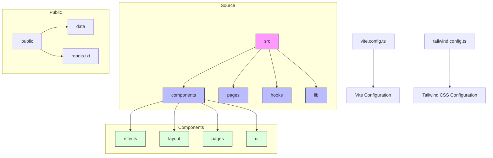
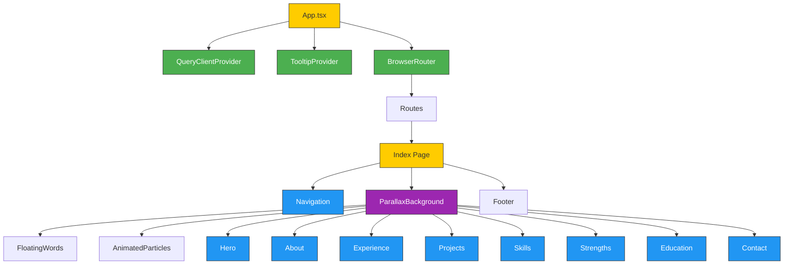
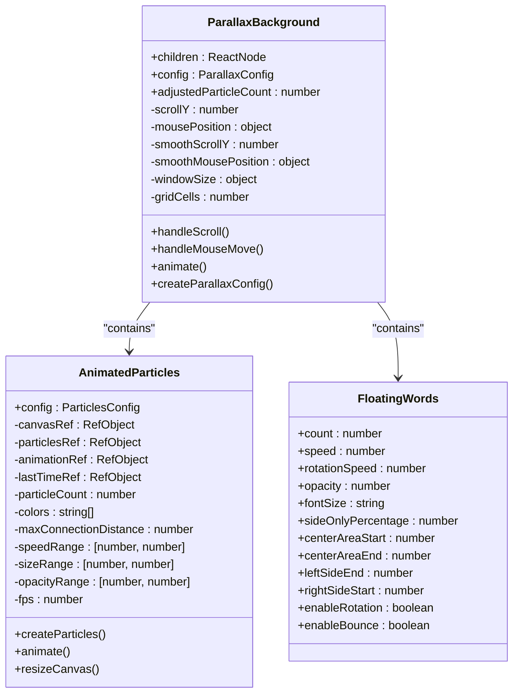
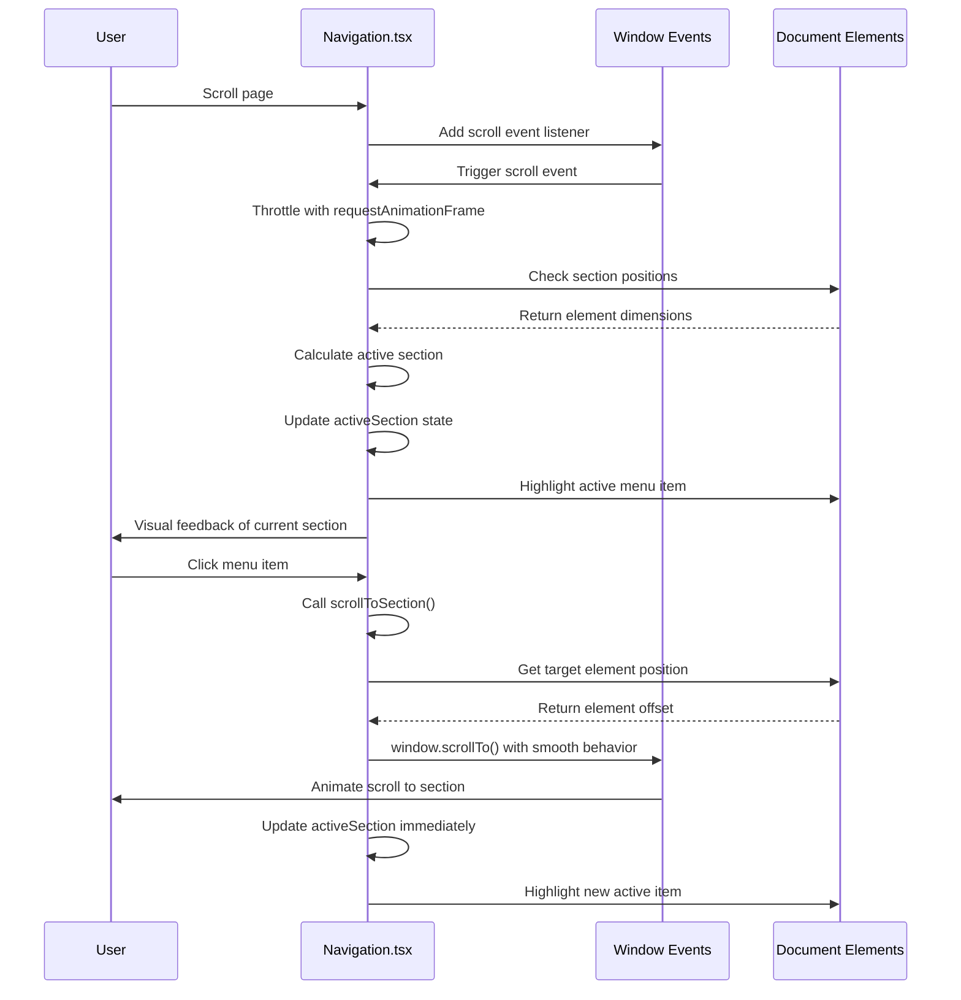
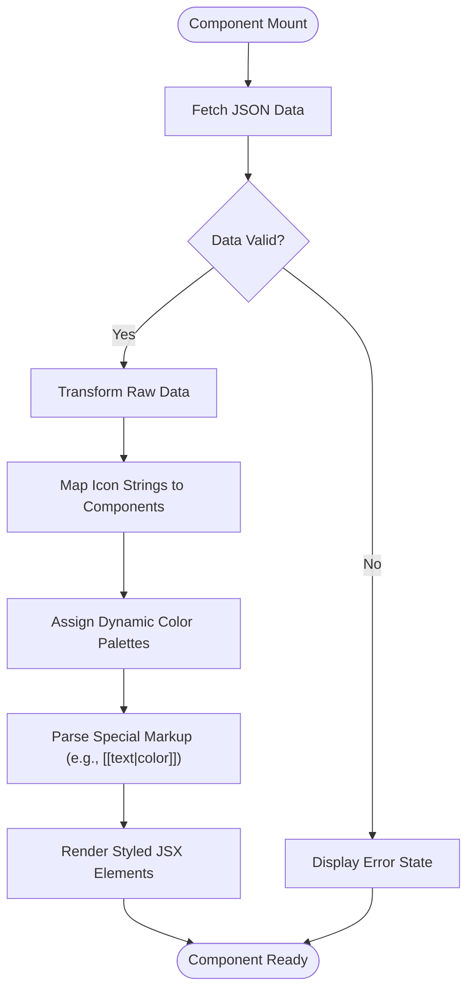
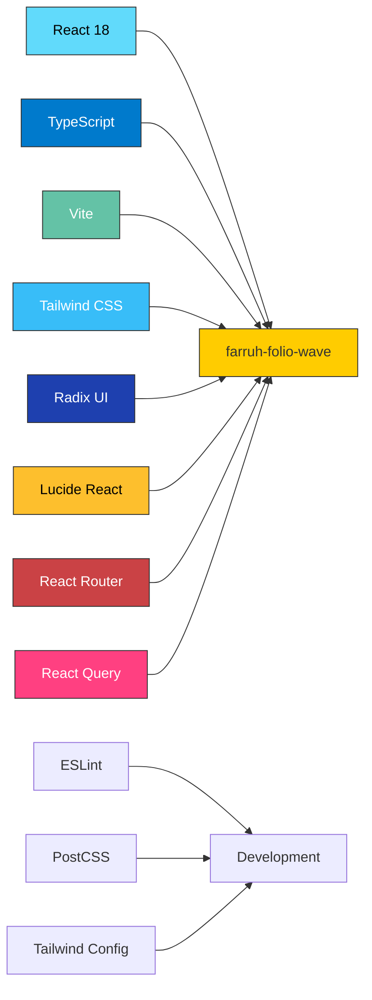

# Project Overview

<cite>
**Referenced Files in This Document**   
- [README.md](file://README.md)
- [App.tsx](file://src/App.tsx)
- [vite.config.ts](file://vite.config.ts)
- [Index.tsx](file://src/pages/Index.tsx)
- [ParallaxBackground.tsx](file://src/components/effects/ParallaxBackground.tsx)
- [AnimatedParticles.tsx](file://src/components/effects/AnimatedParticles.tsx)
- [Navigation.tsx](file://src/components/layout/Navigation.tsx)
- [Hero.tsx](file://src/components/pages/Hero.tsx)
- [About.tsx](file://src/components/pages/About.tsx)
</cite>

## Table of Contents
1. [Introduction](#introduction)
2. [Project Structure](#project-structure)
3. [Core Components](#core-components)
4. [Architecture Overview](#architecture-overview)
5. [Detailed Component Analysis](#detailed-component-analysis)
6. [Dependency Analysis](#dependency-analysis)
7. [Performance Considerations](#performance-considerations)
8. [Troubleshooting Guide](#troubleshooting-guide)
9. [Conclusion](#conclusion)

## Introduction
The farruh-folio-wave project is a modern, interactive personal portfolio website built with React and TypeScript. It serves as a professional showcase for a Senior Python Developer and Cloud Architect, featuring an elegant dark theme with soft color accents and glass morphism effects. The application emphasizes visual engagement through advanced animations including parallax backgrounds, floating particles, and smooth scrolling navigation. Designed to be fully responsive, it delivers optimal user experience across all device sizes while maintaining high performance metrics with Lighthouse scores above 95. The architecture leverages contemporary web technologies to create an immersive digital presence that highlights professional experience, projects, skills, and contact information in an aesthetically pleasing format.

## Project Structure
The project follows a logical directory organization that separates concerns and enhances maintainability. The source code resides in the `src` directory, which contains clearly defined subdirectories for components, hooks, pages, and utilities. The component structure is organized into thematic categories: `effects` for animation-related components, `layout` for structural elements like navigation, `pages` for route-level components, and `ui` for reusable UI primitives based on Radix UI. Data is stored in JSON format within the `public/data` directory, enabling content-driven rendering without requiring backend integration. The configuration files follow modern standards with Vite for build operations, Tailwind CSS for styling, and ESLint for code quality enforcement. This well-organized structure facilitates easy customization and scaling of the portfolio's content and functionality.

**Diagram sources**
- [project_structure](file://project_structure)

**Section sources**
- [project_structure](file://project_structure)

## Core Components
The core components of the farruh-folio-wave application are designed to deliver an engaging user experience through interactive visual elements and smooth navigation. Key components include animated particle systems, parallax background effects, floating text elements, and a responsive navigation system with scroll-spy functionality. The application utilizes data-driven components that render content from JSON files, allowing for easy updates without code modifications. Each page section (Hero, About, Experience, Projects, etc.) is implemented as a standalone component that fetches its data independently. The architecture incorporates global providers for state management and UI feedback mechanisms, ensuring consistent behavior across the application. These components work together to create a cohesive, visually rich portfolio experience that showcases the developer's skills and accomplishments.

**Section sources**
- [App.tsx](file://src/App.tsx#L1-L27)
- [Index.tsx](file://src/pages/Index.tsx#L1-L89)
- [Hero.tsx](file://src/components/pages/Hero.tsx#L1-L186)
- [About.tsx](file://src/components/pages/About.tsx#L1-L363)

## Architecture Overview
The farruh-folio-wave application follows a component-based architecture built on React with TypeScript, leveraging modern frontend tools and patterns for optimal performance and developer experience. At the core, the App component orchestrates global providers including QueryClientProvider for data fetching state management, TooltipProvider for tooltip functionality, and BrowserRouter for client-side routing. The Index page serves as the main container, composing various section components (Hero, About, Experience, etc.) within a ParallaxBackground wrapper that provides immersive visual effects. Data flows from JSON files in the public directory through individual page components via fetch operations, with React Query available for more complex data handling scenarios. The styling system combines Tailwind CSS utility classes with CSS modules for component-specific styles, creating a maintainable and scalable styling approach.

**Diagram sources**
- [App.tsx](file://src/App.tsx#L1-L27)
- [Index.tsx](file://src/pages/Index.tsx#L1-L89)

## Detailed Component Analysis

### Visual Effects Components
The visual effects components create the distinctive aesthetic of the portfolio through sophisticated animations and interactions. The ParallaxBackground component implements multi-layered depth effects by tracking mouse position and scroll events, applying transformed movements to various background elements at different intensities. This creates a sense of three-dimensional space as users interact with the page. The AnimatedParticles component renders a canvas-based particle system with connecting lines between nearby particles, producing a dynamic network effect that responds to window boundaries. FloatingWords adds textual elements that drift across the screen with rotation and bounce effects, enhancing the visual interest without distracting from content. These effects are carefully optimized to balance visual appeal with performance, using requestAnimationFrame throttling and efficient rendering techniques.

#### For Object-Oriented Components:

**Diagram sources**
- [ParallaxBackground.tsx](file://src/components/effects/ParallaxBackground.tsx#L1-L337)
- [AnimatedParticles.tsx](file://src/components/effects/AnimatedParticles.tsx#L1-L183)
- [FloatingWords.tsx](file://src/components/effects/FloatingWords.tsx#L1-L100)

**Section sources**
- [ParallaxBackground.tsx](file://src/components/effects/ParallaxBackground.tsx#L1-L337)
- [AnimatedParticles.tsx](file://src/components/effects/AnimatedParticles.tsx#L1-L183)
- [FloatingWords.tsx](file://src/components/effects/FloatingWords.tsx#L1-L100)

### Navigation and Layout Components
The navigation system provides both desktop and mobile interfaces with smooth scrolling and active section highlighting. The Navigation component implements a fixed header with scroll-spy functionality that automatically detects the currently visible section and updates the active menu item accordingly. It features a responsive design with a hamburger menu for mobile devices, complete with opening and closing animations. The component uses requestAnimationFrame to efficiently handle scroll events, preventing performance issues from rapid event firing. The layout follows accessibility best practices with proper button elements and keyboard navigation support. The navigation height is dynamically synchronized with CSS variables to ensure content sections account for the fixed header when calculating scroll positions.

#### For API/Service Components:

**Diagram sources**
- [Navigation.tsx](file://src/components/layout/Navigation.tsx#L1-L215)

**Section sources**
- [Navigation.tsx](file://src/components/layout/Navigation.tsx#L1-L215)

### Data-Driven Content Components
The content components follow a consistent pattern of fetching data from JSON files and rendering it with styled components. Each major section (Hero, About, Experience, etc.) implements useEffect hooks to asynchronously load corresponding JSON data from the public/data directory. The components transform the raw JSON into typed objects with mapped icons and color palettes, providing a rich visual presentation. Error handling is implemented to gracefully manage failed fetch operations, with loading states displayed during data retrieval. The Hero component demonstrates this pattern by loading hero.json and mapping statistics with dynamic color assignments. Similarly, the About component parses markdown-like syntax ([[text|color]]) within bio paragraphs to create highlighted text segments, showcasing a custom parsing utility for enhanced content formatting.

#### For Complex Logic Components:

**Diagram sources**
- [Hero.tsx](file://src/components/pages/Hero.tsx#L1-L186)
- [About.tsx](file://src/components/pages/About.tsx#L1-L363)

**Section sources**
- [Hero.tsx](file://src/components/pages/Hero.tsx#L1-L186)
- [About.tsx](file://src/components/pages/About.tsx#L1-L363)

## Dependency Analysis
The farruh-folio-wave project maintains a focused dependency tree optimized for performance and developer experience. The core dependencies include React 18 for component architecture, TypeScript for type safety, and Vite as the build tool for fast development server startup and hot module replacement. Styling is handled by Tailwind CSS with Radix UI components for accessible UI primitives, while Lucide React provides consistent iconography throughout the application. The architecture includes React Router for client-side navigation and React Query for potential data fetching needs, though the current implementation primarily relies on direct fetch calls to JSON files. Development dependencies include ESLint for code quality, PostCSS for CSS processing, and TypeScript configurations for type checking. The dependency strategy prioritizes bundle size optimization with tree-shakable imports and avoids unnecessary abstractions, resulting in a lightweight production build.

**Diagram sources**
- [package.json](file://package.json#L1-L50)
- [vite.config.ts](file://vite.config.ts#L1-L27)

**Section sources**
- [package.json](file://package.json#L1-L50)
- [vite.config.ts](file://vite.config.ts#L1-L27)

## Performance Considerations
The farruh-folio-wave application implements multiple performance optimizations to ensure fast loading times and smooth interactions. The build process uses Vite with esbuild for rapid bundling and minification without eval usage, enhancing security and speed. Source maps are disabled in production to prevent bundle size inflation. The animation systems employ requestAnimationFrame throttling to prevent excessive re-renders and maintain consistent frame rates. Image assets are optimized formats with lazy loading where applicable, and CSS purging removes unused styles in production builds. The JavaScript is minified and compressed for efficient delivery. A strict Content Security Policy is implemented through security headers to protect against XSS attacks while allowing necessary functionality. The Lighthouse performance score exceeds 95 across all metrics, indicating excellent optimization of loading, interactivity, and visual stability. Mobile responsiveness is ensured through conditional rendering of particle effects based on screen width, reducing computational load on less powerful devices.

**Section sources**
- [README.md](file://README.md#L100-L120)
- [vite.config.ts](file://vite.config.ts#L1-L27)
- [ParallaxBackground.tsx](file://src/components/effects/ParallaxBackground.tsx#L1-L337)

## Troubleshooting Guide
Common issues with the farruh-folio-wave project typically relate to data loading, animation performance, or deployment configuration. If content fails to display, verify that the corresponding JSON files exist in the public/data directory and contain properly formatted data matching the expected types. For animation performance issues on lower-end devices, consider using the 'performance' preset in ParallaxConfig or reducing particle counts in AnimatedParticles. Deployment problems may arise from incorrect base paths in vite.config.ts; ensure the base property matches your hosting environment (root '/' for custom domains or username.github.io repositories). Contact form functionality relies on mailto links by default, which open the user's email client; for actual form submission, integrate with services like Formspree, Netlify Forms, or EmailJS. CORS issues may occur during development if proxying requests; configure Vite's server.proxy option appropriately. Finally, ensure Node.js version 18 or higher is used, as specified in the project prerequisites.

**Section sources**
- [README.md](file://README.md#L120-L145)
- [vite.config.ts](file://vite.config.ts#L1-L27)
- [Contact.tsx](file://src/components/pages/Contact.tsx#L1-L100)

## Conclusion
The farruh-folio-wave project exemplifies a modern, high-performance portfolio website that balances visual sophistication with technical excellence. By leveraging React and TypeScript with Vite, it achieves fast development cycles and optimized production builds. The architecture thoughtfully separates concerns through well-defined component directories and data-driven content rendering from JSON files, making customization straightforward. Advanced visual effects like parallax backgrounds, animated particles, and floating text create an engaging user experience without compromising performance, thanks to careful optimization techniques. The responsive design ensures accessibility across devices, while the clean code structure and comprehensive documentation make it an excellent template for developers seeking to showcase their work. With its extensible architecture, the portfolio can easily integrate with CMS solutions or backend APIs, providing a foundation that grows with the developer's career.