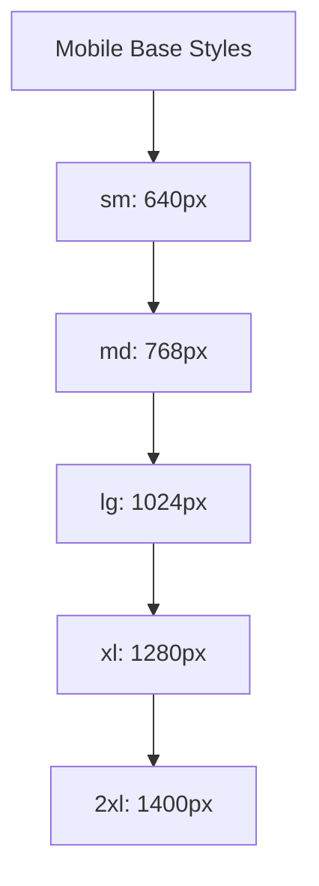
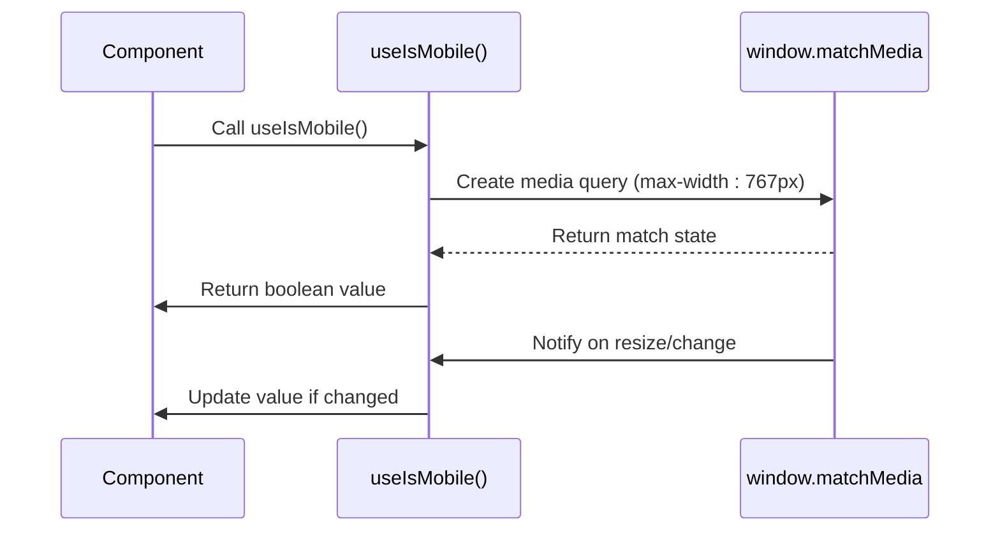
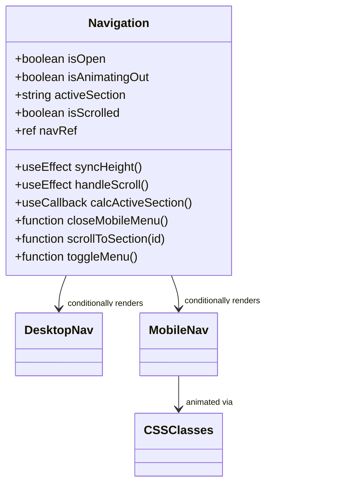
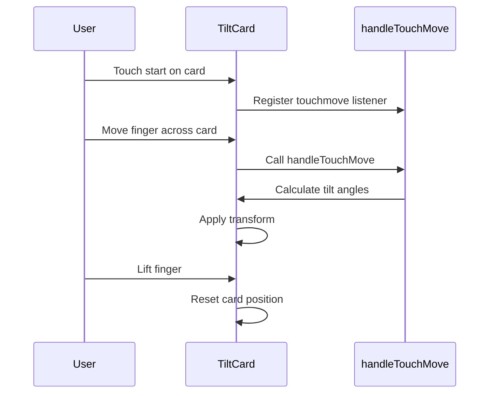
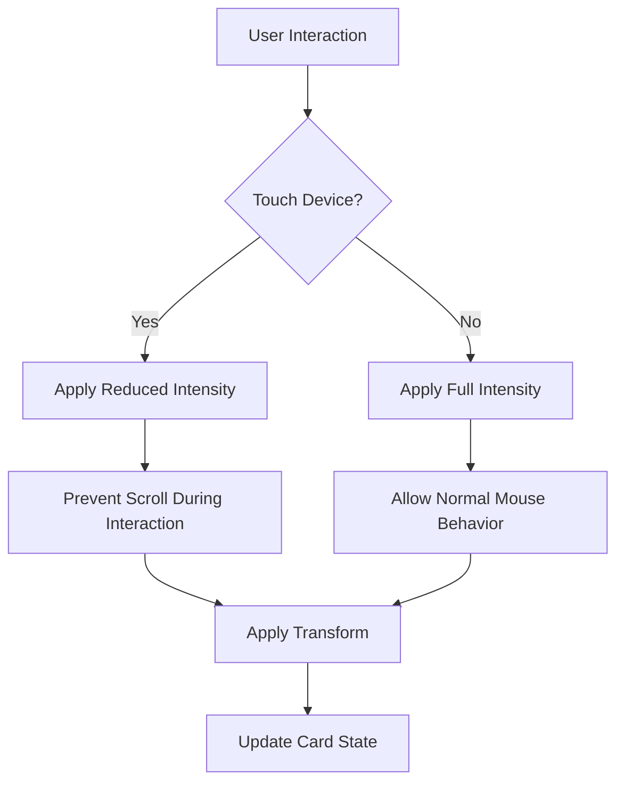

# Responsive Design

<cite>
**Referenced Files in This Document**   
- [tailwind.config.ts](file://tailwind.config.ts)
- [use-mobile.tsx](file://src/hooks/use-mobile.tsx)
- [Navigation.tsx](file://src/components/layout/Navigation.tsx)
- [TiltCard.tsx](file://src/components/shared/TiltCard.tsx) - *Updated glare effect styling and container layout*
</cite>

## Update Summary
**Changes Made**   
- Updated documentation for TiltCard component to reflect changes in glare effect styling and container layout
- Enhanced details on responsive interactions with focus on visual improvements
- Added specific information about radial gradient configuration and container overflow handling
- Updated section sources to reflect modified files

## Table of Contents
1. [Introduction](#introduction)
2. [Mobile-First Approach with Tailwind CSS](#mobile-first-approach-with-tailwind-css)
3. [Device Detection and Behavior Adaptation](#device-detection-and-behavior-adaptation)
4. [Adaptive Layouts Across Screen Sizes](#adaptive-layouts-across-screen-sizes)
5. [Responsive Interactions](#responsive-interactions)
6. [Testing Guidelines](#testing-guidelines)
7. [Advanced Responsive Techniques](#advanced-responsive-techniques)
8. [Common Layout Bugs and Debugging](#common-layout-bugs-and-debugging)

## Introduction
The farruh-folio-wave project implements a comprehensive responsive design strategy to ensure optimal user experience across devices. This documentation details the implementation of mobile-first principles using Tailwind CSS, device detection mechanisms, adaptive layouts, and responsive interactions. The system leverages Tailwind's breakpoint system and custom hooks to create a seamless experience from mobile phones to large desktop displays.

## Mobile-First Approach with Tailwind CSS

The project follows a strict mobile-first methodology, where base styles are designed for mobile devices and progressively enhanced for larger screens using Tailwind's responsive prefixes (sm, md, lg, xl). The `tailwind.config.ts` file defines the breakpoint configuration that governs this responsive behavior.

**Diagram sources**
- [tailwind.config.ts](file://tailwind.config.ts#L1-L128)

Tailwind's breakpoint system allows developers to apply different utility classes at different screen sizes by prefixing them with the appropriate breakpoint identifier. For example, a component might use `text-sm` for mobile and `text-lg` for larger screens with the syntax `text-sm md:text-lg`. This approach ensures that content is readable and accessible on small screens while taking advantage of additional space on larger displays.

The configuration extends Tailwind's default theme with custom container settings, ensuring consistent padding and centering across breakpoints. The container component automatically adjusts its maximum width based on the current breakpoint, providing an optimal reading experience without excessive white space on smaller screens or overly wide text blocks on larger displays.

**Section sources**
- [tailwind.config.ts](file://tailwind.config.ts#L1-L128)

## Device Detection and Behavior Adaptation

The `useIsMobile` hook provides a reliable mechanism for detecting mobile devices and adapting component behavior accordingly. This custom React hook uses window.matchMedia to monitor screen width changes and determine whether the current viewport qualifies as a mobile device.

**Diagram sources**
- [use-mobile.tsx](file://src/hooks/use-mobile.tsx#L1-L19)

The hook establishes a consistent mobile breakpoint at 768 pixels, aligning with Tailwind's default sm breakpoint. When the window width is less than this threshold, the hook returns true, indicating a mobile context. This detection is not limited to initial render but persists through window resizing events, ensuring components respond appropriately to dynamic viewport changes.

Components leverage this hook to conditionally render different UI patterns. For instance, navigation systems can switch between a hamburger menu on mobile devices and a horizontal navigation bar on desktops. The hook's implementation includes proper cleanup of event listeners to prevent memory leaks, following React best practices for useEffect cleanup.

**Section sources**
- [use-mobile.tsx](file://src/hooks/use-mobile.tsx#L1-L19)

## Adaptive Layouts Across Screen Sizes

The responsive design system implements several strategies for adapting layouts across different screen sizes, including font scaling, grid adjustments, and conditional element visibility. These adaptations ensure content remains accessible and visually appealing regardless of the viewing device.

### Navigation Component Adaptation
The Navigation component demonstrates a classic responsive pattern, switching between desktop and mobile navigation paradigms based on screen size. On desktop, all navigation items are displayed horizontally in a persistent navbar. On mobile, these items are collapsed into a hamburger menu that expands when activated.

**Diagram sources**
- [Navigation.tsx](file://src/components/layout/Navigation.tsx#L1-L216)
- [Navigation.module.css](file://src/components/layout/Navigation.module.css#L1-L16)

The component uses CSS classes controlled by state variables to manage the mobile menu animation. When the menu is opening, it applies the `mobileNavEnter` class with a slide-down animation. When closing, it uses `mobileNavLeave` with a slide-up animation. This creates a smooth user experience during menu transitions.

### Font Scaling and Typography
Typography adapts across breakpoints to maintain readability. While specific font size utilities aren't visible in the provided code, Tailwind's responsive prefixes enable automatic font scaling. For example, a heading might use `text-lg sm:text-xl md:text-2xl` to increase in size as the screen width grows, ensuring text remains legible without overwhelming small screens.

### Grid and Layout Adjustments
Layout grids reconfigure based on available space. Though not explicitly shown in the provided components, Tailwind's grid system allows columns to change from stacked (1-column) on mobile to multi-column layouts on larger screens. This flexibility ensures content density matches the available real estate, preventing both overcrowding on small screens and excessive whitespace on large displays.

### Element Visibility
Elements can be conditionally hidden or shown using Tailwind's visibility utilities. The Navigation component hides the hamburger menu button on screens 768px and wider using the `@media(min-width:768px){.menuToggleWrapper{display:none;}}` rule in its CSS module. Conversely, the desktop navigation is always visible on larger screens but would typically be hidden on mobile in favor of the hamburger menu.

**Section sources**
- [Navigation.tsx](file://src/components/layout/Navigation.tsx#L1-L216)
- [Navigation.module.css](file://src/components/layout/Navigation.module.css#L1-L16)

## Responsive Interactions

The project implements touch-friendly interactions optimized for various input methods, with special consideration for mobile devices. These interactions enhance usability across different device types while maintaining performance.

### Touch-Friendly Buttons and Tap Targets
Interactive elements are designed with adequate tap targets for touch interfaces. While specific dimensions aren't visible in the code, best practices suggest minimum 44x44 pixel touch areas. The Navigation component's buttons provide sufficient size and spacing to prevent accidental taps, crucial for mobile usability.

### Swipe Gestures and Touch Events
The TiltCard component supports touch-based interactions, enabling users to manipulate cards through touch movements. It registers touch event listeners to track finger position and translate this into card tilt effects, creating an engaging tactile experience on touch-enabled devices.

**Diagram sources**
- [TiltCard.tsx](file://src/components/shared/TiltCard.tsx#L1-L294)

### Optimized Tap Targets
Interactive elements include appropriate spacing and sizing to accommodate finger input. The TiltCard component specifically prevents default touch behavior (`e.preventDefault()`) during touch moves to avoid unintended scrolling while interacting with the card, ensuring the tilt gesture takes precedence over page scrolling.

### Performance Considerations for Mobile GPUs
The TiltCard implementation includes several optimizations for mobile performance:
- Uses requestAnimationFrame to throttle updates to the refresh rate
- Implements will-change CSS property to hint at upcoming transforms
- Applies contain: 'layout style paint' to isolate rendering
- Uses passive event listeners where appropriate to improve scroll performance

These optimizations ensure smooth animations even on less powerful mobile devices, preventing jank and maintaining a high frame rate during interactions.

**Section sources**
- [TiltCard.tsx](file://src/components/shared/TiltCard.tsx#L1-L294)

## Testing Guidelines

Effective testing of responsive designs requires both automated tools and real-world validation across various devices and conditions.

### Browser DevTools Testing
Developers should use browser developer tools to simulate different device sizes and orientations:
1. Open DevTools and toggle device toolbar
2. Test at exact breakpoint values (640px, 768px, 1024px, etc.)
3. Verify layout transitions occur correctly at each breakpoint
4. Check text readability and element sizing
5. Test interactive elements in touch simulation mode

### Real Device Testing
While DevTools provide valuable insights, testing on actual devices is essential:
- Test on multiple physical devices with different screen sizes and densities
- Validate touch interactions on actual touchscreens
- Check performance on lower-end devices
- Verify orientation changes (portrait to landscape)
- Test under different network conditions

### Automated Testing Considerations
Though not implemented in the provided code, automated responsive testing could include:
- Visual regression tests at multiple breakpoints
- Accessibility checks for touch target sizes
- Performance monitoring for animation smoothness
- Cross-browser testing on mobile browsers

**Section sources**
- [Navigation.tsx](file://src/components/layout/Navigation.tsx#L1-L216)
- [TiltCard.tsx](file://src/components/shared/TiltCard.tsx#L1-L294)

## Advanced Responsive Techniques

For experienced developers, the project demonstrates several advanced responsive techniques that go beyond basic media queries.

### Conditional Behavior Based on Device Type
The TiltCard component intelligently adjusts its behavior based on device capabilities. It detects touch support and applies different intensity levels for mobile versus desktop interactions, recognizing that touch-based manipulation differs from mouse-based interaction.

**Diagram sources**
- [TiltCard.tsx](file://src/components/shared/TiltCard.tsx#L1-L294)

This differentiation recognizes that users interact differently with touchscreens versus mice, adjusting the sensitivity to provide a natural feel on each input method.

### Viewport Units and Dynamic Sizing
While not explicitly visible in the provided code, the use of CSS custom properties like `--nav-height` demonstrates an understanding of dynamic sizing. The Navigation component sets this variable based on the actual height of the navbar, allowing other elements to reference this dynamic value rather than hardcoding dimensions.

### Performance Tuning for Mobile
The TiltCard component implements several performance optimizations:
- RequestAnimationFrame batching to limit re-renders
- DOMRect caching to minimize layout thrashing
- Cleanup of event listeners to prevent memory leaks
- Strategic use of CSS containment for rendering isolation

These techniques ensure smooth performance even on mobile devices with limited GPU capabilities, maintaining high frame rates during interactive animations.

**Section sources**
- [TiltCard.tsx](file://src/components/shared/TiltCard.tsx#L1-L294)

## Common Layout Bugs and Debugging

Responsive designs often encounter specific issues that require systematic debugging approaches.

### Breakpoint Transition Issues
A common bug occurs when components don't transition smoothly between breakpoints. To debug:
1. Verify breakpoint values match across components
2. Check for conflicting CSS rules
3. Ensure media queries are properly ordered (mobile-first)
4. Test at exact breakpoint boundaries

### Touch Interaction Conflicts
When touch gestures interfere with scrolling:
- Verify preventDefault is used appropriately
- Check event listener options (passive: false for touchmove)
- Ensure proper event cleanup
- Test touch action CSS properties

### Layout Shifts and Content Reflow
To prevent unwanted layout shifts:
- Set explicit dimensions where possible
- Use CSS aspect ratio boxes
- Implement skeleton loading states
- Avoid late-loading content that affects layout

### Performance Bottlenecks
For sluggish responsive interactions:
- Profile with browser performance tools
- Check for excessive re-renders
- Verify proper use of React.memo and useCallback
- Monitor JavaScript execution time
- Optimize expensive calculations

The use of requestAnimationFrame in the TiltCard component demonstrates awareness of performance considerations, ensuring animations run at optimal frame rates without blocking the main thread.

**Section sources**
- [TiltCard.tsx](file://src/components/shared/TiltCard.tsx#L1-L294)
- [Navigation.tsx](file://src/components/layout/Navigation.tsx#L1-L216)