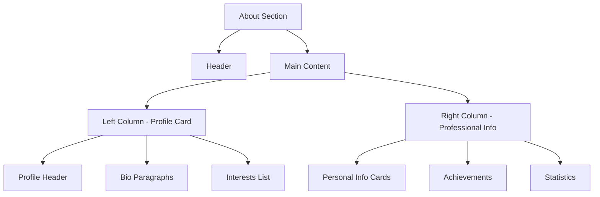

# About Section

<cite>
**Referenced Files in This Document **  
- [About.tsx](file://src/components/pages/About.tsx)
- [About.module.css](file://src/components/pages/About.module.css)
- [about.json](file://public/data/about.json)
</cite>

## Table of Contents
1. [Introduction](#introduction)  
2. [Layout Structure](#layout-structure)  
3. [Data Loading and JSON Structure](#data-loading-and-json-structure)  
4. [Dynamic Icon Resolution System](#dynamic-icon-resolution-system)  
5. [Color Palette and Theming](#color-palette-and-theming)  
6. [Text Highlighting with parseHighlight](#text-highlighting-with-parsehighlight)  
7. [Usage Examples](#usage-examples)  
8. [Accessibility Notes](#accessibility-notes)  
9. [Troubleshooting Guide](#troubleshooting-guide)

## Introduction
The About section is a central component of the portfolio website, designed to present personal and professional information in an engaging, visually appealing layout. It features a responsive two-column design that dynamically loads structured data from `about.json`, supports rich text formatting via custom markup, and implements dynamic theming through CSS variables and React state management.

**Section sources**  
- [About.tsx](file://src/components/pages/About.tsx#L0-L58)

## Layout Structure
The About section uses a responsive two-column grid layout:
- **Left Column**: Contains a profile card with the user's name, bio, and interests.
- **Right Column**: Displays professional information cards, achievements, and statistics.

On mobile devices, the columns stack vertically for better readability. The layout is powered by CSS Grid in `About.module.css` and adapts based on screen size using media queries.



**Diagram sources**  
- [About.tsx](file://src/components/pages/About.tsx#L224-L251)  
- [About.module.css](file://src/components/pages/About.module.css#L150-L170)

## Data Loading and JSON Structure
The component fetches structured data from `/data/about.json` during initialization using the `useEffect` hook. The JSON file contains the following top-level fields:

- `personalInfo`: Array of objects containing icon, title, value, description, and optional link.
- `interests`: Array of interest items with icon, text, and color.
- `bio`: Array of strings representing paragraphs, supporting `[[text|color]]` syntax.
- `achievements`: List of key accomplishments.
- `stats`: Numerical metrics with labels and colors.

Each field is loaded into React state and rendered conditionally after validation.

**Section sources**  
- [About.tsx](file://src/components/pages/About.tsx#L147-L188)  
- [about.json](file://public/data/about.json#L1-L39)

## Dynamic Icon Resolution System
Icons are dynamically resolved from string names in the JSON to actual Lucide React components using the `iconsMap` object. This mapping allows the JSON to remain lightweight and string-based while enabling rich visual rendering.

For example, `"icon": "Mail"` in JSON maps to the imported `Mail` component from `lucide-react`. If an icon is not found, fallback icons (`User` or `Star`) are used.

```typescript
const iconsMap: Record<string, LucideIcon> = {
  MapPin,
  Mail,
  ExternalLink,
  Code,
  Heart,
  Coffee,
  Zap,
  Star,
  User,
  Globe,
  Calendar,
  Award,
  Briefcase,
  Lightbulb,
  Target,
  Cloud,
  Users,
  CheckCircle,
};
```

This system ensures flexibility and maintainability, allowing new icons to be added without modifying the core logic.

**Section sources**  
- [About.tsx](file://src/components/pages/About.tsx#L45-L60)

## Color Palette and Theming
The component uses a predefined array of color palettes (`colorPalettes`) to assign consistent themes to contact cards and other UI elements. Each palette includes primary, secondary, and text colors in hex format.

CSS variables such as `--card-gradient`, `--text-color`, `--border-hover`, and `--shadow-color` are applied inline via `CustomCSSProperties`. These variables enable dynamic theming and smooth hover effects.

For instance, each `personalInfo` card receives a unique color palette based on its index:
```tsx
const { primary, secondary, text } = info.colorPalette || colorPalettes[0];
const cardStyle: CustomCSSProperties = {
  '--card-gradient': `linear-gradient(135deg, ${primary}33 0%, ${secondary}33 100%)`,
  '--text-color': text,
  '--border-hover': `${primary}66`,
  '--shadow-color': `${primary}33`
};
```

This approach ensures visual diversity while maintaining design coherence.

**Section sources**  
- [About.tsx](file://src/components/pages/About.tsx#L277-L297)  
- [About.module.css](file://src/components/pages/About.module.css#L430-L486)

## Text Highlighting with parseHighlight
The `parseHighlight` function processes bio paragraphs containing `[[text|color]]` markup and converts them into JSX with colored `<span>` elements. It uses a regular expression to identify matches and applies corresponding CSS classes (e.g., `highlightBlue`, `highlightEmerald`) from the stylesheet.

Example input:
```
"I'm a [[results-driven|blue]] AI/ML Engineer"
```
Is rendered as:
```jsx
I'm a <span className="highlightBlue">results-driven</span> AI/ML Engineer
```

This enables expressive, color-rich content directly from plain JSON strings.

```mermaid
flowchart TD
Start([Input String]) --> Parse{Find [[text|color]]}
Parse --> |Match Found| Extract["Extract text & color"]
Extract --> ApplyClass["Apply highlight${Color} class"]
ApplyClass --> RenderSpan["Create <span> element"]
RenderSpan --> ContinueParsing
Parse --> |No Match| OutputText["Output plain text"]
ContinueParsing --> Parse
OutputText --> End([Rendered JSX])
```

**Diagram sources**  
- [About.tsx](file://src/components/pages/About.tsx#L118-L145)  
- [About.module.css](file://src/components/pages/About.module.css#L280-L300)

## Usage Examples
### Adding a New Personal Info Entry
Update `about.json`:
```json
{
  "icon": "Calendar",
  "title": "Availability",
  "value": "Open to Offers",
  "description": "Currently available for freelance or full-time roles"
}
```

### Adding an Interest Item
```json
{
  "icon": "Coffee",
  "text": "Tech Meetups",
  "color": "amber"
}
```

Ensure the color has corresponding CSS classes (`interestIconAmber`, `highlightAmber`, etc.) in the stylesheet.

**Section sources**  
- [about.json](file://public/data/about.json#L1-L39)  
- [About.module.css](file://src/components/pages/About.module.css#L300-L350)

## Accessibility Notes
The About section follows accessibility best practices:
- Semantic HTML structure with proper heading hierarchy (`h2`, `h3`, `h4`).
- Screen reader-friendly icons using appropriate ARIA roles.
- Focus-visible styles for keyboard navigation.
- Sufficient color contrast for readability.
- Hover and focus states provide visual feedback without relying solely on color.

All interactive elements (links) include proper `rel` and `target` attributes when external.

**Section sources**  
- [About.tsx](file://src/components/pages/About.tsx#L296-L325)  
- [About.module.css](file://src/components/pages/About.module.css#L607-L687)

## Troubleshooting Guide
### Missing Icons
- **Cause**: Icon name in JSON does not match any key in `iconsMap`.
- **Fix**: Add the missing icon import and update `iconsMap`.

### Broken Links
- **Cause**: Invalid URL format or missing protocol (`http://`, `https://`).
- **Fix**: Ensure external links start with `http` or `https`.

### Colors Not Applying
- **Cause**: Color name in JSON doesn't match existing CSS classes.
- **Fix**: Add corresponding CSS rules for `highlight${Color}`, `interestIcon${Color}`, etc.

### Data Not Loading
- **Cause**: Network error or malformed JSON.
- **Fix**: Check browser console for errors and validate JSON syntax.

**Section sources**  
- [About.tsx](file://src/components/pages/About.tsx#L190-L222)  
- [about.json](file://public/data/about.json#L1-L39)