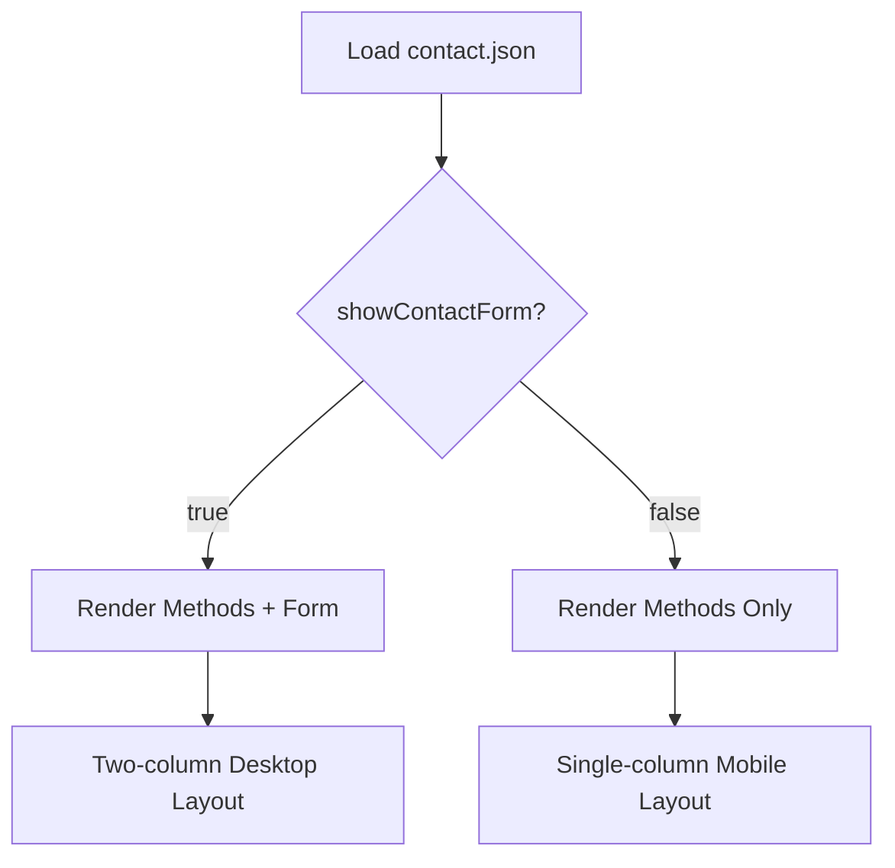
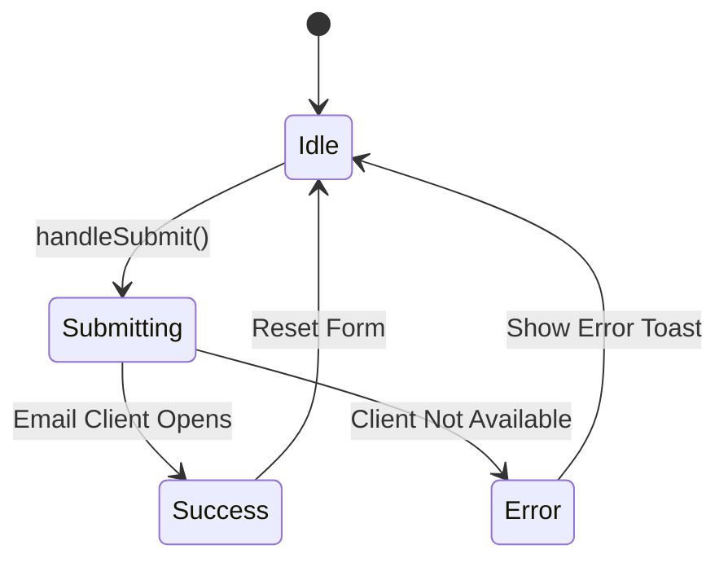
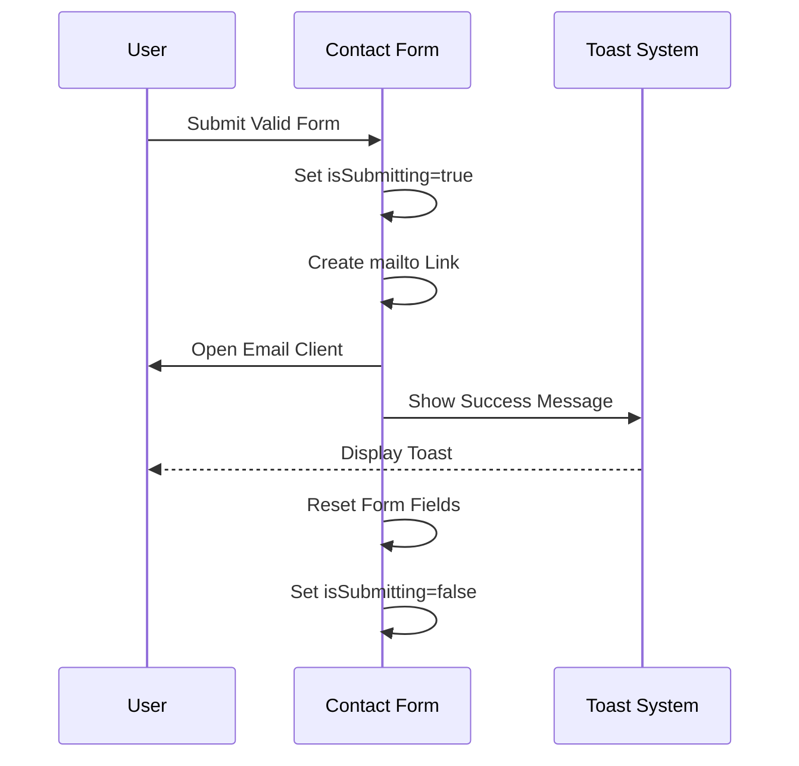
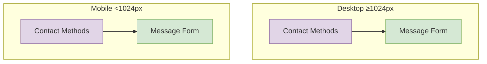

# Contact Section

<cite>
**Referenced Files in This Document**  
- [Contact.tsx](file://src/components/pages/Contact.tsx)
- [contact.json](file://public/data/contact.json)
- [Contact.module.css](file://src/components/pages/Contact.module.css)
- [use-toast.ts](file://src/hooks/use-toast.ts)
</cite>

## Table of Contents
1. [Introduction](#introduction)
2. [Configuration and Data Structure](#configuration-and-data-structure)
3. [Dual-Mode Communication Interface](#dual-mode-communication-interface)
4. [Form Submission Handling Logic](#form-submission-handling-logic)
5. [Accessibility Features](#accessibility-features)
6. [Responsive Layout Adaptation](#responsive-layout-adaptation)
7. [Integration with Messaging Services](#integration-with-messaging-services)
8. [Security and Privacy Considerations](#security-and-privacy-considerations)

## Introduction

The Contact section provides a comprehensive communication interface that enables visitors to connect through multiple channels. It implements a dual-mode design combining direct contact methods via external links and an optional message form. The component is dynamically configured through external JSON data, supports accessibility standards, and adapts responsively across device sizes. This documentation details the implementation, behavior, and integration points of this critical user interaction component.

## Configuration and Data Structure

The Contact section's behavior and content are driven by configuration data sourced from `contact.json`. This externalization allows for easy updates without code changes.

### Contact Configuration Schema

```json
{
  "showContactForm": false,
  "contactMethods": [
    {
      "icon": "Mail",
      "title": "Email",
      "value": "farruh.sheripov@fusioncode.org",
      "link": "mailto:farruh.sheripov@fusioncode.org"
    },
    {
      "icon": "Phone",
      "title": "Phone",
      "value": "+48 571 048 777",
      "link": "tel:+48571048777"
    },
    {
      "icon": "MapPin",
      "title": "Location",
      "value": "Kraków, Poland, 31-878"
    },
    {
      "icon": "Linkedin",
      "title": "LinkedIn",
      "value": "linkedin.com/in/farruh-sheripov",
      "link": "https://www.linkedin.com/in/farruh-sheripov/"
    }
  ]
}
```

The configuration defines:
- **Available Methods**: Each contact method includes an icon identifier, title, display value, and optional link
- **Form Visibility**: The `showContactForm` boolean controls whether the message form is rendered
- **External Links**: Clickable links open native applications (email, phone) or external websites (social media)

**Section sources**
- [contact.json](file://public/data/contact.json#L1-L28)

## Dual-Mode Communication Interface

The Contact section presents two complementary communication pathways: direct external links and a message submission form.

### External Contact Methods

The component renders clickable contact cards for each method defined in the configuration. These include:

- **Email**: Opens the user's default email client via `mailto:` link
- **Phone**: Initiates a call through `tel:` protocol
- **Social Media**: Redirects to external profiles in new browser tabs
- **Location**: Displays geographical information

Each method card features dynamic theming with gradient backgrounds, hover effects, and animated icons that scale on interaction.

### Conditional Form Rendering

The message form's visibility is controlled by the `showContactForm` flag in the configuration. When enabled, both the contact methods and form appear side-by-side on desktop layouts. When disabled, only the contact methods are displayed in a single-column layout optimized for mobile viewing.



**Diagram sources**
- [Contact.tsx](file://src/components/pages/Contact.tsx#L60-L95)
- [Contact.module.css](file://src/components/pages/Contact.module.css#L380-L398)

**Section sources**
- [Contact.tsx](file://src/components/pages/Contact.tsx#L60-L95)
- [Contact.module.css](file://src/components/pages/Contact.module.css#L380-L398)

## Form Submission Handling Logic

The contact form implements a client-side submission workflow that prepares messages for external email clients.

### State Management

The form maintains state for:
- **Form Data**: Name, email, and message inputs using React's `useState`
- **Submission State**: Loading indicator during submission process
- **Toast Notifications**: User feedback system for success/error states



**Diagram sources**
- [Contact.tsx](file://src/components/pages/Contact.tsx#L94-L167)
- [use-toast.ts](file://src/hooks/use-toast.ts#L140-L191)

### Input Validation

The form employs HTML5 validation attributes:
- **Required Fields**: All inputs are mandatory (`required` attribute)
- **Type Validation**: Email field uses `type="email"` for format checking
- **Autocomplete**: Browser autofill support via `autocomplete` attributes

Validation occurs before submission, preventing invalid data from being processed.

### Loading States and Feedback

During submission, the form displays a loading state with animated dots to indicate processing. Upon completion, toast notifications provide feedback:

- **Success**: Informs user that their email client will open
- **Error**: Provides fallback contact information if the email client fails



**Diagram sources**
- [Contact.tsx](file://src/components/pages/Contact.tsx#L134-L167)
- [use-toast.ts](file://src/hooks/use-toast.ts#L140-L191)

**Section sources**
- [Contact.tsx](file://src/components/pages/Contact.tsx#L94-L167)
- [use-toast.ts](file://src/hooks/use-toast.ts#L140-L191)

## Accessibility Features

The Contact section implements several accessibility best practices to ensure usability for all visitors.

### Semantic HTML and ARIA

- **Proper Labeling**: All form inputs have associated `<label>` elements with `for` attributes
- **Focus Management**: Interactive elements maintain visible focus states
- **ARIA Attributes**: Dynamic content updates are announced to screen readers via toast notifications
- **Keyboard Navigation**: Full tab-based navigation support for all interactive elements

### Color and Contrast

The component maintains sufficient color contrast between text and background elements, with text colors specifically chosen to meet WCAG guidelines against semi-transparent backgrounds.

### Screen Reader Support

Toast notifications include appropriate roles and live regions to ensure screen reader users receive timely feedback about form submission outcomes.

**Section sources**
- [Contact.tsx](file://src/components/pages/Contact.tsx#L200-L238)
- [Contact.module.css](file://src/components/pages/Contact.module.css#L200-L250)

## Responsive Layout Adaptation

The Contact section adapts its layout based on screen size and configuration settings.

### Desktop vs. Mobile Layouts

On larger screens (≥1024px), the component uses a two-column grid layout:
- Left column: Contact methods and information
- Right column: Message form (when enabled)

On smaller screens (<1024px), the layout stacks vertically in a single column.

### Tap Target Optimization

Mobile-specific considerations include:
- **Adequate Spacing**: Contact method cards have sufficient margin for touch interaction
- **Flexible Sizing**: On medium screens, contact methods wrap into a responsive grid
- **Full-width Elements**: Form inputs and buttons expand to full container width



**Diagram sources**
- [Contact.module.css](file://src/components/pages/Contact.module.css#L250-L300)
- [Contact.module.css](file://src/components/pages/Contact.module.css#L380-L452)

**Section sources**
- [Contact.module.css](file://src/components/pages/Contact.module.css#L250-L452)

## Integration with Messaging Services

While the current implementation uses the `mailto:` protocol, the architecture supports integration with various messaging services.

### Current Implementation

The form generates a properly encoded `mailto:` link containing:
- Pre-filled subject line with sender name
- Structured message body with name, email, and message content
- Proper URL encoding of special characters

This approach requires no backend infrastructure and respects user privacy by keeping message transmission within their control.

### Potential Integrations

To extend functionality, the submission handler could be modified to integrate with:

- **Email APIs**: Services like SendGrid, Mailgun, or AWS SES
- **Form Services**: Third-party solutions like Formspree or Netlify Forms
- **CRM Systems**: Direct integration with customer relationship management platforms
- **Analytics Tools**: Tracking form submissions and user engagement

Such integrations would require modifying the `handleSubmit` function to make HTTP requests to external endpoints instead of opening email clients.

**Section sources**
- [Contact.tsx](file://src/components/pages/Contact.tsx#L134-L167)

## Security and Privacy Considerations

The Contact section implements several security and privacy measures.

### Spam Prevention

The current client-side implementation inherently prevents spam by:
- **No Server Exposure**: Messages never pass through a server that could be targeted
- **User-Controlled Transmission**: Users must explicitly send messages through their own email client
- **No Data Collection**: The application does not store or access submitted message content

### Privacy Guidelines

The implementation respects user privacy by:
- **Transparent Data Flow**: Users see exactly where their information is being sent
- **No Hidden Tracking**: No analytics or tracking scripts are attached to form submissions
- **Direct Communication**: Messages go directly to the recipient without intermediary storage

### Security Best Practices

Additional security considerations include:
- **Input Sanitization**: While not storing data, the implementation properly encodes URI components
- **Secure Links**: External links open with `noopener noreferrer` for security
- **HTTPS Enforcement**: The portfolio site should be served over HTTPS to protect data in transit

For future server-integrated versions, additional measures would be required:
- **Rate Limiting**: Prevent abuse of the messaging endpoint
- **CAPTCHA**: Additional verification for automated submission prevention
- **Input Validation**: Server-side validation of all submitted data
- **Data Encryption**: Secure storage and transmission of message content

**Section sources**
- [Contact.tsx](file://src/components/pages/Contact.tsx#L134-L167)
- [Contact.tsx](file://src/components/pages/Contact.tsx#L200-L238)