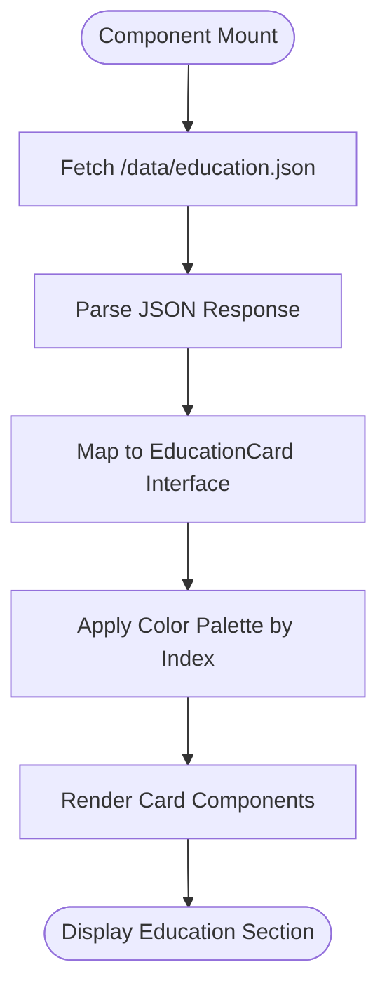
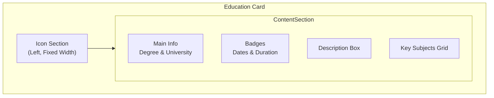
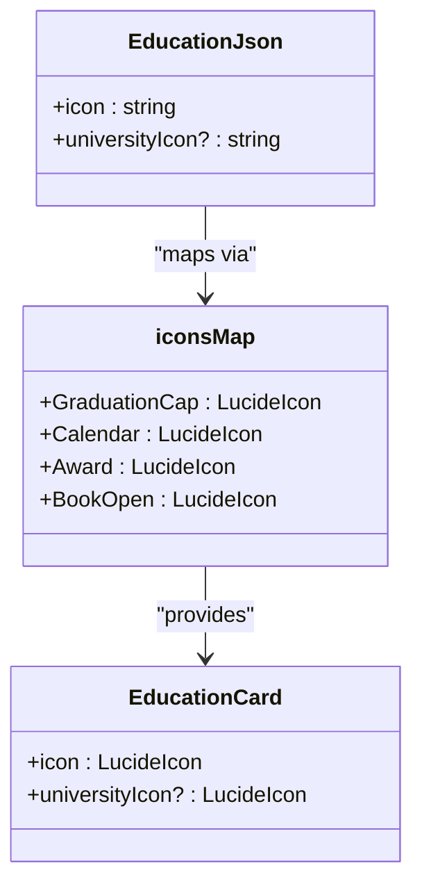
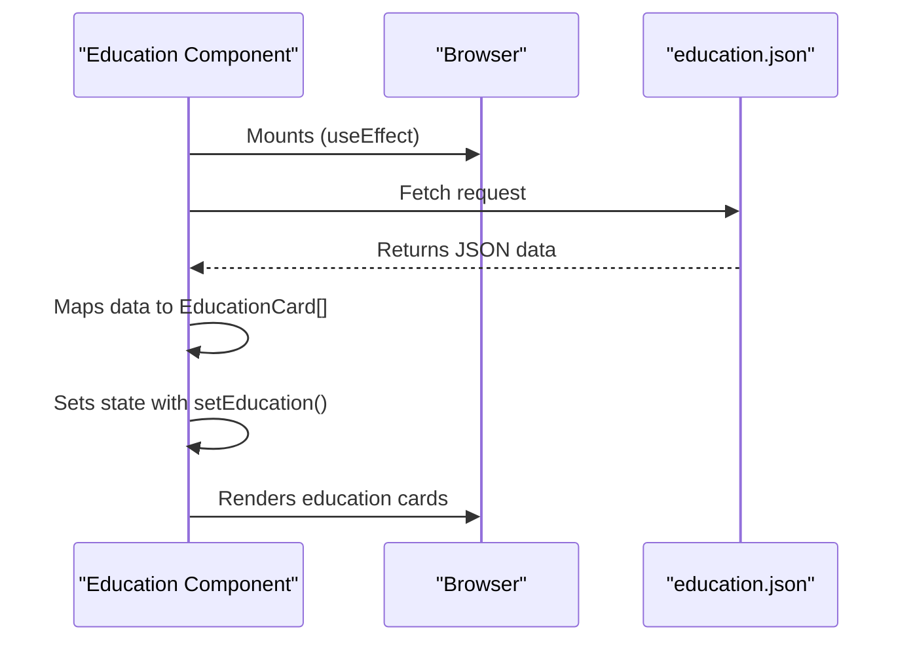
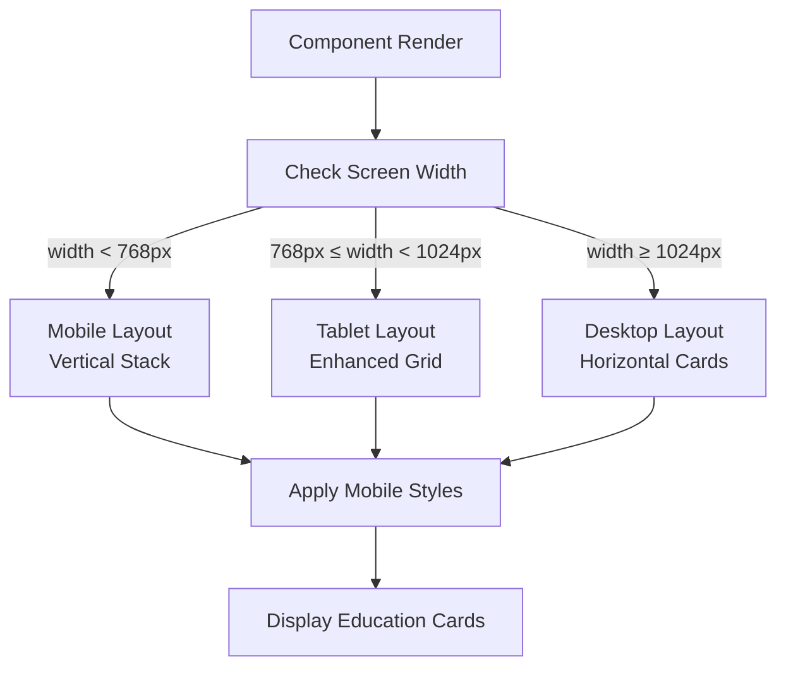
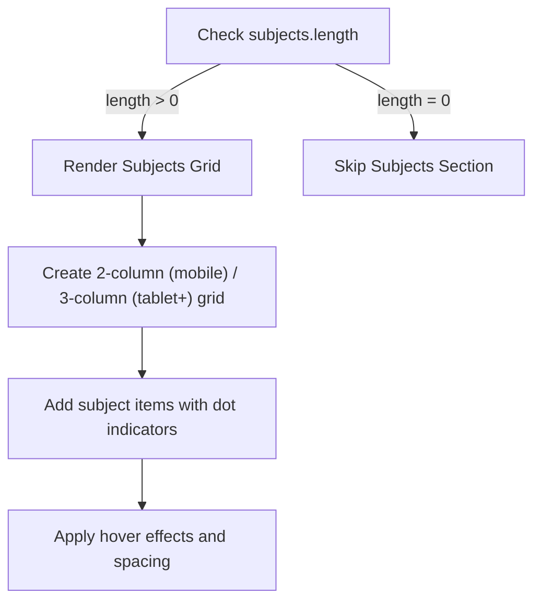

# Education Section

<cite>
**Referenced Files in This Document**   
- [Education.tsx](file://src/components/pages/Education.tsx)
- [Education.module.css](file://src/components/pages/Education.module.css)
- [education.json](file://public/data/education.json)
</cite>

## Table of Contents
1. [Introduction](#introduction)
2. [Data Model](#data-model)
3. [Visual Design Pattern](#visual-design-pattern)
4. [Component Architecture](#component-architecture)
5. [Styling and Aesthetics](#styling-and-aesthetics)
6. [Customization Options](#customization-options)
7. [Conclusion](#conclusion)

## Introduction
The Education section presents academic credentials in a structured, visually engaging format. It loads data from education.json and displays it using a card-based layout with timeline elements, icons, and interactive design features. The section emphasizes academic milestones through a cohesive visual language aligned with the overall portfolio aesthetic.

**Section sources**
- [Education.tsx](file://src/components/pages/Education.tsx#L89-L122)
- [Education.module.css](file://src/components/pages/Education.module.css#L0-L76)

## Data Model
The Education section utilizes a structured data model to represent academic credentials with consistent fields and relationships.

### Core Fields
The data structure includes the following key fields:

| Field | Type | Description |
|-------|------|-------------|
| icon | string | Icon identifier for the main credential (e.g., "GraduationCap") |
| degree | string | Academic degree or program name |
| university | string | Institution name with country |
| universityIcon | string | Optional icon for the institution |
| years | string | Date range of attendance (e.g., "2012 - 2017") |
| duration | string | Program length (e.g., "5 Years") |
| description | string | Summary of academic experience and curriculum |
| subjects | string[] | Array of key subjects or areas of study |

### Data Flow
The component follows a clear data flow pattern:
1. Fetches JSON data from `/data/education.json`
2. Maps raw JSON to typed interface with enhanced properties
3. Applies color palettes based on index position
4. Renders mapped data as interactive cards



**Diagram sources**
- [Education.tsx](file://src/components/pages/Education.tsx#L61-L90)
- [education.json](file://public/data/education.json#L0-L17)

**Section sources**
- [Education.tsx](file://src/components/pages/Education.tsx#L0-L59)
- [education.json](file://public/data/education.json#L0-L17)

## Visual Design Pattern
The Education section employs a card-based layout with consistent visual elements that highlight academic milestones.

### Layout Structure
The component uses a responsive grid system that adapts to different screen sizes:
- Mobile: Single column layout
- Desktop: Horizontal card layout with icon and content sections



**Diagram sources**
- [Education.tsx](file://src/components/pages/Education.tsx#L89-L122)
- [Education.module.css](file://src/components/pages/Education.module.css#L124-L385)

### Icon System
The component implements an icon mapping system that converts string identifiers to Lucide React components:



**Diagram sources**
- [Education.tsx](file://src/components/pages/Education.tsx#L0-L59)

## Component Architecture
The Education component follows a clean architectural pattern with separation of concerns between data handling and presentation.

### State Management
The component uses React's useState and useEffect hooks to manage asynchronous data loading:



**Diagram sources**
- [Education.tsx](file://src/components/pages/Education.tsx#L61-L90)

### Responsive Behavior
The component adapts its layout based on screen size through CSS media queries:



**Diagram sources**
- [Education.module.css](file://src/components/pages/Education.module.css#L124-L385)

**Section sources**
- [Education.tsx](file://src/components/pages/Education.tsx#L89-L198)
- [Education.module.css](file://src/components/pages/Education.module.css#L124-L385)

## Styling and Aesthetics
The Education section implements sophisticated styling using CSS modules and Tailwind-inspired utilities to create a cohesive visual experience.

### Color System
The component uses a dynamic color palette system with three predefined color schemes that rotate based on card index:

```mermaid
classDiagram
class colorPalettes {
+primary : string
+secondary : string
+text : string
}
class EducationCard {
+colorPalette : {primary, secondary, text}
}
EducationCard --> colorPalettes : "assigns from"
colorPalettes : [
{primary : '#60a5fa', secondary : '#818cf8', text : '#93c5fd'},
{primary : '#8b5cf6', secondary : '#6366f1', text : '#c4b5fd'},
{primary : '#2563eb', secondary : '#4f46e5', text : '#bfdbfe'}
]
```

**Diagram sources**
- [Education.tsx](file://src/components/pages/Education.tsx#L0-L59)

### CSS Custom Properties
The component leverages CSS custom properties for dynamic styling:

| CSS Variable | Purpose | Source Value |
|--------------|---------|--------------|
| --card-gradient | Background gradient for icon container | primary and secondary colors with 33% opacity |
| --text-color | Text and icon color | text color from palette |
| --border-hover | Border color on hover | primary color with 66% opacity |
| --shadow-color | Box shadow color | primary color with 33% opacity |

These variables enable consistent theming across multiple visual elements while maintaining flexibility for future customization.

**Section sources**
- [Education.tsx](file://src/components/pages/Education.tsx#L89-L122)
- [Education.module.css](file://src/components/pages/Education.module.css#L124-L385)

## Customization Options
The Education section provides several built-in customization options for displaying academic information.

### Key Subjects Display
The component conditionally renders the key subjects section only when subjects are present in the data:



The subjects grid automatically adjusts column count based on screen size:
- Mobile (≤768px): 2 columns
- Tablet+ (>768px): 3 columns

**Diagram sources**
- [Education.tsx](file://src/components/pages/Education.tsx#L152-L198)
- [Education.module.css](file://src/components/pages/Education.module.css#L293-L366)

### Interactive Elements
The component includes several interactive visual elements that enhance user engagement:

- **Hover Effects**: Cards expand shadows and animate decorative elements
- **Floating Dots**: Animated background elements with staggered timing
- **Badge Interactions**: Badges highlight on hover with color transitions

These elements create a dynamic experience while maintaining focus on the academic content.

**Section sources**
- [Education.module.css](file://src/components/pages/Education.module.css#L293-L385)

## Conclusion
The Education section effectively presents academic credentials through a well-structured component that combines clean data modeling with sophisticated visual design. By loading data from education.json and applying consistent styling patterns, the component creates an engaging presentation of academic milestones. The use of CSS modules, custom properties, and responsive design ensures a cohesive aesthetic that aligns with the overall portfolio while providing flexibility for future enhancements and customization.