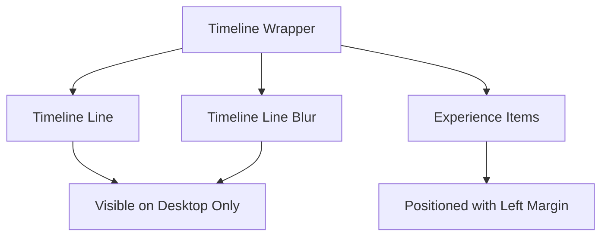
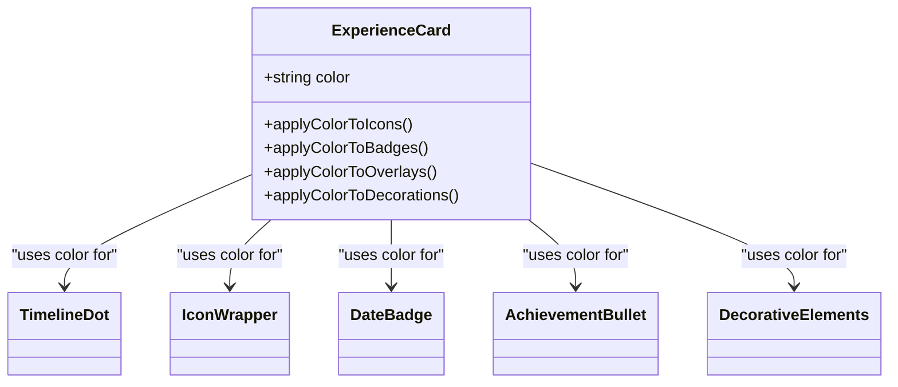
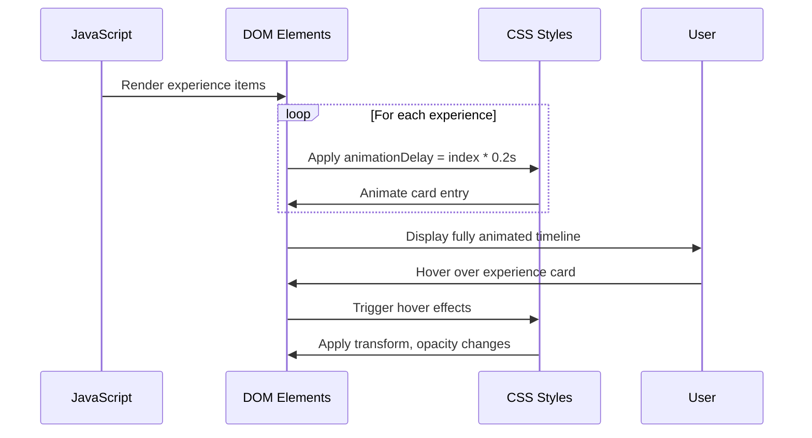
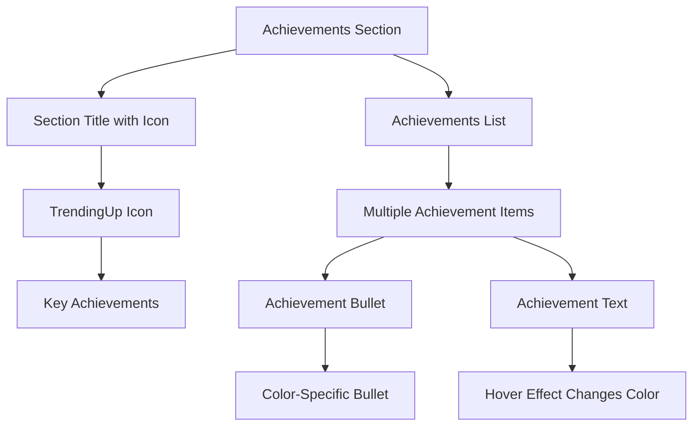
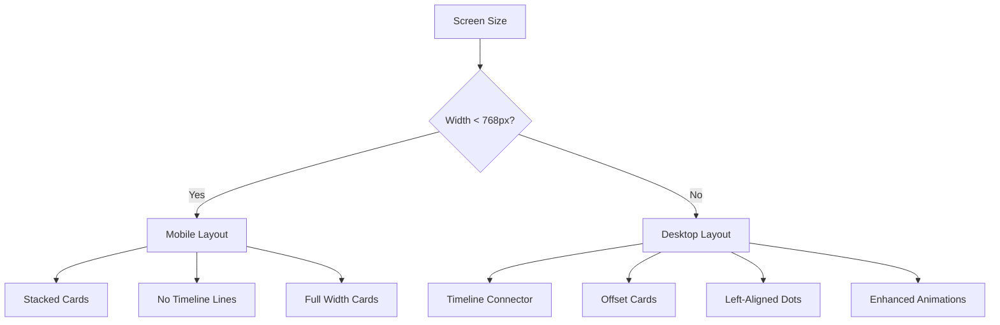

# Experience Section

<cite>
**Referenced Files in This Document **   
- [Experience.tsx](file://src/components/pages/Experience.tsx)
- [Experience.module.css](file://src/components/pages/Experience.module.css)
- [experience.json](file://public/data/experience.json)
</cite>

## Table of Contents
1. [Introduction](#introduction)
2. [Data Structure and JSON Schema](#data-structure-and-json-schema)
3. [Timeline Layout and Visual Design](#timeline-layout-and-visual-design)
4. [Color-Coded Design System](#color-coded-design-system)
5. [Animation Sequence and Effects](#animation-sequence-and-effects)
6. [Achievements and Technologies Display](#achievements-and-technologies-display)
7. [Responsive Behavior](#responsive-behavior)
8. [Customization Options](#customization-options)

## Introduction
The Experience section presents a visually engaging timeline of professional career history with animated experience cards, color-coded elements, and interactive design features. It dynamically renders job experiences fetched from a JSON data file, organizing them chronologically along a vertical timeline with smooth animations and hover effects.

**Section sources**
- [Experience.tsx](file://src/components/pages/Experience.tsx#L1-L20)
- [Experience.module.css](file://src/components/pages/Experience.module.css#L1-L50)

## Data Structure and JSON Schema
The Experience section fetches its data from `experience.json`, which contains an array of experience objects. Each object follows a specific schema with required fields that define the content and styling of each experience card.

```json
{
  "company": "string",
  "title": "string",
  "dates": "string",
  "duration": "string",
  "type": "string",
  "location": "string",
  "achievements": ["string"],
  "technologies": ["string"],
  "color": "string"
}
```

The `color` field determines the designated color theme for the experience entry and must match one of the predefined color variants (blue, emerald, purple, rose, amber). The component uses TypeScript interface `ExperienceData` to enforce type safety when processing the JSON data.

**Section sources**
- [Experience.tsx](file://src/components/pages/Experience.tsx#L8-L19)
- [experience.json](file://public/data/experience.json#L1-L87)

## Timeline Layout and Visual Design
The Experience section implements a vertical timeline layout with connector lines that visually link experience entries. On desktop screens (768px and above), the timeline displays as dual parallel lines: a primary gradient line and a blurred background line positioned on the left side of the container.



**Diagram sources **
- [Experience.module.css](file://src/components/pages/Experience.module.css#L150-L190)
- [Experience.tsx](file://src/components/pages/Experience.tsx#L55-L58)

Each experience item is rendered as a card positioned relative to the timeline. On mobile devices, the cards stack vertically without timeline connectors, while on desktop views, they are offset to the right with timeline dots aligned on the left. The timeline dots serve as visual anchors connecting each experience card to the central timeline.

**Section sources**
- [Experience.module.css](file://src/components/pages/Experience.module.css#L192-L230)
- [Experience.tsx](file://src/components/pages/Experience.tsx#L60-L75)

## Color-Coded Design System
The Experience section implements a comprehensive color-coded design system where each experience entry has a designated color applied consistently across multiple visual elements. The available color themes include blue, emerald, purple, rose, and amber, each with coordinated gradient schemes.

The designated color is applied to various elements including:
- Timeline dots and inner circles
- Icons and icon wrappers
- Job titles and company names
- Date badges and achievement bullets
- Technology badge hover states
- Card overlays and decorative elements



**Diagram sources **
- [Experience.module.css](file://src/components/pages/Experience.module.css#L231-L450)
- [Experience.tsx](file://src/components/pages/Experience.tsx#L63-L73)

This systematic color application creates visual cohesion and makes it easy to distinguish between different positions or companies at a glance. The color classes follow a consistent naming convention (e.g., `blueDot`, `emeraldIcon`, `purpleBadge`) that links the semantic meaning with the visual presentation.

**Section sources**
- [Experience.module.css](file://src/components/pages/Experience.module.css#L231-L450)
- [Experience.tsx](file://src/components/pages/Experience.tsx#L63-L73)

## Animation Sequence and Effects
The Experience section employs a sophisticated animation sequence that enhances user engagement through staggered entry animations and interactive hover effects. When the page loads, experience cards appear sequentially with a cascading animation effect controlled by CSS animation delays.



**Diagram sources **
- [Experience.tsx](file://src/components/pages/Experience.tsx#L60-L62)
- [Experience.module.css](file://src/components/pages/Experience.module.css#L231-L250)

Each experience card has an `animationDelay` style property calculated as `index * 0.2s`, creating a wave-like appearance effect as cards animate in succession. Interactive hover effects include:
- Timeline dot scaling (1.25x)
- Card elevation and upward movement
- Icon wrapper scaling (1.1x)
- Shimmer effect animation across the card
- Increased opacity of overlay gradients
- Decorative dot visibility transitions

These animations are implemented using CSS transitions and transforms with carefully tuned timing functions to create a smooth, professional feel.

**Section sources**
- [Experience.tsx](file://src/components/pages/Experience.tsx#L60-L62)
- [Experience.module.css](file://src/components/pages/Experience.module.css#L231-L250)

## Achievements and Technologies Display
The Experience section organizes key information into two distinct sections within each experience card: achievements and technologies. The achievements section displays a list of bullet-point accomplishments with color-coordinated circular bullets that match the experience's designated color theme.



**Diagram sources **
- [Experience.tsx](file://src/components/pages/Experience.tsx#L105-L120)
- [Experience.module.css](file://src/components/pages/Experience.module.css#L451-L520)

The technologies section displays a flex-wrapped list of technology badges, each rendered as a pill-shaped element with subtle gradients and borders. These badges feature hover effects that enhance their visibility through border color changes and subtle box shadows, making them more prominent when interacted with.

Both sections use CSS grid and flexbox layouts to ensure proper spacing and responsive behavior. The achievement items use a grid layout with consistent gap spacing, while technology badges use a flex container that wraps naturally on smaller screens.

**Section sources**
- [Experience.tsx](file://src/components/pages/Experience.tsx#L105-L135)
- [Experience.module.css](file://src/components/pages/Experience.module.css#L451-L580)

## Responsive Behavior
The Experience section adapts its layout and functionality across different device sizes through strategic CSS media queries. The responsive design ensures optimal viewing experience on mobile, tablet, and desktop screens.

On mobile devices (below 768px), the timeline simplifies to a clean vertical stack of experience cards without timeline connectors or dots. The cards occupy the full width of the container with appropriate padding for touch interaction. On tablet and desktop screens (768px and above), the full timeline visualization appears with connector lines and positioned dots.



**Diagram sources **
- [Experience.module.css](file://src/components/pages/Experience.module.css#L150-L190)
- [Experience.module.css](file://src/components/pages/Experience.module.css#L192-L230)

Additional breakpoints further refine the layout:
- At 1024px and above, the card header rearranges to display company information and date badges in a side-by-side configuration
- Container padding increases with screen size to maintain comfortable whitespace
- Font sizes scale appropriately for readability across devices

The responsive design prioritizes content clarity on smaller screens while enhancing visual sophistication on larger displays.

**Section sources**
- [Experience.module.css](file://src/components/pages/Experience.module.css#L150-L230)
- [Experience.module.css](file://src/components/pages/Experience.module.css#L300-L350)

## Customization Options
The Experience section offers several customization options that allow for easy modification of its appearance and functionality. New experience entries can be added to the `experience.json` file following the established schema, with support for additional metadata fields beyond the core requirements.

To add a new experience entry, include an object with the required fields:

```json
{
  "company": "New Company Name",
  "title": "Job Position Title",
  "dates": "Start Date - End Date",
  "duration": "Time Period Description",
  "type": "Employment Type",
  "location": "Geographic Location",
  "achievements": [
    "First key accomplishment",
    "Second significant achievement",
    "Third notable contribution"
  ],
  "technologies": [
    "Technology 1",
    "Technology 2",
    "Framework or Tool"
  ],
  "color": "blue"
}
```

The timeline styling can be customized by modifying the CSS variables and classes in `Experience.module.css`. Key customization points include:
- Timeline line colors and gradients
- Animation durations and delay intervals
- Card border radius and shadow properties
- Spacing between experience items
- Hover effect intensities

Additional metadata fields can be incorporated by extending the `ExperienceData` interface in `Experience.tsx` and updating the rendering logic to display the new information within the card structure. This extensibility allows for the addition of fields such as projects, team size, or specific metrics without disrupting the existing design system.

**Section sources**
- [experience.json](file://public/data/experience.json#L1-L87)
- [Experience.tsx](file://src/components/pages/Experience.tsx#L8-L19)
- [Experience.module.css](file://src/components/pages/Experience.module.css#L1-L680)