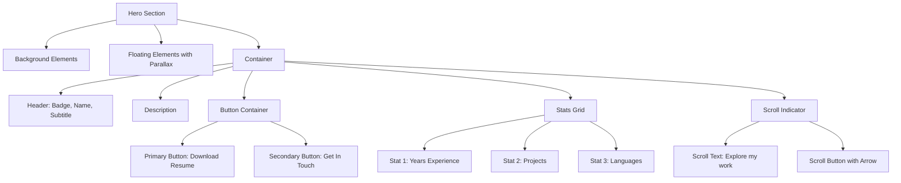
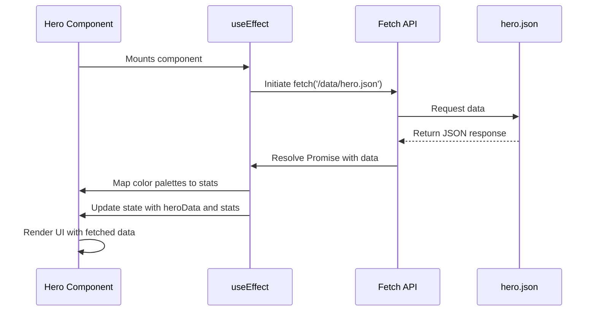
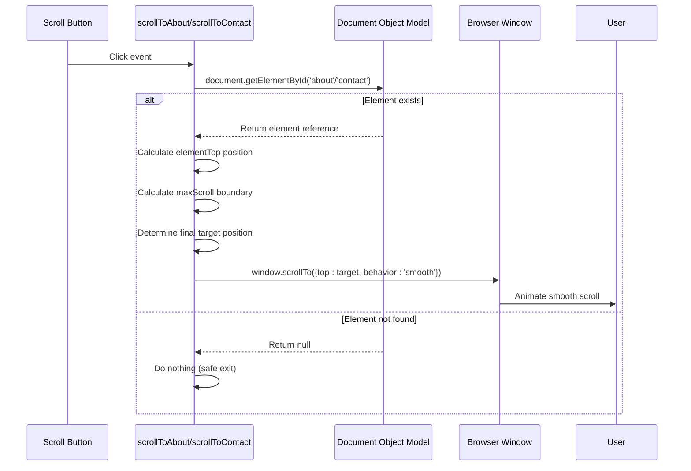

# Hero Section

<cite>
**Referenced Files in This Document **   
- [Hero.tsx](file://src/components/pages/Hero.tsx)
- [hero.json](file://public/data/hero.json)
- [useParallax.ts](file://src/hooks/useParallax.ts)
- [Navigation.tsx](file://src/components/layout/Navigation.tsx)
- [Hero.module.css](file://src/components/pages/Hero.module.css)
</cite>

## Table of Contents
1. [Introduction](#introduction)
2. [Visual Layout](#visual-layout)
3. [Data Fetching and JSON Structure](#data-fetching-and-json-structure)
4. [Dynamic Color Mapping](#dynamic-color-mapping)
5. [Smooth Scrolling Implementation](#smooth-scrolling-implementation)
6. [Parallax Background Effects](#parallax-background-effects)
7. [Accessibility Considerations](#accessibility-considerations)
8. [Customization Guidance](#customization-guidance)
9. [Performance Implications](#performance-implications)
10. [Integration with Global Navigation](#integration-with-global-navigation)

## Introduction
The Hero section serves as the primary landing area for the portfolio website, introducing the user to Farruh Sheripov's professional identity. It combines visual appeal with interactive functionality, featuring a dynamic layout that includes a badge, name, subtitle, description, statistics, and call-to-action buttons. The component leverages modern React patterns including hooks, asynchronous data fetching, and CSS-in-JS styling to deliver an engaging user experience.

**Section sources**
- [Hero.tsx](file://src/components/pages/Hero.tsx#L1-L20)

## Visual Layout
The Hero section presents a clean, centered composition with multiple visual elements arranged vertically:

- **Badge**: A styled label displaying "AI/ML Software Engineer" with subtle background effects
- **Name**: The main title "Farruh Sheripov" rendered with a gradient text effect spanning blue, emerald, purple, and amber
- **Subtitle**: Secondary title "AI/ML Engineer & Backend Architect" in light gray
- **Description**: A paragraph describing the professional background and expertise in AI/ML, NLP, LLMs, and cloud-native deployments
- **Stats Display**: Three statistics showing years of experience, projects completed, and languages spoken, each with dynamically assigned colors
- **Call-to-Action Buttons**: Two buttons - "Download Resume" (primary) and "Get In Touch" (secondary)
- **Scroll Indicator**: An arrow button with "Explore my work" text that enables navigation to the About section

The layout uses responsive design principles, adapting container padding at different breakpoints (640px and 1024px). Subtle floating background elements provide depth through blur effects and parallax motion.



**Diagram sources **
- [Hero.tsx](file://src/components/pages/Hero.tsx#L118-L152)
- [Hero.module.css](file://src/components/pages/Hero.module.css#L1-L395)

**Section sources**
- [Hero.tsx](file://src/components/pages/Hero.tsx#L118-L152)
- [Hero.module.css](file://src/components/pages/Hero.module.css#L1-L395)

## Data Fetching and JSON Structure
The Hero component fetches its content asynchronously from `hero.json` using the `useEffect` hook combined with `async/await` syntax. This approach ensures the component renders only after data is successfully loaded, preventing potential rendering errors.

The data loading process follows these steps:
1. Initialize state variables for hero data and stats
2. Use `useEffect` to trigger data fetching when the component mounts
3. Execute an asynchronous fetch operation to retrieve `/data/hero.json`
4. Validate response status and parse JSON data
5. Map color palettes to statistics
6. Update component state with fetched data
7. Handle any errors during the fetch process

The expected JSON structure contains the following properties:

| Field | Type | Description |
|-------|------|-------------|
| badge | string | Professional designation displayed above the name |
| name | string | Full name of the individual |
| subtitle | string | Secondary professional title |
| description | string | Detailed professional summary |
| primaryButtonText | string | Label for the primary CTA button |
| primaryButtonLink | string | URL or path for the primary button |
| secondaryButtonText | string | Label for the secondary CTA button |
| stats | array | Collection of statistical items |

Each stat object contains:
- `number`: The numeric value to display
- `label`: Descriptive text for the statistic



**Diagram sources **
- [Hero.tsx](file://src/components/pages/Hero.tsx#L45-L84)

**Section sources**
- [Hero.tsx](file://src/components/pages/Hero.tsx#L45-L84)
- [hero.json](file://public/data/hero.json#L1-L14)

## Dynamic Color Mapping
The Hero component implements dynamic color mapping to create visual variety across the statistics display. This is achieved through a predefined array of color palettes and a modulo-based indexing strategy.

The color palettes are defined as an array of objects, each containing primary and text color values in hexadecimal format:
- Blue: `#60a5fa`
- Emerald: `#34d399`
- Purple: `#c084fc`
- Amber: `#f59e0b`

When processing the statistics from the JSON data, the component maps each stat to a color palette using the index position modulo the length of the color palettes array:

```typescript
const mappedStats: StatItem[] = data.stats.map((s, idx) => ({
  ...s,
  colorPalette: colorPalettes[idx % colorPalettes.length],
}));
```

This approach ensures consistent color assignment regardless of the number of statistics, cycling through the available palettes when more stats exist than color options. The assigned colors are then applied via CSS custom properties (`--text-color`) to maintain separation between logic and presentation.

**Section sources**
- [Hero.tsx](file://src/components/pages/Hero.tsx#L10-L15)
- [Hero.tsx](file://src/components/pages/Hero.tsx#L68-L74)

## Smooth Scrolling Implementation
The Hero component provides two smooth scrolling functions that enable navigation to key sections of the portfolio: `scrollToAbout()` and `scrollToContact()`. These functions are triggered by button interactions and implement client-side navigation without page reloads.

### scrollToAbout()
Navigates to the About section (ID: 'about') with smooth behavior:
- Calculates the absolute position of the target element
- Accounts for navigation bar height (80px offset)
- Ensures the target does not exceed maximum scroll limits
- Uses `window.scrollTo()` with `{ behavior: 'smooth' }`

### scrollToContact()
Navigates to the Contact section (ID: 'contact') using identical smooth scrolling logic:
- Locates the element by ID
- Calculates positioning with navigation offset
- Applies maximum scroll boundary protection
- Executes smooth scroll animation

Both functions include safety checks to verify the target element exists before attempting to scroll, preventing runtime errors when elements are missing from the DOM.



**Diagram sources **
- [Hero.tsx](file://src/components/pages/Hero.tsx#L77-L91)

**Section sources**
- [Hero.tsx](file://src/components/pages/Hero.tsx#L77-L91)

## Parallax Background Effects
The Hero section incorporates subtle parallax effects through the `useParallax` custom hook, creating a sense of depth and motion as users interact with the page. These effects are applied to floating background elements that respond to both scroll position and mouse movement.

The implementation works as follows:
1. Import `useParallax` hook and extract `getCombinedParallaxStyle` function
2. Apply the generated style to floating elements in the JSX
3. Configure scroll speed (0.03-0.04) and mouse intensity (-0.01 to 0.01) parameters

The `useParallax` hook itself implements sophisticated performance optimizations:
- Uses `requestAnimationFrame` throttling to limit update frequency
- Implements smooth interpolation (lerp) for fluid motion
- Maintains separate raw and smoothed values for scroll and mouse position
- Utilizes `useCallback` and `useRef` for performance optimization
- Cleans up event listeners on unmount

The floating elements have minimal visual impact with semi-transparent backgrounds and blur filters, ensuring they enhance rather than distract from the primary content.

```mermaid
classDiagram
class useParallax {
+scrollY : number
+mousePosition : {x : number, y : number}
+rawScrollY : number
+rawMousePosition : {x : number, y : number}
+getParallaxStyle(speed : number, useSmooth : boolean) : Object
+getMouseParallaxStyle(intensity : number, useSmooth : boolean) : Object
+getCombinedParallaxStyle(scrollSpeed : number, mouseIntensity : number, useSmooth : boolean) : Object
-handleScroll() : void
-handleMouseMove(e : MouseEvent) : void
-smoothUpdate() : void
}
class Hero {
-getCombinedParallaxStyle : Function
-floatingElement1Style : Object
-floatingElement2Style : Object
}
Hero --> useParallax : "uses"
```

**Diagram sources **
- [Hero.tsx](file://src/components/pages/Hero.tsx#L1-L5)
- [useParallax.ts](file://src/hooks/useParallax.ts#L1-L110)

**Section sources**
- [Hero.tsx](file://src/components/pages/Hero.tsx#L1-L5)
- [useParallax.ts](file://src/hooks/useParallax.ts#L1-L110)

## Accessibility Considerations
The Hero component addresses several accessibility aspects to ensure usability for all visitors:

### Keyboard Navigation
All interactive elements are keyboard accessible:
- Call-to-action buttons can be focused and activated using Tab and Enter keys
- Scroll indicator button supports keyboard interaction
- Focus states are explicitly defined in CSS with visible outlines

### Screen Reader Support
Interactive elements include appropriate semantic markup:
- Buttons use native `<button>` elements rather than divs with click handlers
- Icons are accompanied by visible text labels
- The component maintains proper tab order

### Focus Indicators
CSS styles provide clear visual feedback for keyboard navigation:
- Primary and secondary buttons have `focus-visible` styles with blue outlines
- Scroll button includes focus indication
- All focus styles use sufficient contrast ratios

### Semantic HTML
The component uses appropriate HTML structure:
- Section is wrapped in a `<section>` element with ID "hero"
- Headings follow proper hierarchy (h1 for name, h2 for subtitle)
- Text content is structured with paragraphs and spans

**Section sources**
- [Hero.tsx](file://src/components/pages/Hero.tsx#L1-L187)
- [Hero.module.css](file://src/components/pages/Hero.module.css#L287-L382)

## Customization Guidance
The Hero component can be customized in several ways to adapt to different content and design requirements.

### Modifying Text Content
Update the `hero.json` file with new values for any text fields:
```json
{
  "badge": "New Title",
  "name": "Full Name",
  "subtitle": "Professional Role",
  "description": "Detailed bio...",
  "primaryButtonText": "New Action",
  "secondaryButtonText": "Secondary Action"
}
```

### Changing Colors
Modify the `colorPalettes` array in `Hero.tsx` to change the color scheme:
```typescript
const colorPalettes = [
  { primary: '#newcolor1', text: '#newcolor1' },
  { primary: '#newcolor2', text: '#newcolor2' }
];
```

### Updating Button Behavior
Customize button actions by modifying the onClick handlers:
- Change `primaryButtonLink` in JSON to point to different files/URLs
- Modify `scrollToContact` or add new scroll functions for different targets
- Implement analytics tracking within button handlers

### Adjusting Layout
Customize visual appearance through `Hero.module.css`:
- Modify spacing, typography, and alignment
- Adjust responsive breakpoints
- Change animation timing and effects
- Update background elements and their styling

**Section sources**
- [Hero.tsx](file://src/components/pages/Hero.tsx#L1-L187)
- [hero.json](file://public/data/hero.json#L1-L14)
- [Hero.module.css](file://src/components/pages/Hero.module.css#L1-L395)

## Performance Implications
The Hero component's parallax implementation has several performance considerations that affect rendering efficiency.

### Rendering Performance
The parallax effect uses `transform: translate3d()` with `will-change: transform` to promote layers to GPU acceleration, improving rendering performance. However, the continuous updates from scroll and mouse events could potentially cause jank if not properly optimized.

### Optimization Strategies
The current implementation already includes several performance optimizations:
- **RequestAnimationFrame Throttling**: Limits update frequency to match screen refresh rates
- **Separate Raw and Smoothed Values**: Prevents layout thrashing by decoupling event handling from animation
- **Passive Event Listeners**: Improves scroll performance by marking scroll and mousemove listeners as passive
- **Cleanup on Unmount**: Removes event listeners to prevent memory leaks

### Potential Memoization Opportunities
For advanced optimization, consider implementing memoization strategies:

```typescript
// Memoize expensive calculations
const memoizedParallaxStyle = useMemo(
  () => getCombinedParallaxStyle(0.03, 0.01),
  [scrollY, mousePosition]
);

// Memoize mapped stats to prevent recalculation
const mappedStats = useMemo(() => 
  data.stats.map((s, idx) => ({
    ...s,
    colorPalette: colorPalettes[idx % colorPalettes.length],
  })),
  [data.stats]
);
```

These optimizations would prevent unnecessary recalculations during re-renders, particularly beneficial if the component is part of a larger application with frequent state updates.

**Section sources**
- [Hero.tsx](file://src/components/pages/Hero.tsx#L1-L187)
- [useParallax.ts](file://src/hooks/useParallax.ts#L1-L110)

## Integration with Global Navigation
The Hero section integrates seamlessly with the global navigation system, enabling bidirectional navigation between sections.

The Navigation component manages scroll-based active state detection through a scroll-spy mechanism that:
- Tracks scroll position relative to section offsets
- Updates the active section indicator in real-time
- Highlights the "Home" link when the Hero section is in view

When users click the logo in the navigation bar, they are smoothly scrolled back to the Hero section:
```typescript
const scrollToSection = (id: string) => {
  // ... scrolling logic
  setActiveSection(id);
};
```

This creates a cohesive navigation experience where the Hero section serves as both the entry point and a navigable destination within the site's information architecture.

```mermaid
flowchart LR
A[Navigation Component] < --> B[Hero Section]
A --> C[Other Sections]
B --> |scrollToAbout| D[About Section]
B --> |scrollToContact| E[Contact Section]
D --> |Navigation Link| A
E --> |Navigation Link| A
A --> |scrollToSection('hero')| B
```

**Diagram sources **
- [Hero.tsx](file://src/components/pages/Hero.tsx#L77-L91)
- [Navigation.tsx](file://src/components/layout/Navigation.tsx#L16-L215)

**Section sources**
- [Hero.tsx](file://src/components/pages/Hero.tsx#L77-L91)
- [Navigation.tsx](file://src/components/layout/Navigation.tsx#L16-L215)