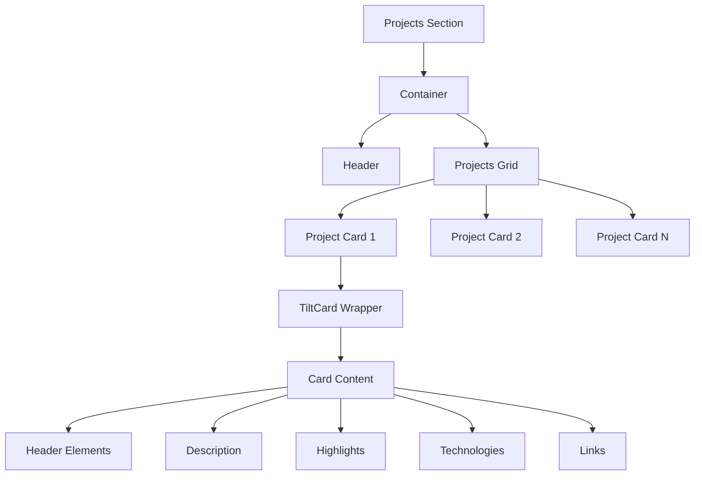
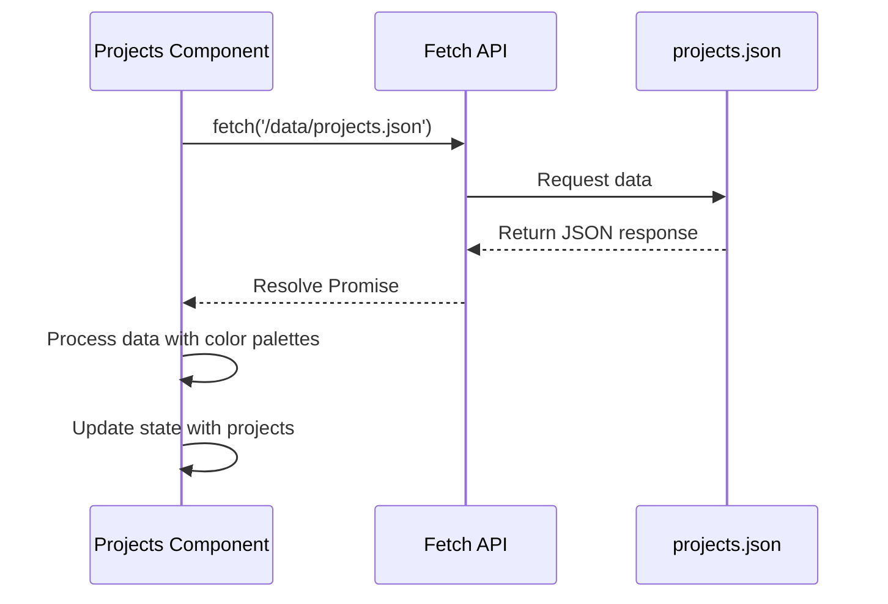
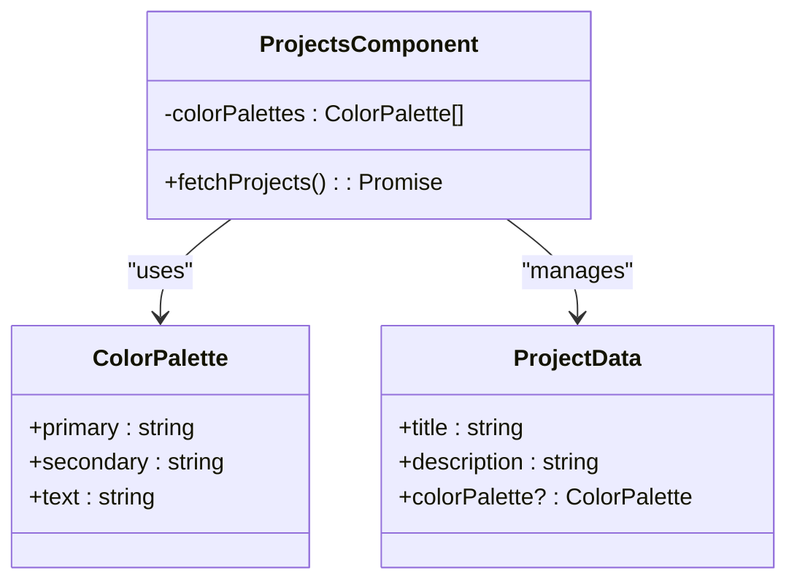
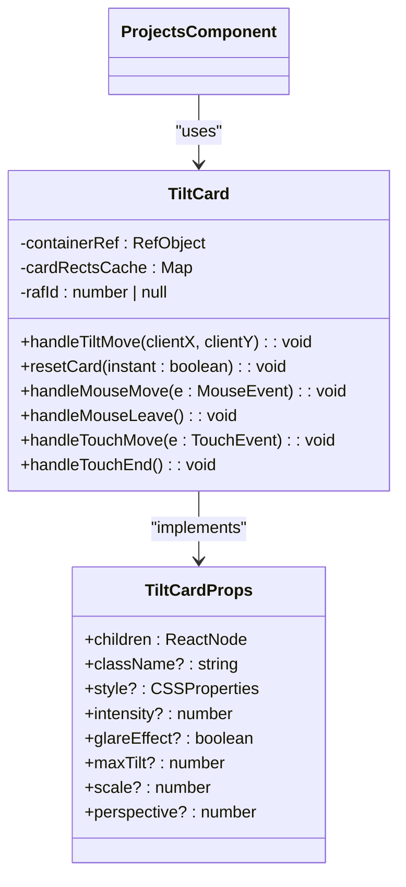
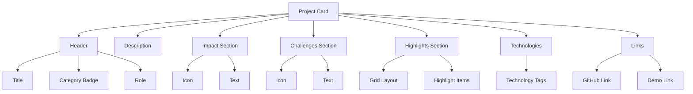
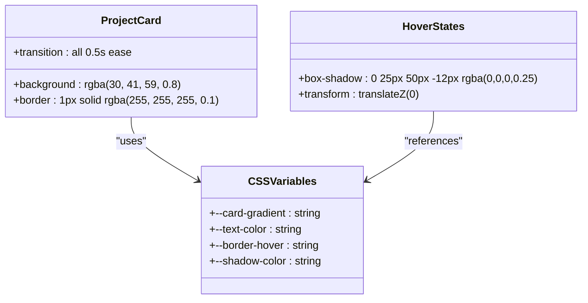
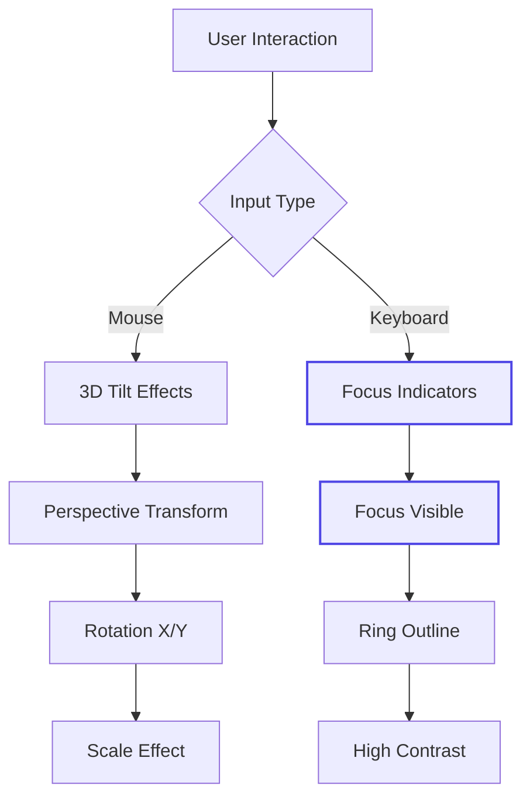
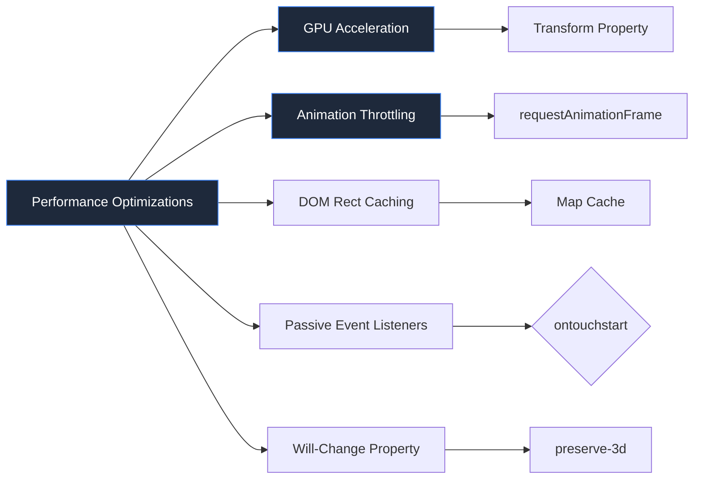

# Projects Section

<cite>
**Referenced Files in This Document**
- [projects.json](file://public/data/projects.json)
- [Projects.tsx](file://src/components/pages/Projects.tsx)
- [TiltCard.tsx](file://src/components/shared/TiltCard.tsx)
- [Project.module.css](file://src/components/pages/Project.module.css)
</cite>

## Table of Contents
1. [Introduction](#introduction)
2. [Grid Layout and Interactive Design](#grid-layout-and-interactive-design)
3. [Project Data Loading and Processing](#project-data-loading-and-processing)
4. [Dynamic Color Palette Integration](#dynamic-color-palette-integration)
5. [TiltCard Component Integration](#tiltcard-component-integration)
6. [Content Areas Structure](#content-areas-structure)
7. [Conditional Rendering Logic](#conditional-rendering-logic)
8. [CSS Custom Properties and Styling](#css-custom-properties-and-styling)
9. [Adding New Projects](#adding-new-projects)
10. [Accessibility Considerations](#accessibility-considerations)
11. [Performance Optimization](#performance-optimization)

## Introduction
The Projects section is a visually engaging component that showcases featured projects through an interactive grid layout. Each project card utilizes 3D transformations triggered by mouse movement, creating an immersive user experience. The implementation combines dynamic data loading from JSON, real-time CSS variable manipulation, and GPU-accelerated animations to deliver a responsive and performant interface.

**Section sources**
- [Projects.tsx](file://src/components/pages/Projects.tsx#L1-L50)

## Grid Layout and Interactive Design
The Projects section implements a responsive grid layout using CSS Grid, adapting from single-column on mobile devices to multi-column layouts on larger screens. The grid container uses a consistent gap spacing and maintains proper alignment across different viewport sizes.

Each project is rendered as an interactive card within the grid, featuring hover effects and 3D transforms powered by the TiltCard component. The layout ensures optimal spacing and readability while maintaining visual consistency across all projects.



**Diagram sources**
- [Projects.tsx](file://src/components/pages/Projects.tsx#L69-L108)
- [Project.module.css](file://src/components/pages/Project.module.css#L150-L170)

## Project Data Loading and Processing
Project data is loaded asynchronously from `/data/projects.json` via the Fetch API during component initialization. The data loading process occurs within a useEffect hook, ensuring it runs after the component mounts.

The JSON file contains structured project information including title, description, technologies, category, impact statement, role, challenges, key features (highlights), and external links. Upon successful retrieval, the data is processed to enrich each project with dynamic color palettes before being stored in component state.



**Diagram sources**
- [Projects.tsx](file://src/components/pages/Projects.tsx#L39-L70)

## Dynamic Color Palette Integration
The Projects section implements a dynamic color system that assigns unique color schemes to each project card based on its position in the list. A predefined array of color palettes containing primary, secondary, and text colors is used to ensure visual consistency while providing variety.

During data processing, each project is assigned a color palette using modulo arithmetic to cycle through the available palettes. These colors are then used to generate CSS custom properties for gradient backgrounds, text colors, and hover effects, creating a cohesive yet diverse visual experience.



**Diagram sources**
- [Projects.tsx](file://src/components/pages/Projects.tsx#L10-L37)

## TiltCard Component Integration
The TiltCard component provides immersive 3D hover effects that respond to mouse movement. Integrated directly into the Projects section, it enables realistic tilt transformations with configurable intensity, maximum tilt angle, scale effect, and perspective.

The component supports both mouse and touch events, making it functional across desktop and mobile devices. It implements requestAnimationFrame for smooth animation performance and includes glare effects that simulate light reflection on the card surface. The tilt behavior is optimized for different device types, with reduced intensity on mobile platforms.



**Diagram sources**
- [TiltCard.tsx](file://src/components/shared/TiltCard.tsx#L2-L11)
- [Projects.tsx](file://src/components/pages/Projects.tsx#L2-L3)

## Content Areas Structure
Each project card displays comprehensive information organized into distinct content areas:

- **Project Title**: Prominently displayed at the top with large font size and white color
- **Category Badge**: Positioned beside the title with gradient background and rounded styling
- **Role Information**: Shows the user's role in the project with appropriate iconography
- **Description**: Provides a concise overview of the project's purpose and functionality
- **Impact Statement**: Highlights the measurable outcomes and business value delivered
- **Challenges**: Details technical or organizational challenges encountered during development
- **Key Features (Highlights)**: Lists significant accomplishments or innovative aspects in bullet-point format
- **Technologies Stack**: Displays technology tags with subtle gradients and hover effects
- **External Links**: Provides access to GitHub repository and live demo when available



**Diagram sources**
- [Projects.tsx](file://src/components/pages/Projects.tsx#L110-L230)

## Conditional Rendering Logic
The Projects section implements conditional rendering for external links based on hideCode/hideDemo flags and URL availability. When either flag is set to true in the project data, the corresponding link section is hidden entirely.

For cases where URLs are missing but the hide flags allow display, disabled link states are rendered instead. These appear with reduced opacity, grayscale filter, and not-allowed cursor to indicate non-interactivity. The conditional logic ensures clean presentation regardless of data completeness.

```mermaid
flowchart TD
A[Check hideCode || hideDemo] --> |False| B[Render Links Container]
A --> |True| C[Skip Links]
B --> D{hideCode ?}
D --> |False| E{github URL?}
D --> |True| F[Render Active Code Link]
E --> |Yes| F
E --> |No| G[Render Disabled Code Link]
B --> H{hideDemo ?}
H --> |False| I{demo URL?}
H --> |True| J[Render Active Demo Link]
I --> |Yes| J
I --> |No| K[Render Disabled Demo Link]
```

**Section sources**
- [Projects.tsx](file://src/components/pages/Projects.tsx#L189-L230)

## CSS Custom Properties and Styling
The Projects section leverages CSS custom properties (--card-gradient, --border-hover, --text-color, --shadow-color) to enable dynamic theming. These variables are defined both in CSS and programmatically in JavaScript, allowing runtime customization of visual elements.

The --card-gradient property creates semi-transparent linear gradients for background overlays, while --border-hover controls the border color during hover states. These custom properties work in conjunction with Tailwind-inspired utility classes to create a flexible and maintainable styling system.



**Diagram sources**
- [Project.module.css](file://src/components/pages/Project.module.css#L111-L113)
- [Projects.tsx](file://src/components/pages/Projects.tsx#L69-L108)

## Adding New Projects
To add a new project, extend the projects.json array with a properly formatted object containing all required fields. The JSON structure follows a specific schema with mandatory and optional properties.

New entries should include descriptive content for all text fields, a comprehensive technologies array, and valid URLs for external links. The system automatically assigns color palettes based on position, so no manual color configuration is needed.

```json
{
  "title": "Project Name",
  "description": "Brief project overview",
  "technologies": ["Technology 1", "Technology 2"],
  "category": "Project Category",
  "impact": "Measurable outcomes and business value",
  "role": "Your role in the project",
  "challenges": "Technical or organizational challenges faced",
  "highlights": [
    "Key achievement or feature",
    "Notable accomplishment"
  ],
  "github": "https://github.com/username/repository",
  "demo": "https://demo.example.com",
  "hideCode": false,
  "hideDemo": false
}
```

**Section sources**
- [projects.json](file://public/data/projects.json#L0-L87)

## Accessibility Considerations
The Projects section incorporates several accessibility features to ensure keyboard navigation compatibility. All interactive elements maintain focus visibility through CSS focus states, and screen reader users receive appropriate semantic markup.

Keyboard users can navigate between project cards using tab keys, with visual indicators showing current focus. The implementation avoids trapping focus within components and maintains logical tab order. While the 3D effects are primarily visual enhancements, core content remains accessible even when these effects are not perceivable.



**Section sources**
- [Project.module.css](file://src/components/pages/Project.module.css#L348-L350)

## Performance Optimization
The Projects section implements several performance optimizations to ensure smooth animations and efficient rendering. GPU acceleration is leveraged through transform and will-change properties, offloading animation work to the graphics processor.

The TiltCard component uses requestAnimationFrame for optimal animation timing and implements event throttling to prevent excessive re-renders. DOM rect calculations are cached to minimize layout thrashing, and passive event listeners improve scroll responsiveness on touch devices. These optimizations collectively ensure 60fps animations even on mid-range devices.



**Section sources**
- [TiltCard.tsx](file://src/components/shared/TiltCard.tsx#L100-L150)