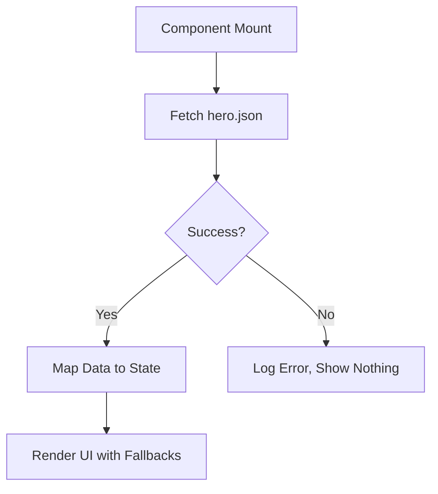
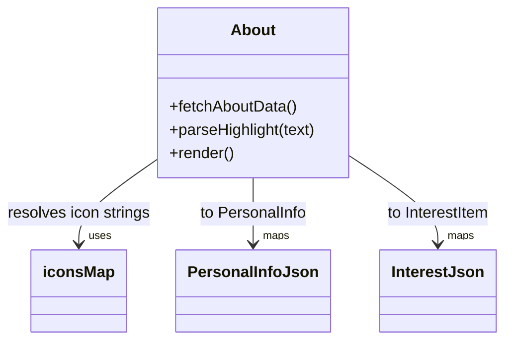
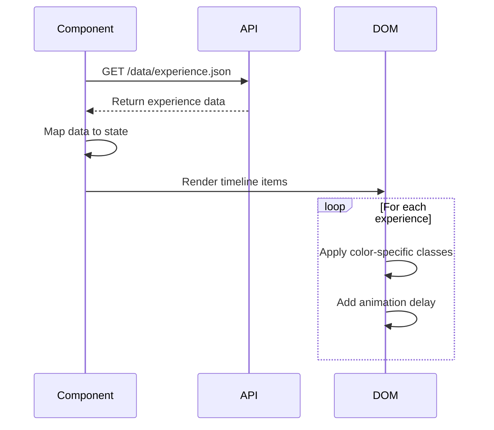
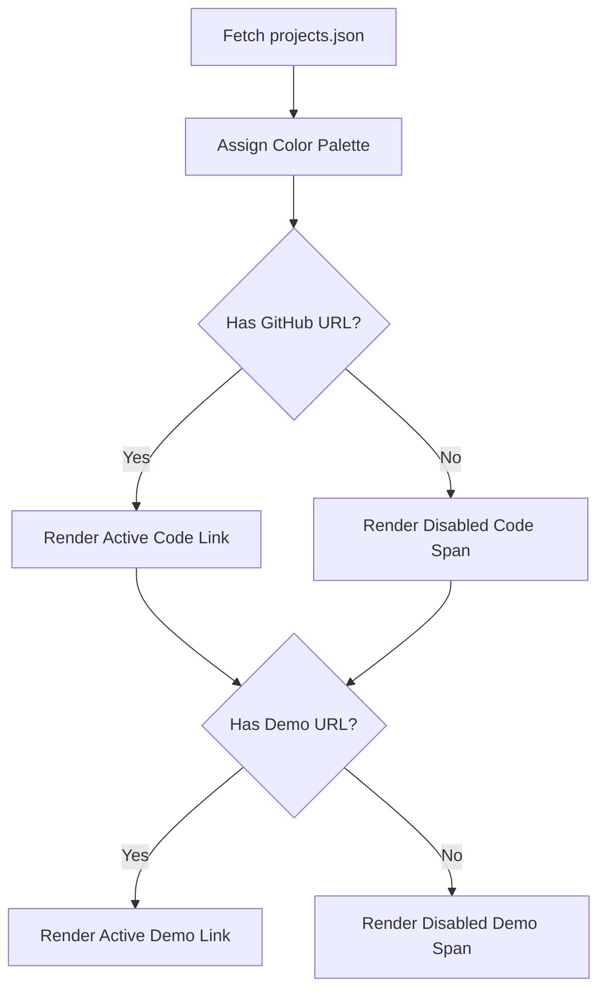
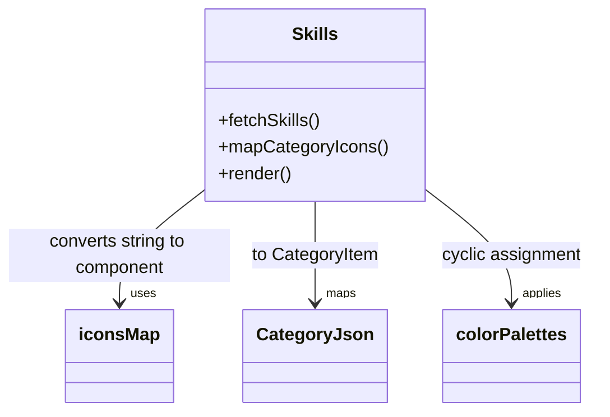
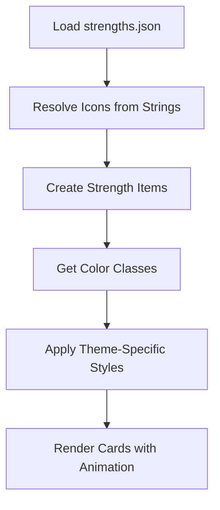
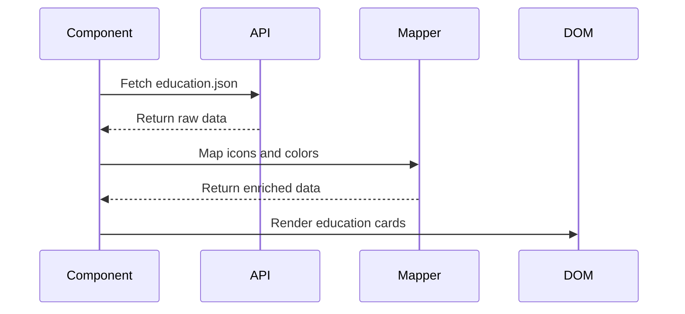
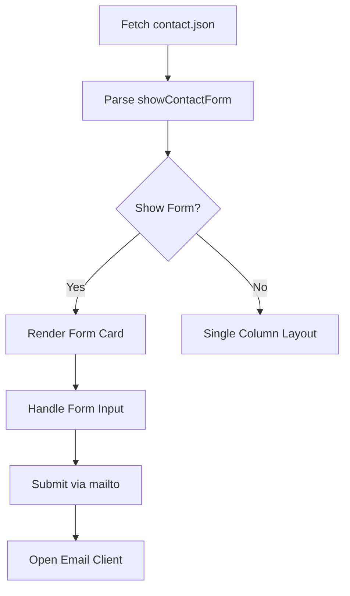
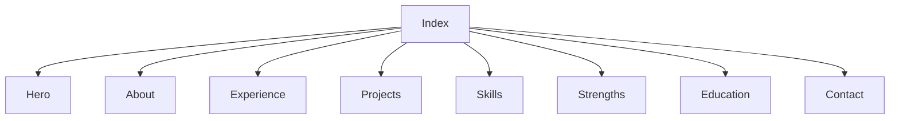

# Section Components

<cite>
**Referenced Files in This Document **   
- [Hero.tsx](file://src/components/pages/Hero.tsx)
- [About.tsx](file://src/components/pages/About.tsx)
- [Experience.tsx](file://src/components/pages/Experience.tsx)
- [Projects.tsx](file://src/components/pages/Projects.tsx)
- [Skills.tsx](file://src/components/pages/Skills.tsx)
- [Strengths.tsx](file://src/components/pages/Strengths.tsx)
- [Education.tsx](file://src/components/pages/Education.tsx)
- [Contact.tsx](file://src/components/pages/Contact.tsx)
- [hero.json](file://public/data/hero.json)
- [about.json](file://public/data/about.json)
- [experience.json](file://public/data/experience.json)
- [projects.json](file://public/data/projects.json)
- [skills.json](file://public/data/skills.json)
- [strengths.json](file://public/data/strengths.json)
- [education.json](file://public/data/education.json)
- [contact.json](file://public/data/contact.json)
</cite>

## Table of Contents
1. [Introduction](#introduction)
2. [Hero Section](#hero-section)
3. [About Section](#about-section)
4. [Experience Section](#experience-section)
5. [Projects Section](#projects-section)
6. [Skills Section](#skills-section)
7. [Strengths Section](#strengths-section)
8. [Education Section](#education-section)
9. [Contact Section](#contact-section)
10. [Data Management and Rendering Patterns](#data-management-and-rendering-patterns)
11. [Styling and Responsive Design](#styling-and-responsive-design)
12. [Accessibility and Performance](#accessibility-and-performance)

## Introduction
This document provides comprehensive documentation for each section component in the portfolio application. It details the visual appearance, layout structure, content rendering logic, data handling, styling approach, and unique behaviors of the Hero, About, Experience, Projects, Skills, Strengths, Education, and Contact sections. The analysis covers how components import and display data from JSON files, handle conditional rendering, apply consistent styling via Tailwind CSS and CSS Modules, and implement accessibility and performance best practices.

## Hero Section

The Hero component serves as the primary landing view, featuring a dynamic introduction with animated elements and key statistics. It renders a clean, modern design with parallax effects and floating background elements to create visual depth.

### Visual Appearance and Layout
The Hero section uses a centered container layout with a fade-in animation effect. Key visual elements include:
- Badge, name, and subtitle headers
- Descriptive paragraph
- Two action buttons (Download Resume, Get In Touch)
- Statistic counters with color-coded numbers
- Scroll indicator prompting users to explore further

### Content Rendering Logic
The component fetches data from `/data/hero.json` and maps it to the UI. Statistics are dynamically colored using predefined palettes:

**Section sources**
- [Hero.tsx](file://src/components/pages/Hero.tsx#L1-L186)
- [hero.json](file://public/data/hero.json#L1-L14)

## About Section

The About component presents personal information, interests, achievements, and professional stats in a two-column layout with card-based design.

### Visual Appearance and Layout
The section features:
- Left column: Profile card with bio and interests
- Right column: Contact information cards, achievements list, and quick stats
- Each contact card has a gradient background and shimmer effect
- Interest items use colored icons with matching text styles

### Content Rendering Logic
Data is loaded from `/data/about.json` and processed to resolve Lucide icons from string names. The component supports highlighted text using `[[text|color]]` syntax:

**Section sources**
- [About.tsx](file://src/components/pages/About.tsx#L1-L363)
- [about.json](file://public/data/about.json#L1-L39)

## Experience Section

The Experience component displays professional history in a timeline format with color-coded entries and achievement highlights.

### Visual Appearance and Layout
Key visual elements include:
- Vertical timeline with colored dots
- Experience cards positioned alternately on left/right
- Color-coded headers, badges, and decorative elements
- Achievement bullet points and technology badges
- Shimmer effects and background overlays

### Content Rendering Logic
The component loads experience data from `/data/experience.json` and renders each entry with:
- Dynamic color classes based on the `color` field
- Animated entrance with incremental delay
- Technology tags with color-specific styling
- Achievement lists with custom bullet points

**Section sources**
- [Experience.tsx](file://src/components/pages/Experience.tsx#L1-L170)
- [experience.json](file://public/data/experience.json#L1-L87)

## Projects Section

The Projects component showcases featured work in a responsive grid of tilt-effect cards with detailed project information.

### Visual Appearance and Layout
Each project card includes:
- Gradient background with shimmer effect
- Project title and category badge
- Role, description, impact, and challenges
- Key features/highlights list
- Technology tags
- Conditional code/demo links

### Content Rendering Logic
Projects are fetched from `/data/projects.json` and enhanced with dynamic color palettes. The component implements conditional rendering for links:

**Section sources**
- [Projects.tsx](file://src/components/pages/Projects.tsx#L1-L231)
- [projects.json](file://public/data/projects.json#L1-L88)

## Skills Section

The Skills component organizes technical competencies into categorized cards with skill lists and visual indicators.

### Visual Appearance and Layout
The section displays:
- Grid of category cards with icons and titles
- Each card shows skills as dot-itemized list
- Gradient backgrounds with color-specific animations
- Decorative dots and shimmer effects
- Category-specific color schemes applied throughout

### Content Rendering Logic
Skills data is loaded from `/data/skills.json` and mapped to components with resolved icons:

**Section sources**
- [Skills.tsx](file://src/components/pages/Skills.tsx#L1-L151)
- [skills.json](file://public/data/skills.json#L1-L15)

## Strengths Section

The Strengths component highlights core personal and professional qualities through visually distinct cards with iconography.

### Visual Appearance and Layout
Each strength card features:
- Full-bleed gradient background
- Central icon with colored wrapper
- Title and description
- Decorative dot elements
- Shimmer overlay effect
- Color-specific styling via CSS classes

### Content Rendering Logic
The component retrieves strengths from `/data/strengths.json` and applies color themes through a lookup system:

**Section sources**
- [Strengths.tsx](file://src/components/pages/Strengths.tsx#L1-L160)
- [strengths.json](file://public/data/strengths.json#L1-L15)

## Education Section

The Education component presents academic background in a vertical card layout with subject listings and institutional details.

### Visual Appearance and Layout
Key visual elements:
- Single-column card layout
- Degree and university information
- Duration and year badges with icons
- Description box
- Key subjects grid with dot indicators
- Floating decorative elements

### Content Rendering Logic
Education data is loaded from `/data/education.json` and enhanced with icon resolution and color mapping:

**Section sources**
- [Education.tsx](file://src/components/pages/Education.tsx#L1-L199)
- [education.json](file://public/data/education.json#L1-L20)

## Contact Section

The Contact component combines contact information with a message form, conditionally rendered based on configuration.

### Visual Appearance and Layout
The section includes:
- Two-column layout (information + form)
- Contact method cards with gradient backgrounds
- Form with name, email, and message fields
- Submit button with loading state
- Heart icon in header
- Color-coordinated contact method cards

### Content Rendering Logic
The component implements sophisticated form handling and conditional rendering:

Form submission uses the `mailto:` protocol with pre-filled subject and body, accompanied by toast notifications.

**Section sources**
- [Contact.tsx](file://src/components/pages/Contact.tsx#L1-L282)
- [contact.json](file://public/data/contact.json#L1-L10)

## Data Management and Rendering Patterns

All section components follow a consistent pattern for data management and rendering:

### JSON Data Structure
Each section has a corresponding JSON file in `/public/data` with structured content tailored to its purpose.

### Common Implementation Patterns
- **Data Fetching**: All components use `useEffect` with `fetch()` to load JSON data
- **State Management**: Data is stored in React state using `useState`
- **Error Handling**: Try-catch blocks with console.error logging
- **Loading States**: Components render nothing or placeholders during loading
- **Icon Resolution**: String-based icon names mapped to Lucide components

### Prop Drilling and Composition
Components are composed in `Index.tsx` without prop drilling - each manages its own data:

**Section sources**
- [Index.tsx](file://src/pages/Index.tsx#L1-L27)
- [App.tsx](file://src/App.tsx#L1-L28)

## Styling and Responsive Design

The application uses a hybrid styling approach combining Tailwind CSS and CSS Modules.

### Styling Architecture
- **Tailwind CSS**: Utility-first classes for layout, spacing, and basic styling
- **CSS Modules**: Component-specific styles with unique class names
- **Dynamic CSS Variables**: Gradient colors and hover effects set inline

### Responsive Adaptations
- Mobile-first design principles
- Flexible grid layouts that collapse to single column
- Typography scales appropriately
- Touch-friendly tap targets
- Hidden decorative elements on small screens

### Animation Integration
- Fade-in animations on scroll
- Staggered entry animations for lists
- Hover effects on interactive elements
- Shimmer animations on card backgrounds
- Parallax effects in Hero section

**Section sources**
- [Hero.module.css](file://src/components/pages/Hero.module.css)
- [About.module.css](file://src/components/pages/About.module.css)
- [Experience.module.css](file://src/components/pages/Experience.module.css)
- [Project.module.css](file://src/components/pages/Project.module.css)
- [Skills.module.css](file://src/components/pages/Skills.module.css)
- [Strengths.module.css](file://src/components/pages/Strengths.module.css)
- [Education.module.css](file://src/components/pages/Education.module.css)
- [Contact.module.css](file://src/components/pages/Contact.module.css)

## Accessibility and Performance

### Accessibility Guidelines
- Semantic HTML structure with proper heading hierarchy
- ARIA labels for interactive elements
- Keyboard navigation support
- Sufficient color contrast
- Alt text for decorative images
- Form labels properly associated with inputs
- Focus indicators visible

### Performance Considerations
- **Memoization Opportunities**: Consider `React.memo()` for card components
- **Lazy Loading**: Potential to lazy-load non-critical sections
- **Image Optimization**: Ensure all images are properly optimized
- **Bundle Size**: Monitor dependencies, particularly Lucide icons
- **JSON Caching**: Implement caching strategy for data files

### Customization Guidance
Common customization needs can be addressed as follows:
- **Adding Projects**: Add new entry to `projects.json` with required fields
- **Modifying Order**: Reorder array elements in respective JSON files
- **Changing Colors**: Modify color palettes in component files or add new ones
- **Updating Content**: Edit text directly in JSON files without touching React components

**Section sources**
- [Hero.tsx](file://src/components/pages/Hero.tsx#L1-L186)
- [About.tsx](file://src/components/pages/About.tsx#L1-L363)
- [Experience.tsx](file://src/components/pages/Experience.tsx#L1-L170)
- [Projects.tsx](file://src/components/pages/Projects.tsx#L1-L231)
- [Skills.tsx](file://src/components/pages/Skills.tsx#L1-L151)
- [Strengths.tsx](file://src/components/pages/Strengths.tsx#L1-L160)
- [Education.tsx](file://src/components/pages/Education.tsx#L1-L199)
- [Contact.tsx](file://src/components/pages/Contact.tsx#L1-L282)