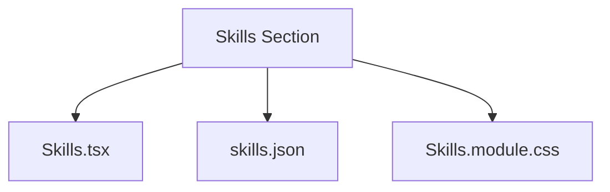
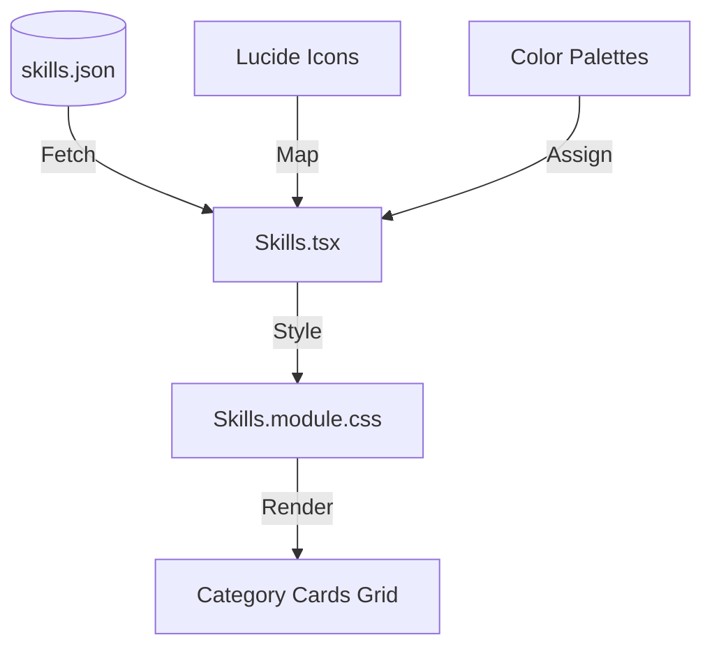
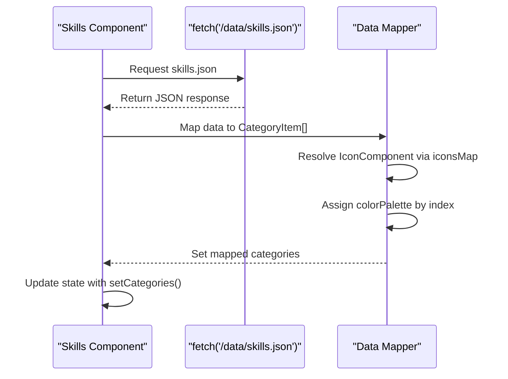
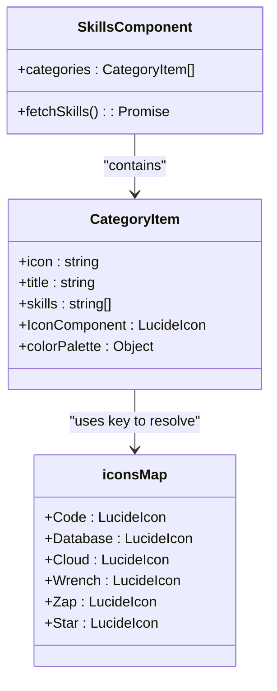
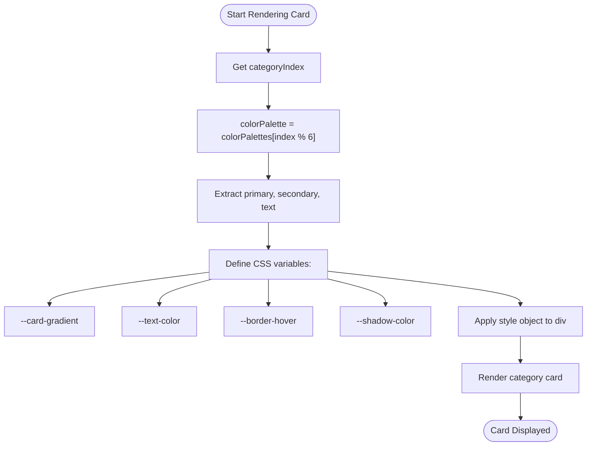
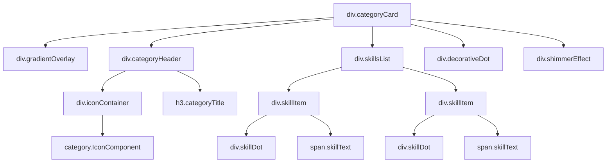
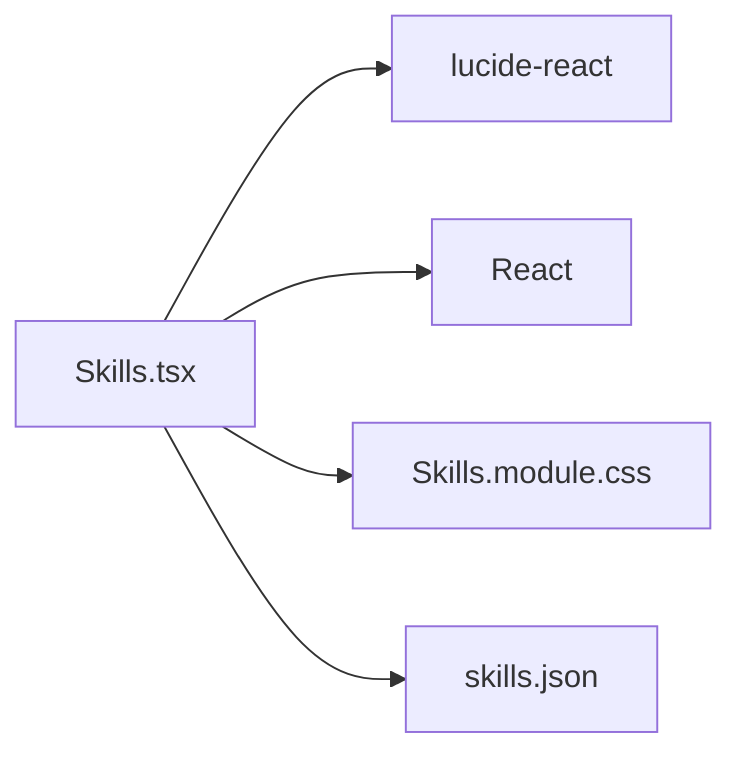

# Skills Section

<cite>
**Referenced Files in This Document **  
- [Skills.tsx](file://src/components/pages/Skills.tsx)
- [skills.json](file://public/data/skills.json)
- [Skills.module.css](file://src/components/pages/Skills.module.css)
</cite>

## Table of Contents
1. [Introduction](#introduction)
2. [Project Structure](#project-structure)
3. [Core Components](#core-components)
4. [Architecture Overview](#architecture-overview)
5. [Detailed Component Analysis](#detailed-component-analysis)
6. [Dependency Analysis](#dependency-analysis)
7. [Performance Considerations](#performance-considerations)
8. [Troubleshooting Guide](#troubleshooting-guide)
9. [Conclusion](#conclusion)

## Introduction
The Skills section is a dynamic, visually engaging component that displays technical competencies through a modular grid layout. Each category card represents a distinct technical domain such as AI/ML, Backend Development, Databases, Cloud platforms, Frontend technologies, and Blockchain. The design emphasizes both aesthetic appeal and functional clarity, using animated transitions, gradient overlays, and interactive hover effects to enhance user experience.

## Project Structure
The implementation of the Skills section spans three primary files across different directories:
- `src/components/pages/Skills.tsx`: Main React component handling logic and rendering
- `public/data/skills.json`: Data source containing categorized skill information
- `src/components/pages/Skills.module.css`: Styling with responsive layouts and animations

**Diagram sources**
- [Skills.tsx](file://src/components/pages/Skills.tsx#L0-L151)
- [skills.json](file://public/data/skills.json#L0-L31)
- [Skills.module.css](file://src/components/pages/Skills.module.css#L0-L293)

## Core Components
The core functionality revolves around fetching structured JSON data, dynamically resolving icon components from Lucide React library, applying color themes via CSS variables, and rendering an interactive grid of skill cards. The component uses React hooks for state management and side effects, ensuring efficient updates and re-renders.

**Section sources**
- [Skills.tsx](file://src/components/pages/Skills.tsx#L0-L151)

## Architecture Overview
The architecture follows a clean separation between data (JSON), presentation (CSS modules), and behavior (React component). It leverages modern web techniques including CSS custom properties, module-based styling, asynchronous data loading, and declarative UI rendering.

**Diagram sources**
- [Skills.tsx](file://src/components/pages/Skills.tsx#L0-L151)
- [skills.json](file://public/data/skills.json#L0-L31)
- [Skills.module.css](file://src/components/pages/Skills.module.css#L0-L293)

## Detailed Component Analysis

### Data Fetching and State Management
The component initializes an empty state for categories and uses `useEffect` to asynchronously fetch skills data from `/data/skills.json`. Upon successful retrieval, it maps raw JSON into enriched objects containing resolved icons and assigned color palettes.

#### Sequence Diagram: Data Initialization Flow

**Diagram sources**
- [Skills.tsx](file://src/components/pages/Skills.tsx#L55-L94)

### Dynamic Icon Resolution
String-based icon identifiers from the JSON are converted into actual Lucide React components using a lookup map (`iconsMap`). This allows flexible configuration without hardcoding component references in data.

#### Class Diagram: Icon Mapping System

**Diagram sources**
- [Skills.tsx](file://src/components/pages/Skills.tsx#L0-L56)

### Color Assignment Logic
Each category receives a unique color palette from a predefined array (`colorPalettes`) based on its index modulo the number of available palettes. These colors are applied via CSS custom properties for gradients, text, borders, and shadows.

#### Flowchart: Color Application Process

**Diagram sources**
- [Skills.tsx](file://src/components/pages/Skills.tsx#L96-L121)

### Hierarchical UI Structure
Each category card features a header with icon and title, followed by a list of individual skills. Each skill item includes a colored dot indicator and text label, creating a consistent visual hierarchy.

#### HTML Structure Tree

**Diagram sources**
- [Skills.tsx](file://src/components/pages/Skills.tsx#L123-L150)
- [Skills.module.css](file://src/components/pages/Skills.module.css#L188-L251)

## Dependency Analysis
The Skills component depends on external libraries and internal assets:
- **Lucide React**: Provides scalable vector icons
- **React Hooks**: Enables state and lifecycle management
- **CSS Modules**: Ensures scoped styles
- **Public Data Directory**: Hosts JSON configuration

**Diagram sources**
- [Skills.tsx](file://src/components/pages/Skills.tsx#L0-L151)

## Performance Considerations
The component efficiently handles rendering through:
- Lazy loading of JSON data only when needed
- Memoized mappings within `useEffect`
- CSS transitions instead of JavaScript animations where possible
- Optimized hover effects using GPU-accelerated transforms and opacity changes

No unnecessary re-renders occur due to proper dependency array usage in `useEffect`, and error handling prevents crashes during failed fetch operations.

## Troubleshooting Guide
Common issues and solutions:

| Issue | Cause | Solution |
|------|-------|----------|
| Cards not appearing | Failed JSON fetch | Check network tab for 404 errors; verify `skills.json` exists at `/data/skills.json` |
| Icons missing | Invalid icon name in JSON | Ensure icon field matches keys in `iconsMap` (e.g., "Code", "Database") |
| Colors not applying | Mismatched CSS variable names | Verify CSS variables match those defined in `CustomCSSProperties` interface |
| Layout broken on mobile | Missing viewport meta tag | Confirm `index.html` includes proper `<meta name="viewport">` tag |

**Section sources**
- [Skills.tsx](file://src/components/pages/Skills.tsx#L55-L94)
- [Skills.module.css](file://src/components/pages/Skills.module.css#L63-L126)

## Conclusion
The Skills section exemplifies a well-structured, maintainable approach to presenting categorized technical expertise. By decoupling data from presentation and leveraging modern React patterns, it enables easy updates and customization. Its modular design supports scalability, allowing new categories and skills to be added simply by updating the JSON file without touching the component logic.