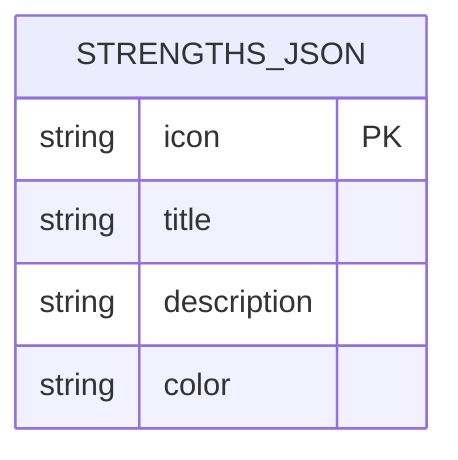
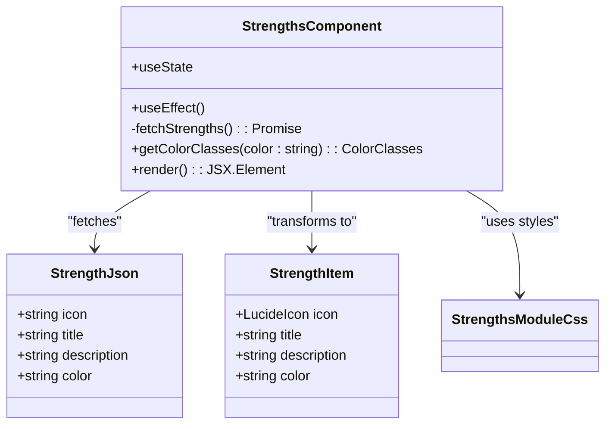
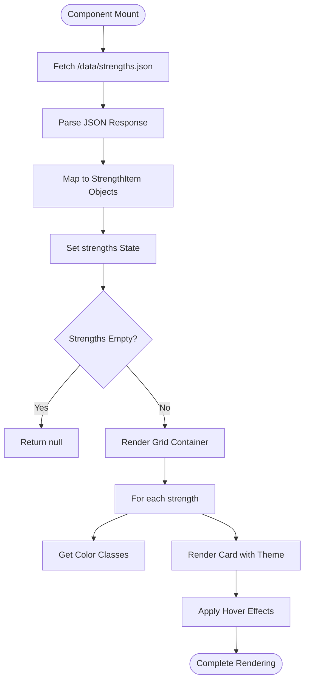
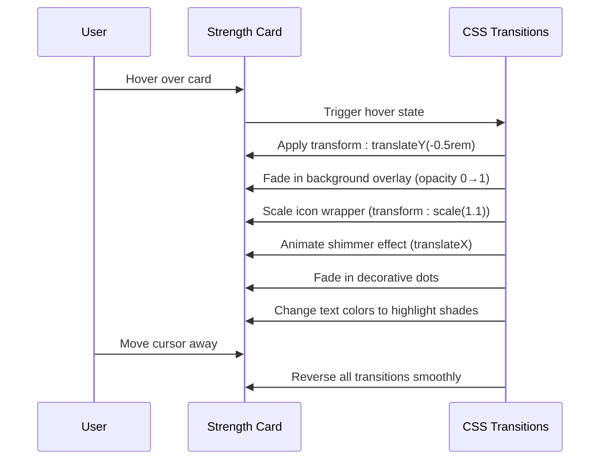

# Strengths Section

<cite>
**Referenced Files in This Document**   
- [Strengths.tsx](file://src/components/pages/Strengths.tsx)
- [strengths.json](file://public/data/strengths.json)
- [Strengths.module.css](file://src/components/pages/Strengths.module.css)
</cite>

## Table of Contents
1. [Introduction](#introduction)
2. [Data Structure and Configuration](#data-structure-and-configuration)
3. [Component Architecture](#component-architecture)
4. [Rendering Logic and Styling](#rendering-logic-and-styling)
5. [Interactive Elements and Visual Effects](#interactive-elements-and-visual-effects)
6. [Implementation Guide](#implementation-guide)
7. [Best Practices for Content Creation](#best-practices-for-content-creation)

## Introduction

The Strengths section is a visually engaging component designed to showcase key soft skills, professional competencies, and core values through an interactive card-based interface. This section serves as a strategic presentation layer that highlights personal attributes contributing to professional success. Each strength is displayed as a stylized card with thematic visual elements, including color-coded design schemes, relevant icons, and descriptive text. The component dynamically loads data from an external JSON file, enabling easy content updates without code modifications. Integrated hover effects and subtle animations enhance user engagement while maintaining a professional aesthetic aligned with modern portfolio design principles.

**Section sources**
- [Strengths.tsx](file://src/components/pages/Strengths.tsx#L1-L20)
- [strengths.json](file://public/data/strengths.json#L1-L5)

## Data Structure and Configuration

The Strengths section retrieves its content from `strengths.json`, a structured data file located in the public data directory. This JSON configuration defines each strength with four essential attributes: icon, title, description, and color. The icon field references Lucide React icon components by name (e.g., "Clock", "Zap"), which are programmatically mapped to their corresponding React components during rendering. Titles provide concise labels for each strength, while descriptions offer detailed explanations of how these qualities manifest in professional contexts. The color attribute assigns a thematic palette to each card, supporting six predefined color schemes: emerald, amber, rose, violet, blue, and purple. This externalized data approach enables non-technical users to update content through simple JSON edits, promoting maintainability and flexibility in presenting evolving skill sets.

**Diagram sources**
- [strengths.json](file://public/data/strengths.json#L1-L38)

**Section sources**
- [strengths.json](file://public/data/strengths.json#L1-L38)
- [Strengths.tsx](file://src/components/pages/Strengths.tsx#L10-L25)

## Component Architecture

The Strengths component follows a modular React architecture with clear separation between data handling, state management, and presentation logic. Implemented as a functional component using React hooks, it leverages the `useState` and `useEffect` hooks for managing asynchronous data loading and rendering state. Upon mounting, the component initiates a fetch request to retrieve strengths data from `/data/strengths.json`. Error handling is implemented to gracefully manage potential network failures or invalid responses. The component maintains its state through the `strengths` array, which stores processed strength items after mapping raw JSON data to enriched objects containing resolved icon components. A type-safe interface structure ensures data integrity throughout the transformation process, with `StrengthJson` representing the raw JSON schema and `StrengthItem` defining the enhanced runtime object structure that includes the actual Lucide icon component reference.

**Diagram sources**
- [Strengths.tsx](file://src/components/pages/Strengths.tsx#L27-L50)

**Section sources**
- [Strengths.tsx](file://src/components/pages/Strengths.tsx#L27-L160)

## Rendering Logic and Styling

The rendering logic implements a dynamic mapping system that transforms loaded strength data into visually consistent cards. Each strength item is processed through the `getColorClasses` function, which returns a theme-specific CSS class configuration based on the color attribute. This function acts as a bridge between semantic color names and their corresponding visual treatments, including gradient backgrounds, icon styling, text colors, and decorative element appearances. The component utilizes CSS Modules for scoped styling, ensuring style encapsulation and preventing conflicts with other components. Tailwind CSS utilities are integrated within the module system to provide responsive layout capabilities and consistent design language. The grid layout adapts responsively, displaying cards in a single column on mobile devices and expanding to three columns on larger screens. Each card's structure includes layered elements: a background overlay, icon container, content section, and decorative accents that collectively create depth and visual interest.

**Diagram sources**
- [Strengths.tsx](file://src/components/pages/Strengths.tsx#L103-L144)
- [Strengths.module.css](file://src/components/pages/Strengths.module.css#L1-L100)

**Section sources**
- [Strengths.tsx](file://src/components/pages/Strengths.tsx#L103-L144)
- [Strengths.module.css](file://src/components/pages/Strengths.module.css#L1-L200)

## Interactive Elements and Visual Effects

The Strengths section incorporates multiple interactive elements and visual effects to enhance user engagement and create a dynamic browsing experience. Each card responds to hover interactions with a coordinated set of animations and transformations. On hover, cards elevate through a translateY transformation, creating a sense of depth and responsiveness. Simultaneously, a semi-transparent background gradient overlay fades in, intensifying the card's color theme. The icon container scales slightly and receives enhanced border definition, drawing attention to the central visual element. Text elements transition to brighter shades, improving readability against the activated background. Two decorative dot elements positioned at opposite corners gradually fade into view, adding visual balance. A shimmer effect animates across the card surface, simulating light reflection and further emphasizing interactivity. These effects are carefully orchestrated through CSS transitions with varying durations and delays, producing a sophisticated animation sequence that feels natural and polished without being distracting.

**Diagram sources**
- [Strengths.module.css](file://src/components/pages/Strengths.module.css#L200-L400)

**Section sources**
- [Strengths.module.css](file://src/components/pages/Strengths.module.css#L200-L400)
- [Strengths.tsx](file://src/components/pages/Strengths.tsx#L120-L140)

## Implementation Guide

To extend or modify the Strengths section, follow the established patterns for consistency and maintainability. Adding new strengths requires updating the `strengths.json` file with a new object containing the required fields: icon (matching a Lucide React component name), title, description, and one of the supported color themes. To introduce additional color themes, extend the `getColorClasses` function in `Strengths.tsx` with new color mappings and define corresponding CSS classes in `Strengths.module.css`. When adding new icon types, include the import statement in the component file and register the icon in the `iconsMap` object. For responsive behavior adjustments, modify the grid template columns in the CSS file's media queries. All visual customizations should be implemented through CSS Modules to preserve style isolation. The component is imported into the main application via `Index.tsx`, following the standard component registration pattern used throughout the project.

**Section sources**
- [Strengths.tsx](file://src/components/pages/Strengths.tsx#L1-L160)
- [strengths.json](file://public/data/strengths.json#L1-L38)
- [Strengths.module.css](file://src/components/pages/Strengths.module.css#L1-L400)
- [Index.tsx](file://src/pages/Index.tsx#L6)

## Best Practices for Content Creation

When crafting content for the Strengths section, focus on articulating transferable skills with concrete professional impact. Titles should be concise and action-oriented, using strong descriptors like "Technical Excellence" rather than generic terms like "Skills." Descriptions should follow the STAR framework (Situation, Task, Action, Result) in miniature, highlighting specific capabilities and their business value. Each description should answer: What does this strength enable? How has it been demonstrated? What outcomes does it produce? Align strengths with career branding goals by selecting attributes that support desired professional narratives—leadership roles should emphasize accountability and team collaboration, while technical positions should highlight problem-solving and adaptability. Maintain thematic consistency by pairing icons with intuitive metaphorical connections to the strength (e.g., "Clock" for time management). Ensure color assignments create visual harmony across the section, distributing warmer and cooler tones evenly to prevent visual imbalance.