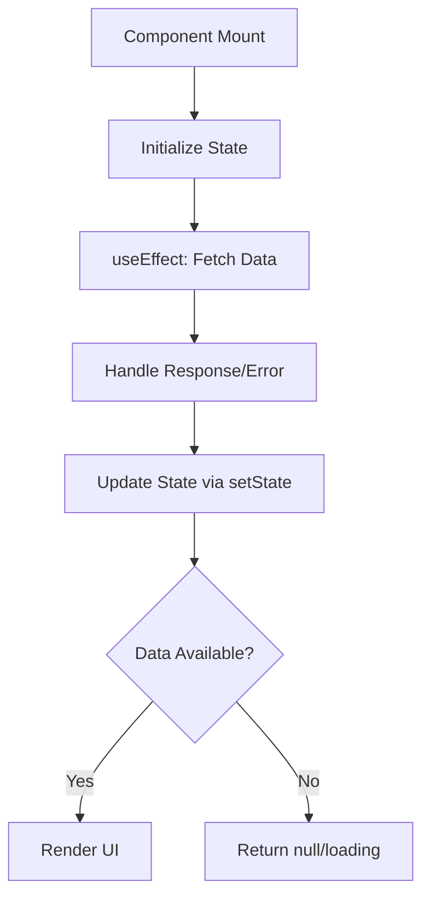
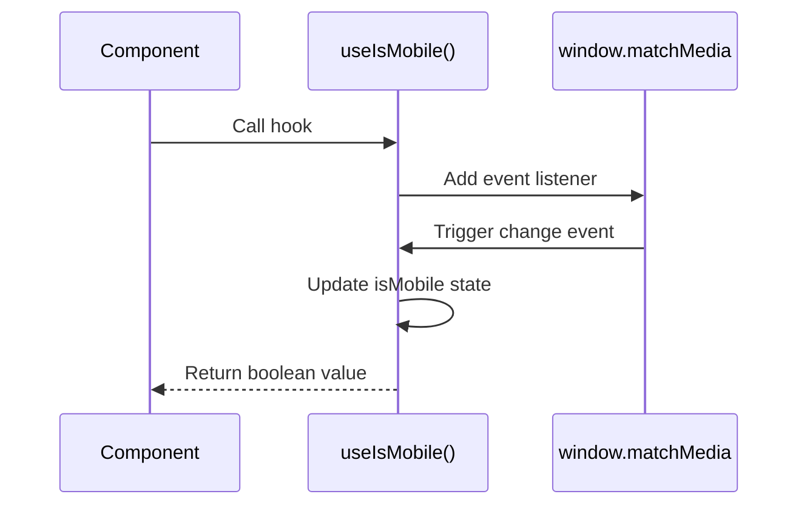
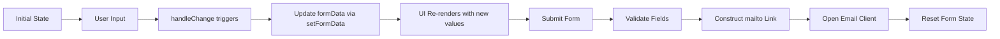
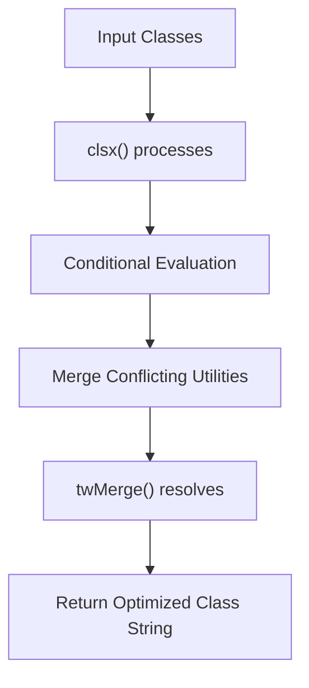
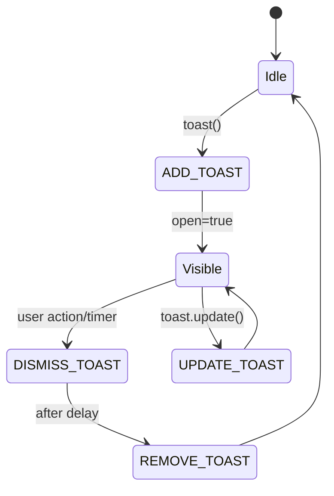

# State Management

<cite>
**Referenced Files in This Document**
- [App.tsx](file://src/App.tsx)
- [Contact.tsx](file://src/components/pages/Contact.tsx)
- [Hero.tsx](file://src/components/pages/Hero.tsx)
- [Skills.tsx](file://src/components/pages/Skills.tsx)
- [About.tsx](file://src/components/pages/About.tsx)
- [Projects.tsx](file://src/components/pages/Projects.tsx)
- [useParallax.ts](file://src/hooks/useParallax.ts)
- [use-mobile.tsx](file://src/hooks/use-mobile.tsx)
- [utils.ts](file://src/lib/utils.ts)
- [use-toast.ts](file://src/hooks/use-toast.ts)
</cite>

## Table of Contents
1. [Introduction](#introduction)
2. [Core State Management Patterns](#core-state-management-patterns)
3. [Custom Hooks for Responsive and Interactive Behavior](#custom-hooks-for-responsive-and-interactive-behavior)
4. [Form State Handling and Validation](#form-state-handling-and-validation)
5. [Data Fetching with React Query](#data-fetching-with-react-query)
6. [Utility Functions and Reusable Logic](#utility-functions-and-reusable-logic)
7. [Toast Notifications and Global UI State](#toast-notifications-and-global-ui-state)
8. [Performance Optimization Strategies](#performance-optimization-strategies)
9. [Common Pitfalls and Best Practices](#common-pitfalls-and-best-practices)
10. [Conclusion](#conclusion)

## Introduction
The farruh-folio-wave project implements a modern React state management architecture using functional components and hooks. This document details the patterns used across the application for managing UI state, user interactions, data fetching, and responsive behavior. The system leverages built-in React hooks like `useState` and `useEffect`, custom hooks for specialized functionality, and external libraries such as React Query for declarative data handling.

**Section sources**
- [App.tsx](file://src/App.tsx#L1-L26)

## Core State Management Patterns
The application uses `useState` to manage component-level state across various pages including Hero, About, Skills, Projects, and Contact sections. Each page loads JSON data from the public directory into local state via `useEffect`-driven fetch operations. For example, the Hero component maintains state for hero data and statistics, while the Skills component manages category data fetched from skills.json.

State is initialized with appropriate types and updated using setter functions returned by `useState`. Components conditionally render based on whether data has been loaded, often returning null during loading states. This pattern ensures that UI elements only appear when their required data is available.



**Diagram sources**
- [Hero.tsx](file://src/components/pages/Hero.tsx#L45-L84)
- [Skills.tsx](file://src/components/pages/Skills.tsx#L55-L94)

**Section sources**
- [Hero.tsx](file://src/components/pages/Hero.tsx#L45-L84)
- [Skills.tsx](file://src/components/pages/Skills.tsx#L55-L94)
- [About.tsx](file://src/components/pages/About.tsx#L147-L188)
- [Projects.tsx](file://src/components/pages/Projects.tsx#L39-L70)

## Custom Hooks for Responsive and Interactive Behavior
The project defines two key custom hooks: `useParallax` and `useIsMobile`. These encapsulate complex logic for interactive visual effects and responsive design decisions.

### useParallax Hook
This hook tracks both scroll position and mouse movement across the viewport, providing smooth interpolated values through requestAnimationFrame-based throttling. It exposes multiple utility functions (`getParallaxStyle`, `getMouseParallaxStyle`, `getCombinedParallaxStyle`) that return transform styles for parallax animations. The implementation uses `lerp` (linear interpolation) for fluid motion and maintains separate raw and smoothed values for performance-sensitive contexts.

```mermaid
classDiagram
class useParallax {
+scrollY : number
+mousePosition : {x : number, y : number}
+rawScrollY : number
+rawMousePosition : {x : number, y : number}
+getParallaxStyle(speed : number, useSmooth : boolean) : Object
+getMouseParallaxStyle(intensity : number, useSmooth : boolean) : Object
+getCombinedParallaxStyle(scrollSpeed : number, mouseIntensity : number, useSmooth : boolean) : Object
}
```

**Diagram sources**
- [useParallax.ts](file://src/hooks/useParallax.ts#L0-L109)

**Section sources**
- [useParallax.ts](file://src/hooks/useParallax.ts#L0-L109)

### useIsMobile Hook
This hook determines mobile device status based on a 768px breakpoint. It uses `window.matchMedia` to listen for changes in viewport width and updates state accordingly. The hook returns a boolean indicating whether the current viewport is below the mobile threshold, enabling responsive UI adaptations throughout the application.



**Diagram sources**
- [use-mobile.tsx](file://src/hooks/use-mobile.tsx#L0-L18)

**Section sources**
- [use-mobile.tsx](file://src/hooks/use-mobile.tsx#L0-L18)

## Form State Handling and Validation
The Contact component demonstrates comprehensive form state management using controlled components. Form data is centralized in a single state object managed by `useState`, with individual fields bound through a generic `handleChange` function that dynamically updates properties based on input names.

Form validation occurs at the browser level using HTML5 required attributes, while submission is handled asynchronously with simulated delay to mimic real API calls. Upon submission, the form constructs a mailto link with encoded message content and opens the user's default email client. After submission, the form resets its state to clear all fields.



**Diagram sources**
- [Contact.tsx](file://src/components/pages/Contact.tsx#L60-L95)

**Section sources**
- [Contact.tsx](file://src/components/pages/Contact.tsx#L60-L282)

## Data Fetching with React Query
Although not explicitly implemented in the current codebase, the App component is configured to support React Query through the `QueryClientProvider`. This indicates an architectural intention to adopt declarative data fetching patterns. Currently, data loading is performed manually using `fetch` within `useEffect` hooks, but the presence of React Query suggests potential for future migration toward more sophisticated caching, background refetching, and server-state synchronization capabilities.

The existing manual fetching approach follows standard patterns: initiate request in `useEffect`, handle loading/error states, parse JSON response, transform data as needed, and update component state.

**Section sources**
- [App.tsx](file://src/App.tsx#L1-L26)

## Utility Functions and Reusable Logic
The `cn` utility function in `utils.ts` provides a robust mechanism for conditional className merging using `clsx` and `tailwind-merge`. This enables type-safe composition of Tailwind CSS classes with proper handling of conflicting utilities, ensuring that the most specific or last-defined styles take precedence.

This utility is essential for building dynamic UI components where class names depend on props, state, or theme conditions, promoting consistency and reducing CSS conflicts in the component library.



**Diagram sources**
- [utils.ts](file://src/lib/utils.ts#L0-L6)

**Section sources**
- [utils.ts](file://src/lib/utils.ts#L0-L6)

## Toast Notifications and Global UI State
The toast notification system is implemented as a global state manager using a reducer pattern. The `use-toast.ts` file exports both `useToast` and `toast` functions, enabling components to dispatch notifications and subscribe to toast state changes.

The system maintains an in-memory queue of toasts with configurable limits and automatic dismissal after a timeout period. It supports actions like adding, updating, dismissing, and removing toasts through a well-defined action dispatcher. The toast function returns dismissible toast objects with update capabilities, allowing for dynamic content modification after display.



**Diagram sources**
- [use-toast.ts](file://src/hooks/use-toast.ts#L0-L191)

**Section sources**
- [use-toast.ts](file://src/hooks/use-toast.ts#L0-L191)
- [Contact.tsx](file://src/components/pages/Contact.tsx#L60-L282)

## Performance Optimization Strategies
While the current implementation does not extensively use `useMemo` or `useCallback`, the architecture contains opportunities for optimization. The parallax hook already employs performance-conscious techniques such as rAF throttling and passive event listeners to prevent jank during scroll and mouse movements.

For beginners, React's reactivity model means any state change triggers a re-render of the component and its children unless prevented. Experts should consider wrapping expensive calculations in `useMemo` and callback functions in `useCallback` to prevent unnecessary re-renders, especially in list-heavy components like Projects or Skills.

Potential optimizations include memoizing mapped data arrays, caching style computations in the parallax hook, and preventing unnecessary re-renders of static UI components through React.memo.

## Common Pitfalls and Best Practices
The codebase avoids common issues like stale closures through proper dependency array usage in `useEffect`. However, there are areas where unmounted component updates could occur if API requests complete after component unmounting—though this risk is mitigated by the simple nature of the JSON fetch operations.

Best practices observed include:
- Proper cleanup of event listeners in custom hooks
- Type-safe state management with TypeScript interfaces
- Centralized color palettes and icon mappings
- Consistent error handling in asynchronous operations
- Semantic separation of concerns between components and hooks

Developers should ensure that all async operations check component mount status before updating state, particularly when introducing real API integrations beyond the current static JSON loading.

## Conclusion
The farruh-folio-wave project demonstrates a well-structured approach to React state management, combining built-in hooks with custom abstractions for responsive design and interactive effects. By leveraging `useState` for local component state, creating reusable custom hooks for cross-cutting concerns, and implementing a robust toast notification system, the application achieves a maintainable and scalable architecture. Future enhancements could fully utilize React Query for advanced data synchronization and implement additional performance optimizations through memoization techniques.