# Styling Strategy

<cite>
**Referenced Files in This Document**   
- [tailwind.config.ts](file://tailwind.config.ts)
- [index.css](file://src/index.css)
- [Hero.module.css](file://src/components/pages/Hero.module.css)
- [Navigation.module.css](file://src/components/layout/Navigation.module.css)
- [About.module.css](file://src/components/pages/About.module.css)
- [Skills.module.css](file://src/components/pages/Skills.module.css)
- [TiltCard.tsx](file://src/components/shared/TiltCard.tsx)
</cite>

## Table of Contents
1. [Introduction](#introduction)
2. [Dual Styling Approach](#dual-styling-approach)
3. [Tailwind CSS Implementation](#tailwind-css-implementation)
4. [CSS Modules for Component Scoping](#css-modules-for-component-scoping)
5. [Advanced Visual Effects](#advanced-visual-effects)
6. [Theming and Dark Mode](#theming-and-dark-mode)
7. [Responsive Design](#responsive-design)
8. [Performance Optimization](#performance-optimization)
9. [Best Practices](#best-practices)

## Introduction

The farruh-folio-wave project employs a sophisticated dual styling strategy that combines the utility-first approach of Tailwind CSS with the component-scoped encapsulation of CSS Modules. This hybrid methodology enables rapid development through atomic classes while maintaining clean separation of concerns for complex visual effects and animations. The styling system supports advanced features like glass morphism, gradient backgrounds, hover interactions, and responsive layouts across all components.

**Section sources**
- [tailwind.config.ts](file://tailwind.config.ts)
- [index.css](file://src/index.css)

## Dual Styling Approach

farruh-folio-wave implements a strategic combination of Tailwind CSS and CSS Modules to leverage the strengths of both methodologies. Tailwind CSS provides utility classes for rapid layout construction, spacing, colors, and responsive design, enabling developers to build interfaces directly in JSX without context switching. CSS Modules handle component-specific styles requiring complex selectors, animations, or visual effects that would be cumbersome to implement with utility classes alone.

This dual approach creates a clear separation of responsibilities: Tailwind manages structural and presentational aspects (layout, spacing, basic colors), while CSS Modules encapsulate complex visual behaviors (animations, gradients, glass morphism effects). The integration is seamless, with both systems coexisting in the same components without conflicts.


**Diagram sources**
- [tailwind.config.ts](file://tailwind.config.ts)
- [Hero.module.css](file://src/components/pages/Hero.module.css)

**Section sources**
- [tailwind.config.ts](file://tailwind.config.ts)
- [Hero.module.css](file://src/components/pages/Hero.module.css)

## Tailwind CSS Implementation

Tailwind CSS serves as the foundation for the project's styling system, configured through `tailwind.config.ts` to extend the default theme with custom color palettes, animations, and UI components. The configuration leverages CSS variables for theming, allowing dynamic color adjustments while maintaining accessibility and consistency across light and dark modes.

The Tailwind setup includes extended color definitions using HSL values tied to CSS variables, enabling easy theme customization. Custom keyframe animations are defined for various effects including accordion transitions, fade-ins, scale effects, and floating animations. These animations are referenced in the `animation` section with appropriate timing functions and iteration counts.


**Diagram sources**
- [tailwind.config.ts](file://tailwind.config.ts)

**Section sources**
- [tailwind.config.ts](file://tailwind.config.ts)

## CSS Modules for Component Scoping

CSS Modules provide component-scoped styling to prevent style leakage and enable local class names. Each component page (e.g., Hero, About, Skills) has its own `.module.css` file where styles are defined with predictable, unique class names after compilation. This encapsulation ensures that styles remain isolated to their respective components, eliminating global namespace pollution and specificity conflicts.

The CSS Modules implementation includes complex visual effects such as gradient backgrounds, backdrop blur for glass morphism, and animated elements. For example, the Hero component uses linear gradients with multiple color stops and opacity transitions to create depth, while the Navigation component implements smooth sliding animations for mobile menu transitions.


**Diagram sources**
- [Hero.module.css](file://src/components/pages/Hero.module.css)
- [Navigation.module.css](file://src/components/layout/Navigation.module.css)

**Section sources**
- [Hero.module.css](file://src/components/pages/Hero.module.css)
- [Navigation.module.css](file://src/components/layout/Navigation.module.css)

## Advanced Visual Effects

The project implements several advanced visual effects to enhance user experience and create a modern aesthetic. Glass morphism is achieved through backdrop blur filters combined with semi-transparent backgrounds and subtle borders, creating a frosted glass appearance. Gradient backgrounds use multi-layered linear gradients with varying opacity to produce depth and dimensionality.

Hover effects are implemented across interactive elements, with smooth transitions for background colors, borders, and transforms. The TiltCard component demonstrates sophisticated 3D transformations with mouse tracking, calculating relative pointer positions within card bounds to apply realistic tilt angles. Glare effects add specular highlights that follow cursor movement, enhancing the perception of depth.


**Diagram sources**
- [TiltCard.tsx](file://src/components/shared/TiltCard.tsx)

**Section sources**
- [TiltCard.tsx](file://src/components/shared/TiltCard.tsx)

## Theming and Dark Mode

The theming system is built on CSS variables defined in `index.css`, providing a consistent color palette across both light and dark modes. The Tailwind configuration references these variables for all color definitions, ensuring theme consistency throughout the application. The dark mode implementation uses the `darkMode: ["class"]` setting in Tailwind config, which toggles styles based on a `dark` class applied to the root element.

Color inheritance is carefully managed through semantic variable names (`--background`, `--foreground`, `--card`, etc.) rather than specific color values, making theme adjustments straightforward. The system supports high contrast ratios for accessibility while maintaining visual appeal, with careful consideration given to text readability against various background types.

```mermaid
erDiagram
THEME ||--o{ COLOR_VARIABLES : contains
THEME ||--o{ COMPONENT_STYLES : applies
COLOR_VARIABLES ||--o{ DARK_MODE : extends
COLOR_VARIABLES ||--o{ LIGHT_MODE : extends
COMPONENT_STYLES }|--|| THEMING_API : consumes
class THEME {
--background
--foreground
--card
--card-foreground
--primary
--primary-foreground
--secondary
--secondary-foreground
}
class COLOR_VARIABLES {
hsl-values
fallback-colors
}
class COMPONENT_STYLES {
background-color
color
border-color
shadow-color
}
```

**Diagram sources**
- [index.css](file://src/index.css)
- [tailwind.config.ts](file://tailwind.config.ts)

**Section sources**
- [index.css](file://src/index.css)
- [tailwind.config.ts](file://tailwind.config.ts)

## Responsive Design

Responsive design is implemented through a combination of Tailwind's breakpoint system and media queries in CSS Modules. Tailwind's responsive prefixes (sm:, md:, lg:) are used extensively for layout adjustments, while CSS Modules handle more complex responsive behaviors that require custom media queries.

The responsive strategy follows a mobile-first approach, with base styles optimized for smaller screens and progressive enhancement for larger viewports. Container padding adjusts at different breakpoints (640px, 1024px) to maintain optimal content width, while grid layouts reconfigure from single-column to multi-column arrangements based on available space.

```mermaid
graph LR
Mobile[Mobile View <640px] --> Tablet[Tablet View 640px-1023px]
Tablet --> Desktop[Desktop View ≥1024px]
Mobile --> SingleColumn[Single Column Layout]
Tablet --> TwoColumn[Two Column Layout]
Desktop --> ThreeColumn[Three Column Layout]
Mobile --> NarrowPadding[Narrow Container Padding]
Tablet --> MediumPadding[Medium Container Padding]
Desktop --> WidePadding[Wide Container Padding]
Mobile --> VerticalStacking[Vertical Element Stacking]
Desktop --> HorizontalAlignment[Horizontal Alignment]
style Mobile fill:#3B82F6,stroke:#2563EB,color:white
style Tablet fill:#059669,stroke:#047857,color:white
style Desktop fill:#7C3AED,stroke:#5B21B6,color:white
```



**Diagram sources**
- [Hero.module.css](file://src/components/pages/Hero.module.css)
- [About.module.css](file://src/components/pages/About.module.css)
- [Skills.module.css](file://src/components/pages/Skills.module.css)

**Section sources**
- [Hero.module.css](file://src/components/pages/Hero.module.css)
- [About.module.css](file://src/components/pages/About.module.css)
- [Skills.module.css](file://src/components/pages/Skills.module.css)

## Performance Optimization

The styling system incorporates several performance optimizations to ensure smooth rendering and minimal bundle size. CSS variables are used extensively to reduce repetition and enable efficient theme switching without additional CSS bloat. The Tailwind configuration is optimized to purge unused styles in production, significantly reducing the final CSS bundle size.

Hardware acceleration is leveraged through `will-change` properties and `transform: translateZ(0)` for elements with frequent animations, promoting them to their own compositor layers. Backdrop filters are carefully applied with vendor prefixes to ensure compatibility while minimizing performance impact. The TiltCard component uses requestAnimationFrame for smooth 60fps updates and throttles event processing to prevent jank.


**Diagram sources**
- [tailwind.config.ts](file://tailwind.config.ts)
- [TiltCard.tsx](file://src/components/shared/TiltCard.tsx)

**Section sources**
- [tailwind.config.ts](file://tailwind.config.ts)
- [TiltCard.tsx](file://src/components/shared/TiltCard.tsx)

## Best Practices

The project follows several best practices for maintainable and scalable styling. Class composition is encouraged, combining Tailwind utility classes with CSS Module local classes to achieve desired effects without duplicating styles. Responsive modifiers are used judiciously, with complex responsive behaviors delegated to CSS Modules when Tailwind's system becomes unwieldy.

For debugging style conflicts, the system relies on CSS Modules' encapsulation to minimize issues, while Tailwind's deterministic class naming reduces specificity wars. Cross-browser compatibility is ensured through Autoprefixer integration in the PostCSS configuration, automatically adding vendor prefixes where needed.

The styling architecture promotes consistency through shared variables and design tokens, while allowing flexibility for component-specific enhancements. Documentation and code comments explain non-obvious styling decisions, particularly around performance optimizations and accessibility considerations.

**Section sources**
- [tailwind.config.ts](file://tailwind.config.ts)
- [postcss.config.js](file://postcss.config.js)
- [index.css](file://src/index.css)