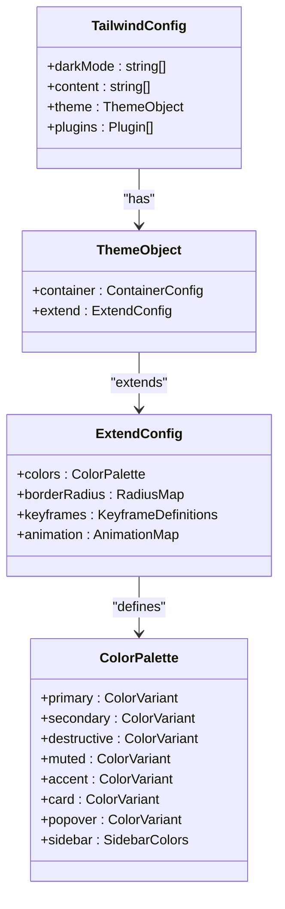
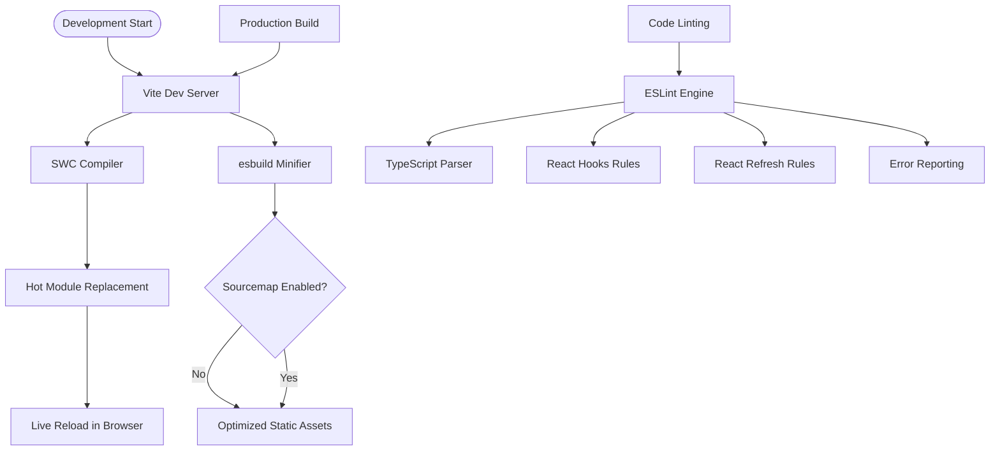

# Technology Stack & Dependencies

<cite>
**Referenced Files in This Document**   
- [package.json](file://package.json)
- [vite.config.ts](file://vite.config.ts)
- [tailwind.config.ts](file://tailwind.config.ts)
- [tsconfig.json](file://tsconfig.json)
- [eslint.config.js](file://eslint.config.js)
- [postcss.config.js](file://postcss.config.js)
- [components.json](file://components.json)
- [src/App.tsx](file://src/App.tsx)
</cite>

## Table of Contents
1. [Core Frameworks & Libraries](#core-frameworks--libraries)
2. [UI Component System](#ui-component-system)
3. [Styling & Design System](#styling--design-system)
4. [Build & Development Tools](#build--development-tools)
5. [Configuration Deep Dive](#configuration-deep-dive)
6. [Integration Examples](#integration-examples)
7. [Troubleshooting Common Issues](#troubleshooting-common-issues)

## Core Frameworks & Libraries

The farruh-folio-wave project leverages a modern React-based technology stack centered around React 18, TypeScript, Vite, and @tanstack/react-query for robust frontend development.

React 18 (version ^18.3.1) serves as the foundation for component architecture, enabling concurrent rendering features such as automatic batching and transition optimizations. The application structure follows a declarative component model with proper state management through React's built-in hooks system.

TypeScript (version ^5.5.3) provides comprehensive type safety across the codebase, ensuring compile-time validation of component props, state interfaces, and API response structures. The configuration enables module resolution via path aliases and maintains compatibility with both application and Node.js environments through referenced configuration files.

@tanstack/react-query (version ^5.56.2) manages data fetching, caching, synchronization, and error handling throughout the application. It is initialized at the root level in App.tsx, providing a centralized QueryClient instance that enables features like automatic refetching, stale-while-revalidate caching strategies, and seamless integration with React's suspense mechanism.

**Section sources**
- [package.json](file://package.json#L1-L87)
- [src/App.tsx](file://src/App.tsx#L0-L27)
- [tsconfig.json](file://tsconfig.json#L0-L19)

## UI Component System

The project utilizes shadcn/ui components built on top of Radix UI primitives, providing accessible, composable, and unstyled base elements enhanced with Tailwind CSS styling. These components include interactive elements such as accordions, dialogs, dropdown menus, navigation menus, tooltips, and form controls—all implemented with full keyboard accessibility and ARIA compliance.

Each UI component resides in the `src/components/ui/` directory and follows a consistent pattern of combining Radix UI's headless functionality with utility-first Tailwind classes. The system also incorporates lucide-react (version ^0.462.0) for scalable, consistent iconography across the interface, offering over 700 SVG icons that can be easily customized via props.

Additional libraries enhance the component ecosystem:
- **react-hook-form** (^7.53.0) for efficient form state management
- **zod** (^3.23.8) for schema validation integrated with form resolvers
- **sonner** (^1.5.0) for toast notifications styled consistently with the design system
- **recharts** (^2.12.7) for data visualization components

These tools work together to create a cohesive, maintainable component library that promotes reusability and accessibility.

**Section sources**
- [package.json](file://package.json#L1-L87)
- [src/components/ui](file://src/components/ui)
- [components.json](file://components.json#L0-L19)

## Styling & Design System

Tailwind CSS (version ^3.4.17) powers the utility-first styling approach, enabling rapid UI development through atomic classes. The configuration in tailwind.config.ts implements a CSS variables-based theming system aligned with the "default" style from shadcn/ui, supporting both light and dark modes via the `darkMode: ["class"]` setting.

Key aspects of the design system include:

- **Theming**: Custom color palettes defined using HSL variables (`hsl(var(--primary))`) allow dynamic theme switching without rebuilding styles.
- **Container Layout**: Responsive container constraints with center alignment and responsive padding up to a maximum width of 1400px.
- **Border Radius Scaling**: Three-tiered radius system (lg, md, sm) calculated relative to a base CSS variable.
- **Animation Framework**: Predefined keyframe animations for common effects including accordion transitions, fade-ins, scale effects, and floating animations.

The project also integrates tailwindcss-animate (^1.0.7), which extends Tailwind with opinionated animations mapped to semantic class names like `animate-in`, `fade-in`, and `slide-in-from-left`. This plugin enhances UX by adding subtle motion cues while maintaining performance.

PostCSS processes the Tailwind output with autoprefixer (^10.4.21) to ensure cross-browser compatibility, automatically adding vendor prefixes where necessary.



**Diagram sources**
- [tailwind.config.ts](file://tailwind.config.ts#L0-L127)
- [postcss.config.js](file://postcss.config.js#L0-L6)

**Section sources**
- [tailwind.config.ts](file://tailwind.config.ts#L0-L127)
- [postcss.config.js](file://postcss.config.js#L0-L6)
- [package.json](file://package.json#L1-L87)

## Build & Development Tools

Vite (version ^6.3.5) acts as the primary build tool and development server, delivering fast cold starts and instant hot module replacement (HMR). The configuration in vite.config.ts sets up essential development and production settings:

- **Development Server**: Listens on all network interfaces (`host: "::"`) at port 8080, allowing access from other devices on the same network.
- **Base Path**: Set to `'/'` for compatibility with GitHub Pages deployments.
- **Plugin System**: Uses `@vitejs/plugin-react-swc` for React support with SWC instead of Babel, resulting in faster compilation times.
- **Alias Resolution**: Maps the `@` symbol to the `src/` directory, enabling cleaner import statements like `import { Button } from "@/components/ui/button"`.

ESLint (^9.9.0) enforces code quality with rules configured in eslint.config.js, extending recommended configurations for JavaScript and TypeScript while incorporating React-specific linting via `eslint-plugin-react-hooks` and refresh optimization checks. The setup disables `@typescript-eslint/no-unused-vars` since unused variables are often kept during development for debugging purposes.

Additional devDependencies include:
- **@types/react** and **@types/react-dom** for TypeScript type definitions
- **typescript-eslint** (^8.0.1) for TypeScript-aware linting rules
- **globals** (^15.9.0) for standard environment variable definitions
- **cssnano** (^7.0.7) for advanced CSS optimization in production builds



**Diagram sources**
- [vite.config.ts](file://vite.config.ts#L0-L26)
- [eslint.config.js](file://eslint.config.js#L0-L29)
- [package.json](file://package.json#L1-L87)

**Section sources**
- [vite.config.ts](file://vite.config.ts#L0-L26)
- [eslint.config.js](file://eslint.config.js#L0-L29)
- [package.json](file://package.json#L1-L87)

## Configuration Deep Dive

### Vite Configuration
The `vite.config.ts` file defines several critical settings:
- **Conditional Source Maps**: Disabled in production (`sourcemap: mode !== 'production'`) to prevent `eval()` usage and improve security.
- **Minification Strategy**: Uses esbuild's minifier by default, known for its speed and efficiency.
- **Path Aliasing**: Establishes `@` as an alias for `./src`, simplifying deep imports and improving code readability.

### TypeScript Configuration
The `tsconfig.json` file orchestrates TypeScript compilation through references to two specialized config files:
- **tsconfig.app.json**: Handles application-level TypeScript settings
- **tsconfig.node.json**: Configures Node.js environment types for Vite scripts

Key compiler options include:
- `baseUrl: "."` enabling path mapping
- `"@/*": ["./src/*"]` defining the source alias
- Relaxed strictness flags (`noImplicitAny: false`, `strictNullChecks: false`) to balance type safety with development flexibility

### Tailwind Configuration
The `tailwind.config.ts` file extends the default theme with custom values:
- **Content Traversal**: Scans all `.tsx` files in `pages/`, `components/`, `app/`, and `src/` directories to purge unused styles
- **Semantic Animations**: Defines reusable animation sequences like `fade-in`, `scale-in`, and infinite `float` effects
- **Plugin Integration**: Includes `tailwindcss-animate` to provide pre-built animation utilities

### Tooling Configuration
- **PostCSS**: Orchestrates the CSS processing pipeline through `postcss.config.js`, invoking Tailwind and Autoprefixer
- **Component CLI**: The `components.json` file configures the shadcn/ui CLI with project-specific paths and aliases for generating new components

**Section sources**
- [vite.config.ts](file://vite.config.ts#L0-L26)
- [tsconfig.json](file://tsconfig.json#L0-L19)
- [tailwind.config.ts](file://tailwind.config.ts#L0-L127)
- [postcss.config.js](file://postcss.config.js#L0-L6)
- [components.json](file://components.json#L0-L19)

## Integration Examples

### Data Fetching with React Query
In pages like About.tsx, data is loaded asynchronously from JSON files in the public/data directory using fetch APIs wrapped within React Query's useQuery hook. This pattern enables loading states, error boundaries, and automatic caching without manual useEffect management.

### Real-time Styling with JIT Mode
Tailwind's Just-In-Time (JIT) engine generates styles on-demand as they're used in JSX files. For example, applying `className="bg-gradient-to-r from-primary to-secondary"` immediately creates the corresponding CSS without requiring a rebuild.

### Hot Module Replacement
During development, modifying any component triggers instantaneous updates in the browser via Vite's HMR system. This works seamlessly even for complex stateful components due to SWC's fast transformation pipeline.

### Themed Components
Components consume theme colors through CSS variables (e.g., `var(--primary)`) rather than hardcoded values, allowing runtime theme switching via the `next-themes` package which toggles the `class="dark"` attribute on the document element.

**Section sources**
- [src/App.tsx](file://src/App.tsx#L0-L27)
- [src/components/pages/About.tsx](file://src/components/pages/About.tsx#L147-L188)
- [tailwind.config.ts](file://tailwind.config.ts#L0-L127)

## Troubleshooting Common Issues

### Dependency Conflicts
When upgrading packages, ensure version compatibility between related libraries:
- Keep `@radix-ui/react-*` packages synchronized
- Match `lucide-react` versions with icon documentation
- Verify `react` and `react-dom` versions remain identical

Use `npm ls <package-name>` to diagnose version mismatches.

### Build Errors
Common causes include:
- Missing peer dependencies (install with `npm install`)
- Type conflicts between TypeScript versions (align with ^5.5.3)
- Incorrect path aliases (verify `@` resolves to `src/` in tsconfig.json)

### Development Server Failures
If Vite fails to start:
- Check if port 8080 is already in use (`lsof -i :8080`)
- Clear node_modules and reinstall dependencies if HMR malfunctions
- Ensure Node.js version meets requirements (^18.0.0 || ^20.0.0 || >=22.0.0)

### Style Inconsistencies
When Tailwind classes don't apply:
- Confirm file paths are included in `content` array in tailwind.config.ts
- Restart Vite after adding new component directories
- Avoid purging issues by using dynamic class names responsibly

### ESLint False Positives
Disable specific rules locally when necessary:
```ts
// eslint-disable-next-line react-refresh/only-export-components
const SomeComponent = () => {...}
```

Or adjust global rules in eslint.config.js based on team preferences.

**Section sources**
- [package.json](file://package.json#L1-L87)
- [vite.config.ts](file://vite.config.ts#L0-L26)
- [tailwind.config.ts](file://tailwind.config.ts#L0-L127)
- [eslint.config.js](file://eslint.config.js#L0-L29)