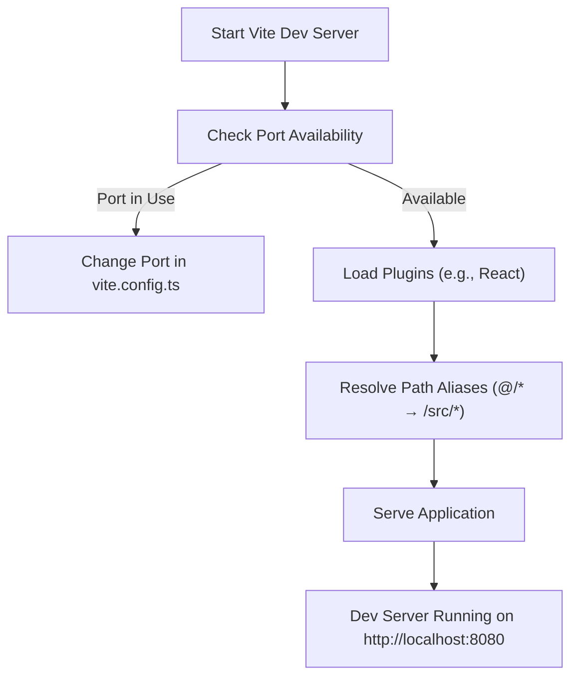
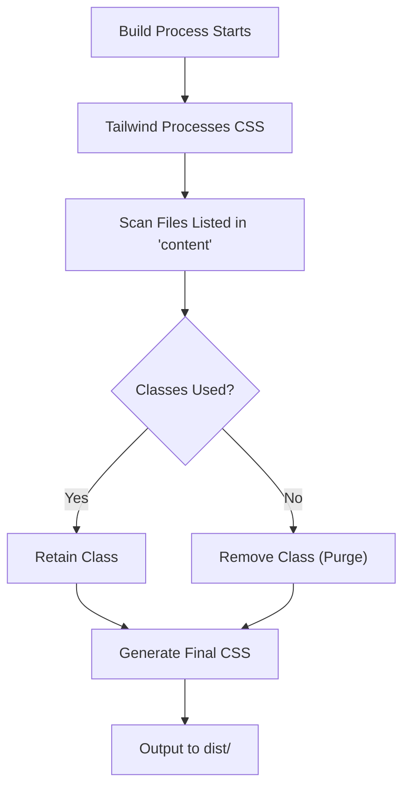

# Troubleshooting

<cite>
**Referenced Files in This Document **   
- [package.json](file://package.json)
- [tsconfig.json](file://tsconfig.json)
- [vite.config.ts](file://vite.config.ts)
- [tailwind.config.ts](file://tailwind.config.ts)
- [index.html](file://index.html)
- [main.tsx](file://src/main.tsx)
- [App.tsx](file://src/App.tsx)
- [ParallaxConfig.ts](file://src/components/effects/ParallaxConfig.ts)
- [utils.ts](file://src/lib/utils.ts)
</cite>

## Table of Contents
1. [Dependency Installation Failures](#dependency-installation-failures)
2. [Vite Dev Server Not Starting](#vite-dev-server-not-starting)
3. [TypeScript Compilation Errors](#typescript-compilation-errors)
4. [Broken Styles After Build](#broken-styles-after-build)
5. [Browser-Specific Rendering Issues](#browser-specific-rendering-issues)
6. [Deployment-Related Errors](#deployment-related-errors)
7. [Debugging Tips and Diagnostic Commands](#debugging-tips-and-diagnostic-commands)

## Dependency Installation Failures

Common issues during `npm install` include version conflicts, corrupted node_modules, or missing peer dependencies. The project relies on modern versions of React, Vite, Tailwind CSS, and several Radix UI components.

To resolve:
1. Delete `node_modules` and `package-lock.json`
2. Run `npm cache clean --force`
3. Reinstall with `npm install`
4. Verify Node.js version is at least v18 (recommended: v18.17+ or v20+)

Ensure your environment matches the expected dependency tree defined in `package.json`.

**Section sources**
- [package.json](file://package.json#L1-L87)

## Vite Dev Server Not Starting

If `npm run dev` fails to start the Vite development server:
- Check if port 8080 is already in use; modify `vite.config.ts` to use a different port
- Ensure required plugins like `@vitejs/plugin-react-swc` are properly installed
- Validate that TypeScript configuration does not block module resolution

The Vite server is configured to listen on all network interfaces (`host: "::"`) and uses an alias `@` for `/src`, which must resolve correctly.



**Diagram sources **
- [vite.config.ts](file://vite.config.ts#L1-L27)

**Section sources**
- [vite.config.ts](file://vite.config.ts#L1-L27)

## TypeScript Compilation Errors

TypeScript errors often stem from misconfigured paths or strict type checking. This project uses a composite tsconfig setup with `tsconfig.app.json`, `tsconfig.node.json`, and a base `tsconfig.json`.

Key settings:
- Path mapping: `@/*` resolves to `./src/*`
- Skip library checks enabled
- Allow JavaScript files in compilation
- No implicit any or unused parameter enforcement disabled

Run `tsc --noEmit` to validate types without building. If errors persist:
- Confirm all referenced paths match actual file locations
- Ensure `baseUrl` is set to `"."`
- Check for conflicting types from outdated packages

**Section sources**
- [tsconfig.json](file://tsconfig.json#L1-L19)

## Broken Styles After Build

Tailwind CSS styles may break after build due to incorrect content paths in `tailwind.config.ts`. The `content` array must include all directories containing class usages.

In this project, Tailwind scans:
- `./pages/**/*.{ts,tsx}`
- `./components/**/*.{ts,tsx}`
- `./app/**/*.{ts,tsx}`
- `./src/**/*.{ts,tsx}`

PurgeCSS removes unused classes in production builds. If styles disappear:
- Verify component paths are included in `content`
- Avoid dynamic class names like `class="bg-${color}"`
- Use safelist for dynamically applied classes

Also ensure PostCSS and Autoprefixer are correctly configured in `postcss.config.js`.



**Diagram sources **
- [tailwind.config.ts](file://tailwind.config.ts#L1-L127)

**Section sources**
- [tailwind.config.ts](file://tailwind.config.ts#L1-L127)

## Browser-Specific Rendering Issues

Issues with CSS transforms and animations—especially involving parallax effects—are common in Safari and older browsers.

This project uses advanced CSS features such as:
- `transform: translateY()` and `rotate()` in keyframe animations
- Hardware-accelerated rendering via `will-change`
- Custom properties (`--radius`, `--background`) for theming

Safari may not fully support certain transform combinations or prefers prefixed variants. To debug:
- Use browser developer tools to inspect animation timelines
- Disable individual transforms to isolate problematic rules
- Test fallbacks using `@supports` queries

Animations defined in `tailwind.config.ts` (e.g., `fade-in`, `float`) rely on precise timing and transform chains. Ensure no conflicting inline styles override these.

**Section sources**
- [tailwind.config.ts](file://tailwind.config.ts#L80-L120)
- [ParallaxConfig.ts](file://src/components/effects/ParallaxConfig.ts#L1-L121)

## Deployment-Related Errors

### Missing _headers File on Netlify

For proper routing and security headers on Netlify, create a `_headers` file in the `public/` directory:

```
/*
  X-Frame-Options: DENY
  X-Content-Type-Options: nosniff
  Referrer-Policy: strict-origin-when-cross-origin
  Content-Security-Policy: default-src 'self'; script-src 'self'; style-src 'self' 'unsafe-inline'; img-src 'self' data: https:; font-src 'self' data:; connect-src 'self' https:; object-src 'none'; base-uri 'self';
```

This mirrors the CSP policy in `index.html`.

### Incorrect Base Href in index.html

The `base` path in `vite.config.ts` must align with deployment context:
- For GitHub Pages under `username.github.io/repo-name`, set `base: '/repo-name/'`
- For custom domains or root deployments, use `base: '/'`

Mismatched base paths cause broken asset loading. Also verify that `index.html` references `/src/main.tsx` correctly relative to the base.

**Section sources**
- [vite.config.ts](file://vite.config.ts#L1-L27)
- [index.html](file://index.html#L1-L23)

## Debugging Tips and Diagnostic Commands

Use the following commands to diagnose issues:

| Command | Purpose |
|--------|---------|
| `npm audit` | Identify vulnerable or outdated dependencies |
| `tsc --noEmit` | Type-check without compiling |
| `vite preview` | Simulate production build locally |
| `npm run lint` | Check code quality with ESLint |

Enable source maps in development by ensuring `build.sourcemap` is `true` when not in production mode (configured in `vite.config.ts`). Use browser DevTools to:
- Inspect element styles and computed values
- View console logs from `console.log` statements
- Debug React component state with React DevTools
- Analyze network requests and asset loading

For animation debugging, use the browser’s Animation Inspector to step through keyframes and adjust timing.

**Section sources**
- [vite.config.ts](file://vite.config.ts#L20-L26)
- [eslint.config.js](file://eslint.config.js)
- [main.tsx](file://src/main.tsx#L1-L5)
- [App.tsx](file://src/App.tsx#L1-L27)
- [utils.ts](file://src/lib/utils.ts#L1-L6)