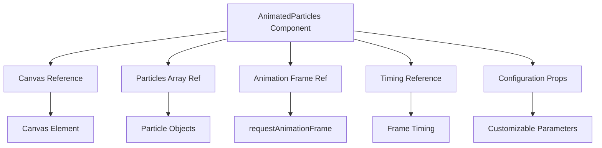
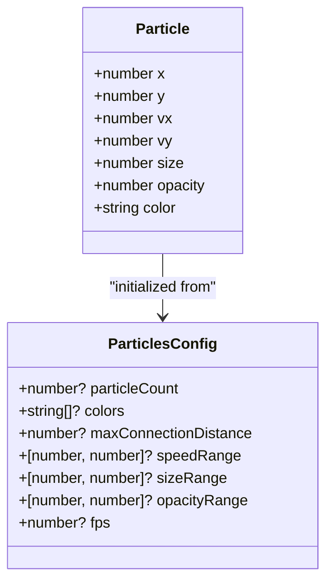
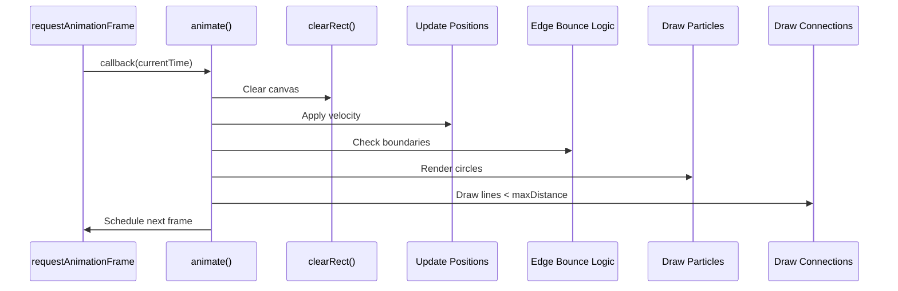
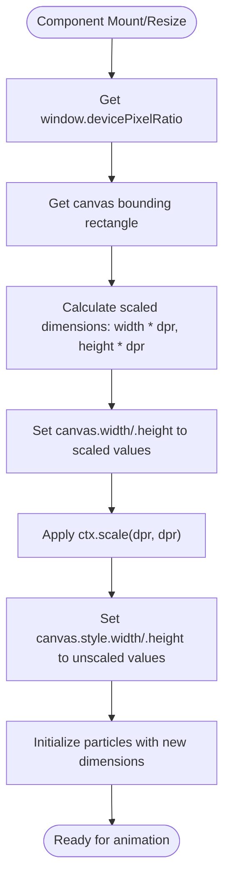

# Animated Particles

<cite>
**Referenced Files in This Document**   
- [AnimatedParticles.tsx](file://src/components/effects/AnimatedParticles.tsx)
- [AnimatedParticles.module.css](file://src/components/effects/AnimatedParticles.module.css)
- [Index.tsx](file://src/pages/Index.tsx)
</cite>

## Table of Contents
1. [Introduction](#introduction)
2. [Core Architecture](#core-architecture)
3. [Particle System Implementation](#particle-system-implementation)
4. [Animation and Rendering Pipeline](#animation-and-rendering-pipeline)
5. [Configuration and Customization](#configuration-and-customization)
6. [Performance Optimization Strategies](#performance-optimization-strategies)
7. [Integration and Usage Patterns](#integration-and-usage-patterns)
8. [Responsive Design Considerations](#responsive-design-considerations)
9. [Advanced Topics and Future Enhancements](#advanced-topics-and-future-enhancements)

## Introduction

The AnimatedParticles component implements a high-performance particle system using HTML5 Canvas API to create dynamic background effects for the farruh-folio-wave portfolio website. This component generates an interactive field of animated particles that move fluidly across the screen, connecting with nearby particles through subtle lines to create a visually engaging network effect. The implementation balances aesthetic appeal with performance considerations, making it suitable for modern web portfolios while maintaining responsiveness across different devices.

**Section sources**
- [AnimatedParticles.tsx](file://src/components/effects/AnimatedParticles.tsx#L0-L32)

## Core Architecture

The AnimatedParticles component follows a React functional component pattern with hooks-based state management and canvas rendering. It leverages useRef to maintain persistent references to the canvas element, particle array, animation frame ID, and timing information across renders without triggering re-renders. The architecture separates concerns into distinct functional units: particle initialization, animation loop, and canvas resizing logic, all coordinated through useEffect lifecycle management.



**Diagram sources**
- [AnimatedParticles.tsx](file://src/components/effects/AnimatedParticles.tsx#L34-L72)

## Particle System Implementation

### Particle Data Structure
Each particle is represented as an object containing position (x, y), velocity (vx, vy), visual properties (size, opacity, color), enabling a rich simulation of movement and appearance variation across the particle field.

### Particle Creation Logic
The component initializes particles with randomized properties based on configuration parameters:
- Position: Randomly distributed across canvas dimensions
- Velocity: Assigned within configurable speed range
- Size: Varies according to sizeRange parameter
- Opacity: Determined by opacityRange values
- Color: Selected randomly from provided colors array

The creation process occurs during component mount and canvas resize events, ensuring particles are appropriately distributed regardless of viewport dimensions.



**Diagram sources**
- [AnimatedParticles.tsx](file://src/components/effects/AnimatedParticles.tsx#L3-L32)
- [AnimatedParticles.tsx](file://src/components/effects/AnimatedParticles.tsx#L34-L72)

## Animation and Rendering Pipeline

### Animation Loop Mechanism
The component implements a throttled animation loop using requestAnimationFrame combined with FPS-based interval checking. This approach prevents excessive rendering while maintaining smooth animation at the desired frame rate. The loop checks whether sufficient time has elapsed since the last frame based on the configured FPS value before proceeding with rendering.

### Edge-Bounce Physics
Particles implement simple physics for boundary interaction:
- Horizontal velocity reverses when reaching left or right canvas edges
- Vertical velocity reverses when reaching top or bottom canvas edges
- Position is constrained within canvas bounds using Math.max and Math.min

This creates a contained particle field where particles appear to bounce off the viewport boundaries.

### Connection Drawing Algorithm
The component renders subtle connections between nearby particles using a distance-based algorithm:
- For each particle, checks distance to all subsequent particles
- Draws a line if distance is less than maxConnectionDistance
- Connection opacity varies inversely with distance (closer = more opaque)
- Line width is fixed at 0.3 pixels for subtlety

The algorithm optimizes performance by only checking each pair once (index + 1) rather than all combinations.



**Diagram sources**
- [AnimatedParticles.tsx](file://src/components/effects/AnimatedParticles.tsx#L74-L123)

## Configuration and Customization

The AnimatedParticles component accepts a comprehensive configuration object allowing extensive customization of the particle system's behavior and appearance:

| Configuration Parameter | Type | Default Value | Description |
|------------------------|------|---------------|-------------|
| particleCount | number | 1000 | Total number of particles in the system |
| colors | string[] | ['rgba(139, 92, 246, 0.3)', 'rgba(59, 130, 246, 0.3)', 'rgba(236, 72, 153, 0.3)', 'rgba(34, 197, 94, 0.3)'] | Array of rgba color strings for random particle coloring |
| maxConnectionDistance | number | 60 | Maximum pixel distance for drawing connection lines |
| speedRange | [number, number] | [-0.1, 0.1] | Range for random velocity assignment (min, max) |
| sizeRange | [number, number] | [0.5, 2] | Range for random particle size in pixels (min, max) |
| opacityRange | [number, number] | [0.1, 0.3] | Range for random particle opacity (min, max) |
| fps | number | 24 | Target frames per second for animation |

These parameters enable designers to tune the visual density, movement characteristics, and overall aesthetic of the particle system to match specific design requirements.

**Section sources**
- [AnimatedParticles.tsx](file://src/components/effects/AnimatedParticles.tsx#L34-L72)

## Performance Optimization Strategies

The component incorporates several performance optimization techniques to ensure smooth operation across various devices:

### FPS Throttling
The animation loop implements frame rate limiting using currentTime comparison against a calculated frameInterval based on the fps configuration. This prevents unnecessary rendering when higher frame rates would not be perceptible, reducing GPU load significantly.

### Memory Efficiency
The implementation avoids double buffering by directly manipulating the existing particle array rather than creating new arrays on each frame. Particles are stored in a ref (particlesRef) that persists across renders, eliminating allocation overhead.

### Responsive Density Management
While not implemented directly in this component, the integration example shows how particle count can be adjusted based on device characteristics. High particle counts impact performance more significantly on mobile devices, so reducing particleCount on smaller screens maintains smooth animation.

### Hardware Acceleration
The canvas context enables image smoothing with high quality settings, leveraging browser optimizations for rendering operations.

**Section sources**
- [AnimatedParticles.tsx](file://src/components/effects/AnimatedParticles.tsx#L74-L123)

## Integration and Usage Patterns

The AnimatedParticles component is integrated into the main application layout within the Index page, layered beneath content but above other decorative elements. It works in conjunction with other visual effects like FloatingWords and ParallaxBackground to create a rich, multi-layered background experience.

```tsx
<ParallaxBackground config={parallaxConfig}>
  <AnimatedParticles
    config={{
      particleCount: 120,
      colors: [
        'rgba(139, 92, 246, 0.3)',
        'rgba(59, 130, 246, 0.3)',
        'rgba(236, 72, 153, 0.3)',
        'rgba(34, 197, 94, 0.3)',
      ],
      maxConnectionDistance: 60,
      speedRange: [-0.1, 0.1],
      sizeRange: [0.5, 2],
      opacityRange: [0.1, 0.3],
      fps: 24,
    }}
  />
  <div className="relative z-10">
    {/* Page content */}
  </div>
</ParallaxBackground>
```

The component is positioned with fixed positioning via CSS, placed behind content using z-index, and made non-interactive with pointer-events: none to prevent interference with user interactions.

**Section sources**
- [Index.tsx](file://src/pages/Index.tsx#L12-L89)
- [AnimatedParticles.module.css](file://src/components/effects/AnimatedParticles.module.css#L0-L9)

## Responsive Design Considerations

### High-DPI Screen Support
The component implements proper high-DPI (Retina) support by scaling the canvas resolution according to devicePixelRatio while maintaining the same CSS dimensions. This ensures sharp rendering on high-density displays without sacrificing performance on standard displays.



**Diagram sources**
- [AnimatedParticles.tsx](file://src/components/effects/AnimatedParticles.tsx#L134-L164)

### Mobile Device Adaptation
Although the current implementation doesn't include built-in mobile detection, best practices suggest reducing particleCount and potentially disabling the effect entirely on mobile devices to conserve battery and maintain performance. The useIsMobile hook exists in the codebase and could be integrated to conditionally render or configure the particle system based on device type.

**Section sources**
- [AnimatedParticles.tsx](file://src/components/effects/AnimatedParticles.tsx#L134-L164)

## Advanced Topics and Future Enhancements

### WebGL Potential
While currently implemented with 2D Canvas API, the particle system could be enhanced with WebGL for significantly improved performance with large particle counts. WebGL would enable GPU-accelerated rendering of thousands of particles with minimal CPU overhead, allowing for more complex simulations and interactions.

### Interaction Capabilities
Future enhancements could include mouse/touch interaction, where particles are attracted to or repelled from cursor/finger position, creating an engaging interactive experience. This would require additional event listeners and modification of particle velocities based on proximity to input.

### Dynamic Configuration
The component could expose methods to dynamically modify parameters during runtime, allowing for transitions between different visual states based on user actions or scroll position.

### Accessibility Considerations
For users sensitive to motion, a reduced motion preference detection could automatically lower animation speed or disable the effect entirely, improving accessibility compliance.

**Section sources**
- [AnimatedParticles.tsx](file://src/components/effects/AnimatedParticles.tsx#L0-L183)