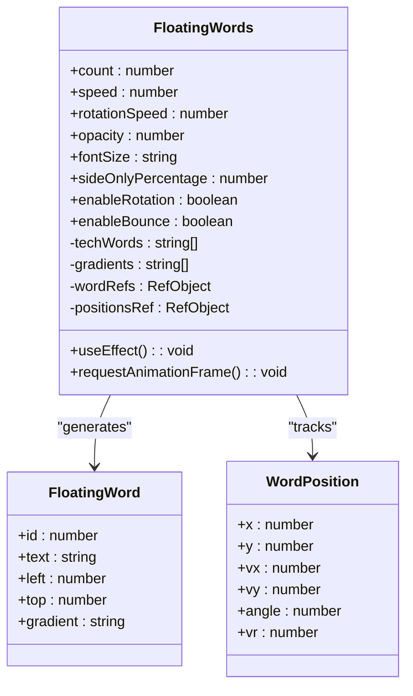
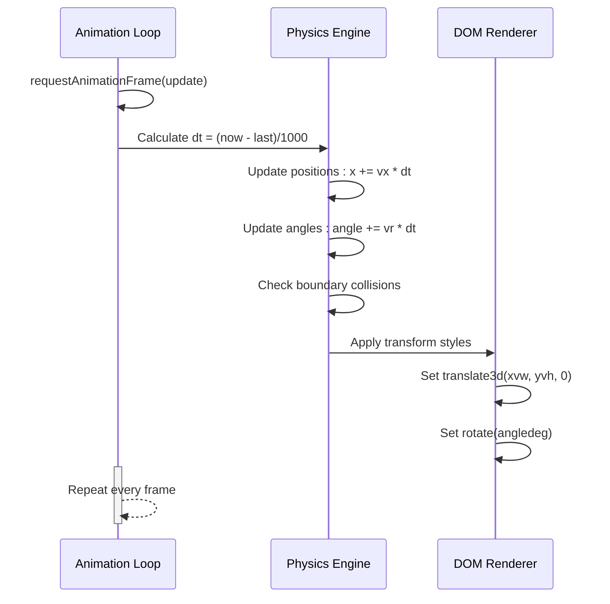
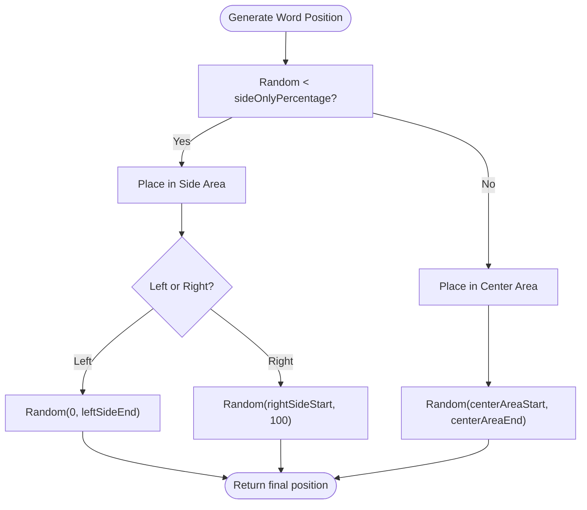
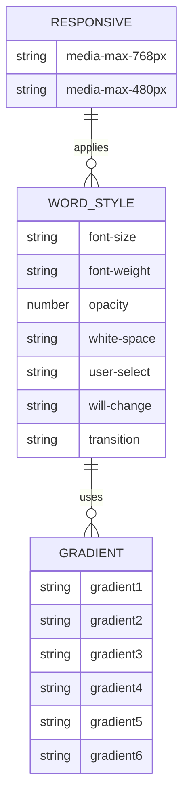
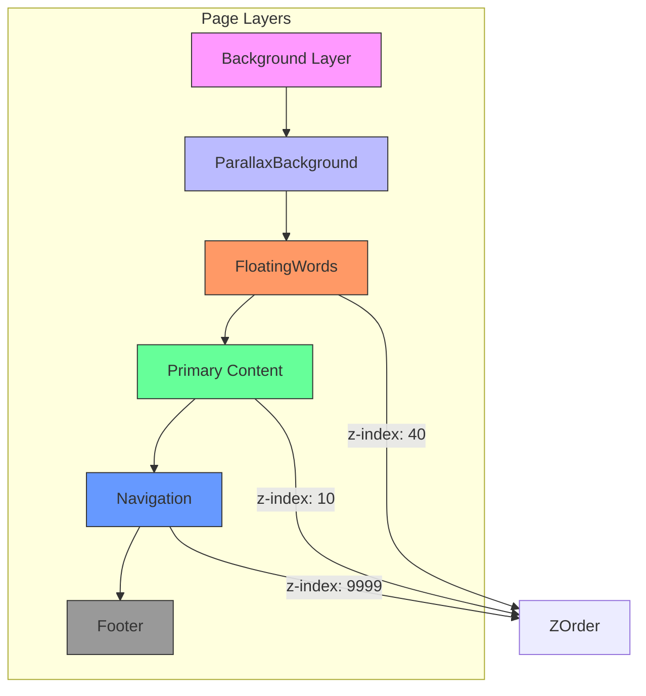
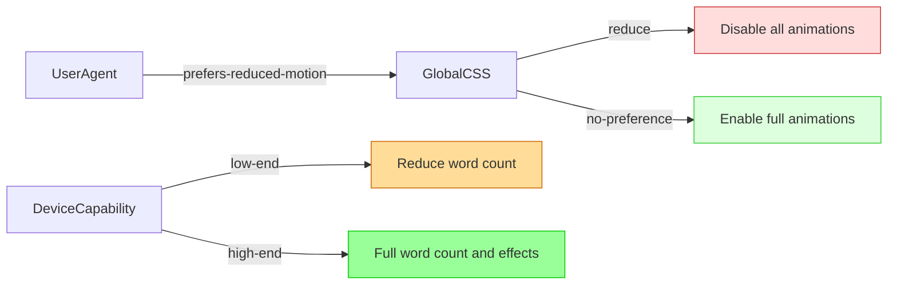

# Floating Words

<cite>
**Referenced Files in This Document**   
- [FloatingWords.tsx](file://src/components/effects/FloatingWords.tsx)
- [FloatingWords.module.css](file://src/components/effects/FloatingWords.module.css)
- [Index.tsx](file://src/pages/Index.tsx)
- [App.css](file://src/App.css)
- [index.css](file://src/index.css)
</cite>

## Table of Contents
1. [Introduction](#introduction)
2. [Core Functionality](#core-functionality)
3. [Animation System](#animation-system)
4. [Placement Strategy](#placement-strategy)
5. [Customization Options](#customization-options)
6. [Visual Design](#visual-design)
7. [Real-World Usage](#real-world-usage)
8. [Accessibility and Performance](#accessibility-and-performance)
9. [Advanced Implementation Notes](#advanced-implementation-notes)

## Introduction

The FloatingWords component is a dynamic visual element within the farruh-folio-wave portfolio that displays animated tech keywords to enhance personal branding and technical identity. It creates an engaging background layer where words like "React", "TypeScript", and "Machine Learning" float across the screen, subtly emphasizing the developer's skill set without obstructing primary content.

This component serves both aesthetic and functional purposes: it adds movement and depth to the portfolio while reinforcing the technical expertise of the site owner through carefully selected terminology. The implementation leverages modern web animation techniques for smooth performance and provides extensive customization options for tailored behavior.

**Section sources**
- [FloatingWords.tsx](file://src/components/effects/FloatingWords.tsx#L0-L192)

## Core Functionality

The FloatingWords component generates a configurable number of technology-related terms that move independently across the viewport using physics-inspired motion models. Each word operates as an autonomous entity with its own velocity vector and optional rotation, creating a natural, organic floating effect.

At initialization, the component creates a collection of `FloatingWord` objects containing metadata such as text content, initial position, and visual styling. These words are rendered as absolutely positioned div elements within a fixed container that spans the entire viewport. The component maintains two synchronized arrays via React refs: one holding references to DOM elements (`wordRefs`) and another tracking positional data (`positionsRef`).

This architecture enables direct DOM manipulation for optimal animation performance while maintaining React's declarative state management for configuration and lifecycle control. The separation of render-time state (words) from animation-time state (positions) ensures efficient updates without unnecessary re-renders.

**Diagram sources**
- [FloatingWords.tsx](file://src/components/effects/FloatingWords.tsx#L0-L192)

**Section sources**
- [FloatingWords.tsx](file://src/components/effects/FloatingWords.tsx#L0-L192)

## Animation System

The component implements a high-performance animation loop using `requestAnimationFrame`, which provides smooth 60fps updates independent of device frame rate. The animation system follows a physics-based model where each word has velocity components (vx, vy) representing movement in percentage of viewport width/height per second.

A critical feature is frame-rate independence achieved through delta time (dt) calculation. By measuring the time elapsed since the last frame (`performance.now()`), the system multiplies velocity by dt to ensure consistent movement speed regardless of refresh rate:

**Diagram sources**
- [FloatingWords.tsx](file://src/components/effects/FloatingWords.tsx#L102-L192)

**Section sources**
- [FloatingWords.tsx](file://src/components/effects/FloatingWords.tsx#L102-L192)

### Direct DOM Manipulation

Instead of relying on React state updates for animation (which would trigger reconciliation), the component directly manipulates DOM element styles using ref references. This approach bypasses React's rendering pipeline for transform properties, significantly improving performance:

- Uses `translate3d()` instead of `translate()` to leverage GPU acceleration
- Applies transforms directly to `element.style.transform`
- Maintains `will-change: transform` in CSS to optimize compositing
- Avoids layout thrashing by batching style updates

## Placement Strategy

The component employs a sophisticated placement algorithm that prioritizes side areas over the center based on the `sideOnlyPercentage` configuration parameter. This strategic positioning enhances readability by minimizing interference with central content while maintaining visual interest at the edges.

When initializing word positions:
- Words have an 80% chance (default) of being placed in side regions
- Left side: 0% to 25% of viewport width
- Right side: 75% to 100% of viewport width  
- Center area: 30% to 70% of viewport width (reserved for remaining 20%)

This distribution creates a natural "clear zone" in the middle third of the screen where primary content remains unobstructed, while still allowing some dynamic elements in the broader center region for visual balance.

**Diagram sources**
- [FloatingWords.tsx](file://src/components/effects/FloatingWords.tsx#L64-L102)

**Section sources**
- [FloatingWords.tsx](file://src/components/effects/FloatingWords.tsx#L64-L102)

## Customization Options

The component exposes comprehensive configuration options through props, allowing fine-tuned control over appearance and behavior:

<table>
  <thead>
    <tr>
      <th>Prop</th>
      <th>Type</th>
      <th>Default</th>
      <th>Description</th>
    </tr>
  </thead>
  <tbody>
    <tr>
      <td>count</td>
      <td>number</td>
      <td>15</td>
      <td>Total number of floating words to display</td>
    </tr>
    <tr>
      <td>speed</td>
      <td>number</td>
      <td>5</td>
      <td>Movement speed in viewport units per second</td>
    </tr>
    <tr>
      <td>rotationSpeed</td>
      <td>number</td>
      <td>30</td>
      <td>Rotation speed in degrees per second</td>
    </tr>
    <tr>
      <td>opacity</td>
      <td>number</td>
      <td>0.6</td>
      <td>Base opacity level of all words</td>
    </tr>
    <tr>
      <td>fontSize</td>
      <td>string</td>
      <td>'0.875rem'</td>
      <td>CSS font size value for text scaling</td>
    </tr>
    <tr>
      <td>sideOnlyPercentage</td>
      <td>number</td>
      <td>0.8</td>
      <td>Probability of placing words in side regions</td>
    </tr>
    <tr>
      <td>enableRotation</td>
      <td>boolean</td>
      <td>true</td>
      <td>Toggles word rotation animation</td>
    </tr>
    <tr>
      <td>enableBounce</td>
      <td>boolean</td>
      <td>true</td>
      <td>Enables bouncing off viewport edges</td>
    </tr>
  </tbody>
</table>

These parameters can be adjusted to create different visual effects—from subtle, slow-moving text with minimal rotation for professional portfolios to energetic, rapidly rotating words for more dynamic presentations.

**Section sources**
- [FloatingWords.tsx](file://src/components/effects/FloatingWords.tsx#L0-L64)

## Visual Design

The visual presentation combines CSS modules with randomized gradient assignments to create diverse, eye-catching text effects. Six distinct linear gradients provide color variety while maintaining thematic consistency with the overall design palette.

Each word receives a random gradient class (`gradient1` through `gradient6`) applied via CSS `background-clip: text`, which renders the background gradient through the text shape while keeping the fill transparent. This technique creates vibrant, colorful text that stands out against dark backgrounds.

The component also includes responsive adjustments:
- On tablets (≤768px): Reduces font size and applies a mask gradient that fades the center area
- On mobile (≤480px): Further reduces font size and completely masks the center 40% of the screen

**Diagram sources**
- [FloatingWords.module.css](file://src/components/effects/FloatingWords.module.css#L0-L145)

**Section sources**
- [FloatingWords.module.css](file://src/components/effects/FloatingWords.module.css#L0-L145)

## Real-World Usage

In the portfolio implementation, the FloatingWords component appears in the main Index page, layered above the parallax background but below primary content sections. It's configured with specific parameters optimized for the site's aesthetic:

- Increased count (20 words) for denser coverage
- Reduced speed (3 vs default 5) for more subtle movement
- Lower opacity (0.2) to prevent visual dominance
- Smaller font size (0.8rem) for finer texture

The component integrates with other visual effects like ParallaxBackground and AnimatedParticles to create a cohesive, immersive experience. Its fixed positioning (`position: fixed`) ensures it remains in place during scrolling, maintaining continuous visual interest throughout the user journey.

**Diagram sources**
- [Index.tsx](file://src/pages/Index.tsx#L0-L90)
- [FloatingWords.module.css](file://src/components/effects/FloatingWords.module.css#L0-L10)

**Section sources**
- [Index.tsx](file://src/pages/Index.tsx#L0-L90)

## Accessibility and Performance

The component addresses accessibility concerns through integration with system preferences, particularly `prefers-reduced-motion`. Although not explicitly handled within the component itself, the global CSS respects this preference by disabling animations when users have indicated they prefer reduced motion.

Performance optimizations include:
- Using `translate3d()` for GPU-accelerated transforms
- Setting `will-change: transform` to optimize compositing layers
- Direct DOM manipulation to avoid React reconciliation overhead
- Efficient collision detection with simple boundary checks
- Configurable word count to adapt to device capabilities

For low-end devices, reducing the `count` prop decreases both CPU and GPU load. The component automatically adapts to viewport size through responsive CSS rules that adjust font sizes and visibility zones on smaller screens.

**Diagram sources**
- [index.css](file://src/index.css#L226-L238)
- [App.css](file://src/App.css#L29-L32)

**Section sources**
- [index.css](file://src/index.css#L226-L238)
- [App.css](file://src/App.css#L29-L32)

## Advanced Implementation Notes

For developers implementing similar components, several advanced considerations emerge from this implementation:

### Ref Array Management
The use of `useRef<(HTMLDivElement | null)[]>([])` requires careful handling during rendering. The callback ref pattern `(el) => (wordRefs.current[idx] = el)` ensures proper synchronization between React's render cycle and the mutable ref array.

### Avoiding Layout Thrashing
By batching all style updates within a single `requestAnimationFrame` callback and writing directly to `element.style`, the component avoids the read-write-read-write cycle that causes layout thrashing and jank.

### Physics Model Extensions
The current implementation could be extended with additional physics features:
- Gravitational attraction toward certain areas
- Collision detection between words
- Mouse interaction (words repelled by cursor)
- Spring-based bouncing for more natural edge interactions

### Potential Offloading
For extremely high word counts, consider offloading physics calculations to a Web Worker to prevent main thread blocking, communicating position updates via `postMessage`.

These patterns demonstrate how performant, visually rich animations can be implemented in React while maintaining good user experience across different devices and accessibility requirements.