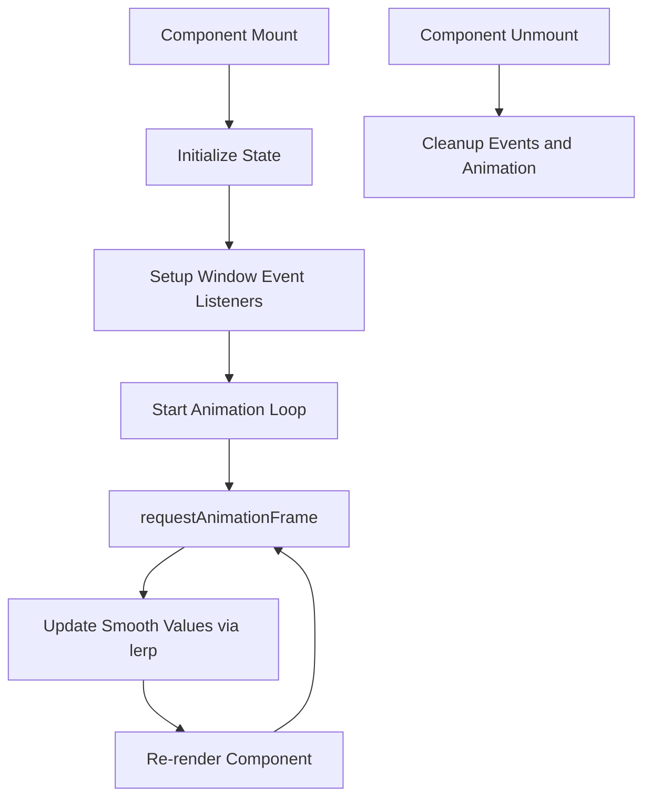
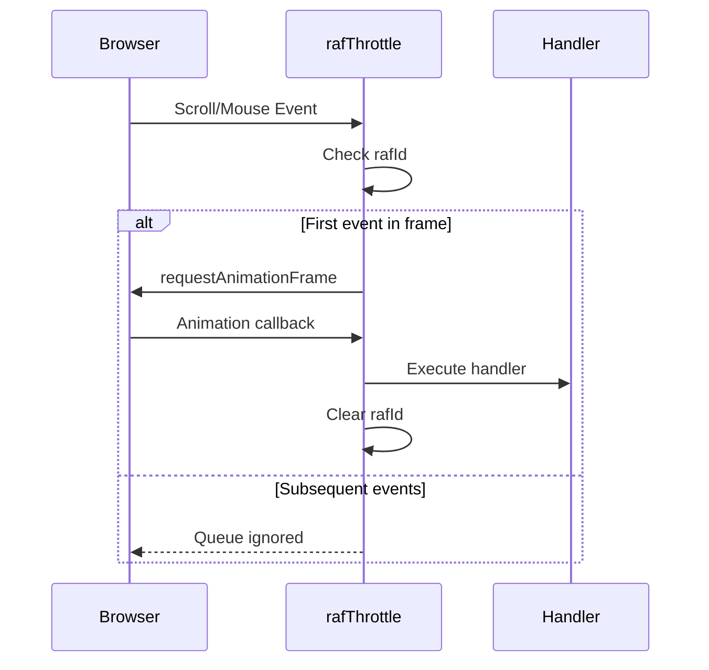
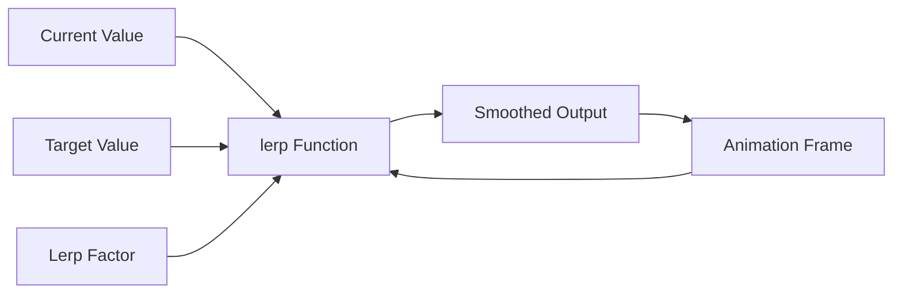
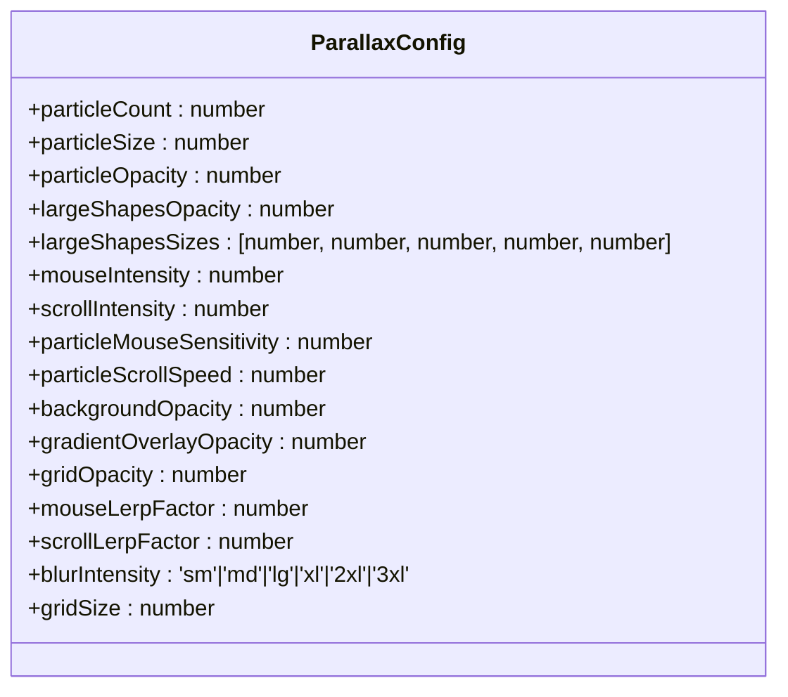
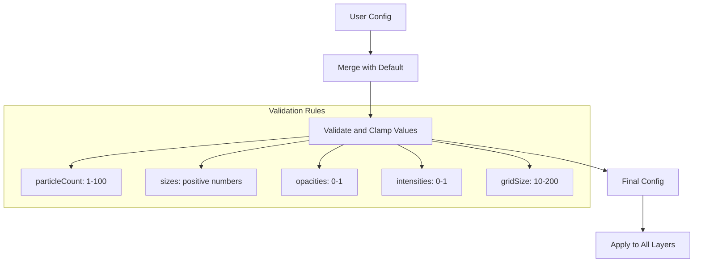
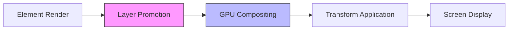
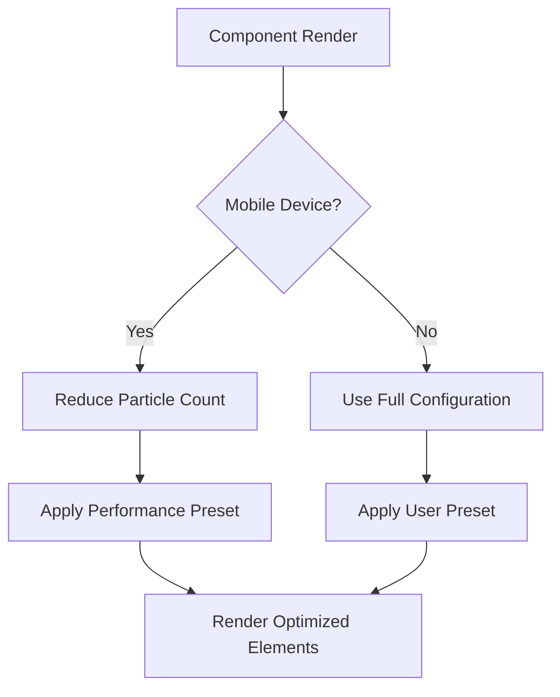
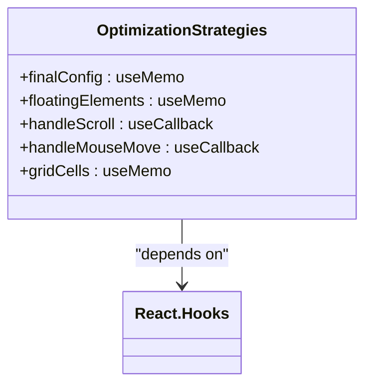
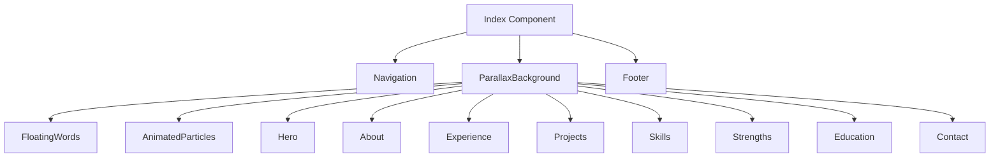
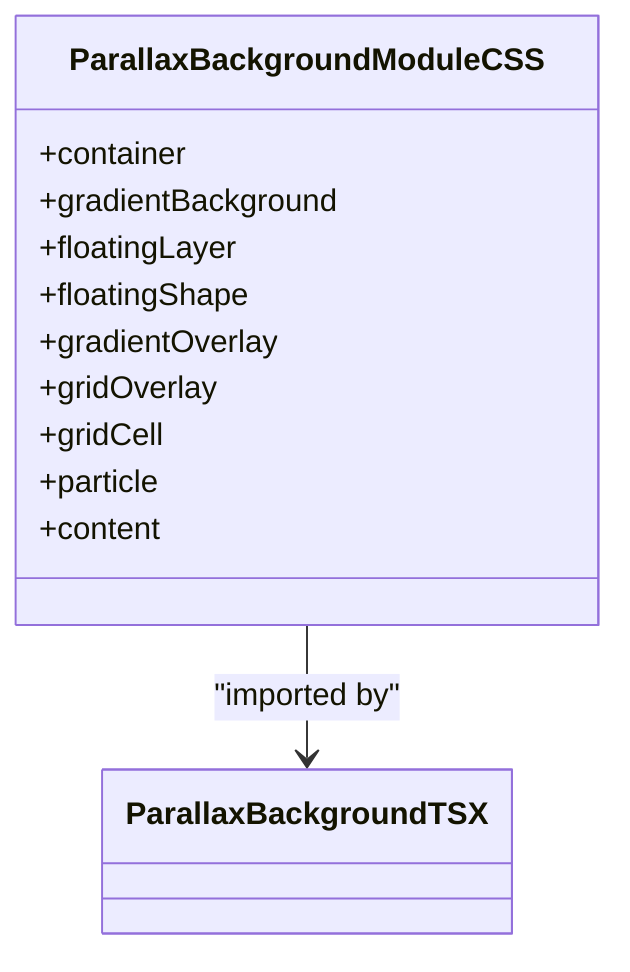

# Parallax Background

<cite>
**Referenced Files in This Document **   
- [ParallaxBackground.tsx](file://src/components/effects/ParallaxBackground.tsx)
- [ParallaxConfig.ts](file://src/components/effects/ParallaxConfig.ts)
- [useParallax.ts](file://src/hooks/useParallax.ts)
- [Index.tsx](file://src/pages/Index.tsx)
- [use-mobile.tsx](file://src/hooks/use-mobile.tsx)
- [ParallaxBackground.module.css](file://src/components/effects/ParallaxBackground.module.css)
</cite>

## Table of Contents
1. [Introduction](#introduction)
2. [Core Implementation](#core-implementation)
3. [Animation System](#animation-system)
4. [Configuration System](#configuration-system)
5. [Performance Optimization](#performance-optimization)
6. [Integration Example](#integration-example)
7. [Styling and Visual Effects](#styling-and-visual-effects)

## Introduction

The ParallaxBackground component in farruh-folio-wave implements a sophisticated multi-layer parallax effect that responds to both scroll position and mouse movement. This immersive background enhances user engagement through smooth, GPU-accelerated animations across multiple visual layers including particles, large geometric shapes, gradient overlays, and grid patterns. The implementation leverages React's useEffect and requestAnimationFrame for optimal performance, with a custom useParallax hook managing input tracking and animation smoothing.

**Section sources**
- [ParallaxBackground.tsx](file://src/components/effects/ParallaxBackground.tsx#L0-L338)

## Core Implementation

The ParallaxBackground component serves as a wrapper for the entire portfolio layout, creating an immersive animated backdrop that enhances visual appeal while maintaining high performance. It accepts children as content to be displayed above the parallax layers and supports optional configuration through the config prop.

The component structure consists of multiple fixed-position layers:
- Static gradient background (z-index: 1)
- Floating layer containing particles and large shapes (z-index: 2)
- Gradient overlay with mouse-responsive radial gradient (z-index: 3)
- Grid pattern overlay (z-index: 4)
- Content layer (z-index: 20)

Each layer is carefully positioned using CSS positioning and z-index values to create depth. The container uses overflow: hidden to prevent scrollbars from appearing due to animated elements moving beyond viewport boundaries.

**Section sources**
- [ParallaxBackground.tsx](file://src/components/effects/ParallaxBackground.tsx#L88-L338)
- [ParallaxBackground.module.css](file://src/components/effects/ParallaxBackground.module.css#L0-L66)

## Animation System

### RequestAnimationFrame and useEffect Integration

The animation system combines React's useEffect hook with requestAnimationFrame to create smooth 60fps animations. Two primary effects manage the animation lifecycle:



**Diagram sources**
- [ParallaxBackground.tsx](file://src/components/effects/ParallaxBackground.tsx#L198-L248)

### useParallax Hook Architecture

The useParallax hook provides a comprehensive solution for tracking scroll and mouse position with throttling and smoothing capabilities. It exposes three key functions:

```mermaid
classDiagram
class useParallax {
+scrollY : number
+mousePosition : {x : number, y : number}
+rawScrollY : number
+rawMousePosition : {x : number, y : number}
+getParallaxStyle(speed : number, useSmooth : boolean) : Object
+getMouseParallaxStyle(intensity : number, useSmooth : boolean) : Object
+getCombinedParallaxStyle(scrollSpeed : number, mouseIntensity : number, useSmooth : boolean) : Object
}
useParallax --> rafThrottle : "uses"
useParallax --> lerp : "uses"
```

**Diagram sources**
- [useParallax.ts](file://src/hooks/useParallax.ts#L0-L109)

### rafThrottle Implementation

The rafThrottle function prevents excessive event handler execution by batching updates through requestAnimationFrame:



**Diagram sources**
- [useParallax.ts](file://src/hooks/useParallax.ts#L4-L20)

### Linear Interpolation (lerp) System

The lerp function creates fluid motion by interpolating between current and target values:



This system ensures rapid input changes are smoothed into gradual transitions, preventing jarring movements and creating a more natural feel.

**Diagram sources**
- [ParallaxBackground.tsx](file://src/components/effects/ParallaxBackground.tsx#L78-L82)
- [useParallax.ts](file://src/hooks/useParallax.ts#L22-L26)

## Configuration System

### ParallaxConfig Interface

The ParallaxConfig interface defines all configurable parameters for the parallax effect:



**Diagram sources**
- [ParallaxBackground.tsx](file://src/components/effects/ParallaxBackground.tsx#L4-L35)

### Preset Configurations

The system includes five predefined presets catering to different performance and aesthetic requirements:

| Preset | Particle Count | Opacity | Blur Intensity | Grid Size | Use Case |
|--------|----------------|-------|----------------|-----------|----------|
| minimal | 12 | Low (0.2) | 2xl | 80px | Minimal distraction |
| standard | 20 | Medium (0.3) | 3xl | 60px | Balanced experience |
| intense | 35 | High (0.5) | 3xl | 40px | Maximum visual impact |
| elegant | 15 | Low-Medium (0.25) | 3xl | 70px | Refined aesthetics |
| performance | 8 | Very Low (0.15) | xl | 100px | Mobile/low-end devices |

**Section sources**
- [ParallaxConfig.ts](file://src/components/effects/ParallaxConfig.ts#L0-L121)

### Configuration Merging and Validation

The component merges user-provided configuration with defaults and applies validation:



This ensures robustness against invalid input while maintaining predictable behavior.

**Section sources**
- [ParallaxBackground.tsx](file://src/components/effects/ParallaxBackground.tsx#L114-L154)

## Performance Optimization

### Transform and GPU Acceleration

All animated elements use transform: translate3d() with will-change: transform to enable GPU acceleration:



The translate3d function specifically triggers hardware acceleration by utilizing the GPU's 3D rendering capabilities, ensuring smooth 60fps animations even with multiple moving elements.

**Section sources**
- [ParallaxBackground.tsx](file://src/components/effects/ParallaxBackground.tsx#L250-L310)
- [ParallaxBackground.module.css](file://src/components/effects/ParallaxBackground.module.css#L30-L33)

### Mobile Detection and Conditional Rendering

The component integrates with useIsMobile to optimize performance on mobile devices:



This adaptive approach ensures acceptable performance across devices with varying capabilities.

**Section sources**
- [Index.tsx](file://src/pages/Index.tsx#L15-L25)
- [use-mobile.tsx](file://src/hooks/use-mobile.tsx#L0-L19)

### Memoization Strategies

The implementation uses useMemo and useCallback extensively to prevent unnecessary re-renders:



These optimizations ensure that computationally expensive operations only occur when dependencies change, significantly improving performance.

**Section sources**
- [ParallaxBackground.tsx](file://src/components/effects/ParallaxBackground.tsx#L114-L154)
- [ParallaxBackground.tsx](file://src/components/effects/ParallaxBackground.tsx#L200-L204)
- [ParallaxBackground.tsx](file://src/components/effects/ParallaxBackground.tsx#L250-L254)

## Integration Example

### Index.tsx Implementation

The ParallaxBackground component wraps the entire portfolio layout in Index.tsx:



**Diagram sources**
- [Index.tsx](file://src/pages/Index.tsx#L0-L89)

### Custom Configuration Usage

The example demonstrates creating a custom configuration based on the intense preset:

```typescript
const parallaxConfig = createParallaxConfig('intense', {
  particleCount: 10,
  mouseIntensity: 1.0,
  backgroundOpacity: 0.8,
});
```

This pattern allows developers to start with a preset and fine-tune specific parameters for their needs.

**Section sources**
- [Index.tsx](file://src/pages/Index.tsx#L8-L13)

## Styling and Visual Effects

### CSS Modules Architecture

The component uses CSS Modules for scoped styling, preventing class name collisions:



Each class serves a specific purpose in the layered architecture, with clear separation of concerns.

**Section sources**
- [ParallaxBackground.module.css](file://src/components/effects/ParallaxBackground.module.css#L0-L66)

### Tailwind Blur Utilities

The implementation leverages Tailwind's blur utilities for visual effects:

```mermaid
flowchart LR
A[blurIntensity Config] --> B{Map to Tailwind Class}
B --> C[sm: blur(4px)]
B --> D[md: blur(6px)]
B --> E[lg: blur(8px)]
B --> F[xl: blur(12px)]
B --> G[2xl: blur(16px)]
B --> H[3xl: blur(24px)]
C --> I[Apply to Shapes]
D --> I
E --> I
F --> I
G --> I
H --> I
```

This integration allows for consistent, responsive blur effects across different configuration presets.

**Section sources**
- [ParallaxBackground.tsx](file://src/components/effects/ParallaxBackground.tsx#L265-L270)
- [index.css](file://src/index.css#L120-L130)