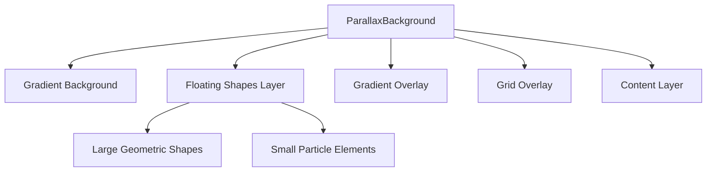
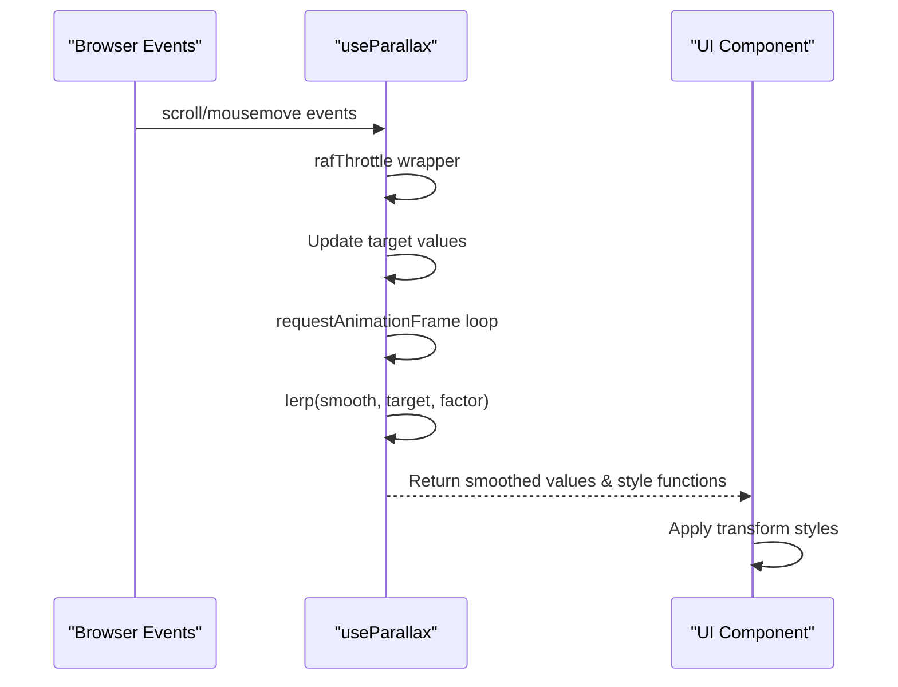
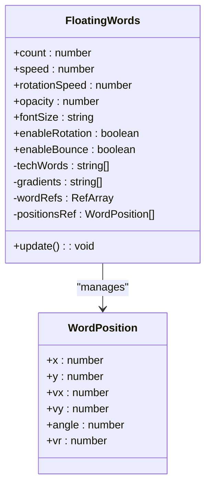

# Visual Effects System

<cite>
**Referenced Files in This Document**   
- [useParallax.ts](file://src/hooks/useParallax.ts)
- [ParallaxConfig.ts](file://src/components/effects/ParallaxConfig.ts)
- [ParallaxBackground.tsx](file://src/components/effects/ParallaxBackground.tsx)
- [AnimatedParticles.tsx](file://src/components/effects/AnimatedParticles.tsx)
- [FloatingWords.tsx](file://src/components/effects/FloatingWords.tsx)
- [Index.tsx](file://src/pages/Index.tsx)
</cite>

## Table of Contents
1. [Introduction](#introduction)
2. [Core Components Overview](#core-components-overview)
3. [Parallax Background System](#parallax-background-system)
4. [Mouse and Scroll Tracking with useParallax Hook](#mouse-and-scroll-tracking-with-useparallax-hook)
5. [Predefined Parallax Presets](#predefined-parallax-presets)
6. [Animated Particles Implementation](#animated-particles-implementation)
7. [Floating Words Animation](#floating-words-animation)
8. [Integration in Main Layout](#integration-in-main-layout)
9. [Performance Optimization Strategies](#performance-optimization-strategies)
10. [Troubleshooting Common Issues](#troubleshooting-common-issues)

## Introduction
The visual effects system in farruh-folio-wave implements an immersive, dynamic background experience that responds to both mouse movement and scroll position. Built using React and optimized for smooth performance, the system combines parallax scrolling, animated particles, and floating text elements to create a modern, engaging interface. The architecture leverages GPU-accelerated CSS transforms via `translate3d` and requestAnimationFrame for consistent 60fps rendering. This document details the technical implementation, configuration options, and integration patterns used throughout the application.

## Core Components Overview
The visual effects ecosystem consists of several interconnected components:
- **useParallax**: Custom React hook managing scroll and mouse position tracking with smooth interpolation
- **ParallaxBackground**: Container component applying layered parallax effects based on configuration
- **ParallaxConfig**: Configuration module defining presets and type interfaces
- **AnimatedParticles**: Canvas-based particle animation system with connection logic
- **FloatingWords**: Floating text elements that drift across the viewport with rotation

These components work together to create a cohesive visual experience while maintaining performance through throttling, hardware acceleration, and configurable intensity levels.

**Section sources**
- [useParallax.ts](file://src/hooks/useParallax.ts#L1-L110)
- [ParallaxConfig.ts](file://src/components/effects/ParallaxConfig.ts#L1-L122)
- [ParallaxBackground.tsx](file://src/components/effects/ParallaxBackground.tsx#L1-L338)
- [AnimatedParticles.tsx](file://src/components/effects/AnimatedParticles.tsx#L1-L184)
- [FloatingWords.tsx](file://src/components/effects/FloatingWords.tsx#L1-L193)

## Parallax Background System
The ParallaxBackground component serves as the foundation for all visual effects, wrapping the main content and applying multiple layers of motion-responsive elements. It uses a combination of CSS transforms and opacity controls to create depth and movement. The component accepts a configuration object that defines the behavior and appearance of all visual elements.

Key features include:
- Layered geometric shapes with variable blur and opacity
- Grid overlay with configurable spacing
- Gradient overlays that follow mouse position
- Particle systems with independent movement parameters
- Smooth interpolation between states to prevent jank

The system applies `transform: translate3d()` to enable GPU acceleration, ensuring smooth animations even on lower-end devices. Each visual layer has its own sensitivity settings for mouse and scroll input, allowing fine-tuned control over the overall effect intensity.

**Diagram sources**
- [ParallaxBackground.tsx](file://src/components/effects/ParallaxBackground.tsx#L150-L300)

**Section sources**
- [ParallaxBackground.tsx](file://src/components/effects/ParallaxBackground.tsx#L1-L338)

## Mouse and Scroll Tracking with useParallax Hook
The useParallax hook provides a centralized system for tracking user interaction data, including scroll position and mouse coordinates. It implements advanced optimization techniques to ensure smooth performance:

- **requestAnimationFrame throttling**: Prevents excessive event handling by syncing updates to the browser's refresh rate
- **Linear interpolation (lerp)**: Creates smooth transitions between values rather than abrupt changes
- **Dual state system**: Maintains both raw and smoothed values for different use cases
- **Passive event listeners**: Improves scroll performance by eliminating default browser behavior interference

The hook exposes three primary style generators:
- `getParallaxStyle`: Applies vertical translation based on scroll position
- `getMouseParallaxStyle`: Applies 2D translation based on mouse position
- `getCombinedParallaxStyle`: Combines both scroll and mouse effects

This abstraction allows components to easily implement parallax effects without managing the underlying event system.

**Diagram sources**
- [useParallax.ts](file://src/hooks/useParallax.ts#L20-L106)

**Section sources**
- [useParallax.ts](file://src/hooks/useParallax.ts#L1-L110)

## Predefined Parallax Presets
The system includes five predefined configuration presets that balance visual impact with performance considerations:

| Preset | Particle Count | Mouse Intensity | Scroll Intensity | Use Case |
|--------|----------------|-----------------|------------------|----------|
| minimal | 12 | 0.01 | 0.15 | Subtle enhancement |
| standard | 20 | 0.02 | 0.3 | Balanced experience |
| intense | 35 | 0.05 | 0.6 | High-impact visuals |
| elegant | 15 | 0.015 | 0.25 | Sophisticated look |
| performance | 8 | 0.008 | 0.12 | Low-end devices |

Each preset configures multiple parameters including particle count, opacity, shape sizes, blur intensity, and animation smoothing factors. The `createParallaxConfig` function allows developers to extend any preset with custom overrides while inheriting the base configuration.

The presets are designed to provide immediate visual improvements while allowing easy customization for specific design requirements or performance constraints.

**Section sources**
- [ParallaxConfig.ts](file://src/components/effects/ParallaxConfig.ts#L1-L122)

## Animated Particles Implementation
The AnimatedParticles component renders a canvas-based particle system with dynamic connections between nearby particles. Key implementation details include:

- **Hardware-accelerated canvas**: Uses device pixel ratio scaling for sharp rendering on high-DPI displays
- **Frame rate limiting**: Configurable FPS (default: 24) to balance smoothness and performance
- **Edge bouncing**: Particles reverse direction when hitting viewport boundaries
- **Connection algorithm**: Draws lines between particles within a configurable distance threshold
- **Memory efficiency**: Reuses particle objects and minimizes garbage collection

The component accepts configuration props for particle count, colors, speed ranges, size variations, and connection distances. It automatically handles window resizing and cleanup through proper useEffect cleanup functions.

Performance is optimized through:
- requestAnimationFrame synchronization
- Selective redrawing only when needed
- Efficient distance calculations using squared distance checks
- Minimal DOM manipulation (canvas-only rendering)

**Section sources**
- [AnimatedParticles.tsx](file://src/components/effects/AnimatedParticles.tsx#L1-L184)

## Floating Words Animation
The FloatingWords component creates drifting text elements that move across the viewport with optional rotation. Each word is positioned using viewport units (vw/vh) and animated via CSS transforms.

Key features:
- **Configurable placement**: Controls distribution between side and center areas
- **Velocity-based movement**: Constant speed in vw/vh per second
- **Rotation animation**: Optional continuous rotation with configurable speed
- **Bounce/wrap behavior**: Options to bounce off edges or wrap around
- **Responsive sizing**: Font size and positioning adapt to viewport dimensions

The animation loop uses `performance.now()` for precise timing and updates transform properties directly on DOM elements. The component supports various configuration options including count, speed, opacity, and font size, making it highly customizable for different design needs.

**Diagram sources**
- [FloatingWords.tsx](file://src/components/effects/FloatingWords.tsx#L1-L193)

**Section sources**
- [FloatingWords.tsx](file://src/components/effects/FloatingWords.tsx#L1-L193)

## Integration in Main Layout
The visual effects system is integrated into the main application layout through the Index.tsx file, which orchestrates all components:

- **Navigation**: Fixed-position navigation outside the parallax container
- **FloatingWords**: Rendered at the root level for full-viewport coverage
- **ParallaxBackground**: Wraps all main content sections with intense preset
- **AnimatedParticles**: Nested within ParallaxBackground for layered effects
- **Main Content**: All page components wrapped in z-index controlled div

The integration demonstrates best practices for layering visual effects while maintaining accessibility and performance. The parallax container uses relative positioning with z-index management to ensure content remains interactive and readable.

Notably, the configuration is customized from the 'intense' preset with specific overrides for particle count, mouse intensity, and background opacity, demonstrating the flexibility of the configuration system.

**Section sources**
- [Index.tsx](file://src/pages/Index.tsx#L1-L90)

## Performance Optimization Strategies
The visual effects system incorporates multiple performance optimization techniques:

- **GPU acceleration**: Extensive use of `translate3d` and `will-change: transform` to leverage hardware rendering
- **Event throttling**: requestAnimationFrame-based throttling prevents jank from rapid event firing
- **Interpolation smoothing**: Linear interpolation (lerp) creates fluid motion without requiring high-frequency updates
- **Configurable intensity**: Presets allow adaptation to device capabilities
- **Conditional rendering**: Particle count adjusted on mobile devices
- **Canvas optimization**: Proper DPR scaling and image smoothing settings

Additional strategies include:
- Passive event listeners for scroll and mousemove
- Memoized calculations to prevent unnecessary re-renders
- Efficient animation loops with proper cleanup
- Frame rate limiting in particle systems
- Minimal re-renders through useCallback and useMemo

For low-end devices, the 'performance' preset reduces particle count, lowers animation intensities, and minimizes visual complexity while maintaining the core parallax effect.

**Section sources**
- [useParallax.ts](file://src/hooks/useParallax.ts#L1-L110)
- [ParallaxBackground.tsx](file://src/components/effects/ParallaxBackground.tsx#L1-L338)
- [AnimatedParticles.tsx](file://src/components/effects/AnimatedParticles.tsx#L1-L184)

## Troubleshooting Common Issues
Common issues and their solutions:

**Jank on low-end devices**:
- Solution: Use 'performance' preset or reduce particle count
- Alternative: Disable effects entirely on mobile using use-mobile hook

**Excessive memory usage**:
- Cause: Too many particles or high FPS settings
- Fix: Reduce particleCount and/or lower FPS in AnimatedParticles config

**Unresponsive animations**:
- Cause: Blocking main thread with heavy computations
- Fix: Ensure all animations use requestAnimationFrame and avoid synchronous operations

**Layout shifts during resize**:
- Cause: Canvas not properly handling DPR changes
- Fix: Verify canvas resize handler properly scales with devicePixelRatio

**Invisible particles**:
- Cause: Opacity set too low or colors blend with background
- Fix: Adjust particleOpacity and verify color contrast

**Mobile performance issues**:
- Strategy: Implement conditional rendering based on screen size
- Example: Halve particle count on screens < 768px as shown in Index.tsx

The system's modular design allows individual components to be disabled or replaced without affecting the overall application structure.

**Section sources**
- [ParallaxBackground.tsx](file://src/components/effects/ParallaxBackground.tsx#L1-L338)
- [AnimatedParticles.tsx](file://src/components/effects/AnimatedParticles.tsx#L1-L184)
- [useParallax.ts](file://src/hooks/useParallax.ts#L1-L110)